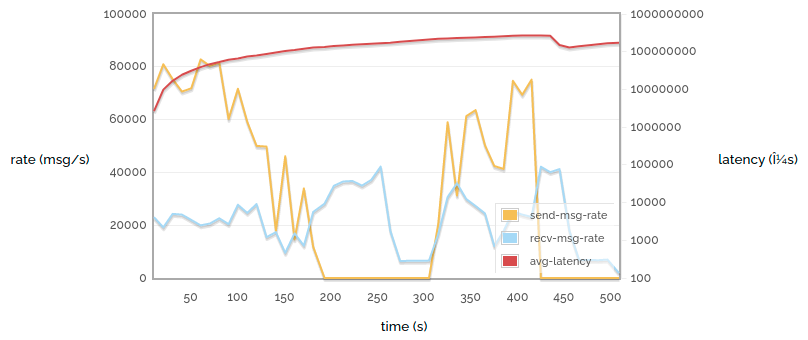
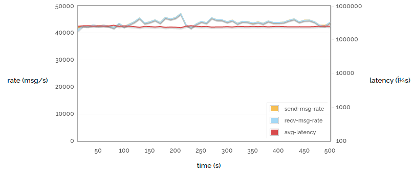
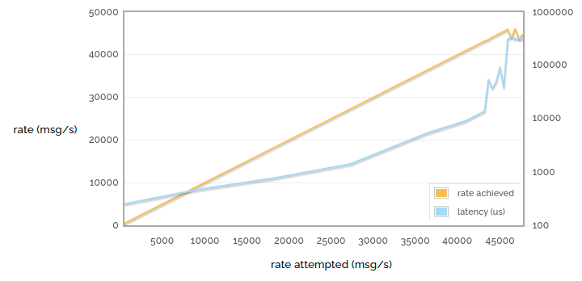

# RabbitMQ Performance Measurements, part 1

https://blog.rabbitmq.com/posts/2012/04/rabbitmq-performance-measurements-part-1/

*April 16, 2012*

So today I would like to talk about some aspects of RabbitMQ’s performance. There are a huge number of variables that feed into the overall level of performance you can get from a RabbitMQ server, and today we’re going to try tweaking some of them and seeing what we can see.  所以今天我想谈谈RabbitMQ的性能的一些方面。 有大量变量会影响您可以从 RabbitMQ 服务器获得的整体性能水平，今天我们将尝试调整其中的一些，看看我们能看到什么。

The aim of this piece is not to try to convince you that RabbitMQ is the fastest message broker in the world - it often isn’t (although we like to think we’re still pretty decent) - but to give you some ideas about what sort of performance you can expect in different situations.  这篇文章的目的不是试图说服你 RabbitMQ 是世界上最快的消息代理——它通常不是（尽管我们喜欢认为我们仍然相当不错）——而是给你一些关于什么的想法 您可以在不同情况下期望的性能。

All the charts and statistics shown were measured on a PowerEdge R610 with dual **Xeon E5530s** and **40GB RAM**. Largely because it was the fastest machine we had lying around. One major thing that’s not ideal is we ran the clients on the same machine as the server - just due to the limited hardware we had available. We used **RabbitMQ 2.8.1** (in most cases) and **Erlang R15B** with **HiPE compilation enabled**.  显示的所有图表和统计数据都是在配备双 Xeon E5530 和 40GB RAM 的 PowerEdge R610 上测量的。 主要是因为它是我们身边最快的机器。 一件不理想的主要事情是我们在与服务器相同的机器上运行客户端 - 只是由于我们可用的硬件有限。 我们使用了 RabbitMQ 2.8.1（在大多数情况下）和 Erlang R15B，并启用了 HiPE 编译。

By the way, the code to produce all these statistics is available in branch bug24527 of rabbitmq-java-client (although it’s currently rather rough) Eventually it will get merged to default, and also become easier to work with. We hope. 顺便说一句，生成所有这些统计信息的代码在rabbitmq-java-client 的分支bug24527 中可用（虽然目前相当粗糙）最终它会合并到默认值，并且也变得更容易使用。 我们希望。

## Flow control in RabbitMQ 2.8.0+

But first of all I need to introduce **a new feature in RabbitMQ 2.8.0+ - internal flow control**. RabbitMQ is internally made up of a number of Erlang processes which pass messages to each other. Each process has a *mailbox* which contains messages it has received and not yet handled. And these mailboxes can grow to an unbounded size.  但首先我需要在 RabbitMQ 2.8.0+ 中引入一个新特性——内部流控制。 RabbitMQ 内部由多个 Erlang 进程组成，这些进程相互传递消息。 每个进程都有一个邮箱，其中包含它已收到但尚未处理的消息。 这些邮箱可以增长到无限大小。

What this means is that unless the first process to receive data off a network socket is the slowest in the chain, (it’s not) then when you have a heavily-loaded RabbitMQ server messages can build up in process mailboxes forever. Or rather, until we run out of memory. Or rather, until the memory alarm goes off. At which point the server will stop accepting new messages while it sorts itself out.  这意味着除非第一个从网络套接字接收数据的进程是链中最慢的，否则当你有一个负载很重的 RabbitMQ 服务器消息时，消息会永远在进程邮箱中建立。 或者更确切地说，直到我们耗尽内存。 或者更确切地说，直到内存警报响起。 在这一点上，服务器将停止接受新消息，同时进行自我分类。

The trouble is, this can take some time. The following chart (the only one in this post made against RabbitMQ 2.7.1) shows a simple process that publishes small messages into the broker as fast as possible, and also consumes them as fast as possible, with acknowledgement, confirms, persistence and so on all switched off. We plot the sending rate, the receiving rate, and the latency (time taken for a sent message to be received), over time. Note that the latency is a logarithmic scale.  问题是，这可能需要一些时间。 下图（本帖中唯一针对 RabbitMQ 2.7.1 制作的图表）展示了一个简单的过程，它尽可能快地将小消息发布到代理中，同时也尽可能快地消费它们，包括确认、确认、持久化等 在所有关闭。 我们绘制了随时间变化的发送速率、接收速率和延迟（接收已发送消息所需的时间）。 请注意，延迟是一个对数标度。

### Simple 1 -> 1 autoack (2.7.1)

Ouch! That’s rather unpleasant. Several things should be obvious:  哎哟! 这是相当不愉快的。 有几件事应该是显而易见的：

- The send rate and receive rate fluctuate quite a lot.  发送速率和接收速率波动很大。
- The send rate drops to zero for two minutes (this is the first time the memory alarm went off). In fact the memory alarm goes off again at the end.  发送速率在两分钟内降至零（这是内存警报第一次响起）。 事实上，内存警报在最后再次响起。
- The latency increases steadily (and look at the scale - we show microseconds, but we could just as easily measure it in minutes).  延迟稳步增加（看看规模 - 我们显示微秒，但我们可以很容易地以分钟为单位测量它）。

(The small drop in latency around 440s is due to all the messages published before 200s being consumed, and the long gap afterwards.)  440 秒左右的延迟小幅下降是由于在 200 秒之前发布的所有消息都被消耗了，并且之后的间隔很长。

Of course, this is only the sort of behaviour you would expect when stressing a server to the limit. But we’re benchmarking - we want to do that. And anyway, servers get stressed in production too.  当然，这只是您在将服务器压力达到极限时所期望的那种行为。 但我们正在进行基准测试——我们想这样做。 无论如何，服务器在生产中也会受到压力。

So now let’s look at the same experiment conducted against a RabbitMQ 2.8.1 server:  所以现在让我们看一下针对 RabbitMQ 2.8.1 服务器进行的相同实验：

### Simple 1 -> 1 autoack (2.8.1)

That looks like a much calmer experience! The **send rate**, **receive rate** and **latency** are all near-constant. The reason is internal flow control. The latency is around 400ms (which is still quite high compared to a less loaded server for reasons I’ll discuss in a minute).  这看起来是一种更平静的体验！ 发送速率、接收速率和延迟都接近恒定。 原因是内部流量控制。 延迟大约为 400 毫秒（由于我将在稍后讨论的原因，与负载较少的服务器相比，这仍然相当高）。

These charts don’t show **memory consumption**, but the story is the same - in this circumstance 2.7.1 will eat lots of memory and bounce off the memory alarm threshold, and 2.8.1 will use a fairly constant, fairly low quantity of memory.  这些图表没有显示内存消耗，但故事是一样的 - 在这种情况下，2.7.1 会消耗大量内存并反弹内存警报阈值，而 2.8.1 将使用相当稳定、相当少的内存 .

Each process in the chain issues *credit* to the processes that can send messages to it. Processes consume credit as they send messages, and issue more credit as they receive them. When a process runs out of credit it will stop issuing more to its upstream processes. Eventually we reach the process which is reading bytes off a network socket. When that process runs out of credit, it stops reading until it gets more. This is the same as when the memory alarm goes off for the 2.7.1 broker, except that it happens many times per second rather than taking minutes, and we control memory use a lot more.  链中的每个进程都向可以向其发送消息的进程发放信用。 进程在发送消息时消耗信用，并在接收消息时发出更多信用。 当一个流程用完信用时，它将停止向其上游流程发放更多。 最终我们到达从网络套接字读取字节的过程。 当该过程用完信用时，它会停止读取，直到获得更多。 这与 2.7.1 代理的内存警报响起时相同，不同之处在于它每秒发生多次而不是几分钟，并且我们控制了更多的内存使用。

So where does that 400ms latency come from? Well, there are still messages queueing up at each stage in the pipeline, so it takes a while for a message to get from the beginning to the end. That accounts for some of the latency. However, most of it comes from an invisible “mailbox” in front of the entire server  那么这 400 毫秒的延迟是从哪里来的呢？ 好吧，管道中的每个阶段仍然有消息排队，因此消息从开始到结束需要一段时间。 这解释了一些延迟。 然而，大部分来自整个服务器前面的一个看不见的“邮箱”

- the TCP buffers provided by the operating system. On Linux the OS will allow up to 8MB of messages to back up in the TCP stack. 8MB doesn’t sound like a lot of course, but we’re dealing with tiny messages (and each one needs routing decisions, permissions check and so on to be made).  操作系统提供的 TCP 缓冲区。 在 Linux 上，操作系统将允许在 TCP 堆栈中备份多达 8MB 的消息。 8MB 听起来当然不是很多，但我们正在处理微小的消息（并且每个消息都需要进行路由决策、权限检查等）。

But it’s important to remember that we tend to see the worst latency when running at the limit of what we can do. So here’s one final chart for this week:  但重要的是要记住，在我们可以做的极限下运行时，我们往往会看到最严重的延迟。 所以这是本周的最后一张图表：

### 1 -> 1 sending rate attempted vs latency

Note that the horizontal axis is no longer time. We’re now showing the results of many runs like the ones above, with each point representing one run.  请注意，横轴不再是时间。 我们现在显示像上面那样的多次运行的结果，每个点代表一次运行。

In the charts above we were running as fast as we can, but here we limit the rate at varying points up to the maximum rate we can achieve. So the yellow line shows rate attempted vs rate achieved - see that it goes most of the way purely 1:1 linearly (when we have spare capacity and so if we try to publish faster we will succeed) and then stops growing as we reach the limit of what we can do.  在上面的图表中，我们尽可能快地运行，但在这里我们将不同点的速率限制到我们可以达到的最大速率。 所以黄线显示了尝试的速率与实现的速率 - 看到它大部分是纯粹的 1:1 线性（当我们有空闲容量时，所以如果我们尝试更快地发布，我们将成功）然后在我们达到时停止增长 我们能做的极限。

But look at the latency! With low publishing rates we have latency of considerably less than a millisecond. But this drifts up as the server gets busier. As we stop being able to publish any faster, we hit a wall of latency - the TCP buffers start to fill up and soon messages are taking hundreds of milliseconds to get through them.  但是看看延迟！ 在低发布率的情况下，我们的延迟远小于一毫秒。 但是随着服务器变得更忙，这种情况会逐渐增加。 当我们不再能够更快地发布时，我们遇到了延迟墙——TCP 缓冲区开始填满，很快消息需要数百毫秒才能通过它们。

So hopefully we’ve shown how RabbitMQ 2.8.1 offers much more reliable performance when heavily loaded than previous versions, and shown how latency can reach for the skies when your message broker is overloaded. Tune in next time to see how some different ways of using messaging affect performance!  所以希望我们已经展示了 RabbitMQ 2.8.1 在重载时如何提供比以前版本更可靠的性能，并展示了当您的消息代理过载时延迟如何达到天空。 下次收听，看看使用消息传递的一些不同方式如何影响性能！

性能指标:

1. 发送速率 和 接收速率通过 UI 页面
1. 延迟通过 grafana 面板
1. 内存消耗通过 grafana 面板
1. cpu
1. 磁盘 IO

