# RabbitMQ Performance Measurements, part 2

https://blog.rabbitmq.com/posts/2012/04/rabbitmq-performance-measurements-part-2/

*April 25, 2012*

Welcome back! [Last time](https://blog.rabbitmq.com/posts/2012/04/rabbitmq-performance-measurements-part-1) we talked about **flow control and latency**; today let’s talk about how different features affect the performance we see. Here are some simple scenarios. As before, they’re all variations on the theme of **one publisher and one consumer** publishing as fast as they can.  欢迎回来！ 上次我们讲了流量控制和延迟； 今天让我们来谈谈不同的功能如何影响我们看到的性能。 下面是一些简单的场景。 和以前一样，它们都是以一个出版商和一个消费者尽快出版为主题的变体。

## Some Simple Scenarios

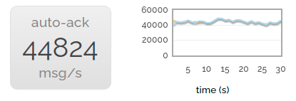

This first scenario is the simplest - just **one producer and one consumer**. So we have a baseline.  第一个场景是最简单的——只有一个生产者和一个消费者。 所以我们有一个基线。

note：

1. 一个生产者，一个消费者
2. 生产者和消费者都尽可能快

------

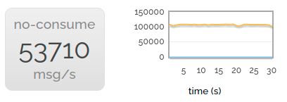

Of course we want to produce impressive figures. So we can go a bit faster than that - if we **don’t consume anything** then we can publish faster.  当然，我们想要产生令人印象深刻的数字。 所以我们可以比这快一点——如果我们不消费任何东西，那么我们可以更快地发布。

note：

1. 一个生产者，没有消费者
2. 生产者尽可能快

------

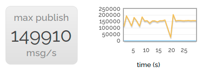

This uses a couple of the cores on our server - but not all of them. So for the best headline-grabbing rate, we start a number of parallel producers, all publishing into nothing.  这使用了我们服务器上的几个核心 - 但不是全部。 因此，为了获得最佳的标题抓取率，我们启动了一些平行的制作人，所有的发布都一无所获。

note：

1. 多个生产者，没有消费者
2. 生产者尽可能快

------

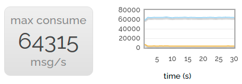

Of course, consuming is rather important! So for the headline consuming rate, we publish to a large number of consumers in parallel.  当然，消费是相当重要的！ 所以对于头条消费率，我们并行发布给大量消费者。

note：

1. 多个消费者，没有生产者
2. 消费者尽可能快

------

Of course to some extent this quest for large numbers is a bit silly, we’re more interested in relative performance. So let’s revert to one producer and one consumer.  当然，在某种程度上，这种对大数字的追求有点愚蠢，我们对相对性能更感兴趣。 因此，让我们回到一位生产者和一位消费者。

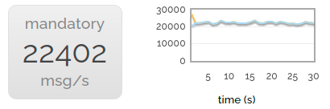

Now let’s try publishing with the **mandatory** flag set. We drop to about 40% of the non-mandatory rate. The reason for this is that the channel we’re publishing to can’t just asynchronously stream messages at queues any more; it synchronously checks with the queues to make sure they’re still there. (Yes, we could probably make mandatory publishing faster, but it’s not very heavily used.)  现在让我们尝试使用强制标志集进行发布。 我们降至非强制性税率的 40% 左右。 这样做的原因是我们发布到的通道不能再在队列中异步流式传输消息； 它与队列同步检查以确保它们仍然存在。 （是的，我们可能可以更快地进行强制发布，但它并没有被大量使用。）

note：

1. 一个生产者，一个消费者
2. 生产者和消费者都尽可能快
3. 生产者使用 mandatory 标志

**mandatory** 标志告诉 RabbitMQ 所发布的消息是强制的(mandatory)。mandatory 标志是一个与 Basic.Publish RPC 命令一起传递的参数，告诉 RabbitMQ 如果消息不可路由，它应该通过 Basic.Return RPC 命令将消息返回给发布者。设置 mandatory 标志可以被认为是开启故障检测模式，它只会让 RabbitMQ 向你通知失败，而不会通知成功。如果消息路由正确，你的发布者将不会收到通知。

------

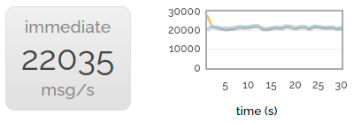

The **immediate** flag gives us almost exactly the same drop in performance. This isn’t hugely surprising - it has to make the same synchronous check with the queue.  立即标志使我们的性能下降几乎完全相同。 这并不奇怪——它必须对队列进行相同的同步检查。

note：

1. 一个生产者，一个消费者
2. 生产者和消费者都尽可能快
3. 生产者使用 immediate 标志

在发送 Basic.Publish 命令时，AMQP 规范包括一个额外的 **immediate** 标志符。如果消息不能立即路由到目的地，immediate 标志告诉代理服务器发出一个 Basic.Return。这个标志从 RabbitMQ 2.9 版开始不推荐使用，如果使用的话会引发一个异常并且关闭信道。

------

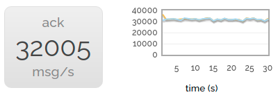

Scrapping the rarely-used mandatory and immediate flags, let’s try turning on **acknowledgements for delivered messages**. We still see a performance drop compared to delivering without acknowledgements (the server has to do more bookkeeping after all) but it’s less noticeable.  废弃很少使用的强制和立即标志，让我们尝试打开已传递消息的确认。 与没有确认的交付相比，我们仍然看到性能下降（毕竟服务器必须做更多的簿记），但不太明显。

note：

1. 一个生产者，一个消费者
2. 生产者和消费者都尽可能快
3. 消费者确认

------

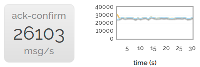

Now we turn on **publish confirms** as well. Performance drops a little more but we’re still at over 60% the speed of neither acks nor confirms.  现在我们也打开发布确认。 性能下降了一点，但我们仍然处于既不确认也不确认的速度的 60% 以上。

note：

1. 一个生产者，一个消费者
2. 生产者和消费者都尽可能快
3. 消费者确认
4. 生产者确认

------

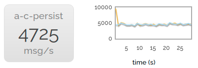

Finally, we enable **message persistence**. The rate becomes much lower, since we’re throwing all those messages at the disk as well.  最后，我们启用消息持久性。 速率变得低得多，因为我们也将所有这些消息都扔到了磁盘上。

note：

1. 一个生产者，一个消费者
2. 生产者和消费者都尽可能快
3. 消费者确认
4. 生产者确认
5. 消息持久化到磁盘

------

## Message Sizes

Notably, all the messages we’ve been sending until now have only been a few bytes long. There are a couple of reasons for this:  值得注意的是，到目前为止我们发送的所有消息都只有几个字节长。 这有几个原因：

- Quite a lot of the work done by RabbitMQ is per-message, not per-byte-of-message.  RabbitMQ 所做的很多工作是按消息进行的，而不是按消息字节进行的。

- It’s always nice to look at big numbers.  看到大数字总是好的。

But in the real world we will often want to send bigger messages. So let’s look at the next chart:  但在现实世界中，我们通常希望发送更大的消息。 那么让我们看看下一张图表：

### 1 -> 1 sending rate message sizes

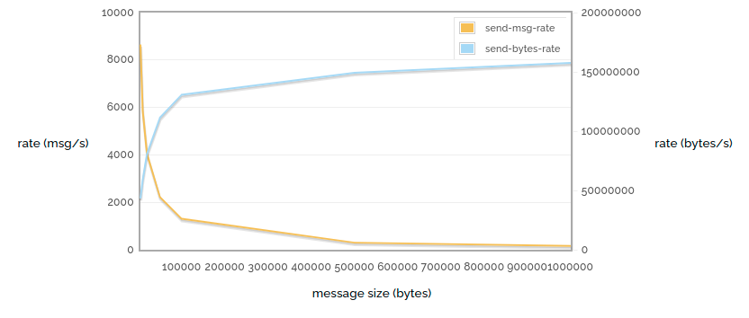

Here (again) we’re sending unacked / unconfirmed messages as fast as possible, but this time we vary the message size. We can see that (of course) the message rate drops further as the size increases, but the actual number of bytes sent increases as we have less and less routing overhead.  在这里（再次）我们尽可能快地发送未确认/未确认的消息，但这次我们改变了消息大小。 我们可以看到（当然）消息速率随着大小的增加而进一步下降，但是随着路由开销越来越少，实际发送的字节数会增加。

note：

1. 一个生产者，一个消费者
2. 生产者和消费者都尽可能快
3. 消费者不确认
4. 生产者不确认
5. 消息存储到内存

------

So how does the message size affect horizontal scaling? Let’s vary the number of producers with different message sizes. Just for a change, in this test we’re not going to have any consumers ar all.  那么消息大小如何影响水平缩放呢？ 让我们改变具有不同消息大小的生产者数量。 只是为了改变，在这个测试中我们不会有任何消费者。

### n -> 0 sending msg rate vs number of producers, for various message sizes

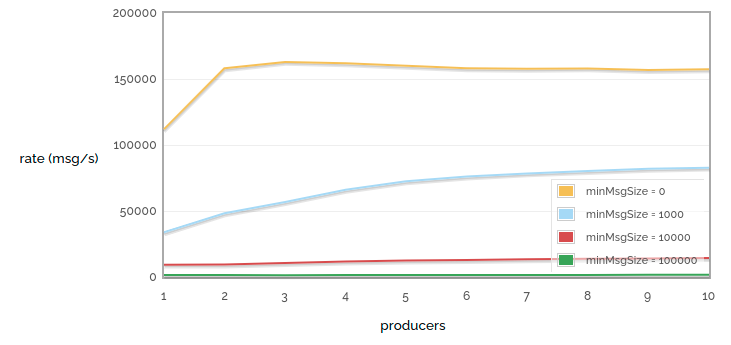

note：

1. 一个生产者，没有消费者
2. 生产者尽可能快
4. 生产者不确认
5. 消息存储到内存

------

### n -> 0 sending bytes rate vs number of producers, for various message sizes

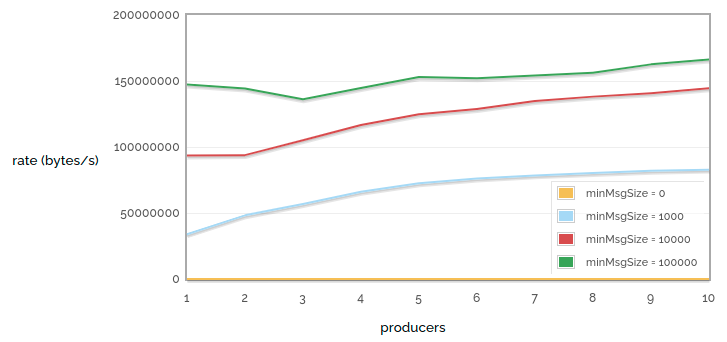

In these tests we can see that for small messages it only takes a couple of producers to reach an upper bound on how many messages we can publish, but that for larger messages we need more producers to use the available bandwidth.  在这些测试中我们可以看到，对于小消息，只需要几个生产者就可以达到我们可以发布的消息数量的上限，但是对于较大的消息，我们需要更多的生产者来使用可用带宽。

note：

1. 一个生产者，没有消费者
2. 生产者尽可能快
4. 生产者不确认
5. 消息存储到内存

------

Another frequently confusing issue is performance around consumers with a prefetch count. RabbitMQ (well, AMQP) defaults to sending all the messages it can to any consumer that looks ready to accept them. The maximum number of these unacknowledged messages per channel can be limited by setting the prefetch count. However, small prefetch counts can hurt performance (since we can be waiting for acks to arrive before sending out more messages).  另一个经常令人困惑的问题是具有预取计数的消费者的性能。 **RabbitMQ（嗯，AMQP）默认将所有消息发送给任何看起来准备接受它们的消费者。 每个通道的这些未确认消息的最大数量可以通过设置预取计数来限制**。 然而，小的预取计数会影响性能（因为我们可能在发送更多消息之前等待确认到达）。

So let’s have a look at prefetch count and, while we’re there, also consider the number of consumers consuming from a single queue. This chart contains some deliberately absurd extremes.  因此，让我们看一下预取计数，同时考虑从单个队列消费的消费者数量。 该图表包含一些故意荒谬的极端情况。

### 1 -> n receiving rate vs consumer count / prefetch count

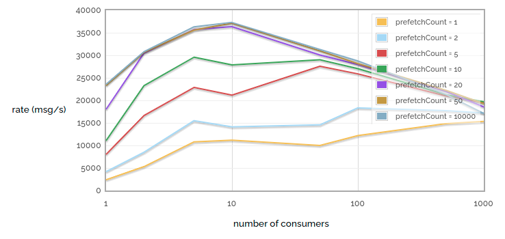

The first thing to notice is that tiny prefetch counts really hurt performance. Note the large difference in performance between prefetch = 1 and prefetch = 2! But we also get into diminishing returns - notice that the difference between prefetch = 20 and prefetch = 50 is hard to see, and the difference between prefetch = 50 and prefetch = 10000 is almost invisible. Of course, this is because for our particular network link prefetch = 50 already ensures that we never starve the consumer while waiting for acks. Of course, this test was run over a low latency link - more latent links will benefit from a higher prefetch count.  首先要注意的是，微小的预取计数确实会影响性能。 请注意 prefetch = 1 和 prefetch = 2 之间的巨大性能差异！ 但是我们也进入了收益递减——请注意，prefetch = 20 和 prefetch = 50 之间的差异很难看出，而 prefetch = 50 和 prefetch = 10000 之间的差异几乎是看不见的。 当然，这是因为对于我们特定的网络链接 prefetch = 50 已经确保我们在等待 ack 时永远不会饿死消费者。 当然，这个测试是在低延迟链接上运行的——更多的潜在链接将受益于更高的预取计数。

The second thing to notice is that when we have a small number of consumers, adding one more will increase performance (we get more parallellism). And with a tiny prefetch count, increasing consumers even up to a large number has benefits (since each individual consumer spends much of its time starved). But when we have a larger prefetch count, increasing the number of consumers is not so helpful, since even a small number can kept busy enough to max out our queue, but the more consumers we have the more work RabbitMQ has to do to keep track of all of them.  要注意的第二件事是，当我们的消费者数量很少时，再增加一个消费者会提高性能（我们获得更多的并行度）。 并且通过很小的预取计数，将消费者增加到大量甚至是有益的（因为每个消费者的大部分时间都处于饥饿状态）。 但是当我们有更大的预取计数时，增加消费者的数量就没有那么有用了，因为即使是很小的数量也可以保持足够的忙碌来最大化我们的队列，但是我们拥有的消费者越多，RabbitMQ 需要做的工作就越多来跟踪所有这些。

------

## Large queues

All the examples we’ve looked at so far have one thing in common: very few messages actually get queued. In general we’ve looked at scenarios where messages get consumed as quickly as they get produced, and thus each queue has an average length of 0.  到目前为止，我们看到的所有示例都有一个共同点：实际上很少有消息排队。 一般来说，我们已经研究了消息在生成时被消耗的情况，因此每个队列的平均长度为 0。

So what happens whe queues get big? When queues are small(ish) they will reside entirely within memory. Persistent messages will also get written to disc, but they will only get read again if the broker restarts.  那么当队列变大时会发生什么？ 当队列很小（ish）时，它们将完全驻留在内存中。 持久消息也将写入磁盘，但只有在代理重新启动时才会再次读取它们。

But when queues get larger, they will get paged to disc, persistent or not. In this case performance can take a hit as suddenly we need to access the disc to send messages to consumers. So let’s run a test: publish a lot of non-persistent messages to a queue, and then consume them all.  但是当队列变大时，它们将被分页到磁盘，无论是否持久。 在这种情况下，性能可能会受到影响，因为我们突然需要访问光盘以向消费者发送消息。 那么让我们运行一个测试：将大量非持久消息发布到一个队列中，然后将它们全部消费掉。

### Queue load / drain 500k messages

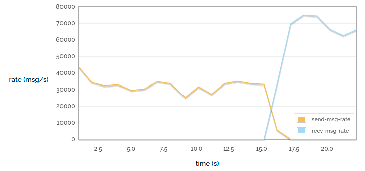

In this small case we can see fairly consistent performance: the messages go into the queue fairly quickly and then come out even more quickly.  在这个小案例中，我们可以看到相当一致的性能：消息进入队列的速度相当快，然后出来的速度更快。

### Queue load / drain 10M messages

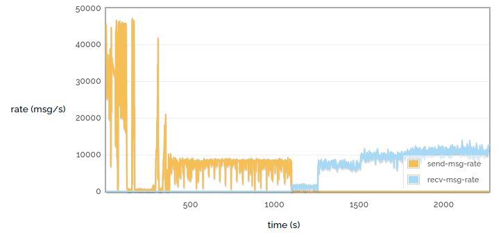

But when we have a larger queue we see that the performance varies a lot more. We see that when loading the queue we initially get a very high throughput, then a pause while some of the queue is paged out to disc, then a more consistent lower throughput. Similarly when draining the queue we see a much lower rate when pulling the messages from disc.  但是当我们有一个更大的队列时，我们会看到性能变化更大。 我们看到，当加载队列时，我们最初获得了非常高的吞吐量，然后在一些队列被页面调出到磁盘时暂停，然后是更一致的低吞吐量。 类似地，当排空队列时，我们看到从磁盘中提取消息时的速率要低得多。

Performance of disc-bound queues is a complex topic - see [Matthew’s blog post on the subject](https://blog.rabbitmq.com/posts/2011/10/performance-of-queues-when-less-is-more) for some more talk on the subject.  磁盘绑定队列的性能是一个复杂的主题 - 有关该主题的更多讨论，请参阅 Matthew 的博客文章。

