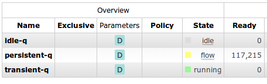
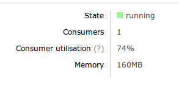

# Finding bottlenecks with RabbitMQ 3.3  使用 RabbitMQ 3.3 查找瓶颈

https://blog.rabbitmq.com/posts/2014/04/finding-bottlenecks-with-rabbitmq-3-3

*April 14, 2014*

One of the goals for RabbitMQ 3.3 was that you should be able to find bottlenecks in running systems more easily. Older versions of RabbitMQ let you see that you were rate-limited but didn’t easily let you see why. In this blog post we’ll talk through some of the new performance indicators in version 3.3.  RabbitMQ 3.3 的目标之一是您应该能够更轻松地发现运行系统中的瓶颈。 旧版本的 RabbitMQ 让您看到您受到速率限制，但不容易让您明白原因。 在这篇博文中，我们将讨论 3.3 版中的一些新性能指标。

### Understanding flow control

Since the introduction of flow control in RabbitMQ 2.8.0, you’ve been able to see when a connection has gone into the flow-controlled state. This (roughly) means that the client is being rate-limited; it would like to publish faster but the server can’t keep up. Of course, the next question you’ll want to ask is “why?”.  自从 RabbitMQ 2.8.0 中引入流控制以来，您已经能够看到连接何时进入流控制状态。 这（大致）意味着客户端受到速率限制； 它想更快地发布，但服务器跟不上。 当然，您要问的下一个问题是“为什么？”。

The flow control mechanism has always extended throughout the server; not just connections but channels and queues can be in the flow-control state, meaning that they would like to publish messages faster, but something ahead of them can’t keep up. So to make sense of the new flow control information you need to know that **a component will go into flow control if anything it is publishing to is a bottleneck - or is in flow control itself**. The order that components handle messages on their way into the server is:  流量控制机制一直延伸到整个服务器； 不仅是连接，通道和队列都可以处于流控状态，这意味着它们希望更快地发布消息，但它们前面的东西却跟不上。 因此，为了理解新的流控制信息，您需要知道如果组件发布到的任何内容是瓶颈，或者它本身处于流控制中，它就会进入流控制。 组件在进入服务器的过程中处理消息的顺序是：

*Network*
  ↓
**Connection process** - AMQP parsing, channel multiplexing  AMQP解析、通道复用
  ↓
**Channel process** - routing, security, coordination  路由、安全、协调
  ↓
**Queue process** - in-memory messages, persistent queue indexing  内存中消息，持久队列索引
  ↓
**Message store** - message persistence

So what possible outcomes are there?  那么有哪些可能的结果呢？

- *A connection is in flow control, but none of its channels are* - This means that one or more of the channels is the bottleneck; the server is CPU-bound on something the channel does, probably routing logic. This is most likely to be seen when publishing small transient messages.  一个连接处于流量控制中，但它的所有通道都不是——这意味着一个或多个通道是瓶颈； 服务器在通道所做的事情上受 CPU 限制，可能是路由逻辑。 这在发布小的临时消息时最有可能出现。

- *A connection is in flow control, some of its channels are, but none of the queues it is publishing to are* - This means that one or more of the queues is the bottleneck; the server is either CPU-bound on accepting messages into the queue or I/O-bound on writing queue indexes to disc. This is most likely to be seen when publishing small persistent messages.  一个连接处于流量控制状态，它的一些通道处于流量控制状态，但它发布到的队列都不是——这意味着一个或多个队列是瓶颈； 服务器要么在接受消息进入队列时受 CPU 限制，要么在将队列索引写入磁盘时受 I/O 限制。 这在发布小的持久消息时最有可能出现。

- *A connection is in flow control, some of its channels are, and so are some of the queues it is publishing to* - This means that the message store is the bottleneck; the server is I/O-bound on writing messages to disc. This is most likely to be seen when publishing larger persistent messages.  一个连接处于流控制状态，它的一些通道是，它发布到的一些队列也是如此——这意味着消息存储是瓶颈； 服务器在将消息写入磁盘时受 I/O 限制。 这在发布较大的持久消息时最有可能出现。

### Consumer utilisation  消费者利用率

So hopefully you can now better understand the performance of the publishing side of your server. So what about the consuming side? The flow control mechanism doesn’t extend as far as consumers, but we do have a new metric to help you tell how hard your consumers are working.  因此，希望您现在可以更好地了解服务器发布端的性能。 那么消费端呢？ 流量控制机制没有扩展到消费者，但我们确实有一个新指标来帮助您了解消费者的工作量。

That metric is *consumer utilisation*. The definition of **consumer utilisation is the proportion of time that a queue’s consumers could take new messages**. It’s thus a number from 0 to 1, or 0% to 100% (or N/A if the queue has no consumers). So if a queue has a consumer utilisation of 100% then it never needs to wait for its consumers; it’s always able to push messages out to them as fast as it can.  该指标是消费者利用率。 消费者利用率的定义是队列的消费者可以接收新消息的时间比例。 因此，它是一个从 0 到 1 或 0% 到 100% 的数字（如果队列没有消费者，则为 N/A）。 因此，如果队列的消费者利用率为 100%，则它永远不需要等待其消费者； 它总是能够尽可能快地将消息推送给他们。

If its utilisation is less than 100% then this implies that its consumers are sometimes not able to take messages. Network congestion can limit the utilisation you can achieve, or low utilisation can be due to the use of too low a [prefetch limit](https://blog.rabbitmq.com/posts/2014/04/an-end-to-synchrony-performance-improvements-in-3-3/), leading to the queue needing to wait while the consumer processes messages until it can send out more.  如果它的利用率低于 100%，那么这意味着它的消费者有时无法接收消息。 网络拥塞可能会限制您可以实现的利用率，或者利用率低可能是由于使用了过低的预取限制，导致队列需要等待消费者处理消息，直到它可以发送更多消息。

The following table shows some approximate values for consumer utilisation I observed when consuming tiny messages over localhost with a single consumer:  下表显示了我在使用单个消费者通过 localhost 消费微小消息时观察到的消费者利用率的一些近似值：

| Prefetch limit | Consumer utilisation |
| :------------- | :------------------- |
| 1              | 14%                  |
| 3              | 25%                  |
| 10             | 46%                  |
| 30             | 70%                  |
| 1000           | 74%                  |

You can see that the utilisation increases with the prefetch limit until we reach a limit of about 30. After that the network bandwidth limitation starts to dominate and increasing the limit has no further benefit. So you can see that consumer utilisation is an easy way to monitor the performance of our consumers.  您可以看到利用率随着预取限制的增加而增加，直到我们达到大约 30 的限制。之后网络带宽限制开始占主导地位，增加限制没有进一步的好处。 因此，您可以看到消费者利用率是监控消费者绩效的一种简单方法。

