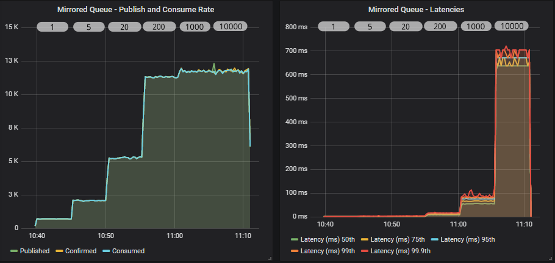
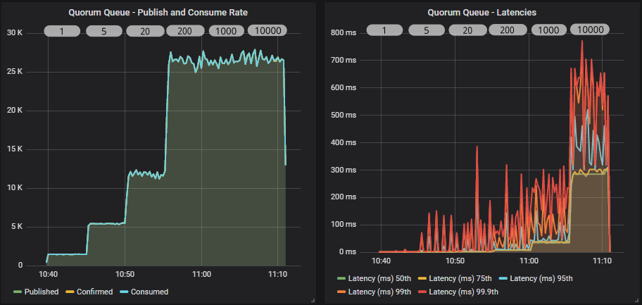
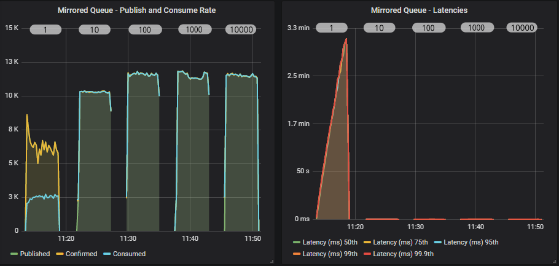
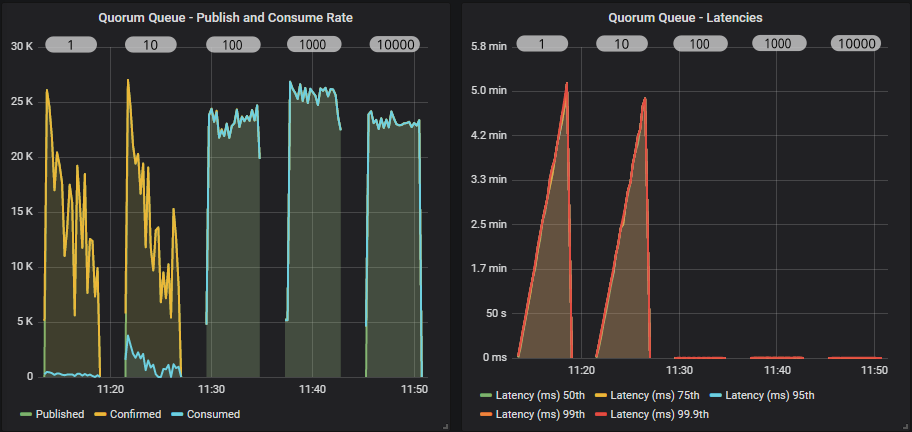
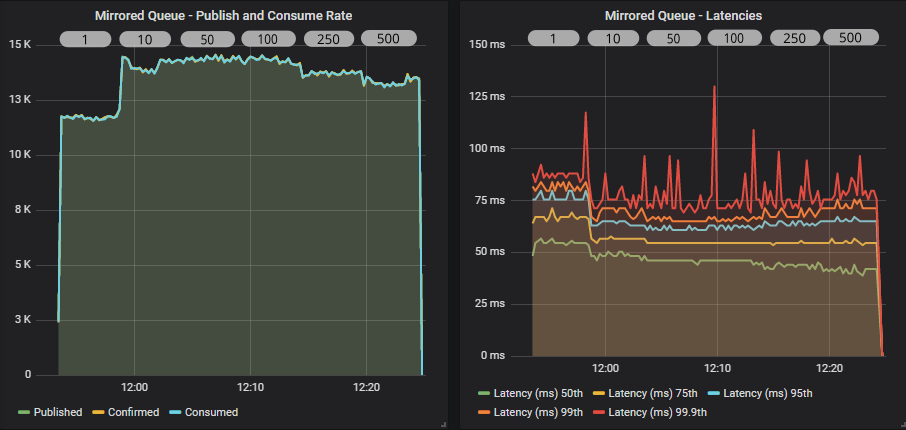
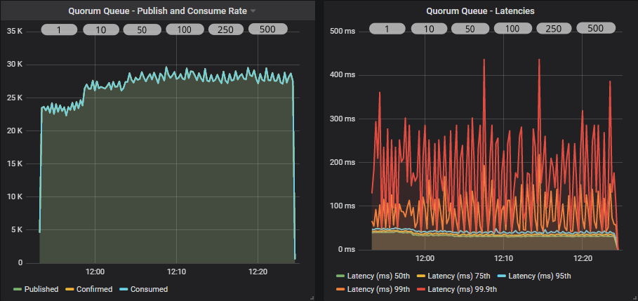
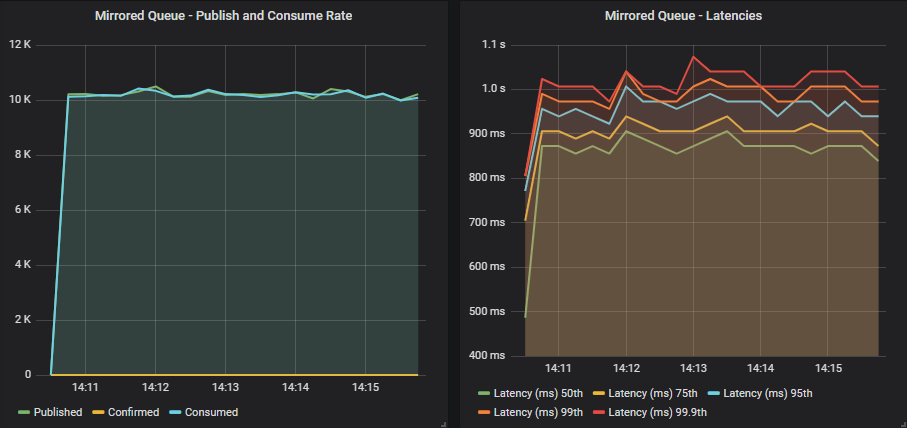
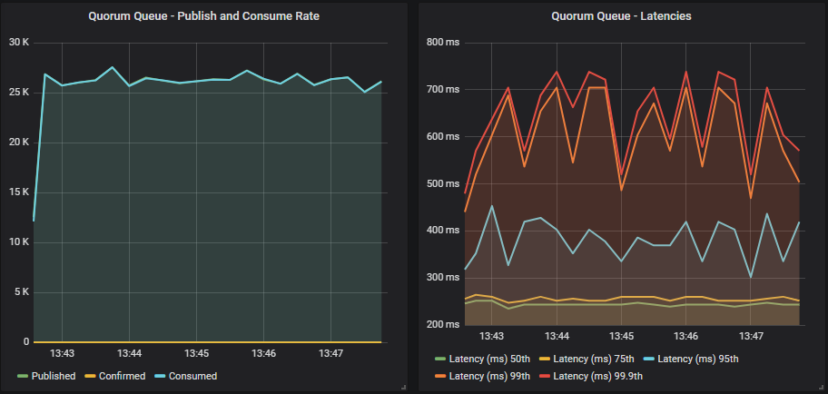

# Quorum Queues and Flow Control - Single Queue Benchmarks

https://blog.rabbitmq.com/posts/2020/05/quorum-queues-and-flow-control-single-queue-benchmarks/

*May 14, 2020*

In the last post we covered what flow control is, both as a general concept and the various flow control mechanisms available in RabbitMQ. We saw that publisher confirms and consumer acknowledgements are not just data safety measures, but also play a role in flow control.  在上一篇文章中，我们介绍了流控制是什么，作为一个通用概念和 RabbitMQ 中可用的各种流控制机制。 我们看到，发布者确认和消费者确认不仅是数据安全措施，还起到了流量控制的作用。 

In this post we’re going to look at how application developers can use publisher confirms and consumer acknowledgements to get a balance of safety and high performance, in the context of a single queue.  在这篇文章中，我们将研究应用程序开发人员如何在单个队列的上下文中使用发布者确认和消费者确认来平衡安全性和高性能。 

Flow control becomes especially important when a broker is being overloaded. A single queue is unlikely to overload your broker. If you send large messages then sure, you can saturate your network, or if you only have a single CPU core, then one queue could max it out. But most of us are on 8, 16 or 30+ core machines. But it’s interesting to break down the effects of confirms and acks on a single queue. From there we can take our learnings and see if they apply to larger deployments (the next post).  当代理超载时，流量控制变得尤为重要。 单个队列不太可能使您的代理超载。 如果您发送大量消息，那么可以肯定，您可以使您的网络饱和，或者如果您只有一个 CPU 核心，那么一个队列可能会将其最大化。 但我们大多数人都在 8、16 或 30 多个核心机器上。 但是将确认和确认对单个队列的影响分解是很有趣的。 从那里我们可以吸取我们的经验，看看它们是否适用于更大的部署（下一篇文章）。

## Pipelining and Publisher Confirms  流水线和发布者确认

Publishers can rate limit themselves based on the number of unconfirmed messages in-flight. With a limit of 5, the publisher will send 5 messages and then block until confirms come in. If a single confirm comes in, the publisher can now send a message and block again. If three confirms come in, the publisher can send three more, and so on.  发布者可以根据未确认消息的数量限制自己的速率。限制为 5 条，发布者将发送 5 条消息，然后阻塞，直到收到确认。如果有单个确认进入，发布者现在可以发送消息并再次阻塞。如果收到三个确认，发布者可以再发送三个，以此类推。

Confirms can be batched together via the use of the *multiple* flag. This allows the broker to confirm multiple messages at a time. If 100 messages are pending confirmation, with sequence numbers 1-100, the broker can send a single confirm with the multiple flag set and the sequence number of 100. This allows for less communications between publisher and broker, which is more efficient.  确认可以通过使用多个标志一起批处理。这允许代理一次确认多条消息。如果有 100 条消息处于待确认状态，序列号为 1-100，则代理可以发送一个带有多重标志集且序列号为 100 的确认。这样可以减少发布者和代理之间的通信，从而提高效率。

This pipelining method will produce the highest and most stable throughput. You can find code samples for how to do this in tutorial 7, strategy #3. There is a [Java](https://www.rabbitmq.com/tutorials/tutorial-seven-java.html) version and a [C#](https://www.rabbitmq.com/tutorials/tutorial-seven-dotnet.html) version. The same approach can be applied to other languages.  这种流水线方法将产生最高和最稳定的吞吐量。您可以在教程 7，策略 #3 中找到如何执行此操作的代码示例。有 Java 版本和 C# 版本。相同的方法可以应用于其他语言。

## Pipelining and Consumer Acks  流水线和消费者确认

RabbitMQ employs the pipelining method, where its “in-flight limit” is the consumer prefetch (QoS) on a given channel. Without a prefetch, it will send messages as fast as it can until there are no more messages to send or TCP back-pressure is applied due to the client TCP buffer being full. This can overload the consumer so please use a prefetch!  RabbitMQ 采用流水线方法，其“动态限制”是给定通道上的消费者预取 (QoS)。如果没有预取，它将尽可能快地发送消息，直到没有更多消息要发送或由于客户端 TCP 缓冲区已满而应用 TCP 背压。这可能会使消费者超载，因此请使用预取！

When your consumer sends an acknowledgement, that is like when the broker sends a confirm to a publisher. It allows more messages to be pushed down the channel.  当您的消费者发送确认时，就像代理向发布者发送确认时一样。它允许将更多消息推送到通道中。

Just like confirms, consumer acks get to use the multiple flag as well. The consumer can choose to acknowledge every message individually or every N number of messages. We’ll call this the *ack interval*. With an ack interval of 10, a consumer will acknowledge every 10th message, using the multiple flag.  就像确认一样，消费者确认也可以使用多重标志。消费者可以选择单独确认每条消息或每 N 条消息。我们称之为确认间隔。确认间隔为 10 时，消费者将使用 multiple 标志确认每 10 条消息。

This can be more complex code as you also need to take into account:  这可能是更复杂的代码，因为您还需要考虑：

- If the last 10 messages includes a mix of acks, nacks and rejects then you can’t simply perform a single ack with multiple flag set.  如果最后 10 条消息包含 ack、nacks 和拒绝的混合，那么您不能简单地执行带有多个标志集的单个 ack。

- You will probably wish to put a temporal limit on the length of time between acks, in case messages come in slowly, for example, every 10 messages or up to 50ms.  您可能希望对 ack 之间的时间长度进行时间限制，以防消息进入缓慢，例如，每 10 条消息或最多 50 毫秒。

## Measuring the Impact of In-Flight Limit, Prefetch and Ack Interval  测量运行中限制、预取和确认间隔的影响

The best way to see the impact is to run a series of benchmarks with a typical cluster and change the publisher confirm in-flight limit, the consumer prefetch and the ack interval.  查看影响的最佳方法是使用典型集群运行一系列基准测试并更改发布者确认飞行限制、消费者预取和确认间隔。

All benchmarks are run in AWS with the following configuration:  所有基准测试都在 AWS 中运行，配置如下：

- c5.4xlarge EC2 instance: 16 vCPUs (Cascade Lake/Skylake Xeon), 32 GB RAM, 5gbit network, 200 GB SSD (io1 with 10000 IOPS)  c5.4xlarge EC2 实例：16 个 vCPU（Cascade Lake/Skylake Xeon）、32 GB RAM、5gbit 网络、200 GB SSD（io1 和 10000 IOPS）

- 3 brokers in a cluster  一个集群中的 3 个代理

- 1 load generation EC2 machine of the same spec (c5.4xlarge)  1台相同规格的负载生成EC2机器（c5.4xlarge）

- 1kb messages  1kb 消息

- No processing time as this is a pure throughput/latency benchmark of a single publisher and single consumer.  没有处理时间，因为这是单个发布者和单个消费者的纯吞吐量/延迟基准。

We test quorum queues and mirrored queues to give an idea of how quorum queues differ from their older counterpart.  我们测试了仲裁队列和镜像队列，以了解仲裁队列与旧队列的不同之处。

Mirrored queues have one master and one mirror, and quorum queues use a replication factor of three (one leader + two followers). It’s not exactly a fair fight, a replication factor of two with mirrored and a replication factor of three with quorum queues, but those are the most common configurations respectively. All tests use an alpha build of RabbitMQ 3.8.4 with new quorum queue features for handling high load.  镜像队列有一个master和一个mirror，quorum队列使用3个复制因子（一个leader +两个follower）。这并不是一场公平的战斗，镜像复制因子为 2，仲裁队列复制因子为 3，但这些分别是最常见的配置。所有测试都使用 RabbitMQ 3.8.4 的 alpha 版本，具有新的仲裁队列功能来处理高负载。

Benchmarks:  基准：

1. Increasing in-flight limit, prefetch 1000, ack interval 1  增加飞行限制，预取 1000，确认间隔 1

2. 1000 in-flight limit, increasing prefetch, ack interval 1  1000 in-flight 限制，增加预取，确认间隔 1

3. 1000 in-flight limit, 1000 prefetch, increasing ack interval  1000 飞行限制，1000 预取，增加确认间隔

4. No confirms, no acks  没有确认，没有确认

## Interpreting these results  解释这些结果

The rules:  规则：

- **Rule 1** - These are synthetic benchmarks, with a specific version of RabbitMQ, with cloud instances (which introduces all kinds of reproducibility issues) and a specific hardware configuration. There is no single benchmark result, there are infinite. So don’t look at specific numbers, look at trends and patterns.  规则 1 - 这些是综合基准，具有特定版本的 RabbitMQ，具有云实例（引入了各种可再现性问题）和特定的硬件配置。 没有单一的基准测试结果，有无限的。 所以不要看具体的数字，看趋势和模式。

- **Rule 2** - These results are using the Java client, not Spring, not Python or any other language or framework. However, what we are testing should hold true for other frameworks as they have to use the same settings, how they use those settings may or may not be under your control.  规则 2 - 这些结果使用的是 Java 客户端，而不是 Spring、Python 或任何其他语言或框架。 但是，我们正在测试的内容应该适用于其他框架，因为它们必须使用相同的设置，它们如何使用这些设置可能会或可能不会在您的控制之下。

- **Rule 3** - Try out your existing code with these different settings changes and see for yourself!  规则 3 - 使用这些不同的设置更改尝试您现有的代码，并亲自查看！

## Benchmark #1 - Increasing in-flight limit, prefetch 1000, ack interval 1

This is a 30 minute benchmark where we increase the in-flight limit every 5 minutes with the following values: 1, 5, 20, 200, 1000, 10000. With the low values, the publishers will be rate limiting themselves pretty aggressively, constraining throughput, but as the limit increases we should see throughput increase.  这是一个 30 分钟的基准测试，我们每 5 分钟增加一次运行中限制，其值如下：1、5、20、200、1000、10000。使用较低的值，发布者将非常积极地限制自己的速率，限制吞吐量，但随着限制的增加，我们应该看到吞吐量增加。

**Mirrored queue**

**Quorum queue**

Both queue types have a similar profile. As we increase the in-flight limit, throughput goes up until we see that the level is so high as to not have any kind of flow control effect. Both see the biggest jump between 20 and 200. A limit of 10000 has no benefit over 1000, all that happens is we increase end-to-end latency.  两种队列类型具有相似的配置文件。当我们增加飞行中的限制时，吞吐量会上升，直到我们看到级别太高以至于没有任何类型的流量控制效果。两者都看到了 20 到 200 之间的最大跳跃。10000 的限制与 1000 相比没有任何好处，所发生的只是我们增加了端到端延迟。

The quorum queue achieves much higher throughput than the mirrored queue and also has lower 95th percentile latencies. Quorum queue 99.9th percentile latencies reach the mirrored queue latencies where all percentiles cluster around the same value.  仲裁队列实现了比镜像队列高得多的吞吐量，并且还具有较低的 95% 延迟。仲裁队列第 99.9 个百分位延迟达到镜像队列延迟，其中所有百分位都聚集在相同的值附近。

In our case, because the brokers and the load generator are all in the same availability zone, network latency is very low. In higher network latency scenarios, we would continue to see large benefits of higher in-flight limits.  在我们的例子中，因为代理和负载生成器都在同一个可用区，所以网络延迟非常低。在更高的网络延迟情况下，我们将继续看到更高的飞行限制带来的巨大好处。

Lastly, remember that if our message rate were 1000 msg/s, then all in-flight limits would look the same. So if you are nowhere close to the queue throughput limit, then these settings won’t necessarily come into play.  最后，请记住，如果我们的消息速率是 1000 msg/s，那么所有运行中的限制看起来都是一样的。因此，如果您远未接近队列吞吐量限制，则这些设置不一定会发挥作用。

## Benchmark #2 - 1000 in-flight limit, increasing prefetch, ack interval 1

This test is a little different to the others. The others are a single run where we dynamically change the behaviour of the load generator. In this test we use a separate run per setting. We have to do this because you’ll see that a prefetch of 1 makes the consume rate so slow, that the queue fills up fast and negatively affects the later phases of the test. So we run each prefetch setting as a completely isolated run.  这个测试与其他测试有点不同。 其他的是单次运行，我们在其中动态更改负载生成器的行为。 在此测试中，我们使用每个设置单独运行。 我们必须这样做，因为您会看到 1 的预取会使消耗率如此之慢，以至于队列很快填满并对测试的后期阶段产生负面影响。 因此，我们将每个预取设置作为一个完全独立的运行运行。

**Mirrored queue**

**Quorum queue**

A prefetch of 1, combined with a fast publisher did not go well for either queue type, but quorum queues did especially badly. Quorum queues saw very low consumer throughput with a prefetch 1 and 10, but we also saw the publish rate drop as time went by and the queue filled.  预取 1 与快速发布者相结合对于任何一种队列类型都不是很好，但仲裁队列的表现尤其糟糕。 Quorum 队列在预取 1 和 10 时发现消费者吞吐量非常低，但我们也看到发布率随着时间的推移和队列被填满而下降。

In fact in these first two tests (prefetch 1 and 10), the quorum queue reached around 4 million messages. We know that quorum queues do slow down a bit once they get into the millions of messages.  事实上，在前两个测试（预取 1 和 10）中，仲裁队列达到了大约 400 万条消息。 我们知道，一旦进入数百万条消息，仲裁队列确实会变慢一点。

From a prefetch of 100 and onwards we start hitting the top throughput as the RabbitMQ consumer channel is not having to block so often (waiting for acks to come in). Setting a high prefetch does not affect end-to-end latency as we see below (for prefetch of 100, 1000, 10000).  从预取 100 起，我们开始达到最高吞吐量，因为 RabbitMQ 消费者通道不必经常阻塞（等待确认进来）。 设置高预取不会影响端到端延迟，如下所示（对于 100、1000、10000 的预取）。

The reason that prefetch doesn’t necessarily increase latency but the in-flight limit can, is that with the in-flight limit we are rate limiting ingress, avoiding buffering in the broker, whereas the prefetch only affects messages already in flight. Whether the messages are buffered in the broker or in the client doesn’t affect latency, especially in a single consumer test. In a multiple consumer test it is conceivable that there could still be an effect.  预取不一定会增加延迟但飞行中的限制会增加延迟的原因是，通过飞行中的限制，我们限制了入口的速率，避免在代理中缓冲，而预取只影响已经在飞行中的消息。 消息是在代理中缓冲还是在客户端中缓冲不会影响延迟，尤其是在单个消费者测试中。 在多消费者测试中，可以想象仍然可能存在影响。

### Some Nuance Around End-to-end Latency  端到端延迟的一些细微差别

Of course the above is predicated on end-to-end latency being from the moment a publisher sends a message to the moment the message is received by a consumer. In your system, end-to-end latency will likely start at an earlier point. So rate limiting the publisher can reduce latency from the point of view of RabbitMQ, but not necessarily your wider system. When it would definitely affect your wider system’s end-to-end latency is if RabbitMQ got overloaded and materially slowed down.  当然，上述内容基于端到端延迟，即从发布者发送消息的那一刻到消费者接收到消息的那一刻。 在您的系统中，端到端延迟可能会从较早的时间点开始。 因此，从 RabbitMQ 的角度来看，限制发布者的速率可以减少延迟，但不一定是您更广泛的系统。 如果 RabbitMQ 过载并显着减慢速度，那么它肯定会影响更广泛系统的端到端延迟。

## Benchmark #3 - 1000 in-flight limit, 1000 prefetch, increasing ack interval

We’re back to the dynamic update of settings again, as we’ll see that while the ack interval does affect throughput, it does not affect it as much as prefetch (not even close!). Using an ack interval of 1 is ok, you will still get good throughput, so if that is what you already do and don’t want the complexity of multiple flag usage, then carry on.  我们再次回到设置的动态更新，我们将看到虽然 ack 间隔确实会影响吞吐量，但它不会像预取那样影响它（甚至不会关闭！）。 使用 1 的 ack 间隔是可以的，您仍然可以获得良好的吞吐量，因此如果您已经这样做并且不希望使用多个标志的复杂性，那么继续。

But we’ll see next that if you want every last bit of performance, multiple flag usage helps.  但是接下来我们将看到，如果您想要最后一点性能，使用多个标志会有所帮助。

**Mirrored queue**

**Quorum queue**

Both queue types see the biggest jump in throughput when switching from an ack interval of 1 to 10. After that the peak is around 50-100. That is 5% and 10% respectively of the prefetch. As a general rule of thumb, this tends to be the sweet spot for the ack interval.  当从 1 到 10 的 ack 间隔切换时，两种队列类型的吞吐量都有最大的跳跃。之后峰值在 50-100 左右。 这分别是预取的 5% 和 10%。 作为一般经验法则，这往往是 ack 间隔的最佳位置。

Mirrored queues tend to see a reduction in throughput once you get past the 25-30% of prefetch mark and rapidly drops off past 50%. Quorum queues remained flat in this test, right up to 50%.  一旦超过 25-30% 的预取标记并迅速下降到 50% 以上，镜像队列往往会看到吞吐量下降。 在本次测试中，Quorum 队列保持不变，最高为 50%。

## Benchmarks #4 - No confirms and acks

In these tests we’ll not use publisher confirms and the consumer will use auto ack mode (this means that the broker will treat a message as delivered as soon as it transmits it).  在这些测试中，我们不会使用发布者确认，而消费者将使用自动确认模式（这意味着代理将在消息传输后立即将其视为已交付）。

**Mirrored queue**

**Quorum queue**

If we compare those results to using confirms and acks, we see no benefit in throughput. In fact all we see is an increase in end-to-end latency. For mirrored we go from 95th percentile at ~60ms to ~1s. Likewise for quorum queues we go from 95th percentile ~50ms to ~400ms.  如果我们将这些结果与使用确认和确认进行比较，我们发现吞吐量没有任何好处。 事实上，我们所看到的只是端到端延迟的增加。 对于镜像，我们从约 60 毫秒的第 95 个百分位变为约 1 秒。 同样，对于仲裁队列，我们从第 95 个百分位 ~50ms 到 ~400ms。

So not only do we not see an increase in throughput but we see a worse latency. Of course this is a single queue, things only get worse as we add more queues and load, as we’ll see in the next post.  因此，我们不仅没有看到吞吐量增加，而且还看到了更糟糕的延迟。 当然，这是一个单一的队列，随着我们添加更多队列和负载，情况只会变得更糟，我们将在下一篇文章中看到。

With a non-replicated classic queue, you will definitely see a difference between confirms/acks vs none. This is because without replication, RabbitMQ doesn’t have to do much work, so the overhead of confirms and acks is noticeable. This isn’t the case when replication is involved, the overhead of confirms/acks is small in comparison.  使用非复制的经典队列，您肯定会看到确认/确认与无之间的差异。 这是因为没有复制，RabbitMQ 不需要做太多工作，所以确认和确认的开销是显而易见的。 当涉及复制时，情况并非如此，相比之下，确认/确认的开销很小。

## Final Conclusions

At this point, with a single queue, the conclusions are simple and limited - that is, they apply to a single queue for sure, and will likely apply to multiple queues but not necessarily a stressed system. That is why we have a follow-up post covering exactly the same settings, but with a system under stress.  在这一点上，对于单个队列，结论是简单且有限的——也就是说，它们肯定适用于单个队列，并且可能适用于多个队列，但不一定适用于压力系统。这就是为什么我们有一个后续帖子涵盖完全相同的设置，但系统处于压力之下。

Low broker stress, single queue, high throughput conclusions:  低代理压力、单队列、高吞吐量结论：

1. Low publisher in-flight limits equate to lower throughput as publishers exert their own flow control. Higher in-flight limits equate to higher throughput, but at some point you stop getting gains. Where that point is, is totally dependent on your system and can change as conditions in your system change.  较低的发布者运行中限制等同于较低的吞吐量，因为发布者会施加自己的流量控制。更高的飞行限制等同于更高的吞吐量，但在某些时候你会停止获得收益。那一点在哪里，完全取决于您的系统，并且可以随着系统条件的变化而变化。

2. Low prefetch can be terrible for a high throughput queue with a single consumer. But in a low throughput queue or where there are many many consumers, it will not be so much of a problem (as we’ll see in the next post where we have 100s of consumers).  对于具有单个消费者的高吞吐量队列，低预取可能会很糟糕。但是在低吞吐量队列或有很多消费者的情况下，这不会是什么大问题（正如我们将在下一篇文章中看到的那样，我们有 100 多个消费者）。

3. An ack interval of 1 is ok, don’t sweat it. But increasing it a little can be beneficial. Up to around 10% of prefetch is a good rule of thumb but as always, it is dependent on your system and local conditions.  ack 间隔为 1 是可以的，不要担心。但是稍微增加一点可能是有益的。最多 10% 的预取是一个很好的经验法则，但与往常一样，它取决于您的系统和本地条件。

4. Confirms and acks are necessary for data safety and not using them with a replicated queue doesn’t gain you any performance, quite the opposite, it increased latency. That said, in this single queue test, the loss of the extra flow control exerted by confirms and acks was not a major problem.  确认和确认是数据安全所必需的，不将它们与复制队列一起使用不会为您带来任何性能，相反，它会增加延迟。也就是说，在这个单队列测试中，confirms 和 acks 施加的额外流量控制的丢失并不是主要问题。

5. Finally - a single quorum queue outperforms a single mirrored queue significantly.  最后 - 单个仲裁队列明显优于单个镜像队列。

All these tests were about sending/consuming messages as fast as possible, pushing a single queue to its limit. What we learned is informative but you likely are not in that situation and so you will probably find the next post more useful. In that post we will look at low load and high load scenarios, with different numbers of queues and clients, but seeing the effects of these same three settings on both quorum and mirrored queues. For the stress tests, flow control will become more important, it will help the stressed system to degrade gracefully rather than catch on fire. Expect a larger impact of not using confirms and acks.  所有这些测试都是关于尽可能快地发送/消费消息，将单个队列推到极限。我们学到的内容很丰富，但您可能不在这种情况下，因此您可能会发现下一篇文章更有用。在那篇文章中，我们将研究具有不同数量的队列和客户端的低负载和高负载场景，但会看到这三个设置对仲裁队列和镜像队列的影响。对于压力测试，流量控制将变得更加重要，它将帮助压力系统优雅地降级而不是着火。预计不使用确认和确认会产生更大的影响。

