# Quorum Queues and Flow Control - Stress Tests

https://blog.rabbitmq.com/posts/2020/05/quorum-queues-and-flow-control-stress-tests/

*May 15, 2020*

In the [last post](https://blog.rabbitmq.com/posts/2020/05/quorum-queues-and-flow-control-single-queue-benchmarks) we ran some simple benchmarks on a single queue to see what effect pipelining publisher confirms and consumer acknowledgements had on flow control.  在上一篇文章中，我们在单个队列上运行了一些简单的基准测试，以了解流水线发布者确认和消费者确认对流控制的影响。

Specifically we looked at:  具体来说，我们看了：

- Publishers: Restricting the number of in-flight messages (messages sent but pending a confirm).  发布者：限制正在发送的消息（已发送但等待确认的消息）的数量。

- Consumers: Prefetch (the number in-flight messages the broker will allow on the channel)  消费者：预取（代理将允许在通道上传输的消息数量）

- Consumers: Ack Interval (multiple flag usage)  消费者：确认间隔（多个标志使用）

Unsurprisingly, we saw when we restricted publishers and the brokers to a small number of in-flight messages at a time, that throughput was low. When we increased that limit, throughput increased, but only to a point, after which we saw no more throughput gains but instead just latency increases. We also saw that allowing consumers to use the multiple flag was beneficial to throughput.  不出所料，当我们将发布者和代理一次限制为少量的动态消息时，我们看到吞吐量很低。当我们增加这个限制时，吞吐量增加了，但只是到了一定程度，之后我们没有看到更多的吞吐量增加，而只是延迟增加。我们还看到，允许消费者使用 multiple 标志有利于吞吐量。

In this post we’re going to look at those same three settings, but with many clients, many queues and different amounts of load, including stress tests. We’ll see that publisher confirms and consumer acknowledgements play a role in flow control to help prevent overload of a broker.  在这篇文章中，我们将研究这三个相同的设置，但有许多客户端、许多队列和不同的负载量，包括压力测试。我们将看到发布者确认和消费者确认在流控制中发挥作用，以帮助防止代理过载。

With data safety the clients play a role, they must use confirms and acks correctly to achieve at-least once processing. Likewise, thousands of clients shouldn’t expect to hammer a broker with load and accept no responsibility for how that goes.  在数据安全的情况下，客户端发挥作用，他们必须正确使用确认和确认来实现至少一次处理。同样，数以千计的客户不应该期望用负载锤击经纪人，并且对事情的进展不承担任何责任。

Be warned, there is a fair amount of detail in this post so make sure you are comfortable with a beverage nearby before you begin.  请注意，这篇文章中有相当多的细节，所以在开始之前，请确保您对附近的饮料感到满意。

## Mechanical Sympathy  机械同情

I really like the term mechanical sympathy. When you drive a racing car slowly, you can get away with pretty much anything. It’s when you push the car to its limits that you need to start listening to it, feeling the vibrations and adjust accordingly else it will break down before the end of the race.  我真的很喜欢机械同情这个词。当您缓慢驾驶赛车时，您几乎可以摆脱任何困境。当您将汽车推到极限时，您需要开始聆听它，感受振动并进行相应调整，否则它会在比赛结束前发生故障。

Likewise, with RabbitMQ, if you have a low load, then you can get away with a lot. You might not see much impact of changing these three settings, or using confirms at all (at least on performance). It’s when you stress a cluster to its limit that these settings really become important.  同样，使用 RabbitMQ，如果您的负载较低，那么您可以摆脱很多。您可能看不到更改这三个设置或使用确认的太大影响（至少在性能方面）。当您将集群压力发挥到极限时，这些设置才真正变得重要。

## Degrading Gracefully  优雅地降级

What should a system do when you throw more data at it than it can handle?  当您向系统提供的数据超出其处理能力时，系统应该怎么做？

- Answer 1: accept all data only to burst into a flaming pile of bits.  答案 1：接受所有数据只是为了爆发成一堆燃烧的比特。

- Answer 2: deliver huge swings of high and low throughput, with hugely varying latencies.  答案 2：提供高吞吐量和低吞吐量的巨大波动，延迟差异很大。

- Answer 3: rate limit data ingress and deliver steady throughput with low latencies.  答案 3：速率限制数据入口并以低延迟提供稳定的吞吐量。

- Answer 4: favour ingress to egress, absorbing the data as if it were a peak in load causing high latencies but better keeping up with the ingress rate.  答案 4：从入口到出口，吸收数据，就好像它是负载的峰值，导致高延迟，但更好地跟上入口速率。

At RabbitMQ we would argue that answers 3 and 4 are reasonable expectations whereas nobody wants 1 and 2.  在 RabbitMQ，我们认为答案 3 和 4 是合理的预期，而没有人想要答案 1 和 2。

When it comes to answer 4, when is a peak not a peak? At what point does a short peak become chronic? How should such a system favour publishers over consumers? This is a hard choice to make and a hard one to implement well. RabbitMQ goes more along with answer 3: rate limit publishers and try to balance the publish and consume rate as much as possible.  说到答案 4，什么时候峰值不是峰值？什么时候短暂的高峰变成慢性的？这样一个系统应该如何有利于出版商而不是消费者？这是一个很难做出的选择，也很难很好地实施。 RabbitMQ 更符合答案 3：速率限制发布者，并尝试尽可能平衡发布和消费速率。

It comes down to flow control.  它归结为流量控制。

## Choosing the right in-flight limit and prefetch  选择正确的动态限制和预取

The decision is simple if you never expect heavy load. We saw in the last post with a single high throughput queue that you can set a high in-flight limit, high prefetch and optionally use the multiple flag with consumer acknowledgements and you’ll do ok. If you have low load then likely all settings look the same to the final throughput and latency numbers.  如果您从不期望负载很重，那么这个决定很简单。我们在上一篇文章中看到了一个高吞吐量队列，您可以设置一个高运行中限制、高预取，并且可以选择使用带有消费者确认的多个标志，您就可以了。如果您的负载较低，那么所有设置可能与最终吞吐量和延迟数字相同。

But if you expect periods of heavy load and have hundreds or even thousands of clients then is that still a good choice? The best way I know to answer these questions is to run tests, many, many tests with all kinds of parameters.  但是，如果您预计会有大量负载并且拥有数百甚至数千个客户端，那么这仍然是一个不错的选择吗？我知道回答这些问题的最好方法是运行测试，很多很多带有各种参数的测试。

So we’ll run a series of benchmarks with different:  因此，我们将运行一系列不同的基准测试：

- numbers of publishers  出版商数量

- numbers of queues  队列数

- numbers of consumers  消费者数量

- publish rates  发布率

- in-flight limits  飞行限制

- prefetch and ack intervals  预取和确认间隔

We’ll measure both throughput and latency. The in-flight limit will be a percentage of the target rate per publisher with the percentages anywhere between 1% to 200%. So for example with a per publisher target rate of 1000:  我们将测量吞吐量和延迟。动态限制将是每个发布商目标费率的百分比，百分比在 1% 到 200% 之间。例如，每个发布者的目标率为 1000：

- 1% in-flight limit = 10  1% 飞行限制 = 10

- 5% in-flight limit = 50  5% 飞行限制 = 50

- 10% in-flight limit = 100  10% 飞行限制 = 100

- 20% in-flight limit = 200  20% 飞行限制 = 200

- 100% in-flight limit = 1000  100% 飞行限制 = 1000

- 200% in-flight limit = 2000  200% 飞行限制 = 2000

Like in the last post we’ll test both mirrored and quorum queues. Mirrored with one master plus one mirror (rep factor 2) and quorum queues with one leader and two followers (rep factor 3).  就像在上一篇文章中一样，我们将测试镜像队列和仲裁队列。一个主加一个镜像（rep factor 2）和一个领导者和两个跟随者的仲裁队列（rep factor 3）。

All tests use an alpha build of RabbitMQ 3.8.4 with improved quorum queue internals for handling high load. Additionally we’ll be conservative with memory use and set the quorum queue *x-max-in-memory-length* property to a low value, this makes a quorum queue act a little bit like a lazy queue, it will remove message bodies from memory as soon as it is safe to do so and the queue length has reached this limit. Without this limit, quorum queues maintain all messages in memory. It can be less performant if consumers are not keeping up as there are more disk reads, but it is a safer more conservative configuration. It will become important as we stress the system as it avoids large memory spikes. In these tests it is set to 0 which is the most aggressive setting.  所有测试都使用 RabbitMQ 3.8.4 的 alpha 版本，改进了仲裁队列内部结构以处理高负载。此外，我们将保守内存使用并将仲裁队列 x-max-in-memory-length 属性设置为较低的值，这使得仲裁队列有点像惰性队列，它将从内存中删除消息体只要这样做是安全的并且队列长度已达到此限制。如果没有此限制，仲裁队列将所有消息都保存在内存中。如果消费者没有跟上更多的磁盘读取，它的性能可能会降低，但它是一种更安全更保守的配置。当我们向系统施加压力时，它将变得很重要，因为它避免了大的内存峰值。在这些测试中，它设置为 0，这是最激进的设置。

All tests were on 3 node clusters with 16 vCPU (Cascade Lake/Skylake Xeon) machines with SSDs.  所有测试都在具有 16 个 vCPU（Cascade Lake/Skylake Xeon）机器和 SSD 的 3 个节点集群上进行。

Benchmarks:  基准：

1. 20 publishers, 1000 msg/s, 10 queues, 20 consumers, 1kb messages  20 个发布者，1000 msg/s，10 个队列，20 个消费者，1kb 消息

2. 20 publishers, 2000 msg/s, 10 queues, 20 consumers, 1kb messages  20 个发布者，2000 msg/s，10 个队列，20 个消费者，1kb 消息

3. 500 publishers, 30 msg/s, 100 queues, 500 consumers, 1kb messages  500 个发布者，30 个消息/秒，100 个队列，500 个消费者，1kb 消息

4. 500 publishers, 60 msg/s, 100 queues, 500 consumers, 1kb messages  500 个发布者，60 msg/s，100 个队列，500 个消费者，1kb 消息

5. 1000 publishers, 100 msg/s, 200 queues, 1000 consumers, 1kb messages  1000 个发布者，100 个消息/秒，200 个队列，1000 个消费者，1kb 消息

## Benchmark #1: 20 publishers, 1000 msgs/s per publisher, 10 queues, 20 consumers

With a total target rate of 20000 msg/s this is within the total throughput limit of the cluster on the chosen hardware for this number of clients and queues. This kind of load is sustainable for this cluster.  对于 20000 msg/s 的总目标速率，这在所选硬件上针对此数量的客户端和队列的集群的总吞吐量限制范围内。 这种负载对于这个集群来说是可持续的。

We have two tests:  我们有两个测试：

1. No publisher confirms  没有出版商确认

2. Confirms with in-flight limit as a percentage of the target send rate: 1% (10), 2% (20), 5% (50), 10% (100), 20% (200), 100% (1000).  以目标发送率的百分比形式确认飞行中限制：1% (10)、2% (20)、5% (50)、10% (100)、20% (200)、100% (1000) .

**Mirrored queue without confirms**

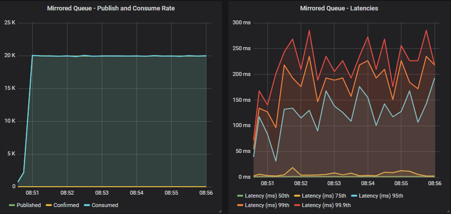

The cluster is not being driven harder by the publishers than it can handle. We get a smooth throughput that matches our target rate with sub-second latency.  发布者对集群的驱动力并没有超出它的承受能力。 我们获得了与我们的目标速率相匹配的平滑吞吐量和亚秒级延迟。

**Mirrored queue with confirms**

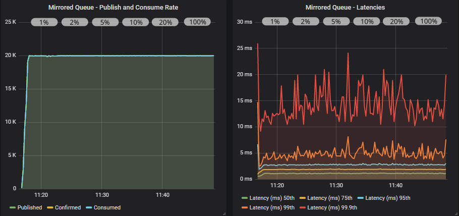

With this load level, all in-flight settings behave the same. We are not anywhere near the broker’s limit.  在此负载级别下，所有飞行中的设置都表现相同。 我们还没有接近经纪人的限制。

**Quorum queue without confirms**

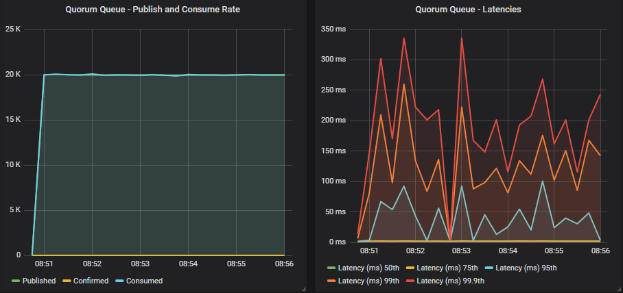

Target rate matched, latency sub-second.  目标速率匹配，延迟亚秒。

**Quorum queue with confirms**

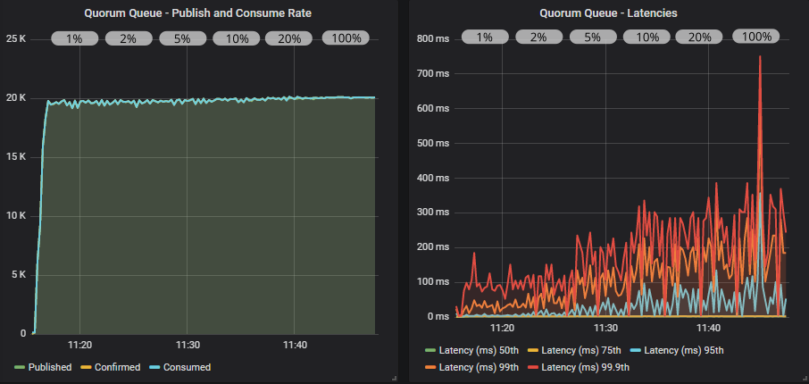

With confirms, and a low in-flight limit, quorum queues are a tiny bit short of the target rate but are achieving < 200ms at all percentiles. As we increase the in-flight limit, the target rate is reached, with a smooth line but latencies increase while still falling below 1 second.  通过确认和较低的飞行限制，仲裁队列比目标速率略低，但在所有百分位数上都实现了 < 200 毫秒。 随着我们增加飞行中的限制，达到了目标速率，线条平滑，但延迟增加，但仍低于 1 秒。

### Conclusion  结论

When the publish rate is within a clusters capacity to deliver it to consumers, confirms with a low in-flight limit delivered the best end-to-end latency while no confirms or confirms with a high in-flight limit delivered the target throughput but at a higher latency (though still sub-second).  当发布速率在将其交付给消费者的集群容量范围内时，以较低的运行中限制确认提供了最佳的端到端延迟，而没有确认或具有高运行中限制的确认提供了目标吞吐量，但在 更高的延迟（尽管仍然是亚秒级）。

## Benchmark #2: 20 publishers, 2000 msgs/s per publisher, 10 queues, 20 consumers

With a total target rate of 40000 msg/s, this is around or above the throughput limit of the cluster on the chosen hardware. This kind of load is probably unsustainable for this cluster but could occur under peak load conditions. If it were sustained then bigger hardware would be advised.  总目标速率为 40000 msg/s，这大约或高于所选硬件上集群的吞吐量限制。 这种负载对于该集群来说可能是不可持续的，但可能会在峰值负载条件下发生。 如果它持续存在，那么将建议使用更大的硬件。

We have three tests:  我们有三个测试：

1. No publisher confirms  没有出版商确认

2. Confirms with in-flight limit as a percentage of the target send rate: 1% (20), 2% (40), 5% (100), 10% (200), 20% (400), 100% (2000). Prefetch of 2000, ack interval of 1.  以目标发送率的百分比形式确认飞行中限制：1% (20)、2% (40)、5% (100)、10% (200)、20% (400)、100% (2000) . 预取 2000，确认间隔 1。

3. Same as 2, but with multiple flag usage by consumers, using an ack interval of 200 (10% of prefetch).  与 2 相同，但消费者使用多个标志，使用 200 的确认间隔（预取的 10%）。

**Mirrored queue without confirms**

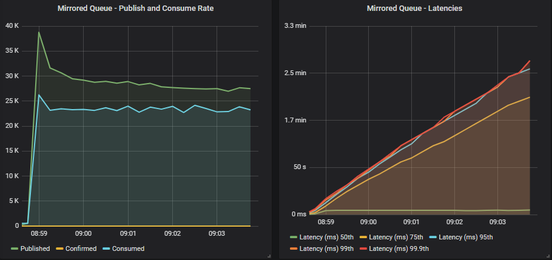

Publishers briefly touch close to the target rate but both publisher and consumer rates stabilise at a lower rate, with the publish rate exceeding the consumer rate. This causes the queues to fill up and latencies to skyrocket. If this were sustained then the queue would grow huge and place increasing pressure on resource usage.  出版商短暂接近目标费率，但出版商和消费者费率都稳定在较低的水平，发布率超过消费者费率。 这会导致队列填满，延迟飙升。 如果这种情况持续下去，那么队列将变得巨大，并对资源使用造成越来越大的压力。

**Mirrored queue with confirms**

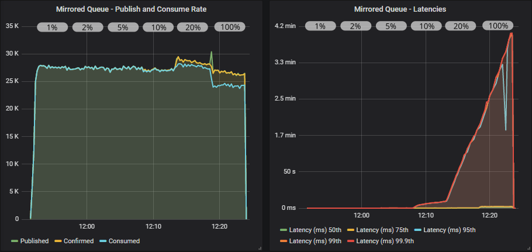

**Mirrored queue with confirms and multiple flag usage**

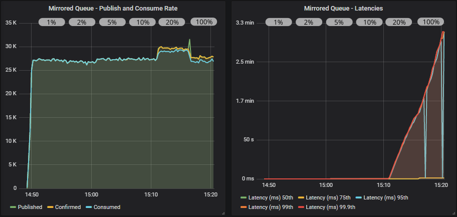

Confirms really make a difference now, applying effective back pressure on the publishers. We hit the peak throughput (still way-off the target) with the lowest in-flight limit of 20 (1% of target rate). End-to-end latency is low, at around 20ms. But as we increase the in-flight limit, a minority of the queues start filling up, causing the 95th percentile latency to shoot up.  确认现在确实有所作为，对出版商施加有效的背压。 我们以 20 的最低飞行限制（目标速率的 1%）达到了峰值吞吐量（仍远未达到目标）。 端到端延迟较低，约为 20 毫秒。 但是随着我们增加飞行中的限制，少数队列开始填满，导致 95% 的延迟激增。

We see that using the multiple flag reduces the publish-to-consume rate imbalance when at the high in-flight limit and thereby reduces the worst of the latencies a bit. But the effect is not super strong in this case.  我们看到，当处于高运行限制时，使用 multiple 标志减少了发布到消费率的不平衡，从而稍微减少了最坏的延迟。 但在这种情况下效果并不是特别强。

**Quorum queue without confirms**

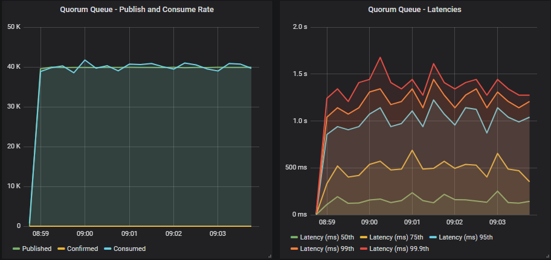

Quorum queues tend to outperform mirrored queues when the queue count is low. Here we see that 40000 msg/s was achieved and so back pressure on publishers was not needed.  当队列计数较低时，Quorum 队列的性能往往优于镜像队列。 在这里，我们看到达到了 40000 msg/s，因此不需要对发布者施加背压。

**Quorum queue with confirms**

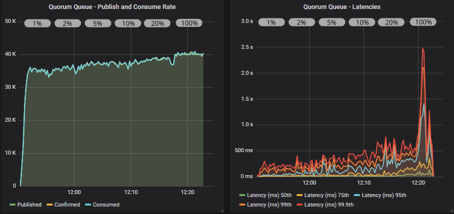

**Quorum queue with confirms and multiple flag usage**

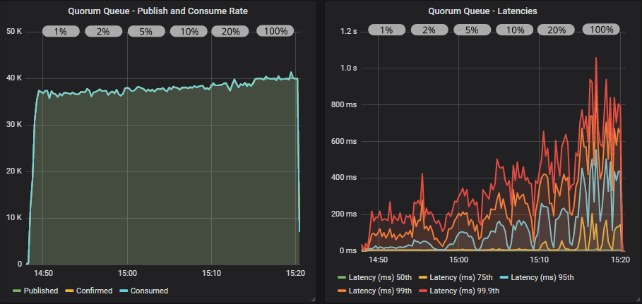

Quorum queues yet again deliver higher throughput and we even reached the target rate of 40000 msg/s with an in-flight limit of 2000. There was a mild benefit to using the multiple flag.  Quorum 队列再次提供了更高的吞吐量，我们甚至达到了 40000 msg/s 的目标速率和 2000 的动态限制。使用多个标志有轻微的好处。

### Conclusion  结论

Without the back pressure of using publisher confirms and an in-flight limit, mirrored queues fell apart. When publishers used confirms they effectively put back pressure on the publishers, achieving low latency until the in-flight limit reached 100% of the target rate, where again latency started spiking again. The important thing to note is that this target rate exceeded the mirrored queues capacity, and we saw how important back pressure was.  如果没有使用发布者确认的背压和动态限制，镜像队列就会分崩离析。 当使用的发布者确认他们有效地对发布者施加压力时，实现了低延迟，直到动态限制达到目标速率的 100%，延迟再次开始飙升。 需要注意的重要一点是，这个目标速率超过了镜像队列的容量，我们看到了背压的重要性。

Quorum queues can achieve higher throughput than mirrored queues when the number of queues and publishers is relatively low. They were capable of delivering 40000 msg/s and so using confirms or not using confirms was not critical to stable performance.  当队列和发布者的数量相对较少时，Quorum 队列可以实现比镜像队列更高的吞吐量。 它们能够提供 40000 msg/s，因此使用确认或不使用确认对于稳定的性能并不重要。

Multiple flag usage was beneficial, but not game changing.  使用多个标志是有益的，但不会改变游戏规则。

## Benchmark #3: 500 publishers, 30 msgs/s per publisher, 100 queues, 500 consumers

With a total target rate of 15000 msg/s, this is within the total throughput limit of the cluster on the chosen hardware.  总目标速率为 15000 msg/s，这在所选硬件上集群的总吞吐量限制范围内。

We have two tests:  我们有两个测试：

1. No publisher confirms  没有出版商确认

2. Confirms with in-flight limit as a percentage of the target send rate: 6% (2), 10% (3), 20% (6), 50% 12, 100% (30), 200% (60) and no multiple flag usage.  以目标发送率的百分比形式确认飞行中限制：6% (2)、10% (3)、20% (6)、50% 12、100% (30)、200% (60) 和无 多个标志的使用。

**Mirrored queue without confirms**

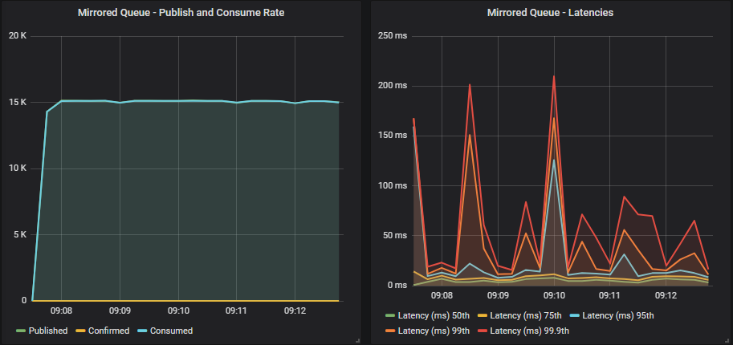

**Mirrored queue with confirms**

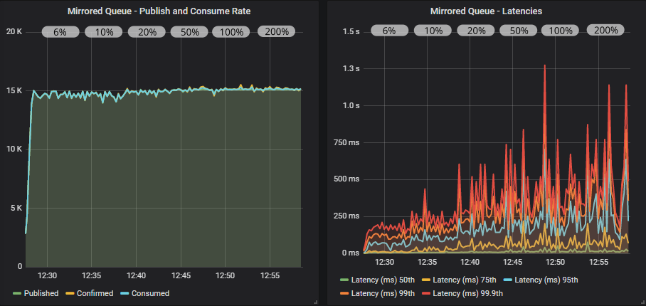

**Quorum queue without confirms**

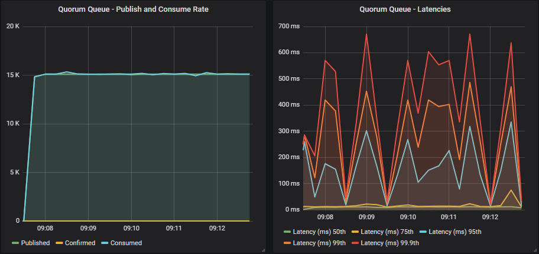

**Quorum queue with confirms**

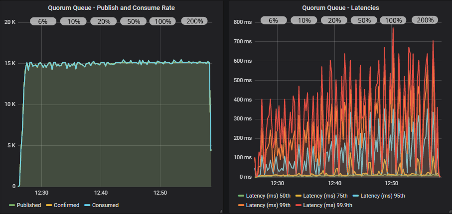

In all cases we matched the target rate. With confirms and a low in-flight limit the throughput had a small amount of jitter that resolved at higher limits.  在所有情况下，我们都符合目标利率。 通过确认和较低的飞行限制，吞吐量具有少量抖动，可在较高限制下解决。

As we increased the in-flight limit, latency crept up. Mirrored queues passed 1 second while quorum queues remained below 1 second.  随着我们增加飞行中的限制，延迟逐渐增加。 镜像队列经过 1 秒，而仲裁队列仍低于 1 秒。

Again, we see that when the cluster is within its capacity, we don’t need confirms as a back pressure mechanism (just for data safety).  同样，我们看到，当集群在其容量范围内时，我们不需要确认作为背压机制（只是为了数据安全）。

## Benchmark #4: 500 publishers, 60 msgs/s per publisher, 100 queues, 500 consumers

With a total target rate of 30000 msg/s, this is just above the total throughput limit of the cluster for this number of clients and queues (on the chosen hardware). This will stress the cluster and is not a sustainable load that this cluster should be exposed to.  对于 30000 msg/s 的总目标速率，这刚好高于该数量的客户端和队列（在所选硬件上）的集群总吞吐量限制。 这会给集群带来压力，并且不是该集群应该承受的可持续负载。

We have three tests:  我们有三个测试：

1. No publisher confirms  没有出版商确认

2. Confirms with in-flight limit as a percentage of the target send rate: 5% (3), 10% (6), 20% (12), 50% (24), 100% (60), 200% (120) and a prefetch of 60.  以目标发送率的百分比形式确认飞行中限制：5% (3)、10% (6)、20% (12)、50% (24)、100% (60)、200% (120) 和 60 的预取。

3. Same as 2 but with multiple flag usage with an ack interval of 6 (10% of prefetch).  与 2 相同，但使用多个标志，确认间隔为 6（预取的 10%）。

**Mirrored queue without confirms**

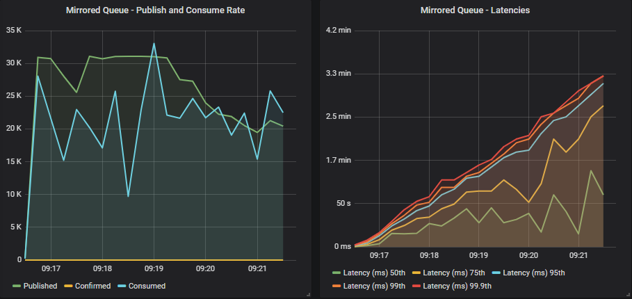

Without confirms, publishers briefly manage the target rate but consumers can’t keep up. Throughput is pretty wild and latencies for half the queues get close to 1 minute and the rest reach over 2-3 minutes.  在没有确认的情况下，发布者会短暂管理目标费率，但消费者无法跟上。 吞吐量非常大，一半队列的延迟接近 1 分钟，其余的则超过 2-3 分钟。

**Mirrored queue with confirms**

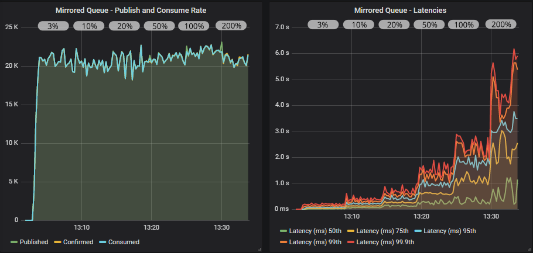

**Mirrored queue with confirms and multiple flag usage**

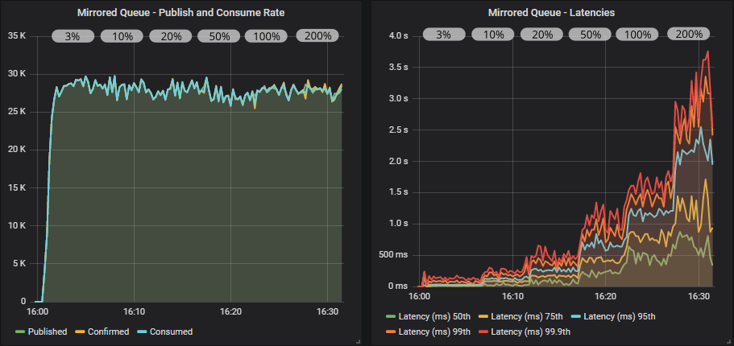

With confirms we get much more stable throughput where consumers keep up with the publish rate because the publishers are being rate limited by their in-flight limit. The multiple flag definitely helps this time, pushing us up to 5000 msg/s higher throughput. Notice that the in-flight limit of just 3% of the target rate delivers the best performance.  通过确认，我们获得了更加稳定的吞吐量，消费者可以跟上发布速率，因为发布者的速率受到其运行中限制的限制。 多重标志这次肯定有帮助，将我们的吞吐量提高到 5000 msg/s。 请注意，仅目标速率的 3% 的飞行中限制可提供最佳性能。

**Quorum queue without confirms**

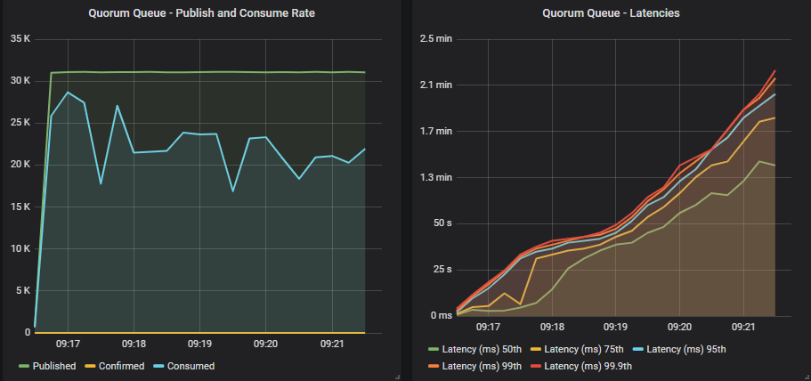

The publishers hit their target, but consumers are not keeping up and the queues are filling. This is not a sustainable position to be in.  出版商达到了他们的目标，但消费者没有跟上，队列正在填满。 这不是一个可持续的位置。

**Quorum queue with confirms**

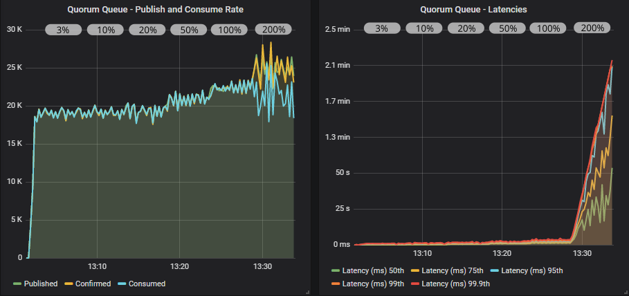

**Quorum queue with confirms and multiple flag**

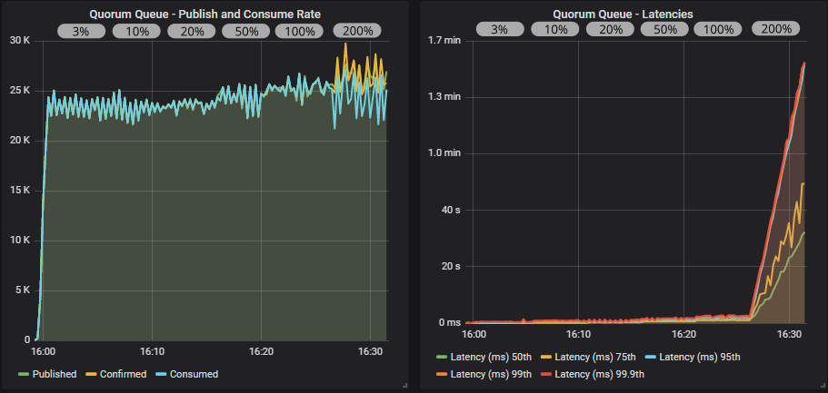

With publisher confirms we see more stable throughput but there is a definitely a saw-tooth pattern. We can go all the way up to an in-flight limit of 100% of the target rate without things falling apart, though latencies are steadily rising. At 200%, the publish rate exceeds the consume rate and the queues start filling up.  随着发布者的确认，我们看到了更稳定的吞吐量，但肯定存在锯齿模式。 尽管延迟在稳步上升，但我们可以一直达到目标速率的 100% 的飞行限制而不会崩溃。 在 200% 时，发布率超过消耗率，队列开始填满。

### Conclusion  结论

When a cluster is past its limit, use of publisher confirms with an in-flight limit ensure a balanced publish and consume rate. Even though the publishers would go faster, they rate limit themselves and RabbitMQ can deliver sustainable performance for long periods.  当集群超过其限制时，发布者的使用会通过运行中的限制进行确认，以确保平衡的发布和消费率。 即使发布者会更快，他们也会限制自己的速率，并且 RabbitMQ 可以长期提供可持续的性能。

With large numbers of publishers, consumers and queues, the maximum throughput of mirrored and quorum queues has converged to a similar number. Quorum queues no longer outperform mirrored queues. We saw a higher throughput with less clients and queues. Less means less context switching, less random IO which is all more efficient.  随着大量发布者、消费者和队列的出现，镜像队列和仲裁队列的最大吞吐量已经收敛到相似的数量。 仲裁队列不再优于镜像队列。 我们看到更高的吞吐量和更少的客户端和队列。 更少意味着更少的上下文切换，更少的随机 IO，这一切都更有效。

## Benchmark #5: 1000 publishers, 100 msgs/s per publisher, 200 queues, 1000 consumers

This load is way past what this cluster can handle at a total target rate of 100000 msg/s second over 200 queues. Beyond the low 10s of queues, expect maximum throughput of a cluster to fall as the number of queues increases.  这个负载远远超过了这个集群在 200 个队列上以 100000 msg/s 的总目标速率可以处理的负载。 超过 10 秒的队列，预计集群的最大吞吐量会随着队列数量的增加而下降。

If this cluster ever gets hit like this then it should only be for short periods of time.  如果这个集群曾经像这样被击中，那么它应该只是在很短的时间内。

We have three tests:  我们有三个测试：

1. No confirms  没有确认

2. Confirms with in-flight limit as a percentage of the target send rate: 2% (2), 5% (5), 10% (10), 20% (20), 50% (50), 100% (100) and a prefetch of 100.  以目标发送率的百分比形式确认飞行中限制：2% (2)、5% (5)、10% (10)、20% (20)、50% (50)、100% (100) 和 100 的预取。

3. Same as 2 but with multiple flag usage and an ack interval of 10 (10% of prefetch).  与 2 相同，但使用多个标志和 10 的确认间隔（预取的 10%）。

**Mirrored queue without confirms**

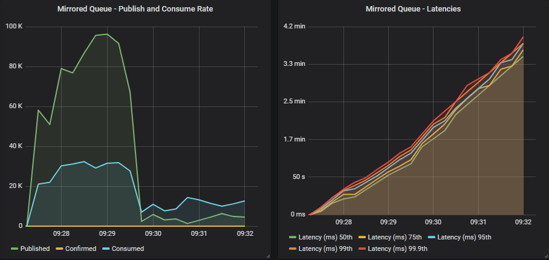

Publishers almost reach the target rate, but then buffers inside the brokers start reaching capacity and throughput plummets like a stone. Relying on TCP back pressure, with default credit based flow control settings with 1000 publishers sending faster than the cluster could handle didn’t go very well.  发布者几乎达到目标速率，但随后经纪人内部的缓冲区开始达到容量，吞吐量像石头一样直线下降。 依靠 TCP 背压，默认基于信用的流量控制设置，1000 个发布者的发送速度超过集群的处理速度，效果并不好。

The initial credit is 400 for each actor in the credit chain, so the reader process on each connection will accept at the least 400 messages before being blocked. With 1000 publishers, that’s 400,000 messages buffered just in the reader processes. Add to that the buffers of the channels and the queues, and all the outgoing port buffers etc and you can see how a broker can absorb and then get choked by a large number of messages from a large number of publishers, even before TCP back pressure kicks in.  信用链中每个参与者的初始信用是 400，因此每个连接上的读取器进程将在被阻止之前至少接受 400 条消息。 对于 1000 个发布者，仅在阅读器进程中就缓冲了 400,000 条消息。 添加通道和队列的缓冲区，以及所有传出端口缓冲区等，您可以看到代理如何吸收大量发布者的大量消息，然后被大量消息阻塞，甚至在 TCP 背压之前 踢进来。

**Mirrored queue with confirms**

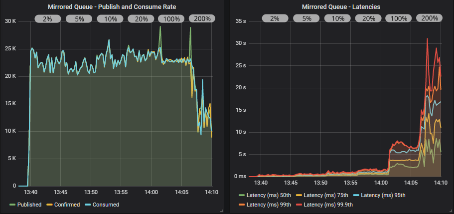

**Mirrored queue with confirms and multiple flag usage**

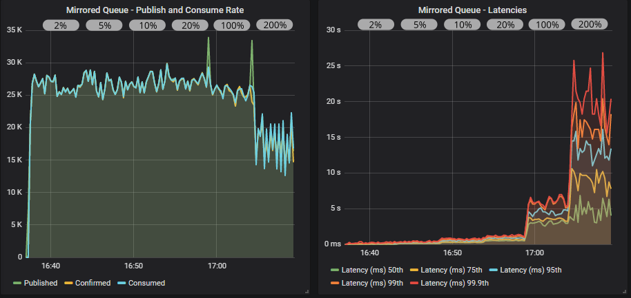

The publishers would love to reach the target rate but they are being rate limited effectively. As we increase the in-flight limit we see a slight increase in throughput and a larger increase in latency. In the end, when we reach an in-flight limit of 200% of the target rate, it’s too much, but publishers are still throttled. Queues back up a little and throughput drops, getting pretty choppy. Usage of the multiple flag helps, it lessens the drop and keeps latency below 25 seconds.  发布商希望达到目标费率，但他们的费率受到有效限制。 随着我们增加飞行中的限制，我们看到吞吐量略有增加，延迟增加更大。 最后，当我们达到目标速率的 200% 的动态限制时，这太过分了，但发布商仍然受到限制。 队列略有备份，吞吐量下降，变得非常不稳定。 使用多个标志会有所帮助，它可以减少丢弃并将延迟保持在 25 秒以下。

If we look at the [RabbitMQ Overview](https://grafana.com/grafana/dashboards/10991) Grafana dashboard (slightly modified for show here), we see that when the in-flight limit is low, there are a low number of pending confirms and pending consumer acks, but as we reach 100% in-flight limit those numbers reach 100,000. So RabbitMQ has a lot more messages buffered internally. Consumers have not reached their prefetch limit though peaking at 55,000 of their total possible 100,000.  如果我们查看 RabbitMQ 概览 Grafana 仪表板（稍微修改以在此处显示），我们会看到当飞行限制较低时，待处理确认和待处理消费者确认的数量较少，但当我们达到 100% 时， 飞行限制这些数字达到100,000。 所以 RabbitMQ 在内部缓冲了更多的消息。 消费者尚未达到预取限制，尽管在可能的 100,000 总数中达到了 55,000 的峰值。

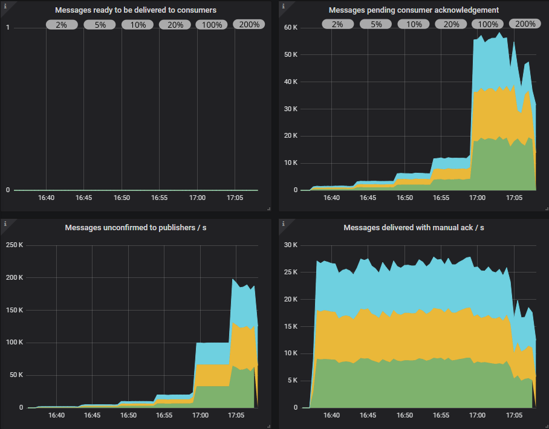

**Quorum queue without confirms**

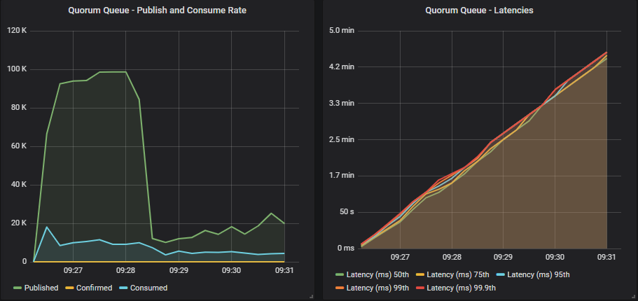

Same as mirrored queues. TCP back pressure was not enough to stop overload.  与镜像队列相同。 TCP 背压不足以阻止过载。

**Quorum queue with confirms**

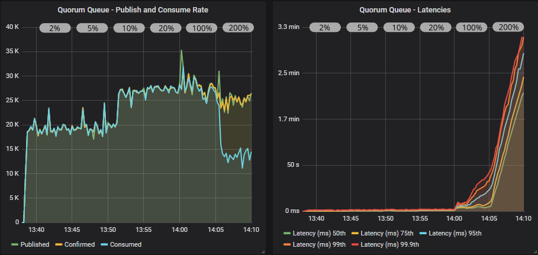

**Quorum queue with confirms and multiple flag usage**

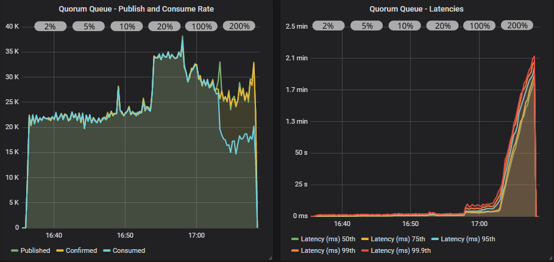

Quorum queues definitely benefited more than mirrored queues when switching from a low to a medium sized in-flight limit. With multiple flag usage we even hit close to 35000 msg/s. Things started to go wrong at the 100% of target rate limit and then really bad at 200%. The publishers pulled ahead causing the queues to fill up. This is when you really need that low value for the *x-max-in-memory-length* quorum queue property. Without it, memory usage would spike very fast under these conditions causing huge swings in throughput as memory alarms turn on and off repeatedly.  当从低限制切换到中等大小的动态限制时，仲裁队列肯定比镜像队列受益更多。 通过使用多个标志，我们甚至达到了接近 35000 msg/s。 事情在 100% 的目标速率限制开始出现问题，然后在 200% 时非常糟糕。 出版商提前导致队列填满。 这是您真正需要 x-max-in-memory-length quorum queue 属性的低值的时候。 没有它，在这些条件下，内存使用量会迅速飙升，导致吞吐量大幅波动，因为内存警报会反复打开和关闭。

We have made big improvements to quorum queue memory usage under stress in the upcoming 3.8.4 release. All these tests show the results of that work. Towards the end of this post we’ll show this same test with 3.8.3 and how it doesn’t deal so well with this stress test.  在即将发布的 3.8.4 版本中，我们对压力下的仲裁队列内存使用进行了重大改进。 所有这些测试都显示了这项工作的结果。 在这篇文章的最后，我们将展示与 3.8.3 相同的测试，以及它如何不能很好地处理这个压力测试。

In the Overview dashboard we see how the queues are filling up. Consumers have reached their prefetch limit.  在概览仪表板中，我们可以看到队列是如何填满的。 消费者已达到预取限制。

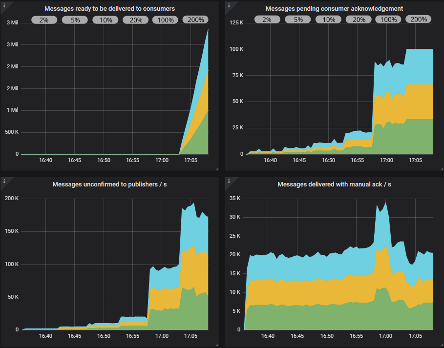

### Conclusion  结论

Neither queue type could handle this load without publisher confirms. Each cluster got totally overwhelmed.  没有发布者确认，这两种队列类型都无法处理此负载。每个集群都完全不堪重负。

With confirms, mirrored and quorum queues achieved the same ballpark throughput and latency numbers until the 100% and 200% in-flight limits, where quorum queues fared worse.  通过确认，镜像队列和仲裁队列达到了相同的吞吐量和延迟数字，直到达到 100% 和 200% 的飞行限制，此时仲裁队列的情况更糟。

Mirrored queues handled the overload pretty well, even with high in-flight limits. Quorum queues needed the additional help of a low in-flight limit to achieve stable throughput with low latency.  镜像队列很好地处理了过载，即使有很高的飞行限制。 Quorum 队列需要低运行中限制的额外帮助，以实现稳定的吞吐量和低延迟。

## What about 3.8.3 and earlier?  3.8.3 及更早版本呢？

All the quorum queue tests were run on an alpha of 3.8.4, in order to show performance of the upcoming 3.8.4 release. But the rest of you will be on version 3.8.3 and earlier. So what can you expect?  所有仲裁队列测试都在 3.8.4 的 alpha 版本上运行，以显示即将发布的 3.8.4 版本的性能。但是你们其他人将使用 3.8.3 和更早的版本。那么你能期待什么呢？

The improvements landing in 3.8.4 are:  3.8.4 中的改进是：

- High throughput capacity of segment writing. Messages are written first to the WAL and secondly to segment files. In 3.8.3 we saw that the segment writer was a bottleneck in high load, high queue count scenarios which would cause high memory usage. 3.8.4 comes with parallelised segment writing which completely solves this bottleneck.  段写入的高吞吐能力。消息首先写入 WAL，然后写入分段文件。在 3.8.3 中，我们看到段写入器是高负载、高队列计数场景中的瓶颈，这会导致高内存使用。 3.8.4 带有并行段写入，完全解决了这个瓶颈。

- Default configuration values for quorum queues were load tested and we found some changes resulted in more stable throughput under high load. Specifically we changed quorum_commands_soft_limit from 256 to 32 and raft.wal_max_batch_size from 32768 to 4096.  仲裁队列的默认配置值经过负载测试，我们发现一些更改导致高负载下的吞吐量更稳定。具体来说，我们将 quorum_commands_soft_limit 从 256 更改为 32，将 raft.wal_max_batch_size 从 32768 更改为 4096。

If you are on 3.8.3 the good news is that rolling upgrades these days are easily performed, but if you can’t upgrade then try the above configurations. You’ll still have the possible bottleneck of the segment writer though.  如果您使用的是 3.8.3，好消息是现在滚动升级很容易执行，但如果您无法升级，请尝试上述配置。不过，您仍然会遇到段编写器的可能瓶颈。

Below is benchmark #5, with a longer running time, with 3.8.3 (with the configuration changes applied).  下面是基准#5，运行时间更长，3.8.3（应用了配置更改）。

**3.8.3 benchmark #5**

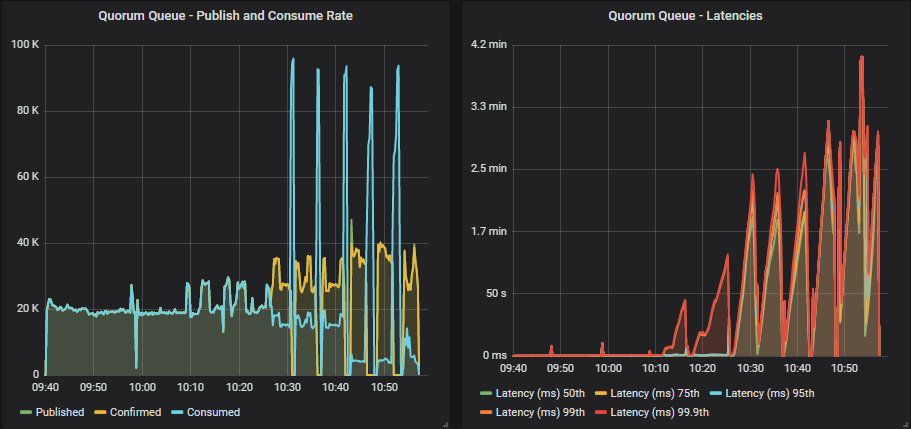

The main difference with 3.8.3 is that as we increase the in-flight limit, the segment writer falls behind and memory grows until memory alarms hit. Publishers get blocked and consumers are then unconstrained by competing with publishers to get their acks into the replicated log. The consume rate reaches short peaks of up to 90k msg/s until the queues are drained, memory falls and alarms deactivated, only to repeat again and again.  与 3.8.3 的主要区别在于，当我们增加运行中限制时，段写入器会落后并且内存会增长，直到内存警报发生。 发布者被阻止，而消费者则不受限制，因为他们与发布者竞争以获得他们的确认到复制的日志中。 消耗率达到高达 90k msg/s 的短峰值，直到队列耗尽、内存下降和警报停用，只会一次又一次地重复。

We can see that from the Overview dashboard. The 3.8.4 alpha has a slowly increasing memory growth as the in-flight limit rises.  我们可以从概览仪表板中看到这一点。 随着飞行限制的增加，3.8.4 alpha 的内存增长缓慢。

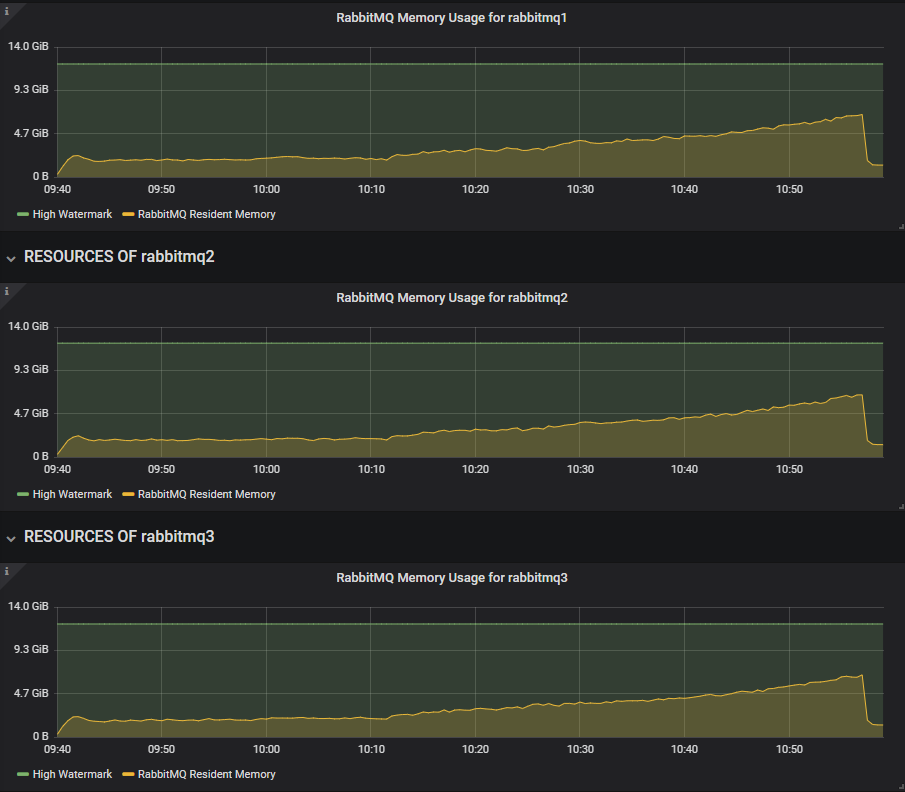

**3.8.3 hits the memory alarms repeatedly.**

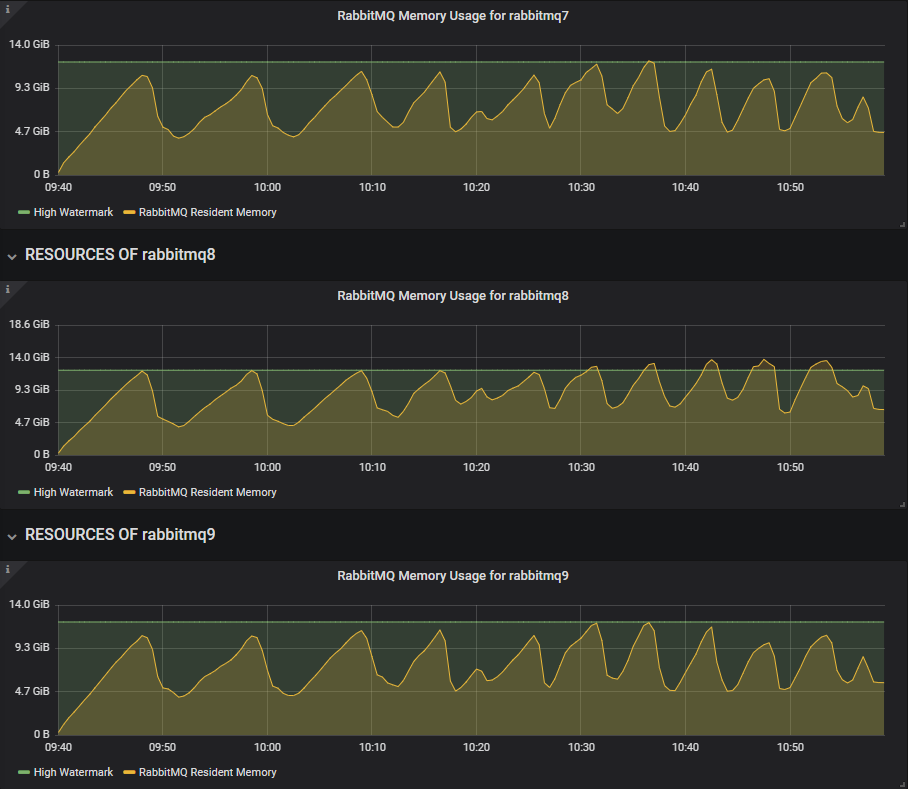

Even with the low in-flight limit, this heavy workload with a 1000 publishers was too much for the segment writer and it reached close to the memory alarms early in the test.  即使在运行中限制较低，1000 个发布者的繁重工作量对于分段编写器来说还是太多了，它在测试早期就接近内存警报。

So if you have large publisher and queue counts with regular peaks in load that exceed its limits, then consider upgrading to 3.8.4 when it is out.  因此，如果您有大量的发布者和队列计数，并且负载的常规峰值超过其限制，那么请考虑在它结束时升级到 3.8.4。

## Final Conclusions  最终结论

First of all, if you are using a replicated queue (mirrored or quorum) then not using publisher confirms, from a data safety point of view, is highly inadvisable. Message delivery is not guaranteed, so please use them.  首先，如果您使用的是复制队列（镜像或仲裁），那么从数据安全的角度来看，不使用发布者确认是非常不可取的。无法保证消息传递，因此请使用它们。

Data safety aside, these tests show that confirms also play a role in flow control.  除了数据安全之外，这些测试表明，确认也在流量控制中发挥作用。

Some key takeaways:  一些关键要点：

- Quorum queues can deliver higher throughput than mirrored queues when the queue count is in the region of 1-2 per core.  当队列计数在每个内核 1-2 个区域时，仲裁队列可以提供比镜像队列更高的吞吐量。

- At low publisher and queue counts, you can pretty much do anything. TCP back pressure is probably enough for both mirrored and quorum queues (not using confirms).  在发布者和队列数量较少的情况下，您几乎可以做任何事情。对于镜像队列和仲裁队列（不使用确认），TCP 背压可能就足够了。

- At high publisher and queue counts and higher load, TCP back pressure is not enough. We must employ publisher confirms so that publishers rate limit themselves.  在较高的发布者和队列计数以及较高的负载下，TCP 背压是不够的。我们必须使用发布者确认，以便发布者限制自己的速率。

- At high publisher and queue counts, performance was more or less similar for both queue types. But quorum queues needed a little extra help via a lower in-flight limit during the stress test.  在发布者和队列数量较多的情况下，两种队列类型的性能或多或少相似。但是，在压力测试期间，仲裁队列需要通过较低的飞行限制来获得一些额外的帮助。

- Multiple flag usage was beneficial but not critical.  使用多个标志是有益的，但并不重要。

- Whatever you do, don’t put your brokers under high load without publisher confirms!  无论您做什么，都不要在没有发布者确认的情况下让您的经纪人处于高负载状态！

So what is the best in-flight limit? I hope I’ve managed to persuade you that *it depends*, but as a rule of thumb, with low network latency between publishers and the broker, using a limit between 1% and 10% of the target rate is optimal. With fewer publishers that have a high send rate, then we veer towards 10% but with hundreds of clients then we veer towards the 1% mark. These numbers are likely to increase with higher latency links between publishers and brokers.  那么最佳的飞行限制是多少？我希望我已经设法说服你这取决于，但根据经验，发布者和经纪人之间的网络延迟较低，使用目标速率的 1% 到 10% 之间的限制是最佳的。发送率高的发布商越少，我们就会转向 10%，但如果有数百个客户，我们就会转向 1%。随着发布者和经纪人之间更高的延迟链接，这些数字可能会增加。

Regarding consumer prefetch, all these tests used a prefetch of the target publish rate (per publisher, not total), but remember that in these tests, the number of publishers matched the number of consumers. When the multiple flag was used, the ack interval was 10% of the prefetch value. Multiple flag usage is beneficial but its not a big deal if you don’t use it.  关于消费者预取，所有这些测试都使用目标发布率的预取（每个发布者，而不是总数），但请记住，在这些测试中，发布者的数量与消费者的数量相匹配。当使用多个标志时，确认间隔为预取值的 10%。多个标志的使用是有益的，但如果你不使用它，这没什么大不了的。

If you are currently on mirrored queues and your workload more closely resembles benchmark #5 rather than any of the others, then it is recommended to make the jump after 3.8.4 is released. Improving flow control and resiliency under load is likely to be an ongoing effort, but is also workload specific in many cases. Hopefully you have seen that you have the power to tune throughput and latency via the use confirms, and get the behaviour that you need.  如果您当前处于镜像队列中并且您的工作负载更接近于基准 #5 而不是其他任何基准，那么建议在 3.8.4 发布后进行跳转。提高负载下的流量控制和弹性可能是一项持续的工作，但在许多情况下也是特定于工作负载的。希望您已经看到您有能力通过使用确认来调整吞吐量和延迟，并获得您需要的行为。

I would be amiss if I didn’t mention capacity planning. Ensuring that RabbitMQ has enough hardware to handle peak loads is the best way to ensure that it can deliver performance that is acceptable. But there are always surprise loads, limits in budget and so on.  如果我没有提到容量规划，那我就错了。确保 RabbitMQ 有足够的硬件来处理峰值负载是确保它能够提供可接受的性能的最佳方式。但是总是有意外的负载，预算限制等等。

Remember, as with all benchmarks like this, don’t fixate on these specific numbers. Your situation will be different. Different hardware, different message sizes, degrees of fanout, different versions of RabbitMQ, different clients, frameworks… the list goes on. The main takeaway is that you shouldn’t expect RabbitMQ to exert flow control by itself when under heavy load. It’s all about *mechanical sympathy*.  请记住，与所有此类基准一样，不要专注于这些特定数字。你的情况会有所不同。不同的硬件、不同的消息大小、扇出程度、不同版本的 RabbitMQ、不同的客户端、框架……不胜枚举。主要的收获是，你不应该期望 RabbitMQ 在重负载下自己进行流量控制。这都是关于机械的同情。

Next in the series is a look at migrating from mirrored to quorum queues.  本系列的下一篇文章介绍了从镜像队列迁移到仲裁队列。

