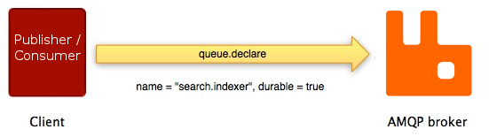
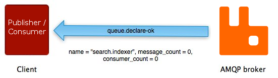

# AMQP 0-9-1 Model Explained

https://www.rabbitmq.com/tutorials/amqp-concepts.html

1. Overview
2. High-level Overview of AMQP 0-9-1 and the AMQP Model
  * What is AMQP 0-9-1?
  * Brokers and Their Role
  * AMQP 0-9-1 Model in Brief
  * AMQP 0-9-1 is a Programmable Protocol
3. Exchanges and Exchange Types
  * Default Exchange
  * Direct Exchange
  * Fanout Exchange
  * Topic Exchange
  * Headers Exchange
4. Queues
  * Queue Names
  * Queue Durability
5. Bindings
6. Consumers
  * Message Acknowledgements
  * Rejecting Messages
  * Negative Acknowledgements
  * Prefetching Messages
7. Message Attributes and Payload
8. Message Acknowledgements
9. AMQP 0-9-1 Methods
10. Connections
11. Channels
12. Virtual Hosts
13. AMQP is Extensible
14. AMQP 0-9-1 Clients Ecosystem
15. Getting Help and Providing Feedback
16. Help Us Improve the Docs <3

## Overview

This guide provides an overview of the AMQP 0-9-1 protocol, one of the protocols supported by RabbitMQ.  本指南概述了 AMQP 0-9-1 协议，RabbitMQ 支持的协议之一。

## High-level Overview of AMQP 0-9-1 and the AMQP Model

### What is AMQP 0-9-1?

AMQP 0-9-1 (Advanced Message Queuing Protocol) is a messaging protocol that enables conforming client applications to communicate with conforming messaging middleware brokers.  AMQP 0-9-1（高级消息队列协议）是一种消息传递协议，它使符合要求的客户端应用程序能够与符合要求的消息传递中间件代理进行通信。

### Brokers and Their Role

Messaging brokers receive messages from [publishers](https://www.rabbitmq.com/publishers.html) (applications that publish them, also known as producers) and route them to [consumers](https://www.rabbitmq.com/consumers.html) (applications that process them).

Since it is a network protocol, the publishers, consumers and the broker can all reside on different machines.  由于它是一个网络协议，发布者、消费者和代理都可以驻留在不同的机器上。

### AMQP 0-9-1 Model in Brief

The AMQP 0-9-1 Model has the following view of the world: messages are published to **exchanges**, which are often compared to post offices or mailboxes. Exchanges then distribute message copies to **queues** using rules called **bindings**. Then the broker either deliver messages to consumers subscribed to queues, or consumers fetch/pull messages from queues on demand.

When publishing a message, publishers may specify various **message attributes** (message meta-data). Some of this meta-data may be used by the broker, however, the rest of it is completely opaque to the broker and is only used by applications that receive the message.  发布消息时，发布者可以指定各种消息属性（消息元数据）。 其中一些元数据可能由代理使用，但是，其余的元数据对代理是完全不透明的，并且仅由接收消息的应用程序使用。

Networks are unreliable and applications may fail to process messages therefore the AMQP 0-9-1 model has a notion of **message acknowledgements**: when a message is delivered to a consumer the consumer **notifies the broker**, either automatically or as soon as the application developer chooses to do so. When message acknowledgements are in use, a broker will only completely remove a message from a queue when it receives a notification for that message (or group of messages).  网络不可靠，应用程序可能无法处理消息，因此 AMQP 0-9-1 模型有一个消息确认的概念：当消息传递给消费者时，消费者会自动或在应用程序开发人员选择时立即通知代理 这样做。 当使用消息确认时，代理只会在收到该消息（或消息组）的通知时从队列中完全删除该消息。

In certain situations, for example, when a message cannot be routed, messages may be **returned** to publishers, dropped, or, if the broker implements an extension, placed into a so-called **dead letter queu**. Publishers choose how to handle situations like this by publishing messages using certain parameters.  在某些情况下，例如，当消息无法路由时，消息可能会返回给发布者、丢弃，或者如果代理实施扩展，则将其放入所谓的“死信队列”。 发布者通过使用某些参数发布消息来选择如何处理此类情况。

Queues, exchanges and bindings are collectively referred to as **AMQP entities**.  队列、交换和绑定统称为 AMQP 实体。

### AMQP 0-9-1 is a Programmable Protocol

AMQP 0-9-1 is a programmable protocol in the sense that AMQP 0-9-1 entities and routing schemes are primarily defined by applications themselves, not a broker administrator. Accordingly, provision is made for protocol operations that declare queues and exchanges, define bindings between them, subscribe to [queues](https://www.rabbitmq.com/queues.html) and so on.  AMQP 0-9-1 是一种可编程协议，因为 AMQP 0-9-1 实体和路由方案主要由应用程序本身定义，而不是代理管理员。 因此，为声明队列和交换、定义它们之间的绑定、订阅队列等的协议操作做出了规定。

This gives application developers a lot of freedom but also requires them to be aware of potential definition conflicts. In practice, definition conflicts are rare and often indicate a misconfiguration.  这为应用程序开发人员提供了很大的自由，但也要求他们了解潜在的定义冲突。 在实践中，定义冲突很少见，通常表示配置错误。

Applications declare the AMQP 0-9-1 entities that they need, define necessary routing schemes and may choose to delete AMQP 0-9-1 entities when they are no longer used.  应用程序声明它们需要的 AMQP 0-9-1 实体，定义必要的路由方案，并可以在不再使用 AMQP 0-9-1 实体时选择删除它们。

## Exchanges and Exchange Types

**Exchanges** are AMQP 0-9-1 entities where messages are sent. Exchanges take a message and route it into zero or more queues. The routing algorithm used depends on the **exchange type** and rules called **bindings**. AMQP 0-9-1 brokers provide four exchange types:

| Exchange type    | Default pre-declared names              |
| :--------------- | :-------------------------------------- |
| Direct exchange  | (Empty string) and amq.direct           |
| Fanout exchange  | amq.fanout                              |
| Topic exchange   | amq.topic                               |
| Headers exchange | amq.match (and amq.headers in RabbitMQ) |

Besides the exchange type, exchanges are declared with a number of attributes, the most important of which are:  除了交换类型之外，交换还声明了许多属性，其中最重要的是：

- Name  名称
- Durability (exchanges survive broker restart)  持久性（交易在代理重启后仍然存在）
- Auto-delete (exchange is deleted when last queue is unbound from it)  自动删除（当最后一个队列解除绑定时，交换被删除）
- Arguments (optional, used by plugins and broker-specific features)  参数（可选，由插件和特定于代理的功能使用）

Exchanges can be durable or transient. Durable exchanges survive broker restart whereas transient exchanges do not (they have to be redeclared when broker comes back online). Not all scenarios and use cases require exchanges to be durable.  交换可以是持久的或短暂的。 持久交换在经纪人重启后幸免于难，而临时交换则不然（他们必须在经纪人重新上线时重新声明）。 并非所有场景和用例都要求交换是持久的。

### Default Exchange

The default exchange is a direct exchange with no name (empty string) pre-declared by the broker. It has one special property that makes it very useful for simple applications: every queue that is created is automatically bound to it with a routing key which is the same as the queue name.  默认交换是没有经纪人预先声明的名称（空字符串）的直接交换。 它有一个特殊的属性，使它对简单的应用程序非常有用：创建的每个队列都会自动绑定到一个与队列名称相同的路由键。

For example, when you declare a queue with the name of "search-indexing-online", the AMQP 0-9-1 broker will bind it to the default exchange using "search-indexing-online" as the routing key (in this context sometimes referred to as the binding key). Therefore, a message published to the default exchange with the routing key "search-indexing-online" will be routed to the queue "search-indexing-online". In other words, the default exchange makes it seem like it is possible to deliver messages directly to queues, even though that is not technically what is happening.

### Direct Exchange

A direct exchange delivers messages to queues based on the message routing key. A direct exchange is ideal for the unicast routing of messages (although they can be used for multicast routing as well). Here is how it works:  直接交换器根据消息路由键将消息传递到队列。 直接交换是消息单播路由的理想选择（尽管它们也可用于多播路由）。 下面是它的工作原理：

- A queue binds to the exchange with a routing key K
- When a new message with routing key R arrives at the direct exchange, the exchange routes it to the queue if K = R

Direct exchanges are often used to distribute tasks between multiple workers (instances of the same application) in a round robin manner. When doing so, it is important to understand that, in AMQP 0-9-1, messages are load balanced between consumers and not between queues.

A direct exchange can be represented graphically as follows:

### Fanout Exchange

A fanout exchange routes messages to all of the queues that are bound to it and the routing key is ignored. If N queues are bound to a fanout exchange, when a new message is published to that exchange a copy of the message is delivered to all N queues. Fanout exchanges are ideal for the broadcast routing of messages.

Because a fanout exchange delivers a copy of a message to every queue bound to it, its use cases are quite similar:

- Massively multi-player online (MMO) games can use it for leaderboard updates or other global events
- Sport news sites can use fanout exchanges for distributing score updates to mobile clients in near real-time
- Distributed systems can broadcast various state and configuration updates
- Group chats can distribute messages between participants using a fanout exchange (although AMQP does not have a built-in concept of presence, so XMPP may be a better choice)

A fanout exchange can be represented graphically as follows:

### Topic Exchange

Topic exchanges route messages to one or many queues based on matching between a message routing key and the pattern that was used to bind a queue to an exchange. The topic exchange type is often used to implement various publish/subscribe pattern variations. Topic exchanges are commonly used for the multicast routing of messages.

Topic exchanges have a very broad set of use cases. Whenever a problem involves multiple consumers/applications that selectively choose which type of messages they want to receive, the use of topic exchanges should be considered.

Example uses:

- Distributing data relevant to specific geographic location, for example, points of sale
- Background task processing done by multiple workers, each capable of handling specific set of tasks
- Stocks price updates (and updates on other kinds of financial data)
- News updates that involve categorization or tagging (for example, only for a particular sport or team)
- Orchestration of services of different kinds in the cloud
- Distributed architecture/OS-specific software builds or packaging where each builder can handle only one architecture or OS

### Headers Exchange

A headers exchange is designed for routing on multiple attributes that are more easily expressed as message headers than a routing key. Headers exchanges ignore the routing key attribute. Instead, the attributes used for routing are taken from the headers attribute. A message is considered matching if the value of the header equals the value specified upon binding.

It is possible to bind a queue to a headers exchange using more than one header for matching. In this case, the broker needs one more piece of information from the application developer, namely, should it consider messages with any of the headers matching, or all of them? This is what the "x-match" binding argument is for. When the "x-match" argument is set to "any", just one matching header value is sufficient. Alternatively, setting "x-match" to "all" mandates that all the values must match.

Headers exchanges can be looked upon as "direct exchanges on steroids". Because they route based on header values, they can be used as direct exchanges where the routing key does not have to be a string; it could be an integer or a hash (dictionary) for example.

Note that headers beginning with the string x- will not be used to evaluate matches.

## Queues

[Queues](https://www.rabbitmq.com/queues.html) in the AMQP 0-9-1 model are very similar to queues in other message- and task-queueing systems: they store messages that are consumed by applications. **Queues share some properties with exchanges, but also have some additional properties**:

- Name  名称
- Durable (the queue will survive a broker restart)  持久（队列将在代理重启后继续存在）
- Exclusive (used by only one connection and the queue will be deleted when that connection closes)  独占（仅由一个连接使用，该连接关闭时队列将被删除）
- Auto-delete (queue that has had at least one consumer is deleted when last consumer unsubscribes)  自动删除（当最后一个消费者取消订阅时，删除至少有一个消费者的队列）
- Arguments (optional; used by plugins and broker-specific features such as message TTL, queue length limit, etc)  参数（可选；由插件和特定于代理的功能使用，例如消息 TTL、队列长度限制等）

Before a queue can be used it has to be declared. Declaring a queue will cause it to be created if it does not already exist. The declaration will have no effect if the queue does already exist and its attributes are the same as those in the declaration. When the existing queue attributes are not the same as those in the declaration a channel-level exception with code 406 (**PRECONDITION_FAILED**) will be raised.  在使用队列之前，必须先声明它。 如果队列不存在，则声明队列将导致它被创建。 如果队列已经存在并且其属性与声明中的属性相同，则声明将不起作用。 当现有队列属性与声明中的属性不同时，将引发代码为 406 (PRECONDITION_FAILED) 的通道级异常。

### Queue Names

Applications may pick queue names or ask the broker to generate a name for them. Queue names may be up to 255 bytes of UTF-8 characters. An AMQP 0-9-1 broker can generate a unique queue name on behalf of an app. To use this feature, pass an empty string as the queue name argument. The generated name will be returned to the client with queue declaration response.  应用程序可以选择队列名称或要求代理为它们生成一个名称。 队列名称最多可以是 255 个字节的 UTF-8 字符。 AMQP 0-9-1 代理可以代表应用程序生成唯一的队列名称。 要使用此功能，请将空字符串作为队列名称参数传递。 生成的名称将与队列声明响应一起返回给客户端。

Queue names starting with "amq." are reserved for internal use by the broker. Attempts to declare a queue with a name that violates this rule will result in a channel-level exception with reply code 403 (**ACCESS_REFUSED**).  以“amq”开头的队列名称。 保留供经纪人内部使用。 尝试使用违反此规则的名称声明队列将导致通道级异常，回复代码为 403 (ACCESS_REFUSED)。

### Queue Durability

In AMQP 0-9-1, queues can be declared as durable or transient. Metadata of a durable queue is stored on disk, while metadata of a transient queue is stored in memory when possible.

The same distinction is made for [messages at publishing time](https://www.rabbitmq.com/publishers.html#message-properties).

In environments and use cases where durability is important, applications must use durable queues *and* make sure that publish mark published messages as persisted.  在持久性很重要的环境和用例中，应用程序必须使用持久队列并确保发布将发布的消息标记为持久化。

This topic is covered in more detailed in the [Queues guide](https://www.rabbitmq.com/queues.html#durability).

## Bindings

Bindings are rules that exchanges use (among other things) to route messages to queues. To instruct an exchange E to route messages to a queue Q, Q has to be **bound** to E. Bindings may have an optional **routing key** attribute used by some exchange types. The purpose of the routing key is to select certain messages published to an exchange to be routed to the bound queue. In other words, the routing key acts like a filter.

To draw an analogy:

- Queue is like your destination in New York city
- Exchange is like JFK airport
- Bindings are routes from JFK to your destination. There can be zero or many ways to reach it

Having this layer of indirection enables routing scenarios that are impossible or very hard to implement using publishing directly to queues and also eliminates certain amount of duplicated work application developers have to do.  拥有这一间接层可以实现使用直接发布到队列不可能或很难实现的路由场景，并且还消除了应用程序开发人员必须做的一定数量的重复工作。

If a message cannot be routed to any queue (for example, because there are no bindings for the exchange it was published to) it is either [dropped or returned to the publisher](https://www.rabbitmq.com/publishers.html#unroutable), depending on message attributes the publisher has set.

## Consumers

Storing messages in queues is useless unless applications can [consume](https://www.rabbitmq.com/consumers.html) them. In the AMQP 0-9-1 Model, there are two ways for applications to do this:  除非应用程序可以使用它们，否则将消息存储在队列中是没有用的。 在 AMQP 0-9-1 模型中，应用程序有两种方法可以做到这一点：

- Subscribe to have messages delivered to them ("push API"): this is the recommended option
- Polling ("pull API"): this way is **highly inefficient** and **should be avoided** in most cases

With the **push API**, applications have to indicate interest in consuming messages from a particular queue. When they do so, we say that they **register a consumer** or, simply put, **subscribe to a queue**. It is possible to have more than one consumer per queue or to register an **exclusive consumer** (excludes all other consumers from the queue while it is consuming).  使用“推送 API”，应用程序必须表明有兴趣使用来自特定队列的消息。 当他们这样做时，我们说他们注册了一个消费者，或者简单地说，订阅了一个队列。 每个队列可能有多个消费者或注册一个独占消费者（在消费时从队列中排除所有其他消费者）。

Each consumer (subscription) has an identifier called a **consumer tag**. It can be used to unsubscribe from messages. Consumer tags are just strings.

### Message Acknowledgements

[Consumer applications](https://www.rabbitmq.com/consumers.html) – that is, applications that receive and process messages – may occasionally fail to process individual messages or will sometimes just crash. There is also the possibility of network issues causing problems. This raises a question: when should the broker remove messages from queues? The AMQP 0-9-1 specification gives consumers control over this. There are two [acknowledgement modes](https://www.rabbitmq.com/confirms.html):  消费者应用程序（即接收和处理消息的应用程序）可能偶尔无法处理单个消息或有时会崩溃。 网络问题也有可能导致问题。 这就提出了一个问题：代理何时应该从队列中删除消息？ AMQP 0-9-1 规范让消费者对此进行控制。 有两种确认模式：

- After broker sends a message to an application (using either basic.deliver or basic.get-ok method).
- After the application sends back an acknowledgement (using the basic.ack method).

The former choice is called the automatic acknowledgement model, while the latter is called the explicit acknowledgement model. With the explicit model the application chooses when it is time to send an acknowledgement. It can be right after receiving a message, or after persisting it to a data store before processing, or after fully processing the message (for example, successfully fetching a Web page, processing and storing it into some persistent data store).  前者称为自动确认模型，后者称为显式确认模型。 使用显式模型，应用程序选择何时发送确认。 它可以是在接收到消息之后，或者在处理之前将它持久化到数据存储之后，或者在完全处理消息之后（例如，成功获取一个网页，将其处理并存储到某个持久性数据存储中）。

If a consumer dies without sending an acknowledgement, the broker will redeliver it to another consumer or, if none are available at the time, the broker will wait until at least one consumer is registered for the same queue before attempting redelivery.

### Rejecting Messages

When a consumer application receives a message, processing of that message may or may not succeed. An application can indicate to the broker that message processing has failed (or cannot be accomplished at the time) by rejecting a message. When rejecting a message, an application can ask the broker to discard or requeue it. When there is only one consumer on a queue, make sure you do not create infinite message delivery loops by rejecting and requeueing a message from the same consumer over and over again.

### Negative Acknowledgements

Messages are rejected with the **basic.reject** method. There is one limitation that **basic.reject** has: there is no way to reject multiple messages as you can do with acknowledgements. However, if you are using RabbitMQ, then there is a solution. RabbitMQ provides an AMQP 0-9-1 extension known as **negative acknowledgements** or **nacks**. For more information, please refer to the [Confirmations](https://www.rabbitmq.com/confirms.html) and [basic.nack extension](https://www.rabbitmq.com/nack.html) guides.

### Prefetching Messages

For cases when multiple consumers share a queue, it is useful to be able to specify how many messages each consumer can be sent at once before sending the next acknowledgement. This can be used as a simple load balancing technique or to improve throughput if messages tend to be published in batches. For example, if a producing application sends messages every minute because of the nature of the work it is doing.  对于多个消费者共享一个队列的情况，能够指定每个消费者在发送下一个确认之前可以一次发送多少消息很有用。 这可以用作简单的负载平衡技术，或者如果消息倾向于批量发布，则可以提高吞吐量。 例如，如果生产应用程序由于其正在执行的工作的性质而每分钟发送一次消息。

Note that RabbitMQ only supports channel-level prefetch-count, not connection or size based prefetching.

## Message Attributes and Payload

Messages in the AMQP 0-9-1 model have **attributes**. Some attributes are so common that the AMQP 0-9-1 specification defines them and application developers do not have to think about the exact attribute name. Some examples are  AMQP 0-9-1 模型中的消息具有属性。 有些属性非常常见，以至于 AMQP 0-9-1 规范定义了它们，应用程序开发人员不必考虑确切的属性名称。 一些例子是

- Content type
- Content encoding
- Routing key
- Delivery mode (persistent or not)
- Message priority
- Message publishing timestamp
- Expiration period  有效期
- Publisher application id

Some attributes are used by AMQP brokers, but most are open to interpretation by applications that receive them. Some attributes are optional and known as **headers**. They are similar to X-Headers in HTTP. Message attributes are set when a message is published.  AMQP 代理使用某些属性，但大多数属性都可以由接收它们的应用程序解释。 一些属性是可选的，称为标题。 它们类似于 HTTP 中的 X-Header。 消息属性是在发布消息时设置的。

Messages also have a **payload** (the data that they carry), which AMQP brokers treat as an opaque byte array. The broker will not inspect or modify the payload. It is possible for messages to contain only attributes and no payload. It is common to use serialisation formats like JSON, Thrift, Protocol Buffers and MessagePack to serialize structured data in order to publish it as the message payload. Protocol peers typically use the "content-type" and "content-encoding" fields to communicate this information, but this is by convention only.  消息还有一个有效载荷（它们携带的数据），AMQP 代理将其视为一个不透明的字节数组。 代理不会检查或修改有效负载。 消息可能只包含属性而没有负载。 通常使用 JSON、Thrift、Protocol Buffers 和 MessagePack 等序列化格式来序列化结构化数据，以便将其作为消息负载发布。 协议对等方通常使用“内容类型”和“内容编码”字段来传达此信息，但这只是按照惯例。

Messages may be published as persistent, which makes the broker persist them to disk. If the server is restarted the system ensures that received persistent messages are not lost. Simply publishing a message to a durable exchange or the fact that the queue(s) it is routed to are durable doesn't make a message persistent: it all depends on persistence mode of the message itself. Publishing messages as persistent affects performance (just like with data stores, durability comes at a certain cost in performance).  消息可以作为持久性发布，这使得代理将它们持久化到磁盘。 如果服务器重新启动，系统会确保接收到的持久消息不会丢失。 简单地将消息发布到持久交换或者它被路由到的队列是持久的这一事实不会使消息持久：这完全取决于消息本身的持久模式。 将消息发布为持久性会影响性能（就像数据存储一样，持久性以一定的性能成本为代价）。

Learn more in the [Publishers guide](https://www.rabbitmq.com/publishers.html).

## Message Acknowledgements

Since networks are unreliable and applications fail, it is often necessary to have some kind of processing acknowledgement. Sometimes it is only necessary to acknowledge the fact that a message has been received. Sometimes acknowledgements mean that a message was validated and processed by a consumer, for example, verified as having mandatory data and persisted to a data store or indexed.  由于网络不可靠且应用程序失败，因此通常需要某种处理确认。 有时只需要确认已收到消息的事实。 有时确认意味着消息已由消费者验证和处理，例如，验证为具有强制性数据并持久保存到数据存储或索引。

This situation is very common, so AMQP 0-9-1 has a built-in feature called **message acknowledgements** (sometimes referred to as *acks*) that consumers use to confirm message delivery and/or processing. If an application crashes (the AMQP broker notices this when the connection is closed), if an acknowledgement for a message was expected but not received by the AMQP broker, the message is re-queued (and possibly immediately delivered to another consumer, if any exists).  这种情况非常常见，因此 AMQP 0-9-1 具有称为消息确认（有时称为 acks）的内置功能，消费者使用它来确认消息传递和/或处理。 如果应用程序崩溃（当连接关闭时 AMQP 代理会注意到这一点），如果 AMQP 代理预期但未收到消息确认，则消息将重新排队（并可能立即传递给另一个消费者，如果有的话） 存在）。

Having acknowledgements built into the protocol helps developers to build more robust software.  在协议中内置确认有助于开发人员构建更强大的软件。

## AMQP 0-9-1 Methods

AMQP 0-9-1 is structured as a number of *methods*. Methods are operations (like HTTP methods) and have nothing in common with methods in object-oriented programming languages. Protocol methods in AMQP 0-9-1 are grouped into *classes*. Classes are just logical groupings of AMQP methods. The [AMQP 0-9-1 reference](https://www.rabbitmq.com/amqp-0-9-1-reference.html) has full details of all the AMQP methods.  AMQP 0-9-1 被构造为许多方法。 方法是操作（如 HTTP 方法），与面向对象编程语言中的方法没有任何共同之处。 AMQP 0-9-1 中的协议方法被分组到类中。 类只是 AMQP 方法的逻辑分组。 AMQP 0-9-1 参考包含所有 AMQP 方法的完整详细信息。

Let us take a look at the *exchange* class, a group of methods related to operations on exchanges. It includes the following operations:

- exchange.declare
- exchange.declare-ok
- exchange.delete
- exchange.delete-ok

(note that the RabbitMQ site reference also includes RabbitMQ-specific extensions to the exchange class that we will not discuss in this guide).  （请注意，RabbitMQ 站点参考还包括我们不会在本指南中讨论的交换类的 RabbitMQ 特定扩展）。

The operations above form logical pairs: exchange.declare and exchange.declare-ok, exchange.delete and exchange.delete-ok. These operations are "requests" (sent by clients) and "responses" (sent by brokers in response to the aforementioned "requests").

As an example, the client asks the broker to declare a new exchange using the exchange.declare method:

As shown on the diagram above, exchange.declare carries several *parameters*. They enable the client to specify exchange name, type, durability flag and so on.

If the operation succeeds, the broker responds with the exchange.declare-ok method:

exchange.declare-ok does not carry any parameters except for the channel number (channels will be described later in this guide).

The sequence of events is very similar for another method pair on the AMQP 0-9-1 *queue* method class: queue.declare and queue.declare-ok:

Not all AMQP 0-9-1 methods have counterparts. Some (basic.publish being the most widely used one) do not have corresponding "response" methods and some others (basic.get, for example) have more than one possible "response".  并非所有 AMQP 0-9-1 方法都有对应的方法。 有些（basic.publish 是最广泛使用的）没有相应的“响应”方法，而其他一些（例如basic.get）有不止一种可能的“响应”。

## Connections

AMQP 0-9-1 connections are typically long-lived. AMQP 0-9-1 is an application level protocol that uses TCP for reliable delivery. Connections use authentication and can be protected using TLS. When an application no longer needs to be connected to the server, it should gracefully close its AMQP 0-9-1 connection instead of abruptly closing the underlying TCP connection.

## Channels

Some applications need multiple connections to the broker. However, it is undesirable to keep many TCP connections open at the same time because doing so consumes system resources and makes it more difficult to configure firewalls. AMQP 0-9-1 connections are multiplexed with [channels](https://www.rabbitmq.com/tutorials/channels.html) that can be thought of as "lightweight connections that share a single TCP connection".

Every protocol operation performed by a client happens on a channel. Communication on a particular channel is completely separate from communication on another channel, therefore every protocol method also carries a channel ID (a.k.a. channel number), an integer that both the broker and clients use to figure out which channel the method is for.

A channel only exists in the context of a connection and never on its own. When a connection is closed, so are all channels on it.

For applications that use multiple threads/processes for processing, it is very common to open a new channel per thread/process and not share channels between them.

## Virtual Hosts

To make it possible for a single broker to host multiple isolated "environments" (groups of users, exchanges, queues and so on), AMQP 0-9-1 includes the concept of *[virtual hosts](https://www.rabbitmq.com/vhosts.html)* (vhosts). They are similar to virtual hosts used by many popular Web servers and provide completely isolated environments in which AMQP entities live. Protocol clients specify what vhosts they want to use during connection negotiation.

## AMQP is Extensible

AMQP 0-9-1 has several extension points:

- [Custom exchange types](https://www.rabbitmq.com/devtools.html#miscellaneous) let developers implement routing schemes that exchange types provided out-of-the-box do not cover well, for example, geodata-based routing.
- Declaration of exchanges and queues can include additional attributes that the broker can use. For example, [per-queue message TTL](https://www.rabbitmq.com/ttl.html) in RabbitMQ is implemented this way.
- Broker-specific extensions to the protocol. See, for example, [extensions that RabbitMQ implements](https://www.rabbitmq.com/extensions.html).
- [New AMQP 0-9-1 method classes](https://www.rabbitmq.com/amqp-0-9-1-quickref.html#class.confirm) can be introduced.
- Brokers can be extended with [additional plugins](https://www.rabbitmq.com/plugins.html), for example, the [RabbitMQ management](https://www.rabbitmq.com/management.html) frontend and HTTP API are implemented as a plugin.

These features make the AMQP 0-9-1 Model even more flexible and applicable to a very broad range of problems.

## AMQP 0-9-1 Clients Ecosystem

There are [many AMQP 0-9-1 clients](https://www.rabbitmq.com/devtools.html) for many popular programming languages and platforms. Some of them follow AMQP terminology closely and only provide implementation of AMQP methods. Some others have additional features, convenience methods and abstractions. Some of the clients are asynchronous (non-blocking), some are synchronous (blocking), some support both models. Some clients support vendor-specific extensions (for example, RabbitMQ-specific extensions).

Because one of the main AMQP goals is interoperability, it is a good idea for developers to understand protocol operations and not limit themselves to terminology of a particular client library. This way communicating with developers using different libraries will be significantly easier.

## Getting Help and Providing Feedback

If you have questions about the contents of this guide or any other topic related to RabbitMQ, don't hesitate to ask them on the [RabbitMQ mailing list](https://groups.google.com/forum/#!forum/rabbitmq-users).

## Help Us Improve the Docs <3

If you'd like to contribute an improvement to the site, its source is [available on GitHub](https://github.com/rabbitmq/rabbitmq-website). Simply fork the repository and submit a pull request. Thank you!