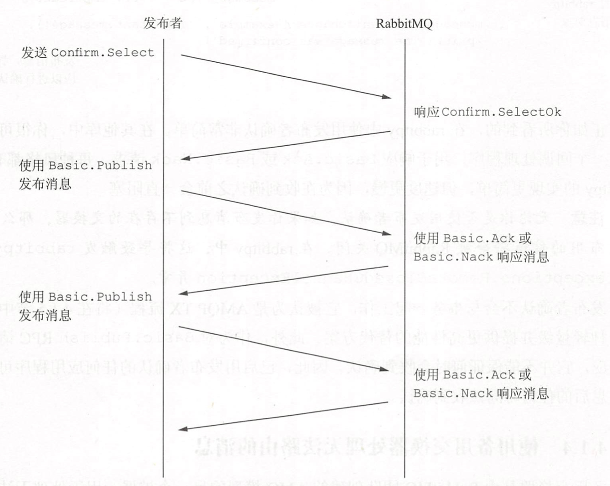
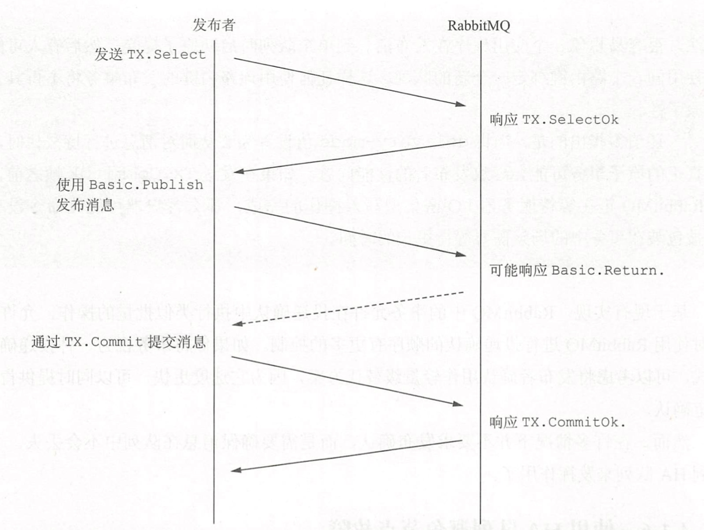
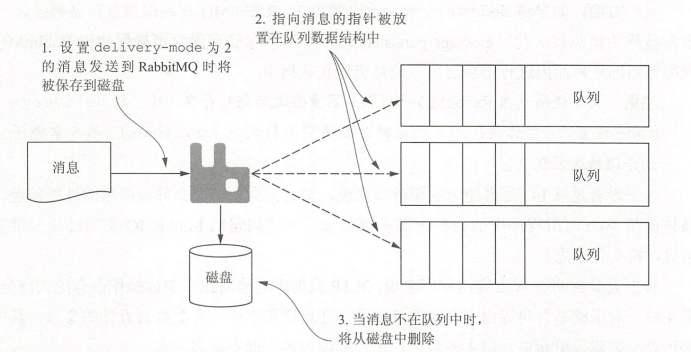

## 使用 mandatory 设置，RabbitMQ 将不接受不可路由消息

**mandatory** 标志告诉 RabbitMQ 所发布的消息是强制的(mandatory)。mandatory 标志是一个与 Basic.Publish RPC 命令一起传递的参数，告诉 RabbitMQ 如果消息不可路由，它应该通过 Basic.Return RPC 命令将消息返回给发布者。设置 mandatory 标志可以被认为是开启故障检测模式，它只会让 RabbitMQ 向你通知失败，而不会通知成功。如果消息路由正确，你的发布者将不会收到通知。

note：

1. mandatory 标志只在路由阶段起作用，如果在其他阶段发生错误， rabbitmq 不会返回错误信息。mandatory 标志起作用的时候比如是没有队列绑定到交换机

2. 在发送 Basic.Publish 命令时，AMQP 规范包括一个额外的 **immediate** 标志符。如果消息不能立即路由到目的地，immediate 标志告诉代理服务器发出一个 Basic.Return。这个标志从 RabbitMQ 2.9 版开始不推荐使用，如果使用的话会引发一个异常并且关闭信道。

## 发布者确认 publisher confirms

在发布任何消息之前，消息发布者必须向 RabbitMQ 发出 Confirm Select RPC 请求，并等待 Confirm.Selectok 响应以获知投递确认已经被启动。在这一点上，对于发布者发送给 RabbitMQ 的每条消息，服务器会发送一个确认响应( **Basic.Ack** )或否定确认响应( **Basic.Nack** )，这两个响应都包括一个整数值用于指定确认消息的偏移值。确认编号通过 Confirm.Select RPC 请求之后的消息接收顺序来引用消息。

note：

1. RabbitMQ 中的发布者确认功能是 AMQP 规范的增强功能，只能用在支持 RabbitMQ 特定扩展的客户端库中。

2. 当发布者发布给所有队列的已路由消息被消费者应用程序直接消费时，或者消息被放入队列并根据需要进行持久化时，一个 Basic.Ack 请求会被发送到发布者。如果消息无法路由，代理服务器将发送一个 Basic.Nack RPC 请求用于表示失败。然后由发布者决定该如何处理该信息。

3. 大多数客户端都是在 channel 上启用发布者确认功能

## 使用备用交换器处理无法路由的消息

备用交换器是由 RabbitMQ 团队创建的 AMQP 模型的另一个扩展，用于处理无法路由的消息。备用交换器在第一次声明交换器时被指定，用来提供一种预先存在的交换器，即如果交换器无法路由消息，那么消息就会被路由到这个新的备用交换器。

要使用备用交换器，你必须首先创建用来接收不可路由消息的交換器。然后，在设置接收消息的主交换器时，将 **alternate-exchange** 参数添加到 Exchange.Declare 命令中。

note：

1. 如果在将消息发送到具有备用交换器的交换器上时设置了 mandatory 标志，那么一旦预期的交换器无法正常路由消息，Basic.Return 就不会发给发布者。当 mandatory 标志为 true 时，向备用交换器发送不可路由消息的行为满足消息已经被发布这一条件。

2. RabbitMQ 的消息路由模式与其他交换器一样适用于备用交换器。如果一个队列没有使用它的初始路由键进行绑定以接收消息，那么该消息将不会被放入队列，并且将会丢失。也就是**备用交换机也需要和队列进行绑定，并行需要相应的路由键**。

## 基于事务的批量处理

AMQP 事务提供了一种机制，通过这种机制，消息可以批量发布到 RabbitMQ，然后提交到队列或回滚。

要启动一个事务，发布者发送一个 TX.Select RPC 请求给 RabbitMQ，RabbitMQ 将回复一个 TX.SelectOk 响应。一旦事务被打开，发布者可以向 RabbitMQ 发送一个或多个消息。

当 RabbitMQ 由于错误(例如不存在的交换器)而无法路由消息时，它将在发送 TX.Commitok 响应之前返回一个带有 Basic.Return 响应的消息。希望中止事务的发布者应该发送 TX.Rollback RPC 请求并等待来自代理服务器的 TX.RollbackOk 响应，然后再继续后续的工作。

note：

1. 原子性确保事务中所有操作的完成都将作为事务提交的一部分。在 AMQP 中这意味着直到事务中的所有操作都完成为止，你的客户端将不会收到 TX.Commitok 响应帧。不幸的是，对于那些寻求真正原子性的人来说，RabbitMQ 只在每个发出的命令作用于单个队列时才执行原子事务。如果不止一个队列受到事务中任何命令的影响，则提交就不具备原子性。

2. 尽管当事务中的所有命令仅影响同一个队列时 RabbitMQ 会执行原子事务，但发布者通常不能很好地控制消息是否被投递到多个队列。使用 RabbitMQ 的高级路由方法，很容易想象一个应用程序在发布消息到单个队列时启动原子提交，然后有人可能使用同一个路由键绑定一个新的队列。这样任何使用该路由键的发布事务将不再具备原子性。

3. 当将 delivery-mode 值设置为 2 从而对消息进行持久化时，真正的原子事务可能会导致发布者的性能问题。如果在发送 TX.CommitOk 帧之前 RabbitMQ 正在等待服务器 I/O 密集型写入操作的完成，那么客户端可能比命令没有被包装在事务中的场景需要等待更长的时间。

## 使用 HA 队列避免节点故障

HA 队列是 RabbitMQ 团队创建的一项增强功能(未包含在 AMQP 规范中)，它允许队列在多个服务器上拥有冗余副本。HA 队列需要 RabbitMQ 集群环境。使用 Queue.Declare AMQP 命令中的传入参数 **x-ha-policy** 创建一个新队列，该队列跨越 RabbitMQ 集群中的每个节点。当发布消息到设置为高可用的队列中时，该消息会被发送到集群中的每台服务器该集群管理着 HA 队列。一旦消息在集群中的任何节点都完成消费，那么消息的所有副本将立即从其他节点中删除。

HA 队列可以跨越集群中的每台服务器，或者仅使用一批独立节点。要指定一批独立节点，不是将 **x-ha-policy** 参数设置为 all，而是将 x-ha-policy 设置为 nodes，然后再传入另一个参数 **x-ha-nodes**，该参数包含一个应该配置队列的节点列表。

HA 队列有一个主服务器节点，其他所有节点都是辅助节点。如果主节点发生故障，其中一个辅助节点将接管主节点的角色。如果 HA 队列配置中的一个辅助节点宕机了，其他节点将继续照常运行，共享所有配置节点上发生的操作状态。当一个宕机的节点被添加回来，或者一个新的节点被添加到集群时，它将不包含任何已经存在于现有节点队列中的消息。相反，一旦所有先前发布的消息被消费完毕，它将接收所有新的消息并且只执行同步操作。

note：

1. 在协议语义方面，HA 队列和任何其他队列运作方式相同。如果你使用的是事务或投递确认机制，则消息在被 HA 队列定义中的所有活动节点确定之后，RabbitMQ 才会发送成功响应。这可能会对你的发布应用程序造成响应延迟。

## 通过设置 delivery-mode 为 2 将消息持久化到磁盘

如果将一个消息的 **delivery-mode** 设置为 1 (也就是默认值)，RabbitMQ 会被告知不需要将消息存储到磁盘，而消息会一直保存在内存中。因此，如果对 RabbitMQ 进行重启，那么当 RabbitMQ 启动成功并运行时，非持久化消息将不可用。

另一方面，如果将 **delivery-mode** 设置为 2，RabbitMQ 将确保消息存储到磁盘。这通常被称为消息持久化(message persistence)，将消息存储到磁盘可确保如果 RabbitMQ 代理服务器因任何原因进行重启之后，消息仍然在队列中。

注意为了使消息在 RabbitMQ 代理服务器重启之后仍然存在，除了将 delivery-mode 设置为 2，你的队列在创建时必须声明为持久性(**durable**)。

当 RabbitMQ 持久化消息时，可能会有相当大的写入偏差。在高吞吐量的消息通信环境中，RabbitMQ 将持久化消息写入磁盘，并通过引用追踪它们直到它们不存在于任何队列中为止。一旦消息的所有引用消失，RabbitMQ 将从磁盘中删除消息。

## RabbitMQ 回推

在 RabbitMQ 2.0 版本之前，如果发布者应用程序因为发布消息太快而开始对 RabbitMQ 造成压力，那么 RabbitMQ 将发送 Channel.Flow RPC 方法来让你的发布者发生阻塞，即发布者不能发送任何消息直到收到另一条 Channel.Flow 命令为止。

从 RabbitMQ 3.2 开始，RabbitMQ 团队扩展了 AMQP 规范，添加了在达到连接**信用阈值**时发送通知的机制，用于通知客户端其连接已被阻塞。Connection.Blocked 和 Connection.Unblocked 是可以随时发送的异步方法，以便在 RabbitMQ 对客户端进行阻塞或取消阻塞时通知到客户端

