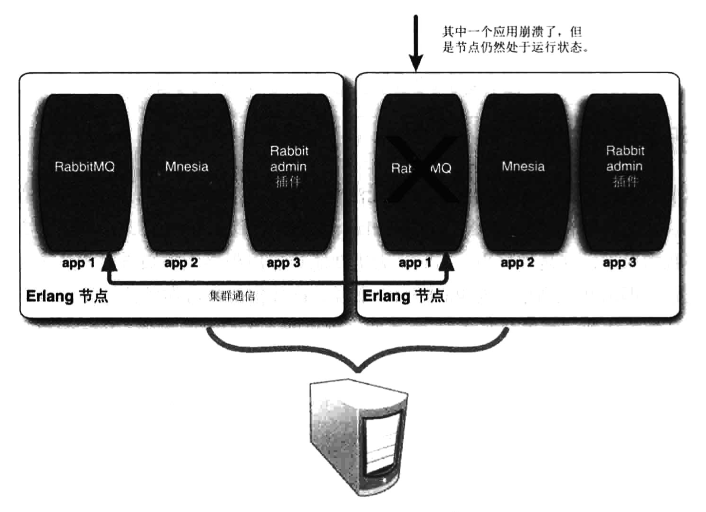

## 在 UNIX 系统上安装 RabbitMQ

运行 RabbitMQ 的操作系统需求非常灵活，我们可以在多个平台上运行 RabbitMQ，包括 Linux、Windows、MacOSX 和其他类 UNIX 系统。

由于 RabbitMQ 是采用 **Erlang** 编写的，因此我们需要先安装该语言库，以便运行代理服务器。

在解决了 RabbitMQ 的依赖关系后，创建一个文件夹用于测试。假设你运行的是类 UNIX 系统，打开一个终端，输人以下命令:

```bash
$ mkdir rabbitmqinaction
$ cd rabbitmqinaction
```

然后从官网的服务器下载页面下载 RabbitMQ 服务器： http://www.rabbitmq.com/server.html 选择**通用UNIX系统平台的安装包**，然后进行下载。

```bash
$ wget http://www.rabbitmq.com/releases/rabbitmq-server/v2.7.0/rabbitmq-server-generic-unix-2.7.0.tar.gz
```

下一步你要做的是解压压缩包，并进人 rabbitmq_server-2.7.0 目录：

```bash
$ tar -xzvf rabbitmq-server-generic-unix-2.7.0.tar.gz
$ cd rabbitmq server-2.7.0/
```

在启动服务器之前，我们还需要创建一些文件夹。首先第一个是 RabbitMQ 的日志文件夹。如果你需要检查安装情况的话，则可以看看这个文件夹。第二个是 **Mnesia** 数据库文件夹，RabbitMQ 使用 Mnesia 数据库存储服务器信息，比如队列元数据、虚拟主机等。在终端输人以下命令：

```bash
$ mkdir -p /var/log/rabbitmq
$ mkdir -p /var/lib/rabbitmq/mnesia/rabbit
```

如果你以超级用户的身份运行了那些命令的话，记得使用 chown 给系统用户设置权限。在生产环境运行 RabbitMQ 时，我们通常会专门创建一个 rabbitmq 用户，然后为其赋予文件夹权限，而非使用普通用户账户来运行所有命令。

现在一切就绪，准备启动服务器。输人以下命令：

```bash
$ sbin/rabbitmg-server
```

RabbitMQ 会输出一些关于启动过程的信息。如果一切正常，你就会看到 RabbitMQ 的 logo 将以 ASCII 字符的艺术形式展现。消息代理服务器就开始运行了。

现在打开一个新的终端窗口，并检查服务器的状态。输人以下命令：

```bash
$ cd path/to/rabbitmqinaction/rabbitmq_server-2.7.0/
$ sbin/rabbitmqctl status
```

## Erlang 节点和 Erlang 应用程序

我们经常使用术语节点来指代 RabbitMQ 服务器实例。事实上，**节点描述的是一个 Erlang 节点运行着一个 Erlang 应用程序**。这和 JVM 的原理是非常相似的。当你运行 Java 程序时，JVM 的一个实例就启动了，并且开始执行指定的 Java 程序。与之相似，**Erlang 也有虚拟机，而虚拟机的每个实例我们称之为节点(node)**。

这里的节点非常特殊。不同于 JVM，**多个 Erlang 应用程序可以运行在同一个节点之上。更重要的是，节点之间可以进行本地通信(不管它们是否真的在同一台服务器上)**。如果应用程序由于某些原因崩溃了，Erlang 节点会自动尝试重启应用程序(前提是 Erlang 本身没有崩溃)。当我们开始讨论插件和集群的时候,事情就会变得有趣起来。现在重要的是记住当我们谈到 RabbitMQ 节点时，我们指的是 RabbitMQ 应用程序和其所在的 Erlang 节点(如下图)。



值得庆幸的是，RabbitMQ 使得启动 Erlang 节点和 Rabbit 应用程序很简单，只需一个步骤即可。在你的 RabbitMQ 安装目录下找到 ./sbin 目录，运行 ./rabbitmq-server。当查看控制台时，你会发现**不同的 RabbitMQ 子系统**运行起来了，并准备好处理消息。如果在启动过程中遇到了任何错误，那么就检查一下 RabbitMQ 日志。通常情况下，可以在 /var/log/rabbitmq/ 目录下找到名为 rabbit@[hostname].log 的日志文件(文件名中的 “rabbit” 部分是运行 RabbitMQ 的默认 **Erlang 节点名称**)。你也可以通过增加 **-detached** 参数的方式启动 Rabbit 节点，以守护程序的方式在后台运行: **./rabbitmq-server -detached**。这就是启动单一 RabbitMQ 节点的所有内容了。

当谈及停止 RabbitMQ 时，有两种方式：干净的方式和肮脏的方式。当运行 RabbitMQ 连接到控制台时，在你按下 CTRL-C 组合键时看到以下内容，也许会感
到迷惑：

```
BREAK: (a)bort (c)ontinue (p)rocinfo (i)nfo (l)oaded
       (v)ersion (k)ill (D)b-tables (d)istribution
```
你想要的只是停止 RabbitMQ 而已。你在控制台上看到的是 Erlang 节点正询问你是想要关闭应用程序还是整个节点；或者这只是一个失误，因为你想要继续运行。通常来讲，你想要关闭整个节点，所以 abort 就是你要找的答案。

但是有更好的方法来停止 RabbitMQ 一一这个方法会通知 RabbitMQ 干净地关闭，并保护好那些持久化队列。rabbitmqct l是几乎所有 RabbitMQ 管理需要的一站式解决方案。它也能帮助你停止 RabbitMQ。当在 RabbitMQ 安装目录下运行 **./sbin/rabbitmqctl stop** 时，rabbitmqctl 会和本地节点通信并指示其干净地关闭。你也可以指定关闭不同的节点，包括远程节点。只需传人 **-n rabbit@[hostname]** 选项即可。当 rabbit、mnesia 和 os_mon 停止了，Rabbit 节点也就完全关闭了。

到目前为止，我们讨论了如何停止整个 RabbitMQ 节点(应用程序和 Erlang 节点一起)。但有些时候你只想要重启 RabbitMQ 应用程序，而同时保持 Erlang 节点运行。停止 RabbitMQ 轻而易举。只需运行 **./rabbitmqctl stop_app** 即可。Rabbit 日志会显示和之前关闭整个节点时一样的关闭消息。

## 在一台机器上设置集群

通常来讲，**你使用 rabbitmq-server 命令启动节点之后就大功告成了。但是如果不用额外参数的话，该命令会默认使用节点名称 rabbit 和监听端口号 5672**。如果你尝试在同台机器用这个方法启动三个节点的话，那么第二个和第三个节点会因为节点名称和端口冲突导致启动失败。在每次调用 rabbitmq-server 命令前，我们通过设置 **RABBITMQ_NODENAME** 和  **RABBITMQ_NODE_PORT** 环境变量来明确指定唯一的节点名称和端口号。我们尚未讨论 RabbitMQ 插件，不过有可能你已经启用了一部分插件了。如果确实如此的话，你需要在启动集群节点前将插件禁用。这是因为像 RabbitMQ Management 插件这样的插件会监听专门的端口来提供服务(例如 Management 插件的 WebUI)。我们还没有讲到如何设置插件监听不同的端口，所以当第二个和之后的节点启动了它们的插件，就会和第一个启动节点的插件相冲突，然后节点就都崩溃了。

```bash
$ RABBITMQ_NODE_PORT=5672 RABBITMQ_NODENAME=rabbit \
./sbin/rabbitmq-server -detached
Activating RabbitMQ plugins...
0 plugins activated:

$ RABBITMQ_NODE_PORT=5673 RABBITMQ_NODENAME=rabbit_1 \
./sbin/rabbitmq-server -detached
Activating RabbitmQ plugins...
0 plugins activated:

$ RABBITMQ_NODE_PORT=5674 RABBITMQ_NODENAME=rabbit_2 \
./sbin/rabbitmq-server -detached
Activating RabbitMQ plugins...
0 plugins activated:

```

现在在开发系统上运行着三个 Rabbit 节点，分别是 rabbit、rabbit_1 和 rabbit_2 (每个节点都会有系统的主机名，添加在@后)。但是每个节点仍然是独立节点，拥有自己的元数据，并且不知道其他节点的存在。集群中的第一个节点将初始元数据带人集群中，并且无须被告知加人。而第二个和之后的节点将加人它并且获取它的元数据。要加人第二个和第三个节点，首先需要停止 Erlang 节点上运行的 RabbitMQ 应用程序，并重设(清空)它们的元数据。这样它们才可以被加人并且获取集群的元数据。rabbitmqctl 工具会帮你和每个节点通信并完成以上的任务。让我们从停止第二个节点上的 RabbitMQ 应用程序开始：

```bash
$ ./sbin/rabbitmqctl -n rabbit_1@Phantome stop_app
stopping niode rabbit_1@Phantome.
.done.
```

下一步，你需要重设第二个节点的元数据和状态为清空的状态：

```bash
$ ./sbin/rabbitmqctl -nrabbit_1@Phantome reset
Resetting node rabbit_1@Phantome
.done.
```

现在拥有了一个停止运行的(并且清空了的) Rabbit 应用，你已经准备好将它加入到第一个集群节点：

```bash
$ ./sbin/rabbitmqctl -n rabbit_l@Phantome cluster rabbit@Phantome \                                                         rabbit_1@Phantome
clustering node rabbit_1@Phantome with [rabbit@Phantome,
                                        rabbit_1@Phantomel]...
.done...
```

最后你可以重新启动第二个节点的应用程序，这样它就开始成为集群中运作的一员了：

```bash
$ ./sbin/rabbitmqctl -n rabbit_1@Phantome start_app
Starting node rabbit_l@Phantome
broker running
.done...
```

你也许注意到了，当你发送 cluster 命令式到第二个节点时，你获得了 Clustering node rabbit_1@Phantome with [rabbit@Phantome, rabbit_1@Phantome] 应答。这很奇怪，除了第一个节点之外，你还将第二个节点自己也集群进来？这样做是对的。原因在于你想让 rabbit_1 也成为**磁盘节点**。**当你将新节点加人到集群时，你必须列出在集群中的所有磁盘节点，并作为集群命令的参数**。这就是内存节点在重启之后还能知道如何获得初始元数据和状态的原因。如果磁盘节点之一就是要新增节点的话，rabbitmqctl 可以非常机智地认识到你想让该新增节点也成为磁盘节点。

另一个传入 rabbitmqctl 命令的关键参数是 **-n rabbit_1@Phantome**。这会告诉 rabbitmqctl 你想要在指定节点而非默认节点(rabbit@)上执行命令。你可以使用 -n 参数指定任何 RabbitMQ 节点，不管是在你的开发系统上或者是网络上任何可以连接的其他系统上。

到目前为止你的开发系统上已经有了两个节点的 Rabbit 集群，第三个独立 Rabbit 节点正等待加入集群。如下列清单所示，加入第三个节点和加入第二个节点的命令几乎是一样的。

```bash
$ ./sbin/rabbitmqctl -n rabbit_2@Phantome stop_app
Stopping node rabbit_2@Phantome
.done.

$ ./sbin/rabbitmqctl -n rabbit_2@Phantome reset
Resetting node rabbit_2@Phantome
.done.

$ ./sbin/rabbitmqctl -n rabbit_2@Phantome cluster rabbit@Phantome \
                                                  rabbit_1@Phantome
Clustering node rabbit_2@Phantome with [rabbit@Phantome,
                                        rabbit_1@Phantome]
.done.

$ ./sbin/rabbitmqctl -n rabbit_2@Phantome start_app
Starting node rabbit_2@phantome
broker running
.done.
```

当你使用相同的命令将第三个节点加人时，唯一不同的是 -n 参数指定了第三个节点。你也许注意到了你指定了 rabbit 和 rabbit_1 作为集群命令的参数，但却没有 rabbit_2。因此，rabbit_2 会知道集群中的两个磁盘节点，但其本身不会成为磁盘节点。取而代之的是，通过不指定其作为参数，rabbit_2 会成为**内存节点**。


## 在不同的机器上设置集群

* ip-10-170-29-145
* ip-10-170-30-18
* ip-10-170-29-88

在三台机器上分别独立启动 rabbitmq 服务。现在，你需要做的是将 ip-10-170-29-145 的 **Erlang cookie ** 复制到其他几个节点，让它们可以互相通信。如果节点的 Erlang cookie 字串不同，那么当 Erlang 节点尝试互相认证时会导致集群失败。你可以在 **/var/lib/rabbitmq/.erlang.cookie** 找到 Erlang cookie。复制 cookie 内的字串，并粘贴到其他两个节点的 /var/lib/rabbitmq/.erlang.cookie 上。然后通过重启另外两个节点的 RabbitMQ 进程。

现在可以准备加人集群了。首先将 ip-10-170-30-18 加入集群。

```bash
ubuntu@ip-10-170-30-18:$ sudo rabbitmqctl stop_app
stopping node 'rabbit@ip-10-170-30-18'
..done.

ubuntu@ip-10-170-30-18:$ sudo rabbitmqctl reset
Resetting node 'rabbit@ip-10-170-30-18'
.done.
ubuntu@ip-10-170-30-18:$ sudo rabbitmqctl cluster \
                                          rabbit@ip-10-170-29-145 \
                                          rabbit@ip-10-170-30-18
Clustering node 'rabbit@ip-l0-l70-30-18' with
['rabbit@ip-10-170-29-145',
'rabbit@ip-10-170-30-18']
...done

ubuntu@ip-10-170-30-18:~# sudo rabbitmqctl start_app
Starting node 'rabbit@ip-10-170-30-18'
.done.
```

你会注意到自己将 rabbit@ip-10-170-30-18 设置成了磁盘节点，同时也将 RabbitMQ 节点名从 rabbit_1 更改成了 rabbit，就像我们对开发机器集群上第二个节点做的那样。在隔离的物理系统中，第一个 RabbitMQ 节点总是叫作 rabbit。只有当同一系统上有多个 Rabbit 节点时，节点名字才会命名为 rabbit_1、rabbit_2 等。当设置完第二个节点后，让我们添加第三个节点 ip-10-170-29-88：

```bash
ubuntu@ip-10-170-29-88:$ sudo rabbitmqctl stop_app
Stopping node 'rabbit@ip-10-170-29-88'
...done.

ubuntu@ip-10-170-29-88:$ sudo rabbitmqctl reset
Resetting node 'rabbit@ip-10-170-29-88'
.done.

ubuntu@ip-10-170-29-88:$ sudo rabbitmqctl cluster \
                                          rabbit@ip-10-170-29-145 \
                                          rabbit@ip-10-170-30-18
Clustering node 'rabbit@ip-10-170-29-88' with
['rabbit@ip-10-170-29-145',
'rabbit@ip-10-170-30-18']
..done.

ubuntu@ip-10-170-29-88:$ sudo rabbitmqctl start_app
Starting node 'rabbitip-10-170-29-88'
..done.
```

如何将节点从集群中移除。针对这两种情况，你需要做的是让节点离开集群。和加入集群的操作类似，只是不需要 rabbitmqctl cluster 这一步了。让我们将 ip-10-170-29-88 从集群中移除，并将其转回独立节点：

```bash
ubuntu@ip-10-170-29-88:$ sudo rabbitmqctl stop_app
Stopping node 'rabbit@ip-10-170-29-88'
.done.

ubuntu@ip-10-170-29-88:$ sudo rabbitmqctl reset
Resetting node 'rabbit@ip-10-170-29-88'
.done.

ubuntu@ip-10-170-29-88:-$sudo rabbitmqctl start_app
Starting node 'rabbit@ip-10-170-29-88'
.done.
```

这里关键的命令是 rabbitmqctl reset。我们之前说过 reset 命令将清空节点的状态，并将其恢复到空白状态。这没错，只不过当重设的节点是集群的一部分时，该命令也会和集群中的磁盘节点进行通信，告诉它们该节点正在离开集群。

