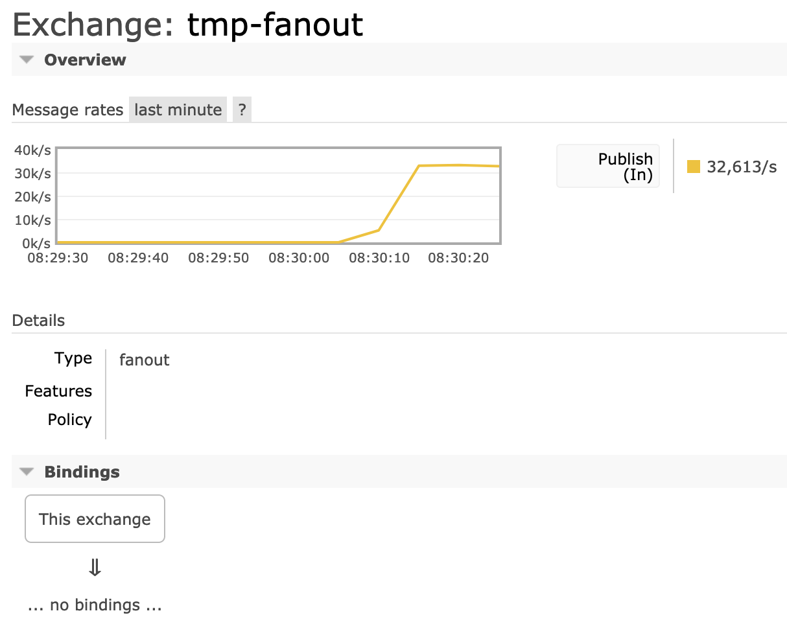

# Publishers

https://www.rabbitmq.com/publishers.html

## Overview

This guide covers various topics related to publishers:

- The basics
- Publisher lifecycle
- Protocol Differences
- Message properties and delivery metadata
- Publisher-side data safety topics (connection recovery, publisher confirms)
- Exception Handling
- Effects of Resource Alarms
- Unroutable Message Handling
- Metrics relevant for publishers
- Concurrency Consideration
- How to temporarily block all publishers
- How to troubleshoot common issues with publishers

and more.

The guide focuses on AMQP 0-9-1 and mentions key protocol-specific differences with other protocols supported by RabbitMQ: AMQP 1.0, MQTT and STOMP.

## Terminology  术语

The term "publisher" means different things in different contexts. In general in messaging a publisher (also called "producer") is an application (or application instance) that publishes (produces) messages. The same application can also consume messages and thus be a [consumer](https://www.rabbitmq.com/consumers.html) at the same time.

Messaging protocols also have the concept of a lasting subscription for message delivery. Subscription is one term commonly used to describe such entity. Consumer is another. Messaging protocols supported by RabbitMQ use both terms but RabbitMQ documentation tends to prefer the latter.  消息传递协议还具有持久订阅消息传递的概念。 订阅是通常用于描述此类实体的一个术语。 消费者是另一个。 RabbitMQ 支持的消息传递协议使用这两个术语，但 RabbitMQ 文档倾向于使用后者。

## The Basics

RabbitMQ is a messaging broker. It accepts messages from publishers, routes them and, if there were queues to route to, stores them for consumption or immediately delivers to consumers, if any.

Publishers publish to a destination that varies from protocol to protocol. **In AMQP 0-9-1, publishers publish to exchanges. In AMQP 1.0, publishing happens on a link**. In [MQTT](https://www.rabbitmq.com/mqtt.html), publishers publish to topics. Finally, [STOMP](https://www.rabbitmq.com/stomp.html) supports a variety of destination types: topics, queues, AMQP 0-9-1 exchanges. This is covered in more details in the protocol-specific differences section.

A publish message has to be routed to a queue (topic, etc). The queue (topic) may have online [consumers](https://www.rabbitmq.com/consumers.html). When the message is successfully routed to a queue and there is a consumer online that can [accept more deliveries](https://www.rabbitmq.com/confirms.html), the message will be sent to the consumer.

An attempt to publish to a non-existent queue (topic) will result in a channel-level exception with the code of 404 Not Found and render the channel it was attempted on to be closed.

### Publisher Lifecycle

Publishers are often long lived: that is, throughout the lifetime of a publisher it publishes multiple messages. Opening a connection or channel (session) to publish a single message is not optimal.

Publishers usually open their connection(s) during application startup. They often would live as long as their connection or even application runs.

Publishers can be more dynamic and begin publishing in reaction to a system event, stopping when they are no longer necessary. This is common with WebSocket clients used via [Web STOMP](https://www.rabbitmq.com/web-stomp.html) and [Web MQTT](https://www.rabbitmq.com/web-mqtt.html) plugins, mobile clients and so on.

## Protocol Differences

The process of publishing messages is quite similar in every protocol RabbitMQ supports. All four protocols allow the user to publish a message which has a payload (body) and one or more message properties (headers).

All four protocols also support an [acknowledgement mechanism](https://www.rabbitmq.com/confirms.html) for publishers which allows the publishing application to keep track of the messages that have or haven't been successfully accepted by the broker, and continue publishing the next batch or retry publishing the current one.

The difference typically have more to do with the terminology used than the semantics. Message properties also vary from protocol to protocol.

### AMQP 0-9-1

In AMQP 0-9-1, publishing happens on a [channel](https://www.rabbitmq.com/channels.html) to an exchange. The exchange uses a routing topology set up by defining bindings between one or more queues and the exchange, or [source exchange and destination exchange](https://www.rabbitmq.com/e2e.html). Successfully routed messages are stored in [queues](https://www.rabbitmq.com/queues.html).

The role of each entity is covered in the [AMQP 0-9-1 concepts guide](https://www.rabbitmq.com/tutorials/amqp-concepts.html).

[Publisher confirms](https://www.rabbitmq.com/confirms.html) is the publisher acknowledgement mechanism.

There are several common types of publisher errors that are handled using different protocol features:

- Publishing to a non-existent exchange results in a [channel error](https://www.rabbitmq.com/channels.html), which closes the channel so that no further publishing (or any other operation) is allowed on it.

- When a published message cannot be routed to any queue (e.g. because there are no bindings defined for the target exchange), and the publisher set the mandatory message property to false (this is the default), the message is discarded or republished to an [alternate exchange](https://www.rabbitmq.com/ae.html), if any.

- When a published message cannot be routed to any queue, and the publisher set the mandatory message property to true, the message will be returned to it. The publisher must have a returned message handler set up in order to handle the return (e.g. by logging an error or retrying with a different exchange)

### AMQP 1.0

In AMQP 1.0 publishing happens within a context of a link.

### MQTT 3.1

In MQTT 3.1.1, messages are published on a connection to a topic. Topics perform both routing and storage. In RabbitMQ, a topic is backed by a [queue](https://www.rabbitmq.com/queue.html) internally.

When publisher chooses to use QoS 1, published messages are acknowledged by the routing node using a [PUBACK frame](http://docs.oasis-open.org/mqtt/mqtt/v3.1.1/os/mqtt-v3.1.1-os.html#_Toc398718043), the publisher acknowledgement mechanism in MQTT 3.1.

Publishers can provide a hint to the server that the published message on the topic must be retained (stored for future delivery to new subscribers). Only the latest published message for each topic can be retained.

Other than closing the connection, there is no mechanism by which the server can communicate a publishing error to the client.

See the [MQTT](https://www.rabbitmq.com/mqtt.html) and [MQTT-over-WebSockets](https://www.rabbitmq.com/web-mqtt.html) guides to learn more.

### STOMP

STOMP clients publish on a connection to one or more destinations which can have different semantics in case of RabbitMQ.

STOMP provides a way for the server to [communicate an error in message processing](http://stomp.github.io/stomp-specification-1.2.html#SEND) back to the publisher. Its variation of [publisher acknowledgements](https://www.rabbitmq.com/confirms.html) is called [receipts](http://stomp.github.io/stomp-specification-1.2.html#RECEIPT), which is a feature [clients enable when publishing](http://stomp.github.io/stomp-specification-1.2.html#Standard_Headers).

See the [STOMP guide](https://www.rabbitmq.com/stomp.html), [STOMP-over-WebSockets](https://www.rabbitmq.com/web-stomp.html) and the [STOMP 1.2 spec](http://stomp.github.io/stomp-specification-1.2.html) to learn more.

## Routing

### AMQP 0-9-1

Routing in AMQP 0-9-1 is performed by exchanges. Exchanges are named routing tables. Table entries are called bindings. This is covered in more detail in the [AMQP 0-9-1 concepts guide](https://www.rabbitmq.com/tutorials/amqp-concepts.html).

There are several built-in exchange types:

- Topic
- Fanout
- Direct (including the default exchange)
- Headers

The first three types are covered with examples in the [tutorials](https://www.rabbitmq.com/getstarted.html).

More exchange types can be provided by [plugins](https://www.rabbitmq.com/plugins.html). [Consistent hashing exchange](https://github.com/rabbitmq/rabbitmq-consistent-hash-exchange/), [random routing exchange](https://github.com/rabbitmq/rabbitmq-random-exchange/), [internal event exchange](https://github.com/rabbitmq/rabbitmq-event-exchange/) and [delayed message exchange](https://github.com/rabbitmq/rabbitmq-delayed-message-exchange/) are exchange plugins that ship with RabbitMQ. Like all plugins they must be enabled before they can be used.

## Unroutable Message Handling

Clients might attempt to publish messages to destinations (exchanges, topics, queues) that do not exist. This section covers on how different protocols different in handling of such cases.

RabbitMQ collects and exposes metrics that can be used to detect publishers that publish unroutable messages.

### AMQP 0-9-1

When a published message cannot be routed to any queue (e.g. because there are no bindings defined for the target exchange), and the publisher set the mandatory message property to false (this is the default), the message is discarded or republished to an [alternate exchange](https://www.rabbitmq.com/ae.html), if any.

When a published message cannot be routed to any queue, and the publisher set the mandatory message property to true, the message will be returned to it. The publisher must have a returned message handler set up in order to handle the return (e.g. by logging an error or retrying with a different exchange).

[Alternate Exchanges](https://www.rabbitmq.com/ae.html) is an AMQP 0-9-1 exchange feature that lets clients handle messages that an exchange was unable to route (i.e. either because there were no bound queues or no matching bindings). Typical examples of this are detecting when clients accidentally or maliciously publish messages that cannot be routed "or else" routing semantics where some messages are handled specially and the rest by a generic handler.

### MQTT

Publishing to a new topic would set up a queue for it. Different topic/QoS level combinations will use different queues with different properties. Publishers and consumers therefore must use the same QoS level.

### STOMP

STOMP supports multiple different destinations, including those that assume pre-existing topology.

- /topic: publishing to a topic that has not had a consumer will result in dropped messages. First subscriber on the topic will declare a queue for it.
- /exchange: target exchange must exist, otherwise the server would report an error
- /amq/queue: target queue must exist, otherwise the server would report an error
- /queue: publishing to a non-existent queue would set it up
- /temp-queue: publishing to a non-existent temporary queue would set it up

### Metrics

Starting with RabbitMQ 3.8, there's a new metric for unroutable dropped messages:


In the example above, all published messages are dropped as unroutable (and non-mandatory).

## Message Properties

### AMQP 0-9-1

Every delivery combines message metadata and delivery information. Different client libraries use slightly different ways of providing access to those properties. Typically delivery handlers have access to a delivery data structure.  每次传递都结合了消息元数据和传递信息。 不同的客户端库使用稍微不同的方式来提供对这些属性的访问。 通常，交付处理程序可以访问交付数据结构。

The following properties are delivery and routing details; they are not message properties per se and set by RabbitMQ at routing and delivery time:  以下属性是交付和路由详细信息； 它们本身不是消息属性，而是由 RabbitMQ 在路由和交付时设置的：

| Property     | Type             | Description                                                  |
| ------------ | ---------------- | ------------------------------------------------------------ |
| Delivery tag | Positive integer | Delivery identifier, see [Confirms](https://www.rabbitmq.com/confirms.html). |
| Redelivered  | Boolean          | Set to `true` if this message was previously [delivered and requeued](https://www.rabbitmq.com/confirms.html#consumer-nacks-requeue) |
| Exchange     | String           | Exchange which routed this message                           |
| Routing key  | String           | Routing key used by the publisher                            |
| Consumer tag | String           | Consumer (subscription) identifier                           |

The following are message properties. Most of them are optional. They are set by publishers at the time of publishing:

| Property         | Type                | Description                                                  | Required? |
| ---------------- | ------------------- | ------------------------------------------------------------ | --------- |
| Delivery mode    | Enum (1 or 2)       | 2 for "persistent", 1 for "transient". Some client libraries expose this property as a boolean or enum. | Yes       |
| Type             | String              | Application-specific message type, e.g. "orders.created"     | No        |
| Headers          | Map (string => any) | An arbitrary map of headers with string header names         | No        |
| Content type     | String              | Content type, e.g. "application/json". Used by applications, not core RabbitMQ | No        |
| Content encoding | String              | Content encoding, e.g. "gzip". Used by applications, not core RabbitMQ | No        |
| Message ID       | String              | Arbitrary message ID                                         | No        |
| Correlation ID   | String              | Helps correlate requests with responses, see [tutorial 6](https://www.rabbitmq.com/getstarted.html) | No        |
| Reply To         | String              | Carries response queue name, see [tutorial 6](https://www.rabbitmq.com/getstarted.html) | No        |
| Expiration       | String              | [Per-message TTL](https://www.rabbitmq.com/ttl.html)         | No        |
| Timestamp        | Timestamp           | Application-provided timestamp                               | No        |
| User ID          | String              | User ID, [validated](https://www.rabbitmq.com/validated-user-id.html) if set | No        |
| App ID           | String              | Application name                                             | No        |

#### Message Types

The type property on messages is an arbitrary string that helps applications communicate what kind of message that is. It is set by the publishers at the time of publishing. The value can be any domain-specific string that publishers and consumers agree on.  消息的类型属性是一个任意字符串，可帮助应用程序传达消息的类型。 它由出版商在出版时设置。 该值可以是发布者和消费者同意的任何特定于域的字符串。

RabbitMQ does not validate or use this field, it exists for applications and plugins to use and interpret.

Message types in practice naturally fall into groups, a dot-separated naming convention is common (but not required by RabbitMQ or clients), e.g. **orders.created** or **logs.line** or **profiles.image.changed**.  实践中的消息类型自然分为多个组，点分隔命名约定是常见的（但 RabbitMQ 或客户端不需要），例如 orders.created 或 logs.line 或 profiles.image.changed。

If a consumer gets a delivery of an unknown type it is highly advised to log such events to make troubleshooting easier.  如果消费者收到未知类型的交付，强烈建议记录此类事件，以便更轻松地进行故障排除。

#### Content Type and Encoding

The content (MIME media) type and content encoding fields allow publishers communicate how message payload should be deserialized and decoded by consumers.  内容（MIME 媒体）类型和内容编码字段允许发布者传达消费者应如何反序列化和解码消息有效负载。

RabbitMQ does not validate or use these fields, it exists for applications and plugins to use and interpret.

For example, messages with JSON payload [should use application/json](http://www.ietf.org/rfc/rfc4627.txt). If the payload is compressed with the LZ77 (GZip) algorithm, its content encoding should be gzip.

Multiple encodings can be specified by separating them with commas.

## Publisher Acknowledgements (Confirms) and Data Safety

Ensuring data safety is a collective responsibility of applications, client libraries and RabbitMQ cluster nodes. This section covers a number of data safety-related topics.  确保数据安全是应用程序、客户端库和 RabbitMQ 集群节点的集体责任。 本节涵盖了许多与数据安全相关的主题。

Networks can fail in less-than-obvious ways and detecting some failures [takes time](https://www.rabbitmq.com/heartbeats.html). Therefore a client that's written a protocol frame or a set of frames (e.g. a published message) to its socket cannot assume that the message has reached the server and was successfully processed. It could have been lost along the way or its delivery can be significantly delayed.  网络可能会以不太明显的方式出现故障，并且检测某些故障需要时间。 因此，将协议帧或一组帧（例如已发布的消息）写入其套接字的客户端不能假定该消息已到达服务器并已成功处理。 它可能在途中丢失了，或者它的交付可能会大大延迟。

To remedy this, a [publisher-side confirmation mechanism](https://www.rabbitmq.com/confirms.html#publisher-confirms) was developed. It mimics the [consumer acknowledgements mechanism](https://www.rabbitmq.com/confirms.html#consumer-acknowledgements) already present in the protocol.  为了解决这个问题，开发了一种发布方确认机制。 它模仿协议中已经存在的消费者确认机制。

### Strategies for Using Publisher Confirms  使用发布者确认的策略

[Publisher confirms](https://www.rabbitmq.com/confirms.html#publisher-confirms) provide a mechanism for application developers to keep track of what messages have been successfully accepted by RabbitMQ. There are several commonly used strategies for using publisher confirms:

- Publish messages individually and use streaming confirms (asynchronous API elements: confirm event handlers, futures/promises and so on)  单独发布消息并使用流确认（异步 API 元素：确认事件处理程序、期货/承诺等）

- Publish a batch of messages and wait for all outstanding confirms  发布一批消息并等待所有未完成的确认

- Publish messages individually and wait for it to be confirmed before proceeding with publishing. This option is highly discouraged due to its strong negative effects on publisher throughput  单独发布消息并等待确认后再继续发布。 强烈建议不要使用此选项，因为它会对发布者吞吐量产生强烈的负面影响

They vary in throughput effects and ease of use.

#### Streaming Confirms

Most client libraries usually provide a way for developers to handle individual confirmations as they arrive from the server. The confirms will arrive asynchronously. Since publishing is also inherently asynchronous in AMQP 0-9-1, this option allows for safe publishing with very little overhead. The algorithm is usually similar to this:  大多数客户端库通常为开发人员提供一种方法来处理来自服务器的单个确认。 确认将异步到达。 由于发布在 AMQP 0-9-1 中本质上也是异步的，因此此选项允许以很少的开销进行安全发布。 算法通常类似于：

- Enable publisher confirms on a channel

- For every published message, add a map entry that maps current sequence number to the message

- When a positive ack arrives, remove the entry

- When a negative ack arrives, remove the entry and schedule its message for republishing (or something else that's suitable)

In RabbitMQ Java client, confirm handler is exposed via the [ConfirmCallback](https://rabbitmq.github.io/rabbitmq-java-client/api/current/com/rabbitmq/client/ConfirmCallback.html) and [ConfirmListener](https://rabbitmq.github.io/rabbitmq-java-client/api/current/com/rabbitmq/client/ConfirmListener.html) interfaces. One or more listeners have to be [added to a channel](https://rabbitmq.github.io/rabbitmq-java-client/api/current/com/rabbitmq/client/Channel.html#addConfirmListener(com.rabbitmq.client.ConfirmCallback,com.rabbitmq.client.ConfirmCallback)).

#### Batch Publishing

This strategy involves publishing batches of messages and awaiting for the entire batch to be confirmed. Retries are performed on batches.  此策略涉及发布批量消息并等待整个批次得到确认。 重试是按批次执行的。

- Enable publisher confirms on a channel

- For every published message batch, await for all outstanding confirms

- When all confirms come in positive, publish the next batch

- If there are negative confirms or timeout hits, republish the entire batch or only the relevant messages

Some clients provide convenience API elements for waiting for all outstanding confirms. For example, in the Java client there is [Channel#waitForConfirms(timeout)](https://rabbitmq.github.io/rabbitmq-java-client/api/current/com/rabbitmq/client/Channel.html#waitForConfirms(long)).

Since this approach involves waiting for confirms, it will have negative effects on publisher throughput. The larger the batch, the smaller the effect will be.  由于此方法涉及等待确认，因此会对发布者吞吐量产生负面影响。 批量越大，效果越小。

#### Publish-and-Wait

This strategy can be considered an anti-pattern and is documented primarily for completeness. It involves publishing a message and immediately waiting for the outstanding acknowledgement to arrive. It can be thought of as the above strategy with batch publishing where batch size equals to one.  这种策略可以被认为是一种反模式，主要是为了完整性而被记录下来。 它涉及发布消息并立即等待未完成的确认到达。 可以将其视为上述批量发布策略，其中批量大小等于 1。

This approach will have a **very significant negative effect on throughput** and is not recommended.  这种方法会对吞吐量产生非常显着的负面影响，因此不推荐使用。

### Recovery from Connection Failures

Network connection between clients and RabbitMQ nodes can fail. How applications handle such failures directly contributes to the data safety of the overall system.

Several RabbitMQ clients support automatic recovery of connections and topology (queues, exchanges, bindings, and consumers): Java, .NET, Bunny are some examples.

Other clients do not provide automatic recovery as a feature but do provide examples of how application developers can implement recovery.

The automatic recovery process for many applications follows the following steps:

1. Reconnect to a reachable node
2. Restore connection listeners
3. Re-open channels
4. Restore channel listeners
5. Restore channel basic.qos setting, publisher confirms and transaction settings

After connections and channels are recovered, topology recovery can start. Topology recovery includes the following actions, performed for every channel

1. Re-declare exchanges (except for predefined ones)
2. Re-declare queues
3. Recover all bindings
4. Recover all consumers

### Exception Handling

Publishers generally can expect two types of exception:

- A network I/O exception due to a failed write or timeout

- An acknowledgement delivery timeout

Note that "exception" here means an error in the general sense; some programming languages do not have exceptions at all so clients there would communicate the error differently. The discussion and recommendations in this section should apply equally to most client libraries and programming languages.

The former type of exception can occur immediately during a write or with a certain delay. This is because certain types of I/O failures (e.g. to high network congestion or packet drop rate) can [take time to detect](https://www.rabbitmq.com/heartbeats.html). Publishing can continue after the connection recovers but if the connection is blocked due to an alarm, all further attempts will fail until the alarm clears. This is covered in more details below in the Effects of Resource Alarms section.  前一种异常可以在写入过程中立即发生，也可以在一定延迟后发生。 这是因为某些类型的 I/O 故障（例如高网络拥塞或丢包率）可能需要时间来检测。 连接恢复后可以继续发布，但如果连接因警报而被阻止，则所有进一步的尝试都将失败，直到警报清除。 这在下面的资源警报的影响部分有更详细的介绍。

The latter type of exception can only happen when the application developer provides a timeout. What timeout value is reasonable for a given application is decided by the developer. It should not be lower than the effective [heartbeat timeout](https://www.rabbitmq.com/heartbeats.html).

## Effects of Resource Alarms

When a cluster node has [a resource alarm](https://www.rabbitmq.com/alarms.html) in effect, all connections in the cluster that attempt to publish a message will be blocked until all alarms across the cluster clear.

When a connection is blocked, no more data sent by this connection will be read, parsed or processed on the connection. When a connection is unblocked, all client traffic processing resumes.

Compatible AMQP 0-9-1 clients will be notified when they are blocked and unblocked.

Writes on a blocked connection will time out or fail with an I/O write exception.

## Metrics

[Metric collection and monitoring](https://www.rabbitmq.com/monitoring.html) are as important for publishers as they are for any other application or component in an application. Several metrics collected by RabbitMQ are of particular interest when it comes to publishers:  指标收集和监控对于发布者与对于任何其他应用程序或应用程序中的组件一样重要。 当涉及到发布者时，RabbitMQ 收集的几个指标特别有趣：

- Outgoing message rate

- Publisher confirmation rate

- [Connection churn](https://www.rabbitmq.com/connections.html#monitoring) rate

- [Channel churn](https://www.rabbitmq.com/channels.html#monitoring) rate

- Unroutable dropped message rate

- Unroutable returned message rate

The publishing and confirmation rates are mostly self-explanatory. The churn rates are so important because they help detect applications that do not use connections or channels optimally and thus offer sub-optimal publishing rates and waste resources.  发布率和确认率大多是不言自明的。 流失率非常重要，因为它们有助于检测未以最佳方式使用连接或通道的应用程序，从而提供次优的发布率和浪费资源。

Unroutable message rates can help detect applications that publish messages that cannot be routed to any queue. For example, this may suggest a misconfiguration.

Client libraries may also collect metrics. [RabbitMQ Java client](https://www.rabbitmq.com/api-guide.html#metrics) is one example. These metrics can provide insight into application-specific architecture (e.g. what publishing component publishes unroutable messages) that RabbitMQ nodes cannot infer.

## Concurrency Considerations  并发注意事项

Concurrency topics are all about client library implementation specifics but some general recommendations can be provided. In general, publishing on a shared "publishing context" (channel in AMQP 0-9-1, connection in STOMP, session in AMQP 1.0 and so on) should be avoided and considered unsafe.  并发主题都是关于客户端库实现细节的，但可以提供一些一般性建议。 通常，应避免在共享的“发布上下文”（AMQP 0-9-1 中的通道、STOMP 中的连接、AMQP 1.0 中的会话等）上发布，并认为这是不安全的。

Doing so can result in incorrect framing of data frames on the wire. That leads to connection closure.  这样做可能会导致线路上的数据帧成帧不正确。 这会导致连接关闭。

With a small number of concurrent publishers in a single application using one thread (or similar) per publisher is the optimal solution. With a large number (say, hundreds or thousands), use a thread pool.  在单个应用程序中使用少量并发发布者，每个发布者使用一个线程（或类似线程）是最佳解决方案。 对于大量（例如，数百或数千），请使用线程池。

## Temporarily Blocking Publishing

It is possible to effectively disable all publishing in a cluster by setting the [memory high watermark](https://www.rabbitmq.com/memory.html) to 0, thus making [a resource alarm](https://www.rabbitmq.com/alarms.html) to go off immediately:  可以通过将内存高水位标记设置为 0 来有效禁用集群中的所有发布，从而立即发出资源警报：

```bash
rabbitmqctl set_vm_memory_high_watermark 0
```

## Troubleshooting Publishers

This section covers a number of common issues with publishers, how to identify and address them. Failures in distributed systems come in [many shapes and forms](https://www.rabbitmq.com/reliability.html), so this list is by no means extensive.  本节介绍了与发布商有关的许多常见问题，以及如何识别和解决这些问题。 分布式系统中的故障有多种形式，因此这个列表绝不是广泛的。

### Connectivity Failures

Like any client, a publisher has to successfully [connect](https://www.rabbitmq.com/connections.html) and successfully authenticate first.  与任何客户端一样，发布者必须先成功连接并成功验证。

The number of potential connectivity issues is pretty broad and has a [dedicated guide](https://www.rabbitmq.com/troubleshooting-networking.html).  潜在连接问题的数量非常广泛，并且有专门的指南。

### Authentication and Authorisation

Like any client, a publisher can fail to authenticate or don't have the permissions to access their target virtual host, or publish to the target exchange.

Such failures are [logged](https://www.rabbitmq.com/logging.html) by RabbitMQ as errors.

See the sections on troubleshooting of [authentication](https://www.rabbitmq.com/access-control.html#troubleshooting-authn) and [authorisation](https://www.rabbitmq.com/access-control.html#troubleshooting-authz) in the [Access Control guide](https://www.rabbitmq.com/access-control.html).

### Connection Churn  连接流失

Some applications open a new connection for every message published. This is highly inefficient and not how messaging protocols were designed to be used. Such condition can be [detected using connection metrics](https://www.rabbitmq.com/connections.html#monitoring).  某些应用程序为每条发布的消息打开一个新连接。 这是非常低效的，而不是消息协议的设计用途。 可以使用连接度量来检测这种情况。

Prefer long lived connections when possible.  如果可能，最好使用长期连接。

### Connection Interruption  连接中断

Network connections can fail. Some client libraries support automatic connection and topology recovery, others make it easy to implement connection recovery in application code.  网络连接可能会失败。 一些客户端库支持自动连接和拓扑恢复，另一些则可以轻松地在应用程序代码中实现连接恢复。

When connection is down, no publishes will go through or be internally enqueued (delayed) by clients. In addition, messages that were previously serialised and written to the socket are not guaranteed to reach the target node. It is therefore **critically important** for publishers that need reliable publishing and data safety to [use Publisher Confirms](https://www.rabbitmq.com/confirms.html) to keep track of what publishes were confirmed by RabbitMQ. Messages that were not confirmed should be considered undelivered after a period of time. Those messages can be republished if it's safe to do so for the application. This is covered in [tutorial 7](https://www.rabbitmq.com/getstarted.html) and the [Data Safety](https://www.rabbitmq.com/publishers.html#data-safety) section in this guide.  当连接关闭时，没有发布将通过或被客户端内部排队（延迟）。 此外，之前序列化并写入套接字的消息不能保证到达目标节点。 因此，对于需要可靠发布和数据安全的发布者来说，使用发布者确认来跟踪 RabbitMQ 确认的发布是至关重要的。 未确认的消息应在一段时间后视为未送达。 如果可以安全地为应用程序重新发布这些消息，则可以重新发布这些消息。 这在教程 7 和本指南的数据安全部分中有介绍。

See [Recovery from Network Connection Failures](https://www.rabbitmq.com/connections.html#automatic-recovery) for details.  有关详细信息，请参阅从网络连接故障中恢复。

### Routing Issues

A publisher can be successfully connected, authenticated and granted the permissions to publish to an exchange (topic, destination). However, it is possible that such messages would not be routed to any queues or consumers. This can be due to

- A configuration mismatch between applications, e.g. topics used by the publishers and consumers do not match
- Publisher misconfiguration (exchange, topic, routing key are not what they should be)
- For AMQP 0-9-1, missing [bindings](https://www.rabbitmq.com/amqp-concepts.html) on the target exchange
- A resource alarm is in effect: see the section below
- Network connection has failed and the client did not recover: see the section above

Inspecting the topology and metrics usually helps narrow the problem quickly. For example, the individual exchange page in [management UI](https://www.rabbitmq.com/management.html) can be used to confirm that there is inbound message activity (ingress rate above zero) and what the bindings are.

In the following example the exchange has no bindings, so no messages will be routed anywhere:



Bindings can also be listed using [rabbitmq-diagnostics](https://www.rabbitmq.com/cli.html):

```ini
# note that the implicit default exchange bindings won't
# be listed as of RabbitMQ 3.8
rabbitmq-diagnostics list_bindings --vhost "/"
=> Listing bindings for vhost /...
```

In the example above the command yields no results.

Starting with RabbitMQ 3.8, there's a new metric for unroutable dropped messages:


In the example above, all published messages are dropped as unroutable (and non-mandatory). See the Unroutable Message Handling section in this guide.

[Cluster-wide and connection metrics](https://www.rabbitmq.com/monitoring.html) as well as server logs will help spot a resource alarm in effect.

### Resource Alarms

When a resource alarm is in effect, all connections that publish will be blocked until the alarm clears. Clients can opt-in to [receive a notification](https://www.rabbitmq.com/connection-blocked.html) when they are blocked. Learn more in the [Resource Alarms guide](https://www.rabbitmq.com/alarm.shtml).

### Protocol Exceptions

With some protocols, such as AMQP 0-9-1 and STOMP, publishers can run into a condition known as a protocol error (exception). For example, publishing to a non-existent exchange or binding an exchange to a non-existent exchange will result in a [channel exception](https://www.rabbitmq.com/channels.html#error-handling) and will render the channel closed. Publishing is not possible on a closed channel. Such events are logged by the RabbitMQ node the publisher was connected to. Failed publishing attempts will also result in client-side exceptions or errors returned, depending on the client library used.

### Concurrent Publishing on a Shared Channel

Concurrent publishing on a shared channel is not supported by client libraries. Learn more in the Concurrency Considerations section.

## Getting Help and Providing Feedback

If you have questions about the contents of this guide or any other topic related to RabbitMQ, don't hesitate to ask them on the [RabbitMQ mailing list](https://groups.google.com/forum/#!forum/rabbitmq-users).

## Help Us Improve the Docs <3

If you'd like to contribute an improvement to the site, its source is [available on GitHub](https://github.com/rabbitmq/rabbitmq-website). Simply fork the repository and submit a pull request. Thank you!

