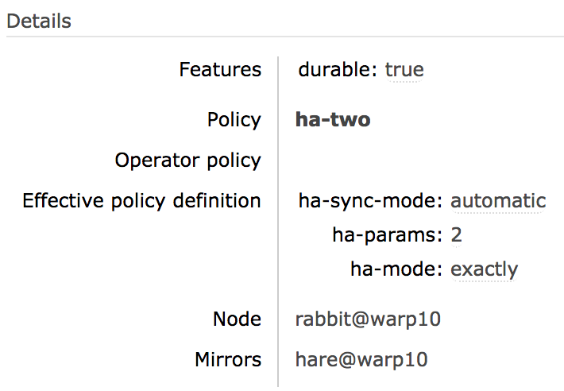

# Classic Queue Mirroring

https://www.rabbitmq.com/ha.html

## [Wait, There's a Better Way: Next Generation Highly Available Queues and Streams](https://www.rabbitmq.com/ha.html#interstitial)  等等，还有更好的方法：下一代高可用队列和流

This guide covers mirroring (queue contents replication) of classic queues. [Quorum queues](https://www.rabbitmq.com/quorum-queues.html) is an alternative, more modern queue type that offers high availability via replication and focuses on data safety.  本指南涵盖了经典队列的镜像（队列内容复制）。 仲裁队列是另一种更现代的队列类型，它通过复制提供高可用性并专注于数据安全。

[Streams](https://www.rabbitmq.com/streams.html) is a messaging data structure available as of [RabbitMQ 3.9](https://www.rabbitmq.com/changelog.html), and is also replicated.  Streams 是 RabbitMQ 3.9 中可用的消息传递数据结构，并且也被复制。

Quorum queues should be the **default choice** for a replicated queue type. Classic queue mirroring will be **removed in a future version** of RabbitMQ: classic queues will remain a supported non-replicated queue type.  仲裁队列应该是复制队列类型的默认选择。 RabbitMQ 的未来版本中将删除经典队列镜像：经典队列仍将是受支持的非复制队列类型。

## Overview


Topics covered in this guide include

- Next generation replicated queue type and why it should be preferred over classic queue mirroring  下一代复制队列类型以及为什么它比经典队列镜像更受欢迎

- What is classic queue mirroring and how it works  什么是经典队列镜像及其工作原理

- How to enable it  如何启用它

- What mirroring settings are available  哪些镜像设置可用

- What replication factor is recommended  推荐使用什么复制因子

- Data locality  数据局部性

- Leader election (mirror promotion) and unsynchronised mirrors  Leader选举（镜像提升）和非同步镜像

- Mirrored vs. non-mirrored queue behavior in case of node failure  节点故障时的镜像与非镜像队列行为

- Batch synchronisation of newly added and recovering mirrors  新增镜像和恢复镜像批量同步

and more.

This guide assumes general familiarity with [RabbitMQ clustering](https://www.rabbitmq.com/clustering.html).  本指南假设您对 RabbitMQ 集群有基本的了解。

## What is Queue Mirroring

**Important**: mirroring of classic queues will be **removed in a future version** of RabbitMQ. Consider using [quorum queues](https://www.rabbitmq.com/quorum-queues.html) or a non-replicated classic queue instead.  重要提示：经典队列的镜像将在 RabbitMQ 的未来版本中删除。考虑改用仲裁队列或非复制经典队列。

By default, contents of a queue within a RabbitMQ cluster are located on a single node (the node on which the queue was declared). This is in contrast to exchanges and bindings, which can always be considered to be on all nodes. Queues can optionally run mirrors (additional replicas) on other cluster nodes.  默认情况下，RabbitMQ 集群中队列的内容位于单个节点（声明队列的节点）上。这与交换和绑定形成对比，交换和绑定总是可以被认为是在所有节点上。队列可以选择在其他集群节点上运行镜像（附加副本）。

Each mirrored queue consists of one **leader replica** and one or more **mirrors** (replicas). The leader is hosted on one node commonly referred as the leader node for that queue. Each queue has its own leader node. All operations for a given queue are first applied on the queue's leader node and then propagated to mirrors. This involves enqueueing publishes, delivering messages to consumers, tracking [acknowledgements from consumers](https://www.rabbitmq.com/confirms.html) and so on.  每个镜像队列由一个领导副本和一个或多个镜像（副本）组成。领导者托管在一个通常称为该队列的领导者节点的节点上。每个队列都有自己的领导节点。给定队列的所有操作首先应用于队列的领导节点，然后传播到镜像。这涉及排队发布、向消费者传递消息、跟踪来自消费者的确认等。

Queue mirroring implies [a cluster of nodes](https://www.rabbitmq.com/clustering.html). It is therefore not recommended for use across a WAN (though of course, clients can still connect from as near and as far as needed).  队列镜像意味着节点集群。因此，不建议跨 WAN 使用（当然，客户端仍然可以根据需要从近处和远处进行连接）。

Messages published to the queue are replicated to all mirrors. Consumers are connected to the leader regardless of which node they connect to, with mirrors dropping messages that have been acknowledged at the leader. Queue mirroring therefore enhances availability, but does not distribute load across nodes (all participating nodes each do all the work).  发布到队列的消息被复制到所有镜像。无论消费者连接到哪个节点，消费者都连接到领导者，镜像会丢弃已在领导者处确认的消息。因此，队列镜像增强了可用性，但不会跨节点分配负载（所有参与节点都完成所有工作）。

If the node that hosts queue leader fails, the oldest mirror will be promoted to the new leader as long as it's synchronised. Unsynchronised mirrors can be promoted, too, depending on queue mirroring parameters.  如果承载队列领导者的节点出现故障，只要同步，最早的镜像就会被提升为新的领导者。根据队列镜像参数，也可以提升未同步的镜像。

There are multiple terms commonly used to identify primary and secondary replicas in a distributed system. This guide typically uses "leader" to refer to the primary replica of a queue and "mirror" for secondary replicas.  有多个术语通常用于标识分布式系统中的主要和次要副本。本指南通常使用“leader”指代队列的主要副本，使用“mirror”指代次要副本。

Queue object fields in the HTTP API and CLI tools originally used the unfortunate term "slave" to refer to secondaries. That term still appears in column names in CLI tools for backwards compatibility but will be replaced or removed in a future version.  HTTP API 和 CLI 工具中的队列对象字段最初使用不幸的术语“从属”来指代辅助对象。为了向后兼容，该术语仍出现在 CLI 工具的列名中，但将在未来版本中替换或删除。

## How Mirroring is Configured

Mirroring parameters are configured using [policies](https://www.rabbitmq.com/parameters.html#policies). A policy matches one or more queues by name (using a regular expression pattern) and contains a definition (a map of optional arguments) that are added to the total set of properties of the matching queues.  使用策略配置镜像参数。 策略按名称（使用正则表达式模式）匹配一个或多个队列，并包含添加到匹配队列的全部属性集的定义（可选参数的映射）。

Please see [Runtime Parameters and Policies](https://www.rabbitmq.com/parameters.html#policies) for more information on policies.  有关策略的更多信息，请参阅运行时参数和策略。

## Queue Arguments that Control Mirroring

As we've covered above, queues have mirroring enabled via [policy](https://www.rabbitmq.com/parameters.html#policies). Policies can change at any time; it is valid to create a non-mirrored queue, and then make it mirrored at some later point (and vice versa). There is a difference between a non-mirrored queue and a mirrored queue which does not have any mirrors - the former lacks the extra mirroring infrastructure and will likely provide higher throughput.  正如我们上面提到的，队列通过策略启用了镜像。 政策可以随时更改； 创建一个非镜像队列是有效的，然后在稍后的某个时间将其镜像（反之亦然）。 非镜像队列和没有任何镜像的镜像队列之间存在差异——前者缺乏额外的镜像基础设施，可能会提供更高的吞吐量。

You should be aware of the behaviour of adding mirrors to a queue.  您应该了解将镜像添加到队列的行为。

To cause queues to become mirrored, you need to create a policy which matches them and sets policy keys **ha-mode** and (optionally) **ha-params**. The following table explains the options for these keys:  要使队列成为镜像，您需要创建一个匹配它们的策略并设置策略键 ha-mode 和（可选）ha-params。 下表说明了这些键的选项：

| ha-mode | ha-params | Result |
| ------- | --------- | ------ |
| exactly | *count* | Number of queue replicas (leader plus mirrors) in the cluster. A *count* value of 1 means a single replica: just the queue leader. If the node running the queue leader becomes unavailable, the behaviour depends on queue durability. A *count* value of 2 means 2 replicas: 1 queue leader and 1 queue mirror. In other words: `NumberOfQueueMirrors = NumberOfNodes - 1`. If the node running the queue leader becomes unavailable, the queue mirror will be automatically promoted to leader according to the mirror promotion strategy configured. If there are fewer than *count* nodes in the cluster, the queue is mirrored to all nodes. If there are more than *count* nodes in the cluster, and a node containing a mirror goes down, then a new mirror will be created on another node. Use of `exactly` mode with `"ha-promote-on-shutdown": "always"` can be dangerous since queues can migrate across a cluster and become unsynced as it is brought down.   集群中的队列副本（领导者加镜像）的数量。 计数值为 1 表示单个副本：只是队列领导者。 如果运行队列领导者的节点变得不可用，则行为取决于队列持久性。 计数值为 2 表示 2 个副本：1 个队列领导者和 1 个队列镜像。 换句话说：NumberOfQueueMirrors = NumberOfNodes - 1。 如果运行队列leader的节点不可用，队列镜像会根据配置的镜像提升策略自动提升为leader。 如果集群中的节点数少于 count 个，则将队列镜像到所有节点。 如果集群中有超过 count 个节点，并且一个包含镜像的节点宕机，那么将在另一个节点上创建一个新镜像。 使用带有 `"ha-promote-on-shutdown": "always"` 的 `exactly` 模式可能很危险，因为队列可以跨集群迁移，并在它关闭时变得不同步。|
| all | (none) | Queue is mirrored across all nodes in the cluster. When a new node is added to the cluster, the queue will be mirrored to that node. This setting is very conservative. Mirroring to a quorum (N/2 + 1) of cluster nodes is recommended instead. Mirroring to all nodes will put additional strain on all cluster nodes, including network I/O, disk I/O and disk space usage.  队列跨集群中的所有节点进行镜像。 当一个新节点被添加到集群中时，队列将被镜像到该节点。 这个设置非常保守。 建议改为镜像到仲裁 (N/2 + 1) 个集群节点。 镜像到所有节点会给所有集群节点带来额外的压力，包括网络 I/O、磁盘 I/O 和磁盘空间使用。|
| nodes | *node names* | Queue is mirrored to the nodes listed in *node names*. Node names are the Erlang node names as they appear in rabbitmqctl cluster_status; they usually have the form "`rabbit@hostname`". If any of those node names are not a part of the cluster, this does not constitute an error. If none of the nodes in the list are online at the time when the queue is declared then the queue will be created on the node that the declaring client is connected to.   队列被镜像到节点名称中列出的节点。 节点名称是出现在 rabbitmqctl cluster_status 中的 Erlang 节点名称； 它们通常具有“rabbit@hostname”的形式。 如果这些节点名称中的任何一个不属于集群的一部分，则这不构成错误。 如果在声明队列时列表中没有任何节点在线，则将在声明客户端连接到的节点上创建队列。|

Whenever the HA policy for a queue changes it will endeavour to keep its existing mirrors as far as this fits with the new policy.  每当队列的 HA 策略发生更改时，它将努力保持其现有镜像，只要这符合新策略。

### Replication Factor: How Many Mirrors are Optimal?

Mirroring to all nodes is the most conservative option. It will put additional strain on all cluster nodes, including network I/O, disk I/O and disk space usage. Having a replica on every node is unnecessary in most cases.  镜像到所有节点是最保守的选择。 它会给所有集群节点带来额外的压力，包括网络 I/O、磁盘 I/O 和磁盘空间使用。 在大多数情况下，不需要在每个节点上都有一个副本。

For clusters of 3 and more nodes it is recommended to replicate to a quorum (the majority) of nodes, e.g. 2 nodes in a 3 node cluster or 3 nodes in a 5 node cluster.  对于 3 个或更多节点的集群，建议复制到仲裁（大多数）节点，例如 3 节点集群中的 2 个节点或 5 节点集群中的 3 个节点。

Since some data can be inherently transient or very time sensitive, it can be perfectly reasonable to use a lower number of mirrors for some queues (or even not use any mirroring).  由于某些数据本身可能是瞬态的或对时间非常敏感，因此为某些队列使用较少数量的镜像（甚至不使用任何镜像）是完全合理的。

## How to Check if a Queue is Mirrored?

Mirrored queues will have a policy name and the number of additional replicas (mirrors) next to it on the queue page in the [management UI](https://www.rabbitmq.com/management.html).

Below is an example of a queue named two.replicas which has a leader and a mirror:


leader node for the queue and its online mirror(s), if any, will be listed on the queue page:



If the queue page does not list any mirrors, the queue is not mirrored (or has only one mirror which is not online):


When a new queue mirror is added, the event is logged:

```bash
2018-03-01 07:26:33.121 [info] <0.1360.0> Mirrored queue 'two.replicas' in vhost '/': Adding mirror on node hare@warp10: <37324.1148.0>
```

It is possible to list queue leader and mirrors using rabbitmqctl list_queues. In this example we also display queue policy since it's highly relevant:

```bash
rabbitmqctl list_queues name policy pid slave_pids

# => Timeout: 60.0 seconds ...
# => Listing queues for vhost / ...
# => two.replicas ha-two <hare@warp10.1.2223.0> [<rabbit@warp10.3.1360.0>]
```

If a queue that's expected to be mirroring is not, this usually means that its name doesn't match that specified in the policy that controls mirroring or that another policy takes priority (and does not enable mirroring). See [Runtime Parameters and Policies](https://www.rabbitmq.com/parameters.html#policies) to learn more.  如果预期镜像的队列不是，这通常意味着它的名称与控制镜像的策略中指定的名称不匹配，或者另一个策略优先（并且不启用镜像）。 请参阅运行时参数和策略以了解更多信息。

## Queue Leader Replicas, Leader Migration, Data Locality

### [Queue Leader Location](https://www.rabbitmq.com/ha.html#queue-leader-location)

Every queue in RabbitMQ has a primary replica. That replica is called *queue leader* (originally "queue master"). All queue operations go through the leader replica first and then are replicated to followers (mirrors). This is necessary to guarantee FIFO ordering of messages.  RabbitMQ 中的每个队列都有一个主副本。 该副本称为队列领导者（最初是“队列主控”）。 所有队列操作首先通过leader副本，然后复制到follower（镜像）。 这对于保证消息的 FIFO 排序是必要的。

To avoid some nodes in a cluster hosting the majority of queue leader replicas and thus handling most of the load, queue leaders should be reasonably evenly distributed across cluster nodes.  为了避免集群中的某些节点托管大多数队列领导副本并因此处理大部分负载，队列领导应该合理地均匀分布在集群节点之间。

Queue leaders can be distributed between nodes using several strategies. Which strategy is used is controlled in three ways, namely, using the **x-queue-master-locator** [optional queue argument](https://www.rabbitmq.com/queues.html#optional-arguments), setting the **queue-master-locator** policy key or by defining the **queue_master_locator** key in [the configuration file](https://www.rabbitmq.com/configure.html#configuration-file). Here are the possible strategies and how to set them:  队列领导者可以使用多种策略在节点之间分布。 使用哪种策略由三种方式控制，即使用x-queue-master-locator可选队列参数、设置queue-master-locator策略键或通过在配置文件中定义queue_master_locator键。 以下是可能的策略以及如何设置它们：

- Pick the node hosting the minimum number of leaders: min-masters

- Pick the node the client that declares the queue is connected to: client-local

- Pick a random node: random

### "nodes" Policy and Migrating Leaders

Note that setting or modifying a "nodes" policy can cause the existing leader to go away if it is not listed in the new policy. In order to prevent message loss, RabbitMQ will keep the existing leader around until at least one other mirror has synchronised (even if this is a long time). However, once synchronisation has occurred things will proceed just as if the node had failed: consumers will be disconnected from the leader and will need to reconnect.  请注意，如果新策略中未列出现有领导者，则设置或修改“节点”策略可能会导致其消失。 为了防止消息丢失，RabbitMQ 将保留现有的领导者，直到至少另一个镜像同步（即使这是很长时间）。 但是，一旦发生同步，事情就会像节点失败一样继续：消费者将与领导者断开连接，并且需要重新连接。

For example, if a queue is on [A B] (with A the leader), and you give it a nodes policy telling it to be on [C D], it will initially end up on [A C D]. As soon as the queue synchronises on its new mirrors [C D], the leader on A will shut down.

### Mirroring of Exclusive Queues

Exclusive queues will be deleted when the connection that declared them is closed. For this reason, it is not useful for an exclusive queue to be mirrored (or durable for that matter) since when the node hosting it goes down, the connection will close and the queue will need to be deleted anyway.  当声明它们的连接关闭时，独占队列将被删除。 出于这个原因，独占队列被镜像（或就此而言是持久的）是没有用的，因为当托管它的节点出现故障时，连接将关闭，无论如何都需要删除队列。

For this reason, exclusive queues are never mirrored (even if they match a policy stating that they should be). They are also never durable (even if declared as such).  出于这个原因，独占队列永远不会被镜像（即使它们匹配一个声明它们应该镜像的策略）。 它们也永远不会持久（即使如此声明）。

## Non-mirrored Queue Behavior in a Cluster

This guide focuses on mirrored queues, however, it is important to briefly explain how non-mirrored queues behave in a cluster in contrast with mirrored ones. 本指南重点介绍镜像队列，但是，重要的是简要说明与镜像队列相比，非镜像队列在集群中的行为方式。

If leader node of a queue (the node running queue leader) is available, all queue operations (e.g. declaration, binding and consumer management, message routing to the queue) can be performed on any node. Cluster nodes will route operations to the leader node transparently to the clients.  如果队列的leader节点（运行队列leader的节点）可用，则所有队列操作（例如声明、绑定和消费者管理、消息路由到队列）都可以在任何节点上执行。 集群节点将对客户端透明地将操作路由到领导节点。

If leader node of a queue becomes unavailable, the behaviour of a non-mirrored queue depends on its durability. A durable queue will become unavailable until the node comes back. All operations on a durable queue with unavailable leader node will fail with a message in server logs that looks like this:  如果队列的领导节点变得不可用，则非镜像队列的行为取决于其持久性。 在节点返回之前，持久队列将不可用。 领导节点不可用的持久队列上的所有操作都将失败，并在服务器日志中显示如下所示的消息：

```bash
operation queue.declare caused a channel exception not_found: home node 'rabbit@hostname' of durable queue 'queue-name' in vhost '/' is down or inaccessible
```

A non-durable one will be deleted.  不耐用的将被删除。

In case it is desired that the queue remains available at all times, mirrors can be configured to be promoted to leader even when not in sync.  如果希望队列始终保持可用，即使不同步，也可以将镜像配置为提升为领导者。

## Examples

Below is a policy where queues whose names begin with "two." are mirrored to any two nodes in the cluster, with automatic synchronisation:  以下是名称以“two”开头的队列的策略。 镜像到集群中任意两个节点，自动同步：

| rabbitmqctl | rabbitmqctl set_policy ha-two "^two\." '{"ha-mode":"exactly","ha-params":2,"ha-sync-mode":"automatic"}' |
| ----------- | ------------------------------------------ |
| rabbitmqctl (Windows) | rabbitmqctl.bat set_policy ha-two "^two\." "{""ha-mode"":""exactly"",""ha-params"":2,""ha-sync-mode"":""automatic""}" |
| HTTP API | PUT /api/policies/%2f/ha-two {"pattern":"^two\.", "definition": {"ha-mode":"exactly", "ha-params":2, "ha-sync-mode":"automatic"}} |
| Web UI | Navigate to Admin > Policies > Add / update a policy.Enter "ha-two" next to Name and "^two\." next to Pattern.Enter "ha-mode" = "exactly" in the first line next to Policy, then "ha-params" = 2 in the second line, then "ha-sync-mode" = "automatic" in the third, and set the type on the second line to "Number".Click Add policy. |

The following example declares a policy which matches the queues whose names begin with "ha." and configures mirroring to all nodes in the cluster.

Note that **mirroring to all nodes is rarely necessary** and will result in unnecessary resource waste.

See To How Many Nodes to Mirror? above:

| rabbitmqctl | rabbitmqctl set_policy ha-all "^ha\." '{"ha-mode":"all"}' |
| ----------- | --------------------------------------------------------- |
| rabbitmqctl (Windows) | rabbitmqctl.bat set_policy ha-all "^ha\." "{""ha-mode"":""all""}" |
| HTTP API | PUT /api/policies/%2f/ha-all {"pattern":"^ha\.", "definition":{"ha-mode":"all"}}` |
| Web UI | Navigate to Admin > Policies > Add / update a policy.Enter "ha-all" next to Name, "^ha\." next to Pattern, and "ha-mode" = "all" in the first line next to Policy.Click Add policy. |

A policy where queues whose names begin with "nodes." are mirrored to specific nodes in the cluster:

| rabbitmqctl | rabbitmqctl set_policy ha-nodes "^nodes\." '{"ha-mode":"nodes","ha-params":["rabbit@nodeA", "rabbit@nodeB"]}' |
| ----------- | -------------------------------------------- |
| rabbitmqctl (Windows) | rabbitmqctl set_policy ha-nodes "^nodes\." "{""ha-mode"":""nodes"",""ha-params"":[""rabbit@nodeA"", ""rabbit@nodeB""]}" |
| HTTP API | PUT /api/policies/%2f/ha-nodes {"pattern":"^nodes\.", "definition":{"ha-mode":"nodes", "ha-params":["rabbit@nodeA", "rabbit@nodeB"]} |
| Web UI | Navigate to Admin > Policies > Add / update a policy.Enter "ha-nodes" next to Name and "^nodes\." next to Pattern.Enter "ha-mode" = "nodes" in the first line next to Policy, then "ha-params" in the second line, set the second line's type to "List", and then enter "rabbit@nodeA" and "rabbit@nodeB" in the sublist which appears.Click Add policy. |

## Mirrored Queue Implementation and Semantics  镜像队列实现和语义

As discussed, for each mirrored queue there is one *leader* replica and several *mirrors*, each on a different node. The mirrors apply the operations that occur to the leader in exactly the same order as the leader and thus maintain the same state. All actions other than publishes go only to the leader, and the leader then broadcasts the effect of the actions to the mirrors. Thus clients consuming from a mirrored queue are in fact consuming from the leader.  如前所述，对于每个镜像队列，有一个领导副本和多个镜像，每个镜像都位于不同的节点上。镜像以与领导者完全相同的顺序将发生的操作应用于领导者，从而保持相同的状态。除了发布之外的所有动作都只传递给领导者，然后领导者将动作的效果广播给镜像。因此，从镜像队列消费的客户端实际上是从领导者消费。

Should a mirror fail, there is little to be done other than some bookkeeping: the leader remains the leader and no client need to take any action or be informed of the failure. Note that mirror failures may not be detected immediately and the interruption of the per-connection flow control mechanism can delay message publication. The details are described in the [Inter-node Communication Heartbeats](https://www.rabbitmq.com/nettick.html) guide.  如果镜像失败，除了一些簿记之外别无他法：领导者仍然是领导者，客户端不需要采取任何行动或被告知失败。请注意，可能无法立即检测到镜像故障，并且每个连接流控制机制的中断可能会延迟消息发布。详细信息在节点间通信心跳指南中进行了描述。

If the leader fails, then one of the mirrors will be promoted to leader as follows:  如果领导者失败，那么其中一个镜像将被提升为领导者，如下所示：

1. The longest running mirror is promoted to leader, the assumption being that it is most likely to be fully synchronised with the leader. If there is no mirror that is synchronised with the leader, messages that only existed on leader will be lost.  运行时间最长的镜像被提升为领导者，假设它最有可能与领导者完全同步。如果没有与leader同步的镜像，那么只存在于leader上的消息就会丢失。

2. The mirror considers all previous consumers to have been abruptly disconnected. It requeues all messages that have been delivered to clients but are pending acknowledgement. This can include messages for which a client has issued acknowledgements, say, if an acknowledgement was either lost on the wire before reaching the node hosting queue leader, or it was lost when broadcast from the leader to the mirrors. In either case, the new leader has no choice but to requeue all messages that it has not seen acknowledgements for.  镜像认为所有先前的消费者都已突然断开连接。它将所有已传递给客户端但等待确认的消息重新排队。这可能包括客户端已发出确认的消息，例如，如果确认在到达托管队列领导者的节点之前在线上丢失，或者从领导者向镜像广播时丢失。在任何一种情况下，新的领导者别无选择，只能将所有没有看到确认的消息重新排队。

3. Consumers that have requested to be notified when a queue fails over will be notified of cancellation.  已请求在队列故障转移时收到通知的消费者将收到取消通知。

4. As a result of the requeuing, clients that re-consume from the queue **must** be aware that they are likely to subsequently receive messages that they have already received.  作为重新排队的结果，从队列中重新消费的客户端必须意识到他们可能随后会收到他们已经收到的消息。

5. As the chosen mirror becomes the leader, no messages that are published to the mirrored queue during this time will be lost (barring subsequent failures on the promoted node). Messages published to a node that hosts queue mirror are routed to the queue leader and then replicated to all mirrors. Should the leader fail, the messages continue to be sent to the mirrors and will be added to the queue once the promotion of a mirror to the leader completes.  由于所选择的镜子成为领导者，因此在此期间不会发布到镜像队列的消息将丢失（禁止在升级节点上的后续故障）。发布到承载队列镜像的节点的消息将路由到队列领导者，然后复制到所有镜像。如果领导者失败，消息会继续发送到镜像，并在镜像提升到领导者完成后添加到队列中。

6. Messages published by clients using [publisher confirms](https://www.rabbitmq.com/confirms.html) will still be confirmed even if the leader (or any mirrors) fail between the message being published and a confirmation received by the publisher. From the point of view of the publisher, publishing to a mirrored queue is no different from publishing to a non-mirrored one.  即使领导者（或任何镜像）在发布消息和发布者收到确认之间失败，客户端使用发布者确认发布的消息仍将得到确认。从发布者的角度来看，发布到镜像队列与发布到非镜像队列没有区别。

If consumers use [automatic acknowledgement mode](https://www.rabbitmq.com/confirms.html), then messages can be lost. This is no different from non-mirrored queues, of course: the broker considers a message *acknowledged* as soon as it has been sent to a consumer in automatic acknowledgement mode.  如果消费者使用自动确认模式，则消息可能会丢失。当然，这与非镜像队列没有什么不同：代理认为消息在自动确认模式下发送给消费者后立即确认。

Should the client disconnect abruptly, the message may never be received. In the case of a mirrored queue, should the leader die, messages that are in-flight on their way to consumers in automatic acknowledgement mode may never be received by those clients, and will not be requeued by the new leader. Because of the possibility that the consuming client is connected to a node that survives, the consumer cancellation notification is useful to identify when such events may have occurred. Of course, in practise, if data safety is less important than throughput, the automatic acknowledgement mode is the way to go.  如果客户端突然断开连接，则可能永远不会收到消息。在镜像队列的情况下，如果领导者死亡，那些客户端可能永远不会收到以自动确认模式发送给消费者的消息，并且不会被新领导者重新排队。由于消费客户端可能连接到幸存的节点，因此消费者取消通知对于识别此类事件何时可能发生非常有用。当然，在实践中，如果数据安全性不如吞吐量重要，那么自动确认模式是可行的方法。

### Publisher Confirms and Transactions

Mirrored queues support both [publisher confirms](https://www.rabbitmq.com/confirms.html) and [transactions](https://www.rabbitmq.com/specification.html#tx). The semantics chosen are that in the case of both confirms and transactions, the action spans all mirrors of the queue. So in the case of a transaction, a tx.commit-ok will only be returned to a client when the transaction has been applied across all mirrors of the queue. Equally, in the case of publisher confirms, a message will only be confirmed to the publisher when it has been accepted by all of the mirrors. It is correct to think of the semantics as being the same as a message being routed to multiple normal queues, and of a transaction with publications within that similarly are routed to multiple queues.

### Flow Control

RabbitMQ uses a credit-based algorithm to [limit the rate of message publication](https://www.rabbitmq.com/memory.html#per-connection). Publishers are permitted to publish when they receive credit from all mirrors of a queue. Credit in this context means permission to publish. Mirrors that fail to issue credit can cause publishers to stall. Publishers will remain blocked until all mirrors issue credit or until the remaining nodes consider the mirror to be disconnected from the cluster. Erlang detects such disconnections by periodically sending a tick to all nodes. The tick interval can be controlled with the [net_ticktime](https://www.rabbitmq.com/nettick.html) configuration setting.

### Leader Failures and Consumer Cancellation

Clients that are consuming from a mirrored queue may wish to know that the queue from which they have been consuming has failed over. When a mirrored queue fails over, knowledge of which messages have been sent to which consumer is lost, and therefore all unacknowledged messages are redelivered with the redelivered flag set. Consumers may wish to know this is going to happen.

If so, they can consume with the argument x-cancel-on-ha-failover set to true. Their consuming will then be cancelled on failover and a [consumer cancellation notification](https://www.rabbitmq.com/consumer-cancel.html) sent. It is then the consumer's responsibility to reissue basic.consume to start consuming again.

For example (in Java):

```java
Channel channel = ...;
Consumer consumer = ...;
Map<String, Object> args = new HashMap<String, Object>();
args.put("x-cancel-on-ha-failover", true);
channel.basicConsume("my-queue", false, args, consumer);
```

This creates a new consumer with the argument set.

## Unsynchronised Mirrors

A node may join a cluster at any time. Depending on the configuration of a queue, when a node joins a cluster, queues may add a mirror on the new node. At this point, the new mirror will be empty: it will not contain any existing contents of the queue. Such a mirror will receive new messages published to the queue, and thus over time will accurately represent the tail of the mirrored queue. As messages are drained from the mirrored queue, the size of the head of the queue for which the new mirror is missing messages, will shrink until eventually the mirror's contents precisely match the leader's contents. At this point, the mirror can be considered fully synchronised, but it is important to note that this has occurred because of actions of clients in terms of draining the pre-existing head of the queue.  节点可以随时加入集群。根据队列的配置，当节点加入集群时，队列可能会在新节点上添加镜像。此时，新镜像将是空的：它将不包含队列的任何现有内容。这样的镜像将接收发布到队列的新消息，因此随着时间的推移将准确地表示镜像队列的尾部。随着消息从镜像队列中排出，新镜像缺少消息的队列头部的大小将缩小，直到最终镜像的内容与领导者的内容精确匹配。在这一点上，镜像可以被认为是完全同步的，但重要的是要注意，这是由于客户端在排空队列的预先存在的头部方面的操作而发生的。

A newly added mirror provides no additional form of redundancy or availability of the queue's contents that existed before the mirror was added, unless the queue has been explicitly synchronised. Since the queue becomes unresponsive while explicit synchronisation is occurring, it is preferable to allow active queues from which messages are being drained to synchronise naturally, and only explicitly synchronise inactive queues.  除非队列已显式同步，否则新添加的镜像不会提供添加镜像之前存在的队列内容的额外形式的冗余或可用性。由于在显式同步发生时队列变得无响应，因此最好允许正在从中排出消息的活动队列自然同步，并且仅显式同步非活动队列。

When enabling automatic queue mirroring, consider the expected on disk data set of the queues involved. Queues with a sizeable data set (say, tens of gigabytes or more) will have to replicate it to the newly added mirror(s), which can put a significant load on cluster resources such as network bandwidth and disk I/O. This is a common scenario with lazy queues, for example.  启用自动队列镜像时，请考虑所涉及队列的预期磁盘数据集。具有大量数据集（例如，数十 GB 或更多）的队列必须将其复制到新添加的镜像，这会给集群资源（例如网络带宽和磁盘 I/O）带来巨大负载。例如，这是延迟队列的常见场景。

To see mirror status (whether they are synchronised), use:

```bash
rabbitmqctl list_queues name slave_pids synchronised_slave_pids
```

It is possible to manually synchronise a queue:

```bash
rabbitmqctl sync_queue {name}
```

Or cancel an in-progress synchronisation:

```bash
rabbitmqctl cancel_sync_queue {name}
```

These features are also available through the management plugin.

### Promotion of Unsynchronised Mirrors on Failure

By default if a queue's leader node fails, loses connection to its peers or is removed from the cluster, the oldest mirror will be promoted to be the new leader. In some circumstances this mirror can be unsynchronised, which will cause data loss.

Starting with RabbitMQ 3.7.5, the ha-promote-on-failure policy key controls whether unsynchronised mirror promotion is allowed. When set to when-synced, it will make sure that unsynchronised mirrors are not promoted.

Default value is always. The when-synced value should be used with care. It trades off safety from unsynchronised mirror promotion for increased reliance on queue leader's availability. Sometimes queue availability can be more important than consistency.

The when-synced promotion strategy avoids data loss due to promotion of an unsynchronised mirror but makes queue availability dependent on its leader's availability. In the event of queue leader node failure the queue will become unavailable until queue leader recovers. In case of a permanent loss of queue leader the queue won't be available unless it is deleted and redeclared. Deleting a queue deletes all of its contents, which means permanent loss of a leader with this promotion strategy equates to losing all queue contents.

Systems that use the when-synced promotion strategy must use [publisher confirms](https://www.rabbitmq.com/confirms.html) in order to detect queue unavailability and broker's inability to enqueue messages.

### [Stopping Nodes and Synchronisation](https://www.rabbitmq.com/ha.html#start-stop)

If you stop a RabbitMQ node which contains the leader of a mirrored queue, some mirror on some other node will be promoted to the leader (assuming there is a synchronised mirror; see [below](https://www.rabbitmq.com/ha.html#cluster-shutdown)). If you continue to stop nodes then you will reach a point where a mirrored queue has no more mirrors: it exists only on one node, which is now its leader. If the mirrored queue was declared *durable* then, if its last remaining node is shutdown, durable messages in the queue will survive the restart of that node. In general, as you restart other nodes, if they were previously part of a mirrored queue then they will rejoin the mirrored queue.

However, there is currently no way for a mirror to know whether or not its queue contents have diverged from the leader to which it is rejoining (this could happen during a network partition, for example). As such, when a mirror rejoins a mirrored queue, it throws away any durable local contents it already has and starts empty. Its behaviour is at this point the same as if it were a [new node joining the cluster](https://www.rabbitmq.com/ha.html#unsynchronised-mirrors).

### [Stopping Nodes Hosting Queue Leader with Only Unsynchronised Mirrors](https://www.rabbitmq.com/ha.html#cluster-shutdown)

It's possible that when you shut down a leader node that all available mirrors are unsynchronised. A common situation in which this can occur is rolling cluster upgrades.

By default, RabbitMQ will refuse to promote an unsynchronised mirror on controlled leader shutdown (i.e. explicit stop of the RabbitMQ service or shutdown of the OS) in order to avoid message loss; instead the entire queue will shut down as if the unsynchronised mirrors were not there.

An uncontrolled leader shutdown (i.e. server or node crash, or network outage) will still trigger a promotion of an unsynchronised mirror.

If you would prefer to have queue leader move to an unsynchronised mirror in all circumstances (i.e. you would choose availability of the queue over avoiding message loss due to unsynchronised mirror promotion) then set the ha-promote-on-shutdown policy key to always rather than its default value of when-synced.

If the ha-promote-on-failure policy key is set to when-synced, unsynchronised mirrors will not be promoted even if the ha-promote-on-shutdown key is set to always. This means that in the event of queue leader node failure the queue will become unavailable until leader recovers. In case of a permanent loss of queue leader the queue won't be available unless it is deleted (that will also delete all of its contents) and redeclared.

Note that ha-promote-on-shutdown and ha-promote-on-failure have different default behaviours. ha-promote-on-shutdown is set to when-synced by default, while ha-promote-on-failure is set to always by default.

### [Loss of a Leader While All Mirrors are Stopped](https://www.rabbitmq.com/ha.html#promotion-while-down)

It is possible to lose the leader for a queue while all mirrors for the queue are shut down. In normal operation the last node for a queue to shut down will become the leader, and we want that node to still be the leader when it starts again (since it may have received messages that no other mirror saw).

However, when you invoke rabbitmqctl forget_cluster_node, RabbitMQ will attempt to find a currently stopped mirror for each queue which has its leader on the node we are forgetting, and "promote" that mirror to be the new leader when it starts up again. If there is more than one candidate, the most recently stopped mirror will be chosen.

It's important to understand that RabbitMQ can only promote **stopped** mirrors during forget_cluster_node, since any mirrors that are started again will clear out their contents as described at "[stopping nodes and synchronisation](https://www.rabbitmq.com/ha.html#start-stop)" above. Therefore when removing a lost leader in a stopped cluster, you must invoke rabbitmqctl forget_cluster_node *before* starting mirrors again.

## [Batch Synchronization](https://www.rabbitmq.com/ha.html#batch-sync)

Classic queue leaders perform synchronisation in batches. Batch can be configured via the ha-sync-batch-size queue argument. If no value is set mirroring_sync_batch_size is used as the default value. Earlier versions (prior to 3.6.0) will synchronise 1 message at a time by default. By synchronising messages in batches, the synchronisation process can be sped up considerably.

To choose the right value for ha-sync-batch-size you need to consider:

- average message size
- network throughput between RabbitMQ nodes
- net_ticktime value

For example, if you set ha-sync-batch-size to 50000 messages, and each message in the queue is 1KB, then each synchronisation message between nodes will be ~49MB. You need to make sure that your network between queue mirrors can accommodate this kind of traffic. If the network takes longer than [net_ticktime](https://www.rabbitmq.com/nettick.html) to send one batch of messages, then nodes in the cluster could think they are in the presence of a network partition.

### Configuring Synchronisation

Let's start with the most important aspect of queue synchronisation: *while a queue is being synchronised, all other queue operations will be blocked*. Depending on multiple factors, a queue might be blocked by synchronisation for many minutes or hours, and in extreme cases even days.  让我们从队列同步最重要的方面开始：在同步队列时，所有其他队列操作都将被阻塞。 取决于多种因素，队列可能会被同步阻塞数分钟或数小时，在极端情况下甚至数天。

Queue synchronisation can be configured as follows:

- ha-sync-mode: manual: this is the default mode. A new queue mirror will not receive existing messages, it will only receive new messages. The new queue mirror will become an exact replica of the leader over time, once consumers have drained messages that only exist on the leader. If the leader queue fails before all unsynchronised messages are drained, those messages will be lost. You can fully synchronise a queue manually, refer to [unsynchronised mirrors](https://www.rabbitmq.com/ha.html#unsynchronised-mirrors) section for details.  这是默认模式。 新的队列镜像不会接收现有消息，它只会接收新消息。 一旦消费者耗尽了仅存在于领导者上的消息，新的队列镜像将随着时间的推移成为领导者的精确副本。 如果在所有未同步的消息耗尽之前领导队列失败，则这些消息将丢失。 您可以手动完全同步队列，有关详细信息，请参阅未同步的镜像部分。

- ha-sync-mode: automatic: a queue will automatically synchronise when a new mirror joins. It is worth reiterating that queue synchronisation is a blocking operation. If queues are small, or you have a fast network between RabbitMQ nodes and the ha-sync-batch-size was optimised, this is a good choice.  当新镜像加入时，队列将自动同步。 值得重申的是，队列同步是一个阻塞操作。 如果队列很小，或者你在 RabbitMQ 节点之间有一个快速的网络并且 ha-sync-batch-size 被优化，这是一个不错的选择。

## Getting Help and Providing Feedback

If you have questions about the contents of this guide or any other topic related to RabbitMQ, don't hesitate to ask them on the [RabbitMQ mailing list](https://groups.google.com/forum/#!forum/rabbitmq-users).

## Help Us Improve the Docs <3

If you'd like to contribute an improvement to the site, its source is [available on GitHub](https://github.com/rabbitmq/rabbitmq-website). Simply fork the repository and submit a pull request. Thank you!