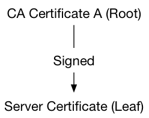
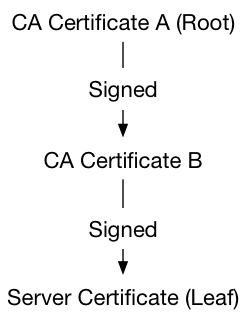

# TLS Support

https://www.rabbitmq.com/ssl.html

## Overview

RabbitMQ has inbuilt support for TLS. This includes client connections and popular plugins, where applicable, such as Federation. It is also possible to use TLS to [encrypt inter-node connections in clusters](https://www.rabbitmq.com/clustering-ssl.html).

This guide covers various topics related to TLS in RabbitMQ, with a focus on client connections:

- Two ways of using TLS for client connections: direct or via a TLS terminating proxy

- Erlang/OTP requirements for TLS support

- Enabling TLS in RabbitMQ

- How to generate self-signed certificates for development and QA environments with tls-gen or manually

- TLS configuration in Java and .NET clients

- Peer (certificate chain) verification of client connections or mutual ("mTLS")

- Public key usage extensions relevant to RabbitMQ

- How to control what TLS version and cipher suite are enabled

- TLSv1.3 support

- Tools that can be used to evaluate a TLS setup

- Known attacks on TLS and their mitigation

- How to use private key passwords

and more. It tries to explain the basics of TLS but not, however, a primer on TLS, encryption, public Key Infrastructure and related topics, so the concepts are covered very briefly.

A number of beginner-oriented primers are available elsewhere on the Web: [one](https://hpbn.co/transport-layer-security-tls/)、[two](https://medium.com/talpor/ssl-tls-authentication-explained-86f00064280)、[three](https://blogs.akamai.com/2016/03/enterprise-security---ssltls-primer-part-1---data-encryption.html)、[four](https://blogs.akamai.com/2016/03/enterprise-security---ssltls-primer-part-2---public-key-certificates.html)

TLS can be enabled for all protocols supported by RabbitMQ, not just AMQP 0-9-1, which this guide focuses on. HTTP API, inter-node and CLI tool traffic can be configured to use TLS (HTTPS) as well.

To configure TLS on Kubernetes using the RabbitMQ Cluster Operator, see the guide for [Configuring TLS](https://www.rabbitmq.com/kubernetes/operator/using-operator.html#tls).

For an overview of common TLS troubleshooting techniques, see [Troubleshooting TLS-related issues](https://www.rabbitmq.com/troubleshooting-ssl.html) and [Troubleshooting Networking](https://www.rabbitmq.com/troubleshooting-networking.html).

### Common Approaches to TLS for client Connections with RabbitMQ

For client connections, there are two common approaches:

- Configure RabbitMQ to handle TLS connections

- Use a proxy or load balancer (such as HAproxy) to perform TLS termination of client connections and use plain TCP connections to RabbitMQ nodes.

Both approaches are valid and have pros and cons. This guide will focus on the first option.

### Erlang/OTP Requirements for TLS Support

In order to support TLS connections, RabbitMQ needs TLS and crypto-related modules to be available in the Erlang/OTP installation. The recommended Erlang/OTP version to use with TLS is the most recent [supported Erlang release](https://www.rabbitmq.com/which-erlang.html). Earlier versions, even if they are supported, may work for most certificates but have known limitations (see below).

The Erlang asn1, crypto, public_key, and ssl libraries (applications) must be installed and functional. On Debian and Ubuntu this is provided by the erlang-asn1, erlang-crypto, erlang-public-key, and erlang-ssl packages, respectively. The zero dependency Erlang RPM for RabbitMQ includes the above modules.

If Erlang/OTP is compiled from source, it is necessary to ensure that configure finds OpenSSL and builds the above libraries.

When investigating调查 TLS connectivity issues, please keep in mind that in the vast majority of cases they are environment-specific (e.g. certificates are missing from the trusted certificate store) and do not indicate a bug or limitation in Erlang/OTP's TLS implementation. Please go through the steps outlined in the Troubleshooting TLS guide to gather more information first.

### Known Incompatibilities and Limitations

If Elliptic curve cryptography (ECC) cipher suites is expected to be used, a recent supported Erlang release is highly recommended. Earlier releases have known limitations around ECC support.

If you face the above limitations or any other incompatibilities, use the TLS termination option (see above).

## TLS Basics: Certificate Authorities, Certificates, Keys

TLS is a large and fairly complex topic. Before explaining how to enable TLS in RabbitMQ it's worth briefly cover some of the concepts used in this guide. This section is intentionally brief and oversimplifies some things. Its goal is to get the reader started with enabling TLS for RabbitMQ and applications. A number of beginner-oriented primers on TLS are available elsewhere on the Web: [one](https://hpbn.co/transport-layer-security-tls/)、[two](https://blog.talpor.com/2015/07/ssltls-certificates-beginners-tutorial/)、[three](https://blogs.akamai.com/2016/03/enterprise-security---ssltls-primer-part-1---data-encryption.html)、[four](https://blogs.akamai.com/2016/03/enterprise-security---ssltls-primer-part-2---public-key-certificates.html).

For a thorough understanding of TLS and how to get the most out of it, we would recommend the use of other resources, for example [Network Security with OpenSSL](http://oreilly.com/catalog/9780596002701/).

TLS has two primary purposes: encrypting connection traffic and providing a way to authenticate verify the peer to mitigate against [Man-in-the-Middle attacks](https://en.wikipedia.org/wiki/Man-in-the-middle_attack). Both are accomplished using a set of roles, policies and procedures known as [Public Key Infrastructure](https://en.wikipedia.org/wiki/public_key_infrastructure) (PKI).

A PKI is based on the concept of digital identities that can be cryptographically (mathematically) verified. Those identities are called certificates or more precisely, certificate/key pairs. Every TLS-enabled server usually has its own certificate/key pair that it uses to compute a connection-specific key that will be used to encrypt traffic sent on the connection. Also, if asked, it can present its certificate (public key) to the connection peer. Clients may or may not have their own certificates. In the context of messaging and tools such as RabbitMQ it is quite common for clients to also use certificate/key pairs so that servers can validate their identity.

Certificate/key pairs are generated by tools such as OpenSSL and signed by entities called Certificate Authorities(CA). CAs issue certificates that users (applications or other CAs) use. When a certificate is signed by a CA, they form a chain of trust. Such chains can include more than one CA but ultimately sign a certificate/key pair used by an application (a leaf or end user certificate). Chains of CA certificates are usually distributed together in a single file. Such file is called a CA bundle.

Here's an example of the most basic chain with one root CA and one leaf (server or client) certificate:



A chain with intermediate certificates might look like this:


There are organizations that sign and issue certificate/key pairs. Most of them are widely trusted CAs and charge a fee for their services.

A TLS-enabled RabbitMQ node must have a set of Certificate Authority certificates it considers to be trusted in a file (a CA bundle), a certificate (public key) file and a private key file. The files will be read from the local filesystem. They must be readable by the effective user of the RabbitMQ node process.

Both ends of a TLS-enabled connection can optionally verify the other end of the connection. While doing so, they try to locate a trusted Certificate Authority in the certificate list presented by the peer. When both sides perform this verification process, this is known as mutual TLS authentication or mTLS. More on this in the Peer Verification section.

This guides assumes the user has access to a Certificate Authority and two certificate/key pairs in a number of formats for different client libraries to use. This is best done using existing tools but those looking to get more familiar with the topic and OpenSSL command line tools there's a separate section.

In production environments certificates are generated by a commercial Certificate Authority or a Certificate Authority issued by the internal security team. In those cases Certificate Authority bundle files very likely will contain more than one certificate. This doesn't change how the bundle file is used when configuration RabbitMQ as long as the same basic file and path requirements are met. In other words, whether the certificates are self-signed or issued by a trusted CA, they are configured the same way. The section on peer verification covers this in detail.

## The Short Route to Generating a CA, Certificates, and Keys

This guides assumes the user has access to a CA certificate bundle file and two certificate/key pairs. The certificate/key pairs are used by RabbitMQ and clients that connect to the server on a TLS-enabled port. The process of generating a Certificate Authority and two key pairs is fairly labourious and can be error-prone. An easier way of generating all that stuff on MacOS or Linux is with [tls-gen](https://github.com/michaelklishin/tls-gen): it requires Python 3.5+, make and openssl in PATH.

Note that tls-gen and the certificate/key pairs it generates are self-signed and only suitable for development and test environments. The vast majority of production environments should use certificates and keys issued by a widely trusted commercial CA.

tls-gen supports RSA and Elliptic Curve Cryptography algorithms for key generation.

### Using tls-gen's Basic Profile

Below is an example that generates a CA and uses it to produce two certificate/key pairs, one for the server and another for clients. This is the setup that is expected by the rest of this guide.

```bash
git clone https://github.com/michaelklishin/tls-gen tls-gen
cd tls-gen/basic
# private key password
make PASSWORD=bunnies
make verify
make info
ls -l ./result
```

The certificate chain produced by this basic tls-gen profile looks like this:


## Enabling TLS Support in RabbitMQ

To enable the TLS support in RabbitMQ, the node has to be configured to know the location of the Certificate Authority bundle (a file with one more CA certificates), the server's certificate file, and the server's key. A TLS listener should also be enabled to know what port to listen on for TLS-enabled client connections. More TLS-related things can be configured. Those are covered in the rest of this guide.

Here are the essential configuration settings related to TLS:

* listeners.ssl

A list of ports to listen on for TLS connections. RabbitMQ can listen on a single interface or multiple ones

* ssl_options.cacertfile

Certificate Authority (CA) bundle file path

* ssl_options.certfile

Server certificate file path

* ssl_options.keyfile

Server private key file path

* ssl_options.verify

Should peer verification be enabled?

* ssl_options.fail_if_no_peer_cert

When set to true, TLS connection will be rejected if client fails to provide a certificate

The options are provided in the configuration file. An example of the config file is below, which will start one TLS listener on port 5671 on all interfaces on this hostname:

```ini
listeners.ssl.default = 5671

ssl_options.cacertfile = /path/to/ca_certificate.pem
ssl_options.certfile   = /path/to/server_certificate.pem
ssl_options.keyfile    = /path/to/server_key.pem
ssl_options.verify     = verify_peer
ssl_options.fail_if_no_peer_cert = true
```

This configuration will also perform peer certificate chain verification so clients without any certificates will be rejected.

It is possible to completely disable regular (non-TLS) listeners. Only TLS-enabled clients would be able to connect to such a node, and only if they use the correct port:

```ini
# disables non-TLS listeners, only TLS-enabled clients will be able to connect
listeners.tcp = none

listeners.ssl.default = 5671

ssl_options.cacertfile = /path/to/ca_certificate.pem
ssl_options.certfile   = /path/to/server_certificate.pem
ssl_options.keyfile    = /path/to/server_key.pem
ssl_options.verify     = verify_peer
ssl_options.fail_if_no_peer_cert = true
```

TLS settings can also be configured using the classic config format:

```erlang
[
  {rabbit, [
     {ssl_listeners, [5671]},
     {ssl_options, [{cacertfile, "/path/to/ca_certificate.pem"},
                    {certfile,   "/path/to/server_certificate.pem"},
                    {keyfile,    "/path/to/server_key.pem"},
                    {verify,     verify_peer},
                    {fail_if_no_peer_cert, true}]}
   ]}
].
```

### Certificate and Private Key File Paths

RabbitMQ must be able to read its configured CA certificate bundle, server certificate and private key. The files must exist and have the appropriate permissions. When that's not the case the node will fail to start or fail to accept TLS-enabled connections.

Note to Windows users: backslashes ("\") in the configuration file are interpreted as escape sequences - so for example to specify the path c:\ca_certificate.pem for the CA certificate you would need to use "c:\\ca_certificate.pem" or "c:/ca_certificate.pem".

### How to Verify that TLS is Enabled

To verify that TLS has been enabled on the node, restart it and inspect its log file. It should contain an entry about a TLS listener being enabled, looking like this:

```
2020-07-13 21:13:01.015 [info] <0.573.0> started TCP listener on [::]:5672
2020-07-13 21:13:01.055 [info] <0.589.0> started TLS (SSL) listener on [::]:5671
```

Another way is by using rabbitmq-diagnostics listeners which should contain lines for TLS-enabled listeners:

```bash
rabbitmq-diagnostics listeners
#
# ... (some output omitted for brevity)
# => Interface: [::], port: 5671, protocol: amqp/ssl, purpose: AMQP 0-9-1 and AMQP 1.0 over TLS
# ...
```

### Providing Private Key Password

Private keys can be optional protected by a password. To provide the password, use the password option:

```ini
listeners.ssl.1 = 5671
ssl_options.cacertfile = /path/to/ca_certificate.pem
ssl_options.certfile   = /path/to/server_certificate.pem
ssl_options.keyfile    = /path/to/server_key.pem
ssl_options.password   = t0p$3kRe7
```

The same example using the classic config format:

```erlang
[
 {rabbit, [
           {ssl_listeners, [5671]},
           {ssl_options, [{cacertfile,"/path/to/ca_certificate.pem"},
                          {certfile,  "/path/to/server_certificate.pem"},
                          {keyfile,   "/path/to/server_key.pem"},
                          {password,  "t0p$3kRe7"}
                         ]}
          ]}
].
```

Classic config file format allows for config value encryption, which is recommended for passwords.

## TLS Peer Verification: Who Do You Say You Are?

As mentioned in the Certificates and Keys section, TLS has two primary purposes: encrypting connection traffic and providing a way to verify that the peer can be trusted (e.g. signed by a trusted Certificate Authority) to mitigate against Man-in-the-Middle attacks, a class of attacks where an attacker impersonates a legitimate trusted peer (usually a server). This section will focus on the latter.

### How Peer Verification Works

When a TLS connection is established client and server perform connection negotiation that takes several steps. The first step is when the peers optionally exchange their certificates. Having exchanged certificates, the peers can optionally attempt to establish a chain of trust between their CA certificates and the certificates presented. This acts to verify that the peer is who it claims to be (provided the private key hasn't been stolen).

The process is known as peer verification or peer validation and follows an algorithm known as the Certification path validation algorithm. Understanding the entire algorithm is not necessary in order to use peer verification, so this section provides an oversimplified explanation of the key parts.

Each peer provides a chain of certificates that begins with a leaf (client or server) certificate and continues with at least one Certificate Authority (CA) certificate. That CA issued (signed) the leaf CA. If there are multiple CA certificates, they usually form a chain of signatures, meaning that each CA certificate was signed by the next one. For example, if certificate B is signed by A and C is signed by B, the chain is A, B, C (commas here are used for clarity). The "topmost" (first or only) CA is often referred to as the root CA for the chain. Root CAs can be issued by well-known Certificate Authorities (commercial vendors) or any other party (self-signed).

Here's an example of the most basic chain with one root CA and one leaf (server or client) certificate:


A chain with intermediate certificates might look like this:



### Mutual Peer Verification (Mutual TLS Authentication or mTLS)

When both sides perform this peer verification process, this is known as mutual TLS authentication or mTLS.  当双方执行此对等验证过程时，这称为相互 TLS 身份验证或 mTLS。

Enabling mutual peer verification involves two things:

- Enabling peer verification for client connections on the RabbitMQ side

- Enabling peer verification of the server in application code

In other words, mutual peer verification ("mTLS") is a joint responsibility of RabbitMQ nodes and client connections. Enabling peer verification on just one end is not enough.

### When Peer Verification Fails

If no trusted and otherwise valid certificate is found, peer verification fails and client's TLS (TCP) connection is closed with a fatal error ("alert" in OpenSSL parlance) that says "Unknown CA" or similar. The alert will be logged by the server with a message similar to this:

```
2018-09-10 18:10:46.502 [info] <0.902.0> TLS server generated SERVER ALERT: Fatal - Unknown CA
```

Certificate validity is also checked at every step. Certificates that are expired or aren't yet valid will be rejected. The TLS alert in that case will look something like this:

```
2018-09-10 18:11:05.168 [info] <0.923.0> TLS server generated SERVER ALERT: Fatal - Certificate Expired
```

The examples above demonstrate TLS alert messages logged by a RabbitMQ node. Clients that perform peer verification will also raise alerts but may use different error messages. [RFC 8446 section 6.2](https://tools.ietf.org/html/rfc8446#section-6.2) provides an overview of various alerts and what they mean.

### Trusted Certificates

Every TLS-enabled tool and TLS implementation, including Erlang/OTP and RabbitMQ, has a way of marking a set of certificates as trusted.

There are three common approaches to this:

- All trusted CA certificates must be added to a single file called the CA certificate bundle

- All CA certificates in a directory are considered to be trusted

- A dedicated tool is used to manage trusted CA certificates

Different TLS implementation and tools use different options. In the context of RabbitMQ this means that the trusted certificate management approach may be different for different client libraries, tools and RabbitMQ server itself.

For example, OpenSSL and OpenSSL command line tools such as s_client on Linux and other UNIX-like systems will use a directory administered by superusers. CA certificates in that directory will be considered trusted, and so are the certificates issued by them (such as those presented by clients). Locations of the trusted certificate directory will vary between distributions, operating systems and releases.

On Windows trusted certificates are managed using tools such as certmgr.

The certificates in the server's CA certificate bundle may be considered trusted. We say "may" because it doesn't work the same way for all client libraries since this varies from TLS implementation to implementation. Certificates in a CA certificate bundler won't be considered to be trusted in Python, for example, unless explicitly added to the trust store.

RabbitMQ relies on Erlang's TLS implementation. It assumes that **all trusted CA certificates are added to the server certificate bundle**.

When performing peer verification, RabbitMQ will only consider the root certificate (first certificate in the list) to be trusted. Any intermediate certificates will be ignored. If it's desired that intermediate certificates are also considered to be trusted they must be added to the trusted certificate list: the certificate bundle.

While it is possible to place final ("leaf") certificates such as those used by servers and clients to the trusted certificate directory, a much more common practice is to add CA certificates to the trusted certificate list.

The most common way of appending several certificates to one another and use in a single Certificate Authority bundle file is to simply concatenate them:

```bash
cat rootca/ca_certificate.pem otherca/ca_certificate.pem > all_cacerts.pem
```

### Enabling Peer Verification

On the server end, peer verification is primarily controlled using two configuration options: ssl_options.verify and ssl_options.fail_if_no_peer_cert.

Setting the ssl_options.fail_if_no_peer_cert option to false tells the node to accept clients which don't present a certificate (for example, were not configured to use one).

When the ssl_options.verify option is set to verify_peer, the client does send us a certificate, the node must perform peer verification. When set to verify_none, peer verification will be disabled and certificate exchange won't be performed.

For example, the following config will perform peer verification and reject clients that do not provide a certificate:

```ini
listeners.ssl.default = 5671

ssl_options.cacertfile = /path/to/ca_certificate.pem
ssl_options.certfile = /path/to/server_certificate.pem
ssl_options.keyfile = /path/to/server_key.pem
ssl_options.verify = verify_peer
ssl_options.fail_if_no_peer_cert = true
```

The same example in the classic config format:

```erlang
[
{rabbit, [
   {ssl_listeners, [5671]},
   {ssl_options, [{cacertfile,"/path/to/ca_certificate.pem"},
                  {certfile,"/path/to/server_certificate.pem"},
                  {keyfile,"/path/to/server_key.pem"},
                  {verify, verify_peer},
                  {fail_if_no_peer_cert, true}]}
 ]}
].
```

How exactly peer verification is configured in client libraries varies from library to library. Java and .NET client sections cover peer verification in those clients.

Peer verification is highly recommended in production environments. With careful consideration, disabling it can make sense in certain environments (e.g. development).

Thus it is possible to create an encrypted TLS connection without having to verify certificates. Client libraries usually support both modes of operation.

When peer verification is enabled, it is common for clients to also check whether the hostname of the server they are connecting to matches one of two fields in the server certificate: the SAN (Subject Alternative Name) or CN (Common Name). When wildcard certificates are used, the hostname is matched against a pattern. If there is no match, peer verification will also be failed by the client. Hostname checks are also optional and generally orthogonal to certificate chain verification performed by the client.

Because of this it is important to know what SAN (Subject Alternative Name) or CN (Common Name) values were used when generating the certificate. If a certificate is generated on one host and used on a different host then the $(hostname) value should be replaced with the correct hostname of the target server.

tls-gen will use local machine's hostname for both values. Likewise, in the manual certificate/key pair generation section local machine's hostname is specified as ...-subj /CN=$(hostname)/... to some OpenSSL CLI tool commands.

### Certificate Chains and Verification Depth

When using a client certificate signed by an intermediate CA, it may be necessary to configure RabbitMQ server to use a higher verification depth.

The depth is the maximum number of non-self-issued intermediate certificates that may follow the peer certificate in a valid certification path. So if depth is 0 the peer (e.g. client) certificate must be signed by the trusted CA directly, if 1 the path can be "peer, CA, trusted CA", if it is 2 "peer, CA, CA, trusted CA", and so on. The default depth is 1.

The following example demonstrates how to configure certificate validation depth for RabbitMQ server:

```ini
listeners.ssl.default = 5671

ssl_options.cacertfile = /path/to/ca_certificate.pem
ssl_options.certfile = /path/to/server_certificate.pem
ssl_options.keyfile = /path/to/server_key.pem
ssl_options.verify = verify_peer
ssl_options.depth  = 2
ssl_options.fail_if_no_peer_cert = false
```

The same example in the classic config format:

```erlang
[
  {rabbit, [
     {ssl_listeners, [5671]},
     {ssl_options, [{cacertfile,"/path/to/ca_certificate.pem"},
                    {certfile,"/path/to/server_certificate.pem"},
                    {keyfile,"/path/to/server_key.pem"},
                    {depth, 2},
                    {verify,verify_peer},
                    {fail_if_no_peer_cert,false}]}
   ]}
].
```

When using RabbitMQ plugins such as Federation or Shovel with TLS, it may be necessary to configure verification depth for the Erlang client that those plugins use under the hood, as explained below.

## Using TLS in the Java Client

There are two main parts to enabling TLS in the RabbitMQ Java client: setting up the key store with a bit of Java security framework plumbing and implementing the desired peer verification strategy.

### Key Managers, Trust Managers and Stores

There are three main components in the Java security framework: [Key Manager](https://docs.oracle.com/javase/8/docs/api/javax/net/ssl/KeyManager.html)、[Trust Manager](https://docs.oracle.com/javase/8/docs/api/javax/net/ssl/TrustManager.html) and [Key Store](https://docs.oracle.com/javase/8/docs/api/java/security/KeyStore.html).

A Key Manager is used by a peer (in this case, a client connection) to manage its certificates. During TLS connection/session negotiation, the key manager will control which certificates to send to the remote peer.

A Trust Manager is used by a peer to manage remote certificates. During TLS connection/session negotiation, the trust manager will control which certificates are trusted from a remote peer. Trust managers can be used to implement any certificate chain verification logic.

A Key Store is a Java encapsulation of the certificate store concept. All certificates must either be stored into a Java-specific binary format (JKS) or to be in the PKCS#12 format. These formats are managed using the KeyStore class. In the below examples the JKS format is used to add the trusted (server) certificate(s) to the store, while for the client key/certificate pair, the PKCS#12 key file generated by tls-gen will be used.

All TLS-related settings in the Java client are configured via the [ConnectionFactory](https://rabbitmq.github.io/rabbitmq-java-client/api/current/com/rabbitmq/client/ConnectionFactory.html).

### Connecting with TLS

This very basic example will show a simple client connecting to a RabbitMQ server over TLS without validating the server certificate, and without presenting any client certificate to the server.

```java
import java.io.*;
import java.security.*;

import com.rabbitmq.client.*;

public class Example1 {
    public static void main(String[] args) throws Exception {
        ConnectionFactory factory = new ConnectionFactory();
        factory.setHost("localhost");
        factory.setPort(5671);

        factory.useSslProtocol();
        // Tells the library to setup the default Key and Trust managers for you
        // which do not do any form of remote server trust verification

        Connection conn = factory.newConnection();
        Channel channel = conn.createChannel();

        // non-durable, exclusive, auto-delete queue
        channel.queueDeclare("rabbitmq-java-test", false, true, true, null);
        channel.basicPublish("", "rabbitmq-java-test", null, "Hello, World".getBytes());

        GetResponse chResponse = channel.basicGet("rabbitmq-java-test", false);
        if (chResponse == null) {
            System.out.println("No message retrieved");
        } else {
            byte[] body = chResponse.getBody();
            System.out.println("Received: " + new String(body));
        }

        channel.close();
        conn.close();
    }
}
```

This simple example is an echo client and server. It creates a channel and publishes to the default direct exchange, then fetches back what has been published and echoes it out. It uses an exclusive, non-durable, auto-delete queue that will be deleted shortly after the connection is closed.

### Connecting with Peer Verification Enabled

For a Java client to trust a server, the server certificate must be added to a trust store which will be used to instantiate a Trust Manager. The JDK ships with a tool called keytool that manages certificate stores. To import a certificate to a store use keytool -import:

```bash
keytool -import -alias server1 -file /path/to/server_certificate.pem -keystore /path/to/rabbitstore
```

The above command will import server/certificate.pem into the rabbitstore file using the JKS format. The certificate will be referred to as server1 in the trust store. All certificates and keys must have distinct name in their store.

keytool will confirm that the certificate is trusted and ask for a password. The password protects the trust store from any tampering attempt.

The client certificate and key in a PKCS#12 file are then used. Note Java understands natively the PKCS#12 format, no conversion is needed.

The below example demonstrates how the key store and the trust store are used with a Key Manager and Trust Manager, respectively.

```java
import java.io.*;
import java.security.*;
import javax.net.ssl.*;

import com.rabbitmq.client.*;

public class Example2 {
    public static void main(String[] args) throws Exception {
        char[] keyPassphrase = "MySecretPassword".toCharArray();
        KeyStore ks = KeyStore.getInstance("PKCS12");
        ks.load(new FileInputStream("/path/to/client_key.p12"), keyPassphrase);

        KeyManagerFactory kmf = KeyManagerFactory.getInstance("SunX509");
        kmf.init(ks, keyPassphrase);

        char[] trustPassphrase = "rabbitstore".toCharArray();
        KeyStore tks = KeyStore.getInstance("JKS");
        tks.load(new FileInputStream("/path/to/trustStore"), trustPassphrase);

        TrustManagerFactory tmf = TrustManagerFactory.getInstance("SunX509");
        tmf.init(tks);

        SSLContext c = SSLContext.getInstance("TLSv1.2");
        c.init(kmf.getKeyManagers(), tmf.getTrustManagers(), null);

        ConnectionFactory factory = new ConnectionFactory();
        factory.setHost("localhost");
        factory.setPort(5671);
        factory.useSslProtocol(c);
        factory.enableHostnameVerification();

        Connection conn = factory.newConnection();
        Channel channel = conn.createChannel();

        channel.queueDeclare("rabbitmq-java-test", false, true, true, null);
        channel.basicPublish("", "rabbitmq-java-test", null, "Hello, World".getBytes());

        GetResponse chResponse = channel.basicGet("rabbitmq-java-test", false);
        if (chResponse == null) {
            System.out.println("No message retrieved");
        } else {
            byte[] body = chResponse.getBody();
            System.out.println("Received: " + new String(body));
        }

        channel.close();
        conn.close();
    }
}
```

To ensure that the above code works as expected with untrusted certificates, set up a RabbitMQ node with a certificate that has not been imported into the key store and watch the connection fail.

#### Server Hostname Verification

Hostname verification must be enabled separately using the ConnectionFactory#enableHostnameVerification() method. This is done in the example above, for instance:

```java
import java.io.*;
import java.security.*;
import javax.net.ssl.*;

import com.rabbitmq.client.*;

public class Example2 {
    public static void main(String[] args) throws Exception {
        char[] keyPassphrase = "MySecretPassword".toCharArray();
        KeyStore ks = KeyStore.getInstance("PKCS12");
        ks.load(new FileInputStream("/path/to/client_key.p12"), keyPassphrase);

        KeyManagerFactory kmf = KeyManagerFactory.getInstance("SunX509");
        kmf.init(ks, keyPassphrase);

        char[] trustPassphrase = "rabbitstore".toCharArray();
        KeyStore tks = KeyStore.getInstance("JKS");
        tks.load(new FileInputStream("/path/to/trustStore"), trustPassphrase);

        TrustManagerFactory tmf = TrustManagerFactory.getInstance("SunX509");
        tmf.init(tks);

        SSLContext c = SSLContext.getInstance("TLSv1.2");
        c.init(kmf.getKeyManagers(), tmf.getTrustManagers(), null);

        ConnectionFactory factory = new ConnectionFactory();
        factory.setHost("localhost");
        factory.setPort(5671);
        factory.useSslProtocol(c);
        factory.enableHostnameVerification();
        ....
    }
}
```

This will verify that the server certificate has been issued for the hostname the client is connecting to. Unlike certificate chain verification, this feature is client-specific (not usually performed by the server).

With JDK 6, it is necessary to add a dependency on [Apache Commons HttpClient](https://hc.apache.org/) for hostname verification to work, e.g. with Maven:

```xml
<!-- Maven dependency to add for hostname verification on JDK 6 -->
<dependency>
    <groupId>org.apache.httpcomponents</groupId>
    <artifactId>httpclient</artifactId>
    <version>4.5.6</version>
</dependency>
```

With Gradle:

```groovy
// Gradle dependency to add for hostname verification on JDK 6
compile group: 'org.apache.httpcomponents', name: 'httpclient', version: '4.5.6'
```

Alternatively with JDK 6 ConnectionFactory#enableHostnameVerification(HostnameVerifier) can be provided a HostnameVerifier instance of choice.

### Configuring TLS Version in Java Client

Just like RabbitMQ server can be configured to support only specific TLS versions, it may be necessary to configure preferred TLS version in the Java client. This is done using the ConnectionFactory#useSslProtocol overloads that accept a protocol version name or a SSLContext:

```java
ConnectionFactory factory = new ConnectionFactory();
factory.setHost("localhost");
factory.setPort(5671);

factory.useSslProtocol("TLSv1.2");
```

Modern releases of the library will attempt to use the latest TLS version supported by the runtime.

## Limiting TLS Versions Used by the Server

### Why Limit TLS Versions

TLS (née SSL) has evolved over time and has multiple versions in use. Each version builds on the shortcomings of previous versions. Most of the time the shortcomings resulted in known attacks that affect specific versions of TLS (and SSL). Disabling older TLS versions is a way to mitigate many of those attacks (another technique is to disable affected cipher suites).  TLS 随着时间的推移不断发展，并有多个版本在使用。 每个版本都建立在以前版本的缺点之上。 大多数情况下，这些缺点会导致已知攻击影响特定版本的 TLS（和 SSL）。 禁用较旧的 TLS 版本是减轻许多此类攻击的一种方法（另一种技术是禁用受影响的密码套件）。

For the above reasons, recent release series of Erlang only enable latest supported TLS version by default, as demonstrated in the below table.

| Erlang Series | TLS Versions Enabled by Default |
| ------------- | ------------------------------- |
| 23.x          | TLSv1.3 (has a dedicated section) and TLSv1.2 |
| 22.x          | TLSv1.2                                       |

Users of older supported Erlang releases are encouraged to limit supported TLS versions to 1.2 and later versions only, if possible. Consider TLSv1.0 and TLSv1.1 to be **deprecated by the industry**.  如果可能，鼓励使用较早支持的 Erlang 版本的用户将支持的 TLS 版本限制为 1.2 及更高版本。 考虑 TLSv1.0 和 TLSv1.1 已被行业弃用。

### Why Not Limit TLS Versions

Limiting TLS versions to only TLSv1.3 or even only TLSv1.2 means that clients that support older TLS versions only won't be able to connect.

If support for applications that use such old runtimes is important, the server must be configured to support older versions of TLS. In most cases, supporting TLSv1.2 should be sufficient.

To limit enabled TLS protocol versions, use the ssl_options.versions setting.

The example below only accepts TLSv1.3 (the most recent and secure version), and requires the node to be running on Erlang 23 compiled against a very recent OpenSSL. Clients that use older runtimes (e.g. JDK, .NET, Python) without TLSv1.3 support **will not be able to connect** with this setup.

```ini
listeners.ssl.1 = 5671

ssl_options.cacertfile = /path/to/ca_certificate.pem
ssl_options.certfile   = /path/to/server_certificate.pem
ssl_options.keyfile    = /path/to/server_key.pem

ssl_options.versions.1 = tlsv1.3

# Limits enable cipher suites to only those used by TLSv1.3. 将密码套件限制为仅 TLSv1.3 使用的密码套件。
# There are no cipher suites supported by both TLSv1.3 and TLSv1.2. 没有 TLSv1.3 和 TLSv1.2 都支持的密码套件。

ssl_options.ciphers.1  = TLS_AES_256_GCM_SHA384
ssl_options.ciphers.2  = TLS_AES_128_GCM_SHA256
ssl_options.ciphers.3  = TLS_CHACHA20_POLY1305_SHA256
ssl_options.ciphers.4  = TLS_AES_128_CCM_SHA256
ssl_options.ciphers.5  = TLS_AES_128_CCM_8_SHA256
```

The example below disables versions older than TLSv1.2:  下面的示例禁用了早于 TLSv1.2 的版本：

```ini
listeners.ssl.1 = 5671
ssl_options.cacertfile = /path/to/ca_certificate.pem
ssl_options.certfile   = /path/to/server_certificate.pem
ssl_options.keyfile    = /path/to/server_key.pem

ssl_options.versions.1 = tlsv1.2
```

### Verifying Enabled TLS Versions

To verify provided TLS versions, [use openssl s_client](https://www.feistyduck.com/library/openssl-cookbook/online/ch-testing-with-openssl.html) with an [appropriate TLS version flag](https://www.openssl.org/docs/man1.1.1/man1/openssl-s_client.html):

```bash
# connect using TLSv1.3
openssl s_client -connect 127.0.0.1:5671 -tls1_3
```

and look for the following in the output:

```plaintext
New, TLSv1.3, Cipher is TLS_AES_256_GCM_SHA384
```

In the example below, TLSv1.2 is used:

```bash
# connect using TLSv1.2
openssl s_client -connect 127.0.0.1:5671 -tls1_2
```

The protocol and negotiated cipher suite in the output would look like so:

```plaintext
SSL-Session:
    Protocol  : TLSv1.2
    Cipher    : ECDHE-RSA-AES256-GCM-SHA384
```

### TLSv1.3

[TLSv1.3](https://wiki.openssl.org/index.php/TLS1.3) is a major revision to the TLS protocol. It is the most recent and secure option. Prior to RabbitMQ 3.8.11, TLSv1.3 support was considered experimental and was disabled.

TLSv1.3 support requires the node to be running on Erlang 23 compiled against a very recent OpenSSL.

Clients that use older runtimes (e.g. JDK, .NET, Python) without TLSv1.3 support **will not be able to connect** to RabbitMQ nodes that are configured to only accept TLSv1.3 connections.

Because TLSv1.3 shares no cipher suites with earlier TLS versions, when enabling TLSv1.3, list a set of TLSv1.3-specific cipher suites:

```ini
listeners.ssl.1 = 5671

ssl_options.cacertfile = /path/to/ca_certificate.pem
ssl_options.certfile   = /path/to/server_certificate.pem
ssl_options.keyfile    = /path/to/server_key.pem

ssl_options.versions.1 = tlsv1.3

# Limits enable cipher suites to only those used by TLSv1.3.
# There are no cipher suites supported by both TLSv1.3 and TLSv1.2.
ssl_options.ciphers.1  = TLS_AES_256_GCM_SHA384
ssl_options.ciphers.2  = TLS_AES_128_GCM_SHA256
ssl_options.ciphers.3  = TLS_CHACHA20_POLY1305_SHA256
ssl_options.ciphers.4  = TLS_AES_128_CCM_SHA256
ssl_options.ciphers.5  = TLS_AES_128_CCM_8_SHA256
```

Explicit cipher suite configuration may also be necessary on the client side.

To verify provided TLS versions, use openssl s_client as explained above.

### TLS Version Support Table for JDK and .NET

Disabling TLSv1.0 limits the number of client platforms supported. Below is a table that explains what TLS versions are supported by what JDK and .NET releases.

| TLS version | Minimum JDK version | Minimum .NET version |
| ----------- | ------------------- | -------------------- |
| TLS 1.3     | JDK 8 starting with JDK8u261, JDK 11+ | .NET 4.7 on Windows versions that support TLSv1.3 |
| TLS 1.2     | JDK 7 , JDK 8 recommended | .NET 4.5 |
| TLS 1.1     | JDK 7 , JDK 8 recommended | .NET 4.5 |

JDK has a [public roadmap on crypt](https://java.com/en/jre-jdk-cryptoroadmap.html) that outlines when certain cipher suites or TLS versions will be deprecated or removed.

## Public Key Usage Options

Public keys (certificates) have a number of fields that describe the intended usage scenarios for the key. The fields limit how the key is allowed to be used by various tools. For example, a public key can be used to verify certificate signatures (act as a Certificate Authority key).

These fields also have effects on what cipher suites will be used by RabbitMQ nodes and clients during connection negotiation (more specifically, the TLS handshake), so it is important to explain what the effects are.

This guide will cover them with some intentional oversimplification. Broadly speaking, the fields fall into one of three categories:

- [keyUsage](https://tools.ietf.org/html/rfc5280#section-4.2.1.3)

- [Basic Constraints](https://tools.ietf.org/html/rfc5280#section-4.2.1.9)

- [extendedKeyUsage](https://tools.ietf.org/html/rfc5280#section-4.2.1.12)

Some fields are boolean values, others are of different types such as a set of options (bits) that can be set or unset.

Data services are largely agnostic to the constraints and key usage options used. However, some are essential to the use cases described in this guide:  数据服务在很大程度上与所使用的约束和关键使用选项无关。 但是，对于本指南中描述的用例，有些是必不可少的：

- Server authentication (provide server node's identity to the client)  服务器认证（向客户端提供服务器节点的身份）

- Client authentication (provide client's identity to the server)  客户端认证（向服务器提供客户端的身份）

- Verification of digital signatures  验证数字签名

- Key encipherment  密钥加密

The first two options are used for peer verification. They must be set for the server and client certificates, respectively, at public key generation time. A certificate can have both options set at the same time.

tls-gen will make sure that these constraints and extensions are correctly set. When generating certificates manually, this is a responsibility of the operator that generates the key pairs, or a key pair provider.

### Extensions and Their Effect on Accepted Cipher Suites (Cipher Suite Filtering)

Two key extensions are critically important for two major types of cipher suites:  两个密钥扩展对于两种主要类型的密码套件至关重要：

- **digitalSignature** for ECC (Elliptic Curve Cryptography)-based suites

- **keyEncipherment** for RSA-based suites

It is highly recommended that both of the above options (bits) are set for certificates that will be used by both RabbitMQ nodes and client libraries. If those bits are not set, TLS implementations will leave out an entire class of cipher suites from consideration, potentially resulting in confusing "no suitable cipher suite found" alerts (error messages) at connection time.  强烈建议为 RabbitMQ 节点和客户端库将使用的证书设置上述两个选项（位）。 如果未设置这些位，TLS 实现将忽略整个类别的密码套件，这可能会导致在连接时混淆“找不到合适的密码套件”警报（错误消息）。

### Examining Certificate Extensions

To see what constraints and extensions are set for a public key, use the openssl x509 command:

```bash
openssl x509 -in /path/to/certificate.pem -text -noout
```

Its output will include a nested list of extensions and constraints that looks similar to this:

```ini
X509v3 extensions:
    X509v3 Basic Constraints:
        CA:FALSE
    X509v3 Key Usage:
        Digital Signature, Key Encipherment
    X509v3 Extended Key Usage:
        TLS Web Client Authentication
```

The above set of extensions says that this is a public key that can be used to authenticate a client (provide a client identity to a RabbitMQ node), cannot be used as a Certificate Authority certificate and can be used for key encipherment and digital signature.  上面的一组扩展说明这是一个公钥，可用于验证客户端（向 RabbitMQ 节点提供客户端身份），不能用作证书颁发机构证书，可用于密钥加密和数字签名。

For the purpose of this guide, this is a suitable certificate (public key) to be used for client connections.  就本指南而言，这是用于客户端连接的合适证书（公钥）。

Below is an example of a public key suitable certificate for server authentication (provides a RabbitMQ node identity) as well as client authentication (perhaps for the sake of usability):  下面是一个适用于服务器身份验证（提供 RabbitMQ 节点身份）以及客户端身份验证（可能是为了可用性）的公钥证书示例：


```ini
X509v3 extensions:
    X509v3 Basic Constraints:
        CA:FALSE
    X509v3 Key Usage:
        Digital Signature, Key Encipherment
    X509v3 Extended Key Usage:
        TLS Web Server Authentication, TLS Web Client Authentication
```

## Cipher Suites

It is possible to configure what cipher suites will be used by RabbitMQ. Note that not all suites will be available on all systems. For example, to use Elliptic curve ciphers, a recent supported Erlang release must be used.

What cipher suites RabbitMQ nodes and clients used can also be effectively limited by the public key usage fields and their values. It is important to make sure that those key usage options are acceptable before proceeding with cipher suite configuration.

### Listing Cipher Suites Available on a RabbitMQ Node

To list cipher suites supported by the Erlang runtime of a running node, use rabbitmq-diagnostics cipher_suites --format openssl:

```bash
rabbitmq-diagnostics cipher_suites --format openssl -q
```

This will produce a list of cipher suites in the OpenSSL format.

Note that if you use --format erlang:

```bash
rabbitmq-diagnostics cipher_suites --format erlang -q
```

then rabbitmq-diagnostics cipher_suites will list cipher suites in the format that's only accepted in the classic config format. The OpenSSL format is accepted by both config formats. Note that cipher suites are not enquoted in the new style config format but double quotes are required in the classic format.

The cipher suites listed by the above command are in formats that can be used for inbound and outgoing (e.g. Shovel, Federation) client TLS connections. They are different from those used by configuration value encryption.

When overriding cipher suites, it is highly recommended that server-preferred cipher suite ordering is enforced.

### Configuring Cipher Suites

Cipher suites are configured using the ssl_options.ciphers config option (rabbit.ssl_options.ciphers in the classic config format).

The below example demonstrates how the option is used.

```ini
listeners.ssl.1 = 5671

ssl_options.cacertfile = /path/to/ca_certificate.pem
ssl_options.certfile   = /path/to/server_certificate.pem
ssl_options.keyfile    = /path/to/server_key.pem
ssl_options.versions.1 = tlsv1.2
ssl_options.versions.2 = tlsv1.1

ssl_options.verify = verify_peer
ssl_options.fail_if_no_peer_cert = false

ssl_options.ciphers.1  = ECDHE-ECDSA-AES256-GCM-SHA384
ssl_options.ciphers.2  = ECDHE-RSA-AES256-GCM-SHA384
ssl_options.ciphers.3  = ECDHE-ECDSA-AES256-SHA384
ssl_options.ciphers.4  = ECDHE-RSA-AES256-SHA384
ssl_options.ciphers.5  = ECDH-ECDSA-AES256-GCM-SHA384
ssl_options.ciphers.6  = ECDH-RSA-AES256-GCM-SHA384
ssl_options.ciphers.7  = ECDH-ECDSA-AES256-SHA384
ssl_options.ciphers.8  = ECDH-RSA-AES256-SHA384
ssl_options.ciphers.9  = DHE-RSA-AES256-GCM-SHA384
ssl_options.ciphers.10 = DHE-DSS-AES256-GCM-SHA384
ssl_options.ciphers.11 = DHE-RSA-AES256-SHA256
ssl_options.ciphers.12 = DHE-DSS-AES256-SHA256
ssl_options.ciphers.13 = ECDHE-ECDSA-AES128-GCM-SHA256
ssl_options.ciphers.14 = ECDHE-RSA-AES128-GCM-SHA256
ssl_options.ciphers.15 = ECDHE-ECDSA-AES128-SHA256
ssl_options.ciphers.16 = ECDHE-RSA-AES128-SHA256
ssl_options.ciphers.17 = ECDH-ECDSA-AES128-GCM-SHA256
ssl_options.ciphers.18 = ECDH-RSA-AES128-GCM-SHA256
ssl_options.ciphers.19 = ECDH-ECDSA-AES128-SHA256
ssl_options.ciphers.20 = ECDH-RSA-AES128-SHA256
ssl_options.ciphers.21 = DHE-RSA-AES128-GCM-SHA256
ssl_options.ciphers.22 = DHE-DSS-AES128-GCM-SHA256
ssl_options.ciphers.23 = DHE-RSA-AES128-SHA256
ssl_options.ciphers.24 = DHE-DSS-AES128-SHA256
ssl_options.ciphers.25 = ECDHE-ECDSA-AES256-SHA
ssl_options.ciphers.26 = ECDHE-RSA-AES256-SHA
ssl_options.ciphers.27 = DHE-RSA-AES256-SHA
ssl_options.ciphers.28 = DHE-DSS-AES256-SHA
ssl_options.ciphers.29 = ECDH-ECDSA-AES256-SHA
ssl_options.ciphers.30 = ECDH-RSA-AES256-SHA
ssl_options.ciphers.31 = ECDHE-ECDSA-AES128-SHA
ssl_options.ciphers.32 = ECDHE-RSA-AES128-SHA
ssl_options.ciphers.33 = DHE-RSA-AES128-SHA
ssl_options.ciphers.34 = DHE-DSS-AES128-SHA
ssl_options.ciphers.35 = ECDH-ECDSA-AES128-SHA
ssl_options.ciphers.36 = ECDH-RSA-AES128-SHA

ssl_options.honor_cipher_order = true
ssl_options.honor_ecc_order    = true
```

In the classic config format:

```erlang
%% list allowed ciphers
[
 {ssl, [{versions, ['tlsv1.2', 'tlsv1.1']}]},
 {rabbit, [
           {ssl_listeners, [5671]},
           {ssl_options, [{cacertfile,"/path/to/ca_certificate.pem"},
                          {certfile,  "/path/to/server_certificate.pem"},
                          {keyfile,   "/path/to/server_key.pem"},
                          {versions, ['tlsv1.2', 'tlsv1.1']},
                          %% This list is just an example!
                          %% Not all cipher suites are available on all machines.
                          %% Cipher suite order is important: preferred suites
                          %% should be listed first.
                          %% Different suites have different security and CPU load characteristics.
                          {ciphers,  [
                            "ECDHE-ECDSA-AES256-GCM-SHA384",
                            "ECDHE-RSA-AES256-GCM-SHA384",
                            "ECDHE-ECDSA-AES256-SHA384",
                            "ECDHE-RSA-AES256-SHA384",
                            "ECDH-ECDSA-AES256-GCM-SHA384",
                            "ECDH-RSA-AES256-GCM-SHA384",
                            "ECDH-ECDSA-AES256-SHA384",
                            "ECDH-RSA-AES256-SHA384",
                            "DHE-RSA-AES256-GCM-SHA384",
                            "DHE-DSS-AES256-GCM-SHA384",
                            "DHE-RSA-AES256-SHA256",
                            "DHE-DSS-AES256-SHA256",
                            "ECDHE-ECDSA-AES128-GCM-SHA256",
                            "ECDHE-RSA-AES128-GCM-SHA256",
                            "ECDHE-ECDSA-AES128-SHA256",
                            "ECDHE-RSA-AES128-SHA256",
                            "ECDH-ECDSA-AES128-GCM-SHA256",
                            "ECDH-RSA-AES128-GCM-SHA256",
                            "ECDH-ECDSA-AES128-SHA256",
                            "ECDH-RSA-AES128-SHA256",
                            "DHE-RSA-AES128-GCM-SHA256",
                            "DHE-DSS-AES128-GCM-SHA256",
                            "DHE-RSA-AES128-SHA256",
                            "DHE-DSS-AES128-SHA256",
                            "ECDHE-ECDSA-AES256-SHA",
                            "ECDHE-RSA-AES256-SHA",
                            "DHE-RSA-AES256-SHA",
                            "DHE-DSS-AES256-SHA",
                            "ECDH-ECDSA-AES256-SHA",
                            "ECDH-RSA-AES256-SHA",
                            "ECDHE-ECDSA-AES128-SHA",
                            "ECDHE-RSA-AES128-SHA",
                            "DHE-RSA-AES128-SHA",
                            "DHE-DSS-AES128-SHA",
                            "ECDH-ECDSA-AES128-SHA",
                            "ECDH-RSA-AES128-SHA"
                            ]}
                         ]}
          ]}
].
```

### Cipher Suite Order

During TLS connection negotiation, the server and the client negotiate what cipher suite will be used. It is possible to force server's TLS implementation to dictate its preference (cipher suite order) to avoid malicious clients that intentionally negotiate weak cipher suites in preparation for running an attack on them. To do so, configure honor_cipher_order and honor_ecc_order to true:  在 TLS 连接协商期间，服务器和客户端协商将使用什么密码套件。 可以强制服务器的 TLS 实现规定其偏好（密码套件顺序），以避免恶意客户端故意协商弱密码套件以准备对其进行攻击。 为此，请将 Honor_cipher_order 和 Honor_ecc_order 配置为 true：

```ini
listeners.ssl.1        = 5671
ssl_options.cacertfile = /path/to/ca_certificate.pem
ssl_options.certfile   = /path/to/server_certificate.pem
ssl_options.keyfile    = /path/to/server_key.pem
ssl_options.versions.1 = tlsv1.2
ssl_options.versions.2 = tlsv1.1

ssl_options.honor_cipher_order = true
ssl_options.honor_ecc_order    = true
```

Or, in the classic config format:

```erlang
%% Enforce server-provided cipher suite order (preference)
[
 {ssl, [{versions, ['tlsv1.2', 'tlsv1.1']}]},
 {rabbit, [
           {ssl_listeners, [5671]},
           {ssl_options, [{cacertfile, "/path/to/ca_certificate.pem"},
                          {certfile,   "/path/to/server_certificate.pem"},
                          {keyfile,    "/path/to/server_key.pem"},
                          {versions,   ['tlsv1.2', 'tlsv1.1']},

                          %% ...


                          {honor_cipher_order,   true},
                          {honor_ecc_order,      true},
                         ]}
          ]}
].
```

## Known TLS Vulnerabilities and Their Mitigation  已知的 TLS 漏洞及其缓解措施

#### ROBOT

[ROBOT attack](https://robotattack.org/) affects RabbitMQ installations that rely on RSA cipher suites and run on Erlang/OTP versions prior to 19.3.6.4 and 20.1.7. To mitigate, upgrade Erlang/OTP to a patched version and consider limiting the list of supported cipher suites.

#### POODLE

[POODLE](https://www.openssl.org/~bodo/ssl-poodle.pdf) is a known SSL/TLS attack that originally compromised SSLv3. Starting with version 3.4.0, RabbitMQ server refuses to accept SSLv3 connections. In December 2014, a modified version of the POODLE attack that affects TLSv1.0 was [announced](https://www.imperialviolet.org/2014/12/08/poodleagain.html). It is therefore recommended to either run Erlang 18.0 or later, which [eliminates TLS 1.0 implementation vulnerability to POODLE](http://www.erlang.org/news/88), or disable TLSv1.0 support.

#### BEAST

[BEAST attack](http://en.wikipedia.org/wiki/Transport_Layer_Security#BEAST_attack) is a known vulnerability that affects TLSv1.0. To mitigate it, disable TLSv1.0 support.

## Evaluating TLS Setups

Because TLS has many configurable parameters and some of them have suboptimal defaults for historical reasons, TLS setup evaluation is a recommended practice. Multiple tools exist that perform various tests on TLS-enabled server endpoints, for example, testing whether it is prone to known attacks such as POODLE, BEAST, and others.  由于 TLS 有许多可配置的参数，并且由于历史原因，其中一些参数的默认设置不是最优的，因此建议使用 TLS 设置评估。 存在多种工具可以对启用 TLS 的服务器端点执行各种测试，例如，测试它是否容易受到已知攻击，如 POODLE、BEAST 等。

### testssl.sh

[testssl.sh](https://testssl.sh/) is a mature and extensive TLS endpoint testing tool. It can be used with protocol endpoints that do not serve HTTPS.  testssl.sh 是一个成熟且广泛的 TLS 端点测试工具。 它可以与不提供 HTTPS 服务的协议端点一起使用。

The tool performs many tests (for instance, on some machines it runs over 350 cipher suite tests alone) and passing every single one may or may not make sense for every environment. For example, many production deployments do not use CRLs (Certificate Revocation Lists); most development environments use self-signed certificates and don't have to worry about the most optimal set of cipher suites enabled; and so on.  该工具执行许多测试（例如，在某些机器上，它仅运行 350 多个密码套件测试）并且通过每个测试可能对每个环境都有意义，也可能没有意义。 例如，许多生产部署不使用 CRL（证书撤销列表）； 大多数开发环境使用自签名证书，不必担心启用的最佳密码套件集； 等等。

To run testssl.sh, provide an endpoint to test in the form of {hostname}:5671:

```bash
./testssl.sh localhost:5671
```

The following example configuration that accepts TLSv1.3 connections passes key testssl.sh tests on Erlang 23:

```ini
listeners.ssl.1 = 5671

ssl_options.cacertfile = /path/to/ca_certificate.pem
ssl_options.certfile   = /path/to/server_certificate.pem
ssl_options.keyfile    = /path/to/server_key.pem

ssl_options.versions.1 = tlsv1.3

ssl_options.verify               = verify_peer
ssl_options.fail_if_no_peer_cert = true

ssl_options.ciphers.1  = TLS_AES_256_GCM_SHA384
ssl_options.ciphers.2  = TLS_AES_128_GCM_SHA256
ssl_options.ciphers.3  = TLS_CHACHA20_POLY1305_SHA256
ssl_options.ciphers.4  = TLS_AES_128_CCM_SHA256
ssl_options.ciphers.5  = TLS_AES_128_CCM_8_SHA256

ssl_options.honor_cipher_order   = true
ssl_options.honor_ecc_order      = true
```

This TLSv1.3-exclusive setup is reported as not vulnerable:

```bash
 Service detected:       Couldn't determine what's running on port 5671, assuming no HTTP service => skipping all HTTP checks

 Testing protocols via sockets except NPN+ALPN

 SSLv2      not offered (OK)
 SSLv3      not offered (OK)
 TLS 1      not offered
 TLS 1.1    not offered
 TLS 1.2    not offered
 TLS 1.3    offered (OK): final
 NPN/SPDY   not offered
 ALPN/HTTP2 not offered

 Testing cipher categories

 NULL ciphers (no encryption)                      not offered (OK)
 Anonymous NULL Ciphers (no authentication)        not offered (OK)
 Export ciphers (w/o ADH+NULL)                     not offered (OK)
 LOW: 64 Bit + DES, RC[2,4], MD5 (w/o export)      not offered (OK)
 Triple DES Ciphers / IDEA                         not offered
 Obsoleted CBC ciphers (AES, ARIA etc.)            not offered
 Strong encryption (AEAD ciphers) with no FS       not offered
 Forward Secrecy strong encryption (AEAD ciphers)  offered (OK)


 Testing server's cipher preferences

 Has server cipher order?     yes (TLS 1.3 only)
 Negotiated protocol          TLSv1.3
 Negotiated cipher            TLS_AES_256_GCM_SHA384, 253 bit ECDH (X25519)
 Cipher per protocol

Hexcode  Cipher Suite Name (OpenSSL)       KeyExch.   Encryption  Bits     Cipher Suite Name (IANA/RFC)
-----------------------------------------------------------------------------------------------------------------------------
SSLv2
 -
SSLv3
 -
TLSv1
 -
TLSv1.1
 -
TLSv1.2
 -
TLSv1.3 (server order)
 x1302   TLS_AES_256_GCM_SHA384            ECDH 253   AESGCM      256      TLS_AES_256_GCM_SHA384
 x1301   TLS_AES_128_GCM_SHA256            ECDH 253   AESGCM      128      TLS_AES_128_GCM_SHA256
 x1303   TLS_CHACHA20_POLY1305_SHA256      ECDH 253   ChaCha20    256      TLS_CHACHA20_POLY1305_SHA256
 x1304   TLS_AES_128_CCM_SHA256            ECDH 253   AESCCM      128      TLS_AES_128_CCM_SHA256
 x1305   TLS_AES_128_CCM_8_SHA256          ECDH 253   AESCCM8     128      TLS_AES_128_CCM_8_SHA256


 Testing robust forward secrecy (FS) -- omitting Null Authentication/Encryption, 3DES, RC4

 FS is offered (OK)           TLS_AES_256_GCM_SHA384 TLS_CHACHA20_POLY1305_SHA256 TLS_AES_128_GCM_SHA256 TLS_AES_128_CCM_SHA256 TLS_AES_128_CCM_8_SHA256
 Elliptic curves offered:     prime256v1 secp384r1 X25519 X448


 Testing server defaults (Server Hello)

 TLS extensions (standard)    "supported versions/#43" "key share/#51"
 Session Ticket RFC 5077 hint no -- no lifetime advertised
 SSL Session ID support       yes
 Session Resumption           Tickets no, ID resumption test failed
 TLS clock skew               -5 sec from localtime
 Client Authentication        none
 Signature Algorithm          SHA256 with RSA
 Server key size              RSA 2048 bits (exponent is 65537)
 Server key usage             Digital Signature, Key Encipherment
 Server extended key usage    TLS Web Server Authentication
 Serial / Fingerprints        01 / SHA1 7B1C27E995BA409F031CBE0827E017E0CE0B931A
                              SHA256 96338084641B5B29FF4E60C570AF5081175D9BDD89EB28FFA3CECE96A995CC8E
 Common Name (CN)             warp10
 subjectAltName (SAN)         warp10 warp10.local localhost
 Trust (hostname)             Ok via SAN (same w/o SNI)
 Chain of trust               NOT ok (self signed CA in chain)
 EV cert (experimental)       no
 Certificate Validity (UTC)   3611 >= 60 days (2021-01-06 17:43 --> 2031-01-04 17:43)
                              >= 10 years is way too long
 ETS/"eTLS", visibility info  not present
 Certificate Revocation List  --
 OCSP URI                     --
                              NOT ok -- neither CRL nor OCSP URI provided
 OCSP stapling                not offered
 OCSP must staple extension   --
 DNS CAA RR (experimental)    not offered
 Certificate Transparency     N/A
 Certificates provided        2
 Issuer                       TLSGenSelfSignedtRootCA
 Intermediate cert validity   #1: ok > 40 days (2031-01-04 17:43).
 Intermediate Bad OCSP (exp.) Ok


 Testing vulnerabilities

 Heartbleed (CVE-2014-0160)                not vulnerable (OK), no heartbeat extension
 CCS (CVE-2014-0224)                       not vulnerable (OK)
 Ticketbleed (CVE-2016-9244), experiment.  --   (applicable only for HTTPS)
 ROBOT                                     Server does not support any cipher suites that use RSA key transport
 Secure Renegotiation (RFC 5746)           not vulnerable (OK)
 Secure Client-Initiated Renegotiation     not vulnerable (OK)
 CRIME, TLS (CVE-2012-4929)                not vulnerable (OK)
 POODLE, SSL (CVE-2014-3566)               not vulnerable (OK), no SSLv3 support
 TLS_FALLBACK_SCSV (RFC 7507)              No fallback possible (OK), TLS 1.3 is the only protocol
 SWEET32 (CVE-2016-2183, CVE-2016-6329)    not vulnerable (OK)
 FREAK (CVE-2015-0204)                     not vulnerable (OK)
 DROWN (CVE-2016-0800, CVE-2016-0703)      not vulnerable on this host and port (OK)
                                           make sure you don't use this certificate elsewhere with SSLv2 enabled services
                                           https://censys.io/ipv4?q=96338084641B5B29FF4E60C570AF5081175D9BDD89EB28FFA3CECE96A995CC8E could help you to find out
 LOGJAM (CVE-2015-4000), experimental      not vulnerable (OK): no DH EXPORT ciphers, no DH key detected with <= TLS 1.2
 BEAST (CVE-2011-3389)                     not vulnerable (OK), no SSL3 or TLS1
 LUCKY13 (CVE-2013-0169), experimental     not vulnerable (OK)
 Winshock (CVE-2014-6321), experimental    not vulnerable (OK)
 RC4 (CVE-2013-2566, CVE-2015-2808)        not vulnerable (OK)

Could not determine the protocol, only simulating generic clients.

 Running client simulations via sockets

 Browser                      Protocol  Cipher Suite Name (OpenSSL)       Forward Secrecy
------------------------------------------------------------------------------------------------
 Android 8.1 (native)         No connection
 Android 9.0 (native)         TLSv1.3   TLS_AES_256_GCM_SHA384            253 bit ECDH (X25519)
 Android 10.0 (native)        TLSv1.3   TLS_AES_256_GCM_SHA384            253 bit ECDH (X25519)
 Java 6u45                    No connection
 Java 7u25                    No connection
 Java 8u161                   No connection
 Java 11.0.2 (OpenJDK)        TLSv1.3   TLS_AES_256_GCM_SHA384            256 bit ECDH (P-256)
 Java 12.0.1 (OpenJDK)        TLSv1.3   TLS_AES_256_GCM_SHA384            256 bit ECDH (P-256)
 OpenSSL 1.0.2e               No connection
 OpenSSL 1.1.0l (Debian)      No connection
 OpenSSL 1.1.1d (Debian)      TLSv1.3   TLS_AES_256_GCM_SHA384            253 bit ECDH (X25519)

```

The following example configuration that accepts TLSv1.2 connections passes key testssl.sh tests on Erlang 23:

```ini
listeners.ssl.default  = 5671
ssl_options.cacertfile = /path/to/ca_certificate.pem
ssl_options.certfile   = /path/to/server_certificate.pem
ssl_options.keyfile    = /path/to/server_key.pem
ssl_options.versions.1 = tlsv1.2

ssl_options.verify               = verify_peer
ssl_options.fail_if_no_peer_cert = false

ssl_options.honor_cipher_order   = true
ssl_options.honor_ecc_order      = true

# These are highly recommended for TLSv1.2 but cannot be used
# with TLSv1.3. If TLSv1.3 is enabled, these lines MUST be removed.
ssl_options.client_renegotiation = false
ssl_options.secure_renegotiate   = true

ssl_options.ciphers.1  = ECDHE-ECDSA-AES256-GCM-SHA384
ssl_options.ciphers.2  = ECDHE-RSA-AES256-GCM-SHA384
ssl_options.ciphers.3  = ECDH-ECDSA-AES256-GCM-SHA384
ssl_options.ciphers.4  = ECDH-RSA-AES256-GCM-SHA384
ssl_options.ciphers.5  = DHE-RSA-AES256-GCM-SHA384
ssl_options.ciphers.6  = DHE-DSS-AES256-GCM-SHA384
ssl_options.ciphers.7  = ECDHE-ECDSA-AES128-GCM-SHA256
ssl_options.ciphers.8  = ECDHE-RSA-AES128-GCM-SHA256
ssl_options.ciphers.9  = ECDH-ECDSA-AES128-GCM-SHA256
ssl_options.ciphers.10 = ECDH-RSA-AES128-GCM-SHA256
ssl_options.ciphers.11 = DHE-RSA-AES128-GCM-SHA256
ssl_options.ciphers.12 = DHE-DSS-AES128-GCM-SHA256
```

This TLSv1.2-enabled setup is reported as not vulnerable to a set of known high profile vulnerabilities:

```bash
Testing robust (perfect) forward secrecy, (P)FS -- omitting Null Authentication/Encryption, 3DES, RC4

PFS is offered (OK)          ECDHE-RSA-AES256-GCM-SHA384 DHE-RSA-AES256-GCM-SHA384 ECDHE-RSA-AES128-GCM-SHA256 DHE-RSA-AES128-GCM-SHA256
Elliptic curves offered:     sect163k1 sect163r1 sect163r2 sect193r1 sect193r2 sect233k1 sect233r1 sect239k1 sect283k1 sect283r1 sect409k1
                             sect409r1 sect571k1 sect571r1 secp160k1 secp160r1 secp160r2 secp192k1 prime192v1 secp224k1 secp224r1 secp256k1
                             prime256v1 secp384r1 secp521r1 brainpoolP256r1 brainpoolP384r1 brainpoolP512r1


Testing vulnerabilities

Heartbleed (CVE-2014-0160)                not vulnerable (OK), no heartbeat extension
CCS (CVE-2014-0224)                       not vulnerable (OK)
Ticketbleed (CVE-2016-9244), experiment.  --   (applicable only for HTTPS)
Secure Renegotiation (CVE-2009-3555)      not vulnerable (OK)
Secure Client-Initiated Renegotiation     not vulnerable (OK)
CRIME, TLS (CVE-2012-4929)                not vulnerable (OK) (not using HTTP anyway)
POODLE, SSL (CVE-2014-3566)               not vulnerable (OK)
TLS_FALLBACK_SCSV (RFC 7507)              No fallback possible, TLS 1.2 is the only protocol (OK)
SWEET32 (CVE-2016-2183, CVE-2016-6329)    not vulnerable (OK)
FREAK (CVE-2015-0204)                     not vulnerable (OK)
DROWN (CVE-2016-0800, CVE-2016-0703)      not vulnerable on this host and port (OK)
                                          make sure you don't use this certificate elsewhere with SSLv2 enabled services
                                          https://censys.io/ipv4?q=5E878E40541CC37F88A0A1BA395FA95EA1EC68373FAC512D54C329F031BA443D could help you to find out
LOGJAM (CVE-2015-4000), experimental      Common prime with 2048 bits detected: RFC3526/Oakley Group 14,
                                          but no DH EXPORT ciphers
BEAST (CVE-2011-3389)                     no SSL3 or TLS1 (OK)
LUCKY13 (CVE-2013-0169), experimental     not vulnerable (OK)
RC4 (CVE-2013-2566, CVE-2015-2808)        no RC4 ciphers detected (OK)
```

## Using TLS in the Erlang Client

Enabling TLS in the RabbitMQ Erlang client is similar to configuring other settings related to networking. The #amqp_params_network record provides a field, ssl_options, for all the [standard Erlang TLS options](http://erlang.org/doc/man/ssl.html).

### Erlang TLS Options

The three important options which must be supplied are:

- The cacertfile option specifies the certificates of the root Certificate Authorities that we wish to implicitly trust.

- The certfile is the client's own certificate in PEM format

- The keyfile is the client's private key file in PEM format

server_name_indication - set this option to the host name of the server to which a TLS connection will be made to enable "Server Name Indication" verification of the certificate presented by the server. This ensures that the server certificate's CN= value will be verified during TLS connection establishment. You can override this behavior by setting server_name_indication to a different host name or to the special value disable to disable this verification. Note that, by default, SNI is **not** enabled. This default will change in a future RabbitMQ Erlang client release.

verify - set this option to verify_peer to enable X509 certificate chain verification. The depth option configures certificate verification depth. Note that, by default, verify is set to verify_none, which disables certificate chain verification. This default will change in a future RabbitMQ Erlang client release.

### Code Example

```erlang
SslOpts = [{cacertfile, "/path/to/ca_certificate.pem"},
           {certfile, "/path/to/client/certificate.pem"},
           {keyfile, "/path/to/client/private_key.pem"},

           %% only necessary with intermediate CAs
           %% {depth, 2},

           %% Note: it is recommended to set 'verify' to
           %% to 'verify_peer' to ensure that X509
           %% certificate chain validation is enabled
           %%
           %% Do not set 'verify' or set it to verify_none
           %% if x509 certificate chain validation is
           %% not desired
           {verify, verify_peer},

           %% If Server Name Indication validation is desired,
           %% set the following option to the host name to which
           %% the connection is made. If necessary, this option
           %% may be set to another host name to match the server
           %% certificate's CN= value.
           %% Do not set this option or set it to the atom 'disable'
           %% to disable SNI validation
           {server_name_indication, "my.rmq-server.net"}],

Params = #amqp_params_network{host = "my.rmq-server.net",
                              port = 5671,
                              ssl_options = SslOpts}

{ok, Conn} = amqp_connection:start(Params),
```

You can now go ahead and use Conn as a normal connection.

## Manually Generating a CA, Certificates and Private Keys

This section of the guide explains how to generate a Certificate Authority and use it to generate and sign two certificate/key pairs, one for the server and one for client libraries. Note that the process can be automated using existing tools, which is recommended. This section is intended for those who would like to improve their understanding of the process, OpenSSL command line tools and some important aspects of OpenSSL configuration.

This guide assumes a UNIX-like operating system (Linux, MacOS, a BSD variant and so on) and a recent version of OpenSSL available in PATH.

First let's create a directory for our test Certificate Authority:

```bash
mkdir testca
cd testca
mkdir certs private
chmod 700 private
echo 01 > serial
touch index.txt
```

Now add the following OpenSSL configuration file, `openssl.cnf`, within the newly created `testca` directory:

```ini
[ ca ]
default_ca = testca

[ testca ]
dir = .
certificate = $dir/ca_certificate.pem
database = $dir/index.txt
new_certs_dir = $dir/certs
private_key = $dir/private/ca_private_key.pem
serial = $dir/serial

default_crl_days = 7
default_days = 365
default_md = sha256

policy = testca_policy
x509_extensions = certificate_extensions

[ testca_policy ]
commonName = supplied
stateOrProvinceName = optional
countryName = optional
emailAddress = optional
organizationName = optional
organizationalUnitName = optional
domainComponent = optional

[ certificate_extensions ]
basicConstraints = CA:false

[ req ]
default_bits = 2048
default_keyfile = ./private/ca_private_key.pem
default_md = sha256
prompt = yes
distinguished_name = root_ca_distinguished_name
x509_extensions = root_ca_extensions

[ root_ca_distinguished_name ]
commonName = hostname

[ root_ca_extensions ]
basicConstraints = CA:true
keyUsage = keyCertSign, cRLSign

[ client_ca_extensions ]
basicConstraints = CA:false
keyUsage = digitalSignature,keyEncipherment
extendedKeyUsage = 1.3.6.1.5.5.7.3.2

[ server_ca_extensions ]
basicConstraints = CA:false
keyUsage = digitalSignature,keyEncipherment
extendedKeyUsage = 1.3.6.1.5.5.7.3.1
```

Next we need to generate the key and certificates that our test Certificate Authority will use. Still within the testca directory:  接下来，我们需要生成我们的测试证书颁发机构将使用的密钥和证书。 仍在 testca 目录中：

```bash
$ openssl req -x509 -config openssl.cnf -newkey rsa:2048 -days 365 -out ca_certificate.pem -outform PEM -subj /CN=MyTestCA/ -nodes

$ openssl x509 -in ca_certificate.pem -out ca_certificate.cer -outform DER
```

This is all that is needed to generate a test Certificate Authority. The root certificate is in ca_certificate.pem and is also in testca/ca_certificate.cer. These two files contain the same information, but in different formats, PEM and DER. Most software uses the former but some tools require the latter.  这就是生成测试证书颁发机构所需的全部内容。 根证书在 ca_certificate.pem 中，也在 testca/ca_certificate.cer 中。 这两个文件包含相同的信息，但格式不同，PEM 和 DER。 大多数软件使用前者，但有些工具需要后者。

Having set up our Certificate Authority, we now need to generate private keys and certificates for the clients and the server. RabbitMQ broker uses certificates and private keys in the PEM format. Some client libraries use the PEM format, others will require conversion to a different format (e.g. PKCS#12).  设置我们的证书颁发机构后，我们现在需要为客户端和服务器生成私钥和证书。 RabbitMQ 代理使用 PEM 格式的证书和私钥。 一些客户端库使用 PEM 格式，其他客户端库需要转换为不同的格式（例如 PKCS#12）。

Java and .NET clients use a certificate format called PKCS#12 and custom certificate stores. Certificate store contains both the client's certificate and key. The PKCS store is usually password protected, and so that a password must be provided. Java 和 .NET 客户端使用称为 PKCS#12 的证书格式和自定义证书存储。 证书存储包含客户端的证书和密钥。 PKCS 存储通常受密码保护，因此必须提供密码。

The process for creating server and client certificates is very similar. First the server:

```bash
cd ..
ls
# => testca
mkdir server
cd server

$ openssl genrsa -out private_key.pem 2048

$ openssl req -new -key private_key.pem -out req.pem -outform PEM -subj /CN=$(hostname)/O=server/ -nodes

cd ../testca

$ openssl ca -config openssl.cnf -in ../server/req.pem -out ../server/server_certificate.pem -notext -batch -extensions server_ca_extensions

cd ../server

$ openssl pkcs12 -export -out server_certificate.p12 -in server_certificate.pem -inkey private_key.pem -passout pass:MySecretPassword
```

And now the client:

```bash
cd ..
ls
# => server testca
mkdir client
cd client

$ openssl genrsa -out private_key.pem 2048

$ openssl req -new -key private_key.pem -out req.pem -outform PEM -subj /CN=$(hostname)/O=client/ -nodes

cd ../testca

$ openssl ca -config openssl.cnf -in ../client/req.pem -out ../client/client_certificate.pem -notext -batch -extensions client_ca_extensions

cd ../client

$ openssl pkcs12 -export -out client_certificate.p12 -in client_certificate.pem -inkey private_key.pem -passout pass:MySecretPassword
```

The two examples above generate private keys that are 2048 bits in size. It is possible to use longer (and thus more secure but also slower to generate) keys by providing a different value to openssl genrsa, e.g.:

```bash
openssl genrsa -out private_key.pem 4096
```

Another option would be to generate a key using Elliptic Curve Cryptography. Instead of openssl genrsa use openssl ecparam like so:

```bash
openssl ecparam -out private_key.pem -genkey -name prime256v1
```

prime256v1 in the example above is an Elliptic curve name. Different versions of OpenSSL will have a different set of curves available, list them with openssl ecparam -list_curves.

## Getting Help and Providing Feedback

If you have questions about the contents of this guide or any other topic related to RabbitMQ, don't hesitate to ask them on the [RabbitMQ mailing list](https://groups.google.com/forum/#!forum/rabbitmq-users).

## Help Us Improve the Docs <3

If you'd like to contribute an improvement to the site, its source is [available on GitHub](https://github.com/rabbitmq/rabbitmq-website). Simply fork the repository and submit a pull request. Thank you!


