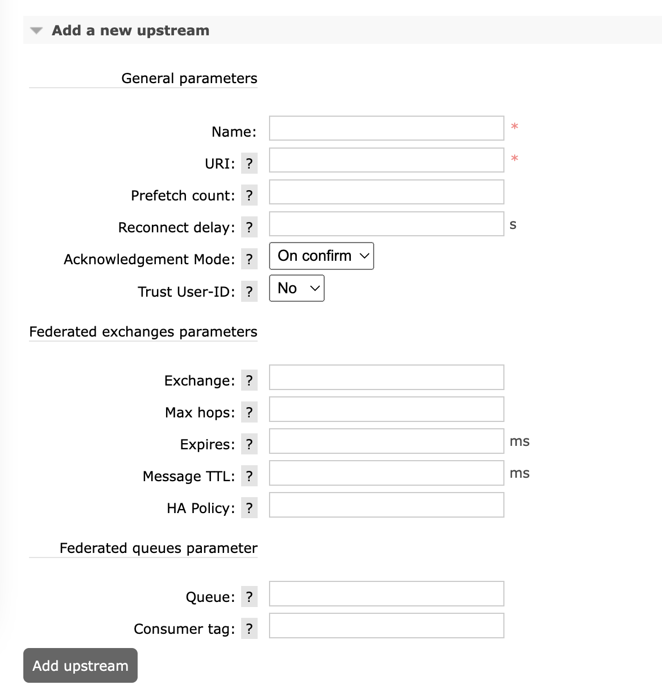

# Federation Plugin

https://www.rabbitmq.com/federation.html

## Overview

The high-level goal of the Federation plugin is to transmit messages between brokers without requiring clustering. This is useful for a number of reasons.  联邦插件的高级目标是在不需要集群的情况下在代理之间传输消息。 出于多种原因，这很有用。

### Loose Coupling of Nodes or Clusters  节点或集群的松散耦合

The federation plugin can transmit messages between brokers (or clusters) in different administrative domains: 联合插件可以在不同管理域的代理（或集群）之间传输消息：

- they may have different users and virtual hosts;  他们可能有不同的用户和虚拟主机；

- they may run on different versions of RabbitMQ and Erlang  它们可能在不同版本的 RabbitMQ 和 Erlang 上运行

### WAN friendliness  广域网友好性

The federation plugin uses AMQP 0-9-1 to communicate between brokers, and is designed to tolerate intermittent connectivity.  联邦插件使用 AMQP 0-9-1 在代理之间进行通信，旨在容忍间歇性连接。

### Specificity  特异性

A broker can contain federated and local-only components to best fit the desired architecture of the system.  代理可以包含联合的和仅限本地的组件，以最适合所需的系统架构。

### Scalability with Growing Connected Node Count  连接节点数量增加的可扩展性

Federation does not require O(n2) connections between *N* brokers (although this is the easiest way to set things up), which should mean it scales better.  联邦不需要 N 个代理之间的 O(n2) 连接（尽管这是最简单的设置方法），这应该意味着它可以更好地扩展。

## What Does It Do?  它有什么作用？

The federation plugin allows you to make exchanges and queues federated. A federated exchange or queue can receive messages from one or more **upstreams** (remote exchanges and queues on other brokers). **A federated exchange can route messages published upstream to a local queue**. **A federated queue lets a local consumer receive messages from an upstream queue**.  联合插件允许您使交换和队列联合。 联合交换或队列可以从一个或多个上游（其他代理上的远程交换和队列）接收消息。 联合交换可以将上游发布的消息路由到本地队列。 联合队列允许本地消费者从上游队列接收消息。

Federation links connect to upstreams using RabbitMQ Erlang client. Therefore they can connect to a specific vhost, use TLS, use multiple [authentication mechanisms](https://www.rabbitmq.com/authentication.html).  联合链接使用 RabbitMQ Erlang 客户端连接到上游。 因此他们可以连接到特定的虚拟主机，使用 TLS，使用多种身份验证机制。

For more details, see the documentation on [federated exchanges](https://www.rabbitmq.com/federated-exchanges.html) and [federated queues](https://www.rabbitmq.com/federated-queues.html).  有关更多详细信息，请参阅有关联合交换和联合队列的文档。

## How is Federation Set Up? 联邦是如何建立的？

To use federation, one needs to configure two things  要使用联邦，需要配置两件事

- One or more upstreams that define federation connections to other nodes. This can be done via [runtime parameters](https://www.rabbitmq.com/parameters.html) or the [federation management plugin](https://github.com/rabbitmq/rabbitmq-federation-management) which adds a federation management tab to the [management UI](https://www.rabbitmq.com/management.html).  定义与其他节点的联合连接的一个或多个上游。 这可以通过运行时参数或联合管理插件来完成，该插件将联合管理选项卡添加到管理 UI。

- One or more [policies](https://www.rabbitmq.com/parameters.html#policies) that match exchanges/queues and makes them federated.  匹配交换/队列并使它们联合的一个或多个策略。



## Getting Started

The federation plugin is included in the RabbitMQ distribution. To enable it, use [rabbitmq-plugins](https://www.rabbitmq.com/man/rabbitmq-plugins.8.html):  联邦插件包含在 RabbitMQ 发行版中。要启用它，请使用 rabbitmq-plugins：

```bash
rabbitmq-plugins enable rabbitmq_federation
```

When using the management plugin, you will also want to enable rabbitmq_federation_management:  使用管理插件时，您还需要启用 rabbitmq_federation_management：

```bash
rabbitmq-plugins enable rabbitmq_federation_management
```

**When using a federation in a cluster, all the nodes of the cluster should have the federation plugin enabled**.  在集群中使用联邦时，集群的所有节点都应该启用联邦插件。

Information about federation upstreams is stored in the RabbitMQ database, along with users, permissions, queues, etc. There are three levels of configuration involved in federation:  有关联合上游的信息与用户、权限、队列等一起存储在 RabbitMQ 数据库中。联合中涉及三个级别的配置：

- **Upstreams**: each upstream defines how to connect to another broker.  每个上游定义如何连接到另一个代理。

- **Upstream sets**: each upstream set groups together a set of upstreams to use for federation.  每个上游集将一组上游组合在一起以用于联合。

- **Policies**: each [policy](https://www.rabbitmq.com/parameters.html#policies) selects a set of exchanges, queues or both, and applies a single upstream or an upstream set to those objects.  每个策略选择一组交换、队列或两者，并将单个上游或上游集应用于这些对象。

In practice, for simple use cases you can almost ignore the existence of upstream sets, since there is an implicitly-defined upstream set called all to which all upstreams are added.  实际上，对于简单的用例，您几乎可以忽略上游集合的存在，因为有一个隐式定义的上游集合，称为 all，所有上游都添加到该集合中。

Upstreams and upstream sets are both instances of [runtime parameters](https://www.rabbitmq.com/parameters.html). Like exchanges and queues, each virtual host has its own distinct set of parameters and policies. For more generic information on parameters and policies, see the guide on [parameters and policies](https://www.rabbitmq.com/parameters.html). For full details on the parameters used by federation, see the [federation reference](https://www.rabbitmq.com/federation-reference.html).  上游和上游集都是运行时参数的实例。与交换和队列一样，每个虚拟主机都有自己独特的一组参数和策略。有关参数和策略的更多一般信息，请参阅参数和策略指南。有关联合使用的参数的完整详细信息，请参阅联合参考。

Parameters and policies can be set in three ways - either with an invocation of rabbitmqctl, a call to the management HTTP API, or (usually) through the web UI presented by rabbitmq_federation_management. The HTTP API does not present all possibilities - in particular, it does not support management of upstream sets.  可以通过三种方式设置参数和策略——调用rabbitmqctl，调用管理HTTP API，或者（通常）通过rabbitmq_federation_management提供的Web UI。 HTTP API 并不提供所有可能性——特别是，它不支持上游集的管理。

### A Basic Example

Here we will federate all the built-in exchanges except for the default exchange, with a single upstream. The upstream will be defined to buffer messages when disconnected for up to one hour (3600000ms).  在这里，我们将联合除了默认交换之外的所有内置交换，与单个上游。 上游将被定义为在断开连接长达一小时（3600000 毫秒）时缓冲消息。

First let's define an upstream:

* rabbitmqctl

```bash
$ rabbitmqctl set_parameter federation-upstream my-upstream '{"uri":"amqp://server-name","expires":3600000}'
```

* rabbitmqctl.bat (Windows)

```bash
$ rabbitmqctl.bat set_parameter federation-upstream my-upstream "{""uri"":""amqp://server-name"",""expires"":3600000}"
```

* HTTP API

```bash
PUT /api/parameters/federation-upstream/%2f/my-upstream
{"value":{"uri":"amqp://server-name","expires":3600000}}
```

* Web UI

Navigate to Admin > Federation Upstreams > Add a new upstream. Enter "my-upstream" next to Name, "amqp://server-name" next to URI, and 36000000 next to Expiry. Click Add upstream.

Then define a policy that will match built-in exchanges and use this upstream:

* rabbitmqctl

```bash
$ rabbitmqctl set_policy --apply-to exchanges federate-me "^amq\." '{"federation-upstream-set":"all"}'
```

* rabbitmqctl (Windows)

```bash
$ rabbitmqctl.bat set_policy --apply-to exchanges federate-me "^amq\." "{""federation-upstream-set"":""all""}"
```


* HTTP API

```bash
PUT /api/policies/%2f/federate-me
{
"pattern": "^amq\.",
"definition": {"federation-upstream-set":"all"},
"apply-to":"exchanges"
}
```

* Management UI

Navigate to `Admin` > `Policies` > `Add / update a policy`. Enter "federate-me" next to "Name", "^amq\." next to "Pattern", choose "Exchanges" from the "Apply to" drop down list and enter "federation-upstream-set" = "all" in the first line next to "Policy". Click "Add" policy.

We tell the policy to federate all exchanges whose names begin with "amq." (i.e. all the built in exchanges except for the default exchange) with (implicit) low priority, and to federate them using the implicitly created upstream set "all", which includes our newly-created upstream. Any other matching policy with a priority greater than 0 will take precedence over this policy. Keep in mind that federate-me is just a name we used for this example, you can use any string you want there.  我们告诉策略联合所有名称以“amq”开头的交易所。 （即除了默认交换之外的所有内置交换）具有（隐式）低优先级，并使用隐式创建的上游集“all”联合它们，其中包括我们新创建的上游。 任何其他优先级大于 0 的匹配策略将优先于该策略。 请记住，federate-me 只是我们在此示例中使用的名称，您可以在此处使用任何您想要的字符串。

The built in exchanges should now be federated because they are matched by the policy. You can check that the policy has applied to the exchanges by checking the exchanges list in management or with:  内置的交易所现在应该是联合的，因为它们与策略相匹配。 您可以通过检查管理中的交易所列表或通过以下方式检查该政策是否已应用于交易所：

```bash
$ rabbitmqctl list_exchanges name policy | grep federate-me
```

And you can check that federation links for each exchange have come up with Admin > Federation Status > Running Links or with:  您可以通过 Admin > Federation Status > Running Links 或通过以下方式检查每个交易所的联合链接：

```bash
# This command will be available only if federation plugin is enabled
rabbitmqctl federation_status
```

In general there will be one federation link for each upstream that is applied to an exchange. So for example with three exchanges and two upstreams for each there will be six links.  一般来说，每个上游都有一个联合链路应用于交换。因此，例如，三个交易所和每个上游两个上游将有六个链接。

For simple use this should be all you need - you will probably want to look at the [AMQP URI reference](https://www.rabbitmq.com/uri-spec.html).  对于简单的使用，这应该是您所需要的——您可能想要查看 AMQP URI 参考。

The [federation reference](https://www.rabbitmq.com/federation-reference.html) contains more details on upstream parameters and upstream sets.  联合参考包含有关上游参数和上游集的更多详细信息。

## Federation Connection (Link) Failures  联合连接（链接）失败

Inter-node connections used by Federation are based on AMQP 0-9-1 connections. Federation links can be treated as special kind of clients by operators.  联邦使用的节点间连接基于 AMQP 0-9-1 连接。联合链路可以被运营商视为特殊类型的客户端。

Should a link fail, e.g. due to a network interruption, it will attempt to re-connect. Reconnection period is a configurable value that's defined in upstream definition. See [federation reference](https://www.rabbitmq.com/federation-reference.html) for more details on setting up upstreams and upstream sets.  如果链接失败，例如由于网络中断，它将尝试重新连接。重新连接周期是上游定义中定义的可配置值。有关设置上游和上游集的更多详细信息，请参阅联合参考。

Links generally try to recover ad infinitum but there are scenarios when they give up:  链接通常会尝试无限恢复，但在某些情况下会放弃：

- Failure rate is too high (max tolerated rate depends on upstream's reconnect-delay but is generally a failure every few seconds by default).  失败率太高（最大容忍率取决于上游的重新连接延迟，但默认情况下通常每隔几秒失败一次）。

- Link no longer can locate its "source" queue or exchange.  链接不再可以找到它的“源”队列或交换。

- Policy changes in such a way that a link considers itself no longer necessary.  策略更改方式使链接认为自己不再需要。

By increasing reconnect-delay for upstreams it is possible to tolerate higher link failure rates. This is primarily relevant for RabbitMQ installations where a moderate or large number of active links.  通过增加上游的重新连接延迟，可以容忍更高的链路故障率。这主要与中等或大量活动链接的 RabbitMQ 安装相关。

## Federating Clusters  联合集群

Clusters can be linked together with federation just as single brokers can. To summarise how clustering and federation interact:  集群可以像单个代理一样通过联​​合连接在一起。总结一下集群和联邦是如何交互的：

- You can define policies and parameters on any node in the downstream cluster; once defined on one node they will apply on all nodes.  您可以在下游集群中的任何节点上定义策略和参数；一旦在一个节点上定义，它们将应用于所有节点。

- Exchange federation links will start on any node in the downstream cluster. They will fail over to other nodes if the node they are running on crashes or stops.  Exchange 联合链接将在下游集群中的任何节点上启动。如果它们正在运行的节点崩溃或停止，它们将故障转移到其他节点。

- Queue federation links will start on the same node as the downstream queue. If the downstream queue is mirrored, they will start on the same node as the leader, and will be recreated on the same node as the new leader after any future leader elections.  队列联合链接将在与下游队列相同的节点上开始。如果下游队列被镜像，它们将在与领导者相同的节点上开始，并在未来任何领导者选举后在与新领导者相同的节点上重新创建。

- To connect to an upstream cluster, you can specify multiple URIs in a single upstream. The federation link process will choose one of these URIs at random each time it attempts to connect.  要连接到上游集群，您可以在单个上游中指定多个 URI。每次尝试连接时，联合链接进程都会随机选择其中一个 URI。

## Securing Federation Connections with TLS  使用 TLS 保护联合连接

Federation connections (links) can be secured with TLS. Because Federation uses a RabbitMQ client under the hood, it is necessary to both configure source broker to [listen for TLS connections](https://www.rabbitmq.com/ssl.html) and Federation/Erlang client to use TLS.  可以使用 TLS 保护联合连接（链接）。因为联邦在后台使用 RabbitMQ 客户端，所以必须配置源代理以侦听 TLS 连接，并配置联邦/Erlang 客户端以使用 TLS。

To configure Federation to use TLS, one needs to  要将联邦配置为使用 TLS，需要

- Use the amqps URI scheme instead of amqp  使用 amqps URI 方案而不是 amqp

- Specify CA certificate and client certificate/key pair via [URI query parameters](https://www.rabbitmq.com/uri-query-parameters.html) when configuring upstream(s)  配置上游时通过 URI 查询参数指定 CA 证书和客户端证书/密钥对

- [Configure Erlang client to use TLS](https://www.rabbitmq.com/ssl.html)  配置 Erlang 客户端以使用 TLS

Just like with "regular" client connections, server's CA should be trusted on the node where federation link(s) runs, and vice versa.  就像“常规”客户端连接一样，服务器的 CA 应该在运行联合链接的节点上受到信任，反之亦然。

## Federation Link Monitoring  联合链路监控

Each combination of federated exchange or queue and upstream needs a link to run. This is the process that retrieves messages from upstream and republishes them downstream. You can monitor the status of federation links using rabbitmqctl and the management plugin.  联合交换或队列和上游的每个组合都需要一个链接来运行。 这是从上游检索消息并在下游重新发布它们的过程。 您可以使用 rabbitmqctl 和管理插件监控联合链接的状态。

### Using CLI Tools  使用 CLI 工具

Federation link status can be inspected using [RabbitMQ CLI tools](https://www.rabbitmq.com/cli.html).  可以使用 RabbitMQ CLI 工具检查联合链接状态。

Invoke:  调用：

```bash
# This command will be available only if federation plugin is enabled
rabbitmqctl federation_status
```

This will output a list of federation links running on the target node (not cluster-wide). It contains the following keys:  这将输出在目标节点（不是集群范围）上运行的联合链接列表。 它包含以下键：

| Parameter Name | Description |
| -------------- | ----------- |
| type | exchange or queue depending on what type of federated resource this link relates to |
| name | the name of the federated exchange or queue |
| vhost | the virtual host containing the federated exchange or queue |
| upstream_name | the name of the upstream this link is connected to |
| status | status of the link:starting{running, LocalConnectionName}{shutdown, Error} |
| connection | the name of the connection for this link (from config) |
| timestamp | time stamp of the last status update |

Here's an example:

```bash
# This command will be available only if federation plugin is enabled
rabbitmqctl federation_status
# => [[{type,<<"exchange">>},
# =>   {name,<<"my-exchange">>},
# =>   {vhost,<<"/">>},
# =>   {connection,<<"upstream-server">>},
# =>   {upstream_name,<<"my-upstream-x">>},
# =>   {status,{running,<<"<rabbit@my-server.1.281.0>">>}},
# =>   {timestamp,{{2020,3,1},{12,3,28}}}]]
# => ...done.
```

### Using the Management UI

Enable the rabbitmq_federation_management [plugin](https://www.rabbitmq.com/plugins.html) that extends [management UI](https://www.rabbitmq.com/management.html) with a new page that displays federation links in the cluster. It can be found under Admin > Federation Status, or by using the GET /api/federation-links HTTP API endpoint.

## Getting Help and Providing Feedback

If you have questions about the contents of this guide or any other topic related to RabbitMQ, don't hesitate to ask them on the [RabbitMQ mailing list](https://groups.google.com/forum/#!forum/rabbitmq-users).

## Help Us Improve the Docs <3

If you'd like to contribute an improvement to the site, its source is [available on GitHub](https://github.com/rabbitmq/rabbitmq-website). Simply fork the repository and submit a pull request. Thank you!


