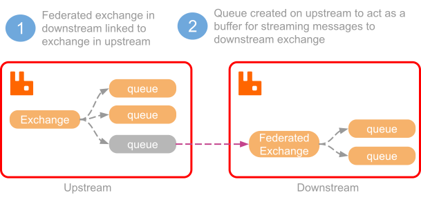
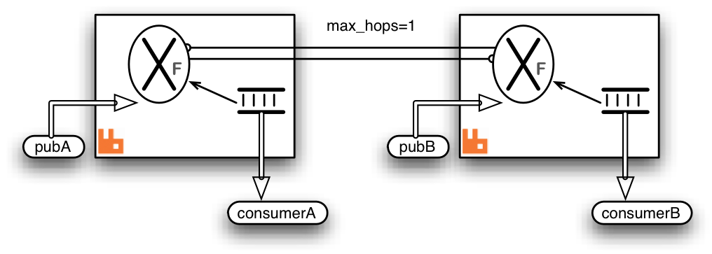
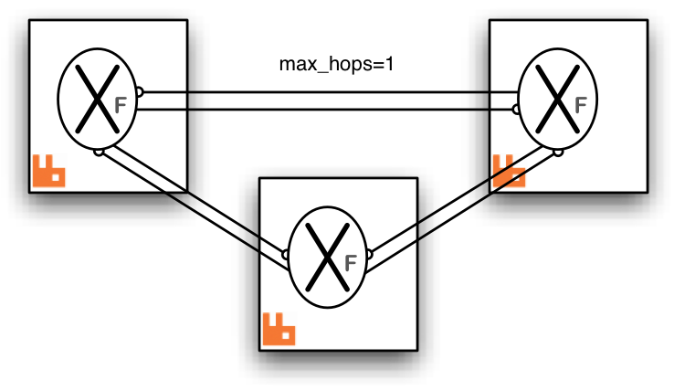
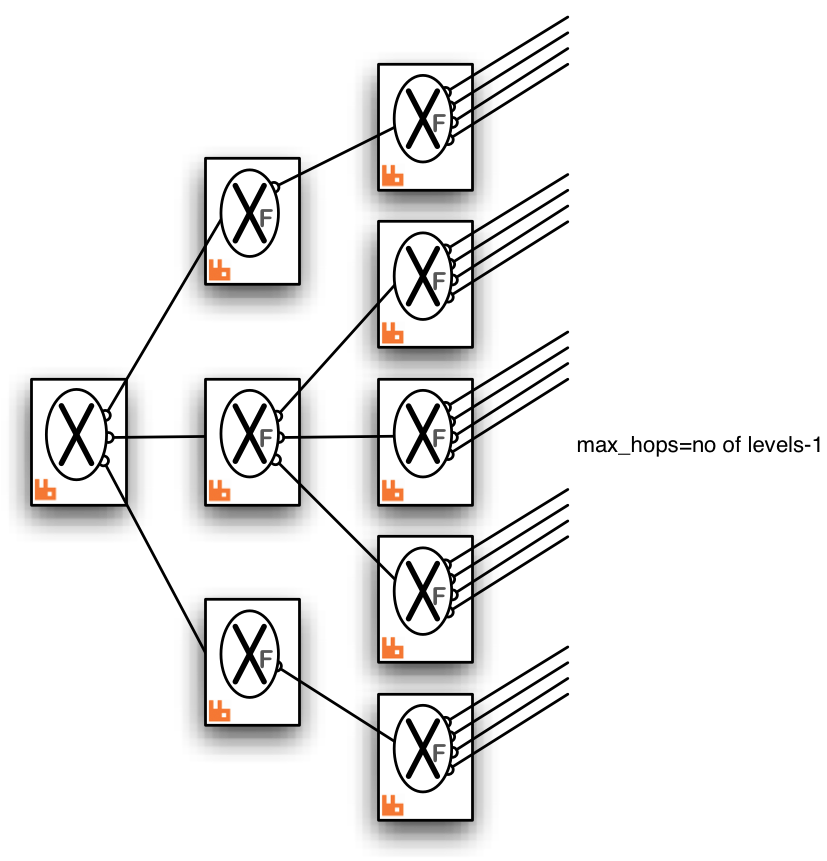

# Federated Exchanges

https://www.rabbitmq.com/federated-exchanges.html

## Overview

This guide covers federated exchanges, a subset of functionality offered by the [Federation plugin](https://www.rabbitmq.com/federation.html).  本指南涵盖联合交易所，联合插件提供的功能子集。

Some covered topics include:  一些涵盖的主题包括：

- An overview of exchange federation  概述

- Common use cases  常见用例

- Usage and configuration  使用和配置

- Limitations of exchange federation  限制

- Example topologies  示例拓扑

- Implementation details  实施细节

A separate [Federation plugin reference](https://www.rabbitmq.com/federation-reference.html) guide is available.  提供了单独的联合插件参考指南。

Exchange federation is a mechanism that allows a flow of messages through an exchange in one location (**called the upstream or the source**) be replicated to exchanges in other locations (**downstreams**). The downstreams are independent nodes or clusters that can span wide area networks (geo regions). The replication process is asynchronous and tolerates connectivity failures.  交换联合是一种机制，它允许通过一个位置（称为上游或源）的交换将消息流复制到其他位置（下游）的交换。下游是可以跨越广域网（地理区域）的独立节点或集群。复制过程是异步的，可以容忍连接故障。

A federated exchange links to other exchanges. Conceptually, messages published to the upstream exchanges are copied to the federated exchange, as though they were published directly to the federated exchange. The upstream exchanges do not need to be reconfigured. They are assumed to be located on a separate node or in a separate cluster.  联合交易所链接到其他交易所。从概念上讲，发布到上游交换的消息被复制到联合交换，就好像它们直接发布到联合交换一样。上游交换不需要重新配置。假定它们位于单独的节点或单独的集群中。

An upstream definition is a URI with certain recognised query parameters that control link connection parameters. Upstreams can be managed using [CLI tools](https://www.rabbitmq.com/cli.html) or the HTTP API with [an additional plugin](https://github.com/rabbitmq/rabbitmq-federation-management).  上游定义是具有某些可识别查询参数的 URI，这些参数控制链路连接参数。可以使用 CLI 工具或带有附加插件的 HTTP API 来管理上游。

Here is a diagram showing a single upstream exchange (the source exchange) in one node linking to a set of two downstream exchanges in two other nodes:  下图显示了一个节点中的单个上游交换（源交换）链接到其他两个节点中的一组两个下游交换：



When exchange federation is used, usually only a subset of exchanges in a cluster is federated. Some exchanges can be inherently local to the "site" (cluster) and its uses.  当使用交换联合时，通常只有集群中的一个交换子集是联合的。某些交换可以在“站点”（集群）及其用途中固有地本地化。

Exchange federation will propagate [bindings](https://www.rabbitmq.com/tutorials/amqp-concepts.html) from the downstream to the upstreams when possible. It will also apply optimizations and propagate messages selectively if needed. This is covered in future sections.  Exchange federation 将尽可能将绑定从下游传播到上游。如果需要，它还将应用优化并有选择地传播消息。这将在以后的部分中介绍。

## Use Cases  用例

Federated exchanges can be used to replicate a flow of certain message types to remote locations. Combined with continuous [schema synchronisation](https://www.rabbitmq.com/backup.html#definitions-backup) and [queue and message TTL](https://www.rabbitmq.com/ttl.html), this can be used to maintain a hot standby with reasonably up-to-date data within a controlled time window.  联合交换可用于将某些消息类型的流复制到远程位置。结合持续的模式同步以及队列和消息 TTL，这可用于在受控时间窗口内维护具有合理最新数据的热备用。

Another use would be to implement massive fanout with a single "source" exchange in one cluster (which acts as the source and need not be federated) can be declared as upstream by many other federated exchanges in other brokers. In turn, each of these can be upstream for many more exchanges, and so on.  另一种用途是在一个集群中使用单个“源”交换实现大规模扇出（充当源，不需要联合），其他代理中的许多其他联合交换可以将其声明为上游。反过来，这些中的每一个都可以在上游进行更多的交换，依此类推。

See the example diagrams below for some possible arrangements.  有关一些可能的安排，请参见下面的示例图。

## Limitations  限制

Exchange federation supports all built-in exchange types. 3rd party exchange types might work depending on their semantics.  Exchange federation 支持所有内置的交换类型。 3rd 方交换类型可能会根据其语义起作用。

The default exchange (with the blank name) cannot be federated as it is not a typical exchange and relies on node-local optimizations other exchange types do not use.  默认交换（具有空白名称）不能联合，因为它不是典型的交换，并且依赖于其他交换类型不使用的节点本地优化。

Exchanges with the internal property set to true are declared and internally used by RabbitMQ and cannot be federated.  内部属性设置为 true 的交换由 RabbitMQ 声明和内部使用，不能联合。

## Usage and Configuration  使用和配置

Federation configuration uses [runtime parameters and policies](https://www.rabbitmq.com/parameters.html), which means it can be configured and reconfigured on the fly as system topology changes. There are two key pieces of configuration involved:  联合配置使用运行时参数和策略，这意味着它可以随着系统拓扑的变化而动态配置和重新配置。涉及到两个关键的配置部分：

- Upstreams: these are remote endpoints in a federated system  这些是联合系统中的远程端点

- Federation policies: these control what exchanges are federated and what upstreams (sources) they will connect to  这些政策控制了哪些交易所是联合的，以及它们将连接到哪些上游（来源）

Both of those are configured on the upstream nodes or clusters.  两者都在上游节点或集群上配置。

To add an upstream, use the rabbitmqctl set_parameter command. It accepts three parameters:  要添加上游，请使用 rabbitmqctl set_parameter 命令。它接受三个参数：

- Parameter type, federation-upstream

- An upstream name that federation policies will refer to

- An upstream definition JSON document with at least one mandatory key, uri

The following example configures an upstream named "source" which can be contacted at remote-host.local:5672:  以下示例配置了一个名为“source”的上游，可以通过 remote-host.local:5672 联系它：

```bash
# Adds a federation upstream named "origin"
rabbitmqctl set_parameter federation-upstream origin '{"uri":"amqp://localhost:5672"}'
```

On Windows, use rabbitmqctl.bat and suitable PowerShell quoting:  在 Windows 上，使用 rabbitmqctl.bat 和合适的 PowerShell 引用：

```powershell
# Adds a federation upstream named "origin"
rabbitmqctl.bat set_parameter federation-upstream origin "{""uri"":""amqp://localhost:5672""}"
```

More upstream definition parameters are covered in the [Federation Reference guide](https://www.rabbitmq.com/federation-reference.html).  更多上游定义参数包含在联合参考指南中。

Once an upstream has been specified, a policy that controls federation can be added. It is added just like any other [policy](https://www.rabbitmq.com/parameters.html#policies), using :  一旦指定了上游，就可以添加控制联合的策略。它像任何其他策略一样添加，使用：

```bash
# Adds a policy named "exchange-federation"
rabbitmqctl set_policy exchange-federation \
"^federated\." \
'{"federation-upstream-set":"all"}' \
--priority 10 \
--apply-to exchanges
```

Here's a Windows version of the above example:  这是上述示例的 Windows 版本：

```powershell
# Adds a policy named "exchange-federation"
rabbitmqctl.bat set_policy exchange-federation ^
"^federated\." ^
"{""federation-upstream-set"":""all""}" ^
--priority 10 ^
--apply-to exchanges
```

In the example above, the policy will match exchanges whose name begins with a federated. prefix in the default virtual host. Those exchanges will set up federation links for all declared upstreams. The name of the policy is exchange-federation. As with any policy, if multiple policies match an exchange, the one with the highest priority will be used. Multiple policy definitions will not be combined, even if their priorities are equal.  在上面的示例中，该策略将匹配名称以 federated 开头的交易所。默认虚拟主机中的前缀。这些交易所将为所有声明的上游建立联合链接。该政策的名称是交易所联盟。与任何策略一样，如果多个策略与交换匹配，则将使用具有最高优先级的策略。不会合并多个策略定义，即使它们的优先级相同。

Once configured, a federation link (connection) will be opened for every matching exchange and upstream pair. By "matching exchange" here we mean an exchange that is matched by the [federation policy pattern](https://www.rabbitmq.com/parameters.html#policies). If no exchanges matched, no links will be started.  配置完成后，将为每个匹配的交换和上游对打开一个联合链接（连接）。这里的“匹配交换”是指由联合策略模式匹配的交换。如果没有匹配的交换，则不会启动任何链接。

To disable federation for the matching exchanges, delete the policy using its name:  要禁用匹配交换的联合，请使用其名称删除策略：

```bash
rabbitmqctl clear_policy exchange-federation
```

## Complex Topologies and Loop Handling  复杂拓扑和环路处理

A federated exchange can be "upstream" from another federated exchange. One can even form "loops", for example, exchange A declares exchange B to be upstream from it, and exchange B declares exchange A to be upstream from it. More complex multiply-connected arrangements are allowed.  一个联合交易所可以是另一个联合交易所的“上游”。甚至可以形成“循环”，例如，交易所 A 声明交易所 B 为其上游，交易所 B 声明交易所 A 为其上游。允许更复杂的多重连接排列。

Such complex topologies will be increasingly difficult to reason about and troubleshoot, however.  然而，这种复杂的拓扑结构将越来越难以推理和排除故障。

To prevent messages being continually copied and re-routed (in a never-ending cycle) there is a limit placed on the number of times a message can be copied over a link ([max-hops](https://www.rabbitmq.com/federated-exchanges.html#upstream-sets) below).  为了防止消息被不断复制和重新路由（在一个永无止境的循环中），一条消息可以通过链接复制的次数受到限制（下面的最大跳数）。

It is recommended that all the exchanges linked by federation are of the same type. Mixing types can and likely will lead to confusing routing behaviours.  建议联邦链接的所有交易所都是同一类型的。混合类型可能并且可能会导致混淆路由行为。

## Implementation  执行

Inter-broker communication is implemented using AMQP 0-9-1 (optionally [secured with TLS](https://www.rabbitmq.com/ssl.html)). Bindings are grouped together and binding operations such as queue.bind and queue.unbind commands are sent to the upstream side of the link when bindings change in the downstream.  使用 AMQP 0-9-1（可选地使用 TLS 保护）实现代理间通信。绑定被组合在一起，并且当下游的绑定发生变化时，queue.bind 和 queue.unbind 命令等绑定操作会发送到链路的上游端。

Therefore the exchange only receives messages for which it has bindings. The bindings are replicated with the upstream asynchronously so the effect of adding or removing a binding is only guaranteed to be seen eventually.  因此，交换只接收它有绑定的消息。绑定与上游异步复制，因此添加或删除绑定的效果只能保证最终看到。

The messages are buffered in an internally declared queue created in the upstream exchange's cluster. This is called the *upstream queue*. It is the upstream queue which is bound to the upstream exchange with the grouped bindings. It is possible to tailor some of the properties of this queue in the [upstream configuration](https://www.rabbitmq.com/federation-reference.html#upstreams).  消息缓冲在上游交换集群中创建的内部声明队列中。这称为上游队列。上游队列通过分组绑定绑定到上游交换。可以在上游配置中定制此队列的一些属性。

Here is a detailed diagram showing a single federated exchange linking to a single upstream exchange including the upstream queue and bindings created by the federation plugin shown in grey. The fat arrow on the upstream link indicates messages republished by the federated exchange. Some potential publisher clients are shown publishing to both exchanges.  这是一个详细的图表，显示了单个联合交换链接到单个上游交换，包括上游队列和由灰色显示的联合插件创建的绑定。上游链路上的粗箭头表示由联合交换重新发布的消息。显示一些潜在的发布者客户向两个交易所发布。


Publications to either exchange may be received by queues bound to the federated exchange, but publications directly to the federated exchange cannot be received by queues bound to the upstream exchange.  绑定到联合交换的队列可以接收到任一交换的发布，但是绑定到上游交换的队列不能接收直接到联合交换的发布。

## Example Topologies  示例拓扑

We illustrate some example federation topologies. Where RabbitMQ brokers are shown in these diagrams indicated by  我们说明了一些示例联合拓扑。 在这些图中显示 RabbitMQ 代理的位置由

(indicated by a )

it can be a cluster of nodes or a standalone node.  它可以是节点集群或独立节点。

* Pair of federated exchanges

Each exchange links to the other in this symmetric arrangement. A publisher and consumer connected to each broker are illustrated. Both consumers can receive messages published by either publisher.Both links are declared with `max-hops=1` so that messages are copied only once, otherwise the consumers will see multiple copies of the same message (up to the `max-hops` limit).

在这种对称布置中，每个交换都链接到另一个。 图示了连接到每个代理的发布者和消费者。 两个消费者都可以接收任一发布者发布的消息。

两个链接都用 `max-hops=1` 声明，以便消息只复制一次，否则消费者将看到同一消息的多个副本（最多为 `max-hops` 限制）。

* Complete Graph

This arrangement is the analogue of the pair of federated exchanges but for three exchanges. Each exchange links to both the others.Again `max-hops=1` because the "hop distance" to any other exchange is exactly one. This will be the case in any complete graph of federated exchanges.

这种安排类似于一对联合交易所，但适用于三个交易所。 每个交换都链接到其他交换。！[三向联合](../../../images/federation-05.png)再次`max-hops=1`，因为“跳跃距离”到任何其他 交换正是其中之一。 在任何完整的联合交易所图表中都会出现这种情况。

* Fan-out

One source exchange (which it is _not_ necessary to federate) is linked to by a tree of exchanges, which can extend to any depth. In this case messages published to the source exchange can be received by any consumer connected to any broker in the tree.Because there are no loops it is not as crucial to get the `max-hops` value right, but it must be at least as large as the longest connecting path. For a tree this is the number of levels minus one.

一个源交换（它_不是_必须联合）由一棵交换树链接到，它可以扩展到任何深度。 在这种情况下，发布到源交换的消息可以被连接到树中任何代理的任何消费者接收。！[扇出]（../../../images/federation-06.png）因为有 没有循环 获得正确的“最大跳数”值并不重要，但它必须至少与最长的连接路径一样大。 对于一棵树，这是层数减一。

* Ring

In this ring of six brokers each federated exchange links to just one other in the ring. The `"max-hops"` property is set to 5 so that every exchange in the ring sees the message exactly once.This topology, though relatively cheap in queues and connections, is rather fragile compared to a completely connected graph. One broker (or connection) failure breaks the ring.

在这个由六个经纪人组成的环中，每个联合交易所都链接到环中的另一个。 `"max-hops"` 属性设置为 5，以便环中的每个交换器只看到一次消息。！[Ring](../../../images/federation-07.png)此拓扑 ，虽然在队列和连接方面相对便宜，但与完全连接的图相比相当脆弱。 一个代理（或连接）故障会破坏环。

## Getting Help and Providing Feedback

If you have questions about the contents of this guide or any other topic related to RabbitMQ, don't hesitate to ask them on the [RabbitMQ mailing list](https://groups.google.com/forum/#!forum/rabbitmq-users).

## Help Us Improve the Docs <3

If you'd like to contribute an improvement to the site, its source is [available on GitHub](https://github.com/rabbitmq/rabbitmq-website). Simply fork the repository and submit a pull request. Thank you!

