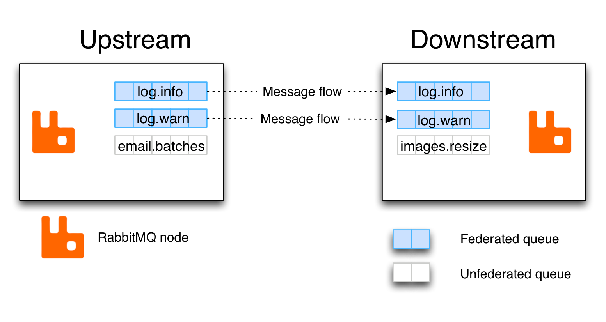
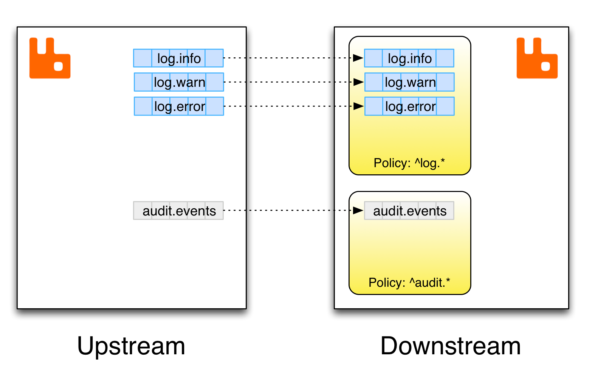

# Federated Queues

https://www.rabbitmq.com/federated-queues.html

## Overview

This guide covers federated queues, a subset of functionality offered by the [Federation plugin](https://www.rabbitmq.com/federation.html).  本指南涵盖联合队列，联合插件提供的功能子集。

Some covered topics include:  一些涵盖的主题包括：

- An overview of queue federation 队列联合概述

- Common [use cases](https://www.rabbitmq.com/federated-queues.html#use-cases)  常见用例

- [Usage and configuration](https://www.rabbitmq.com/federated-queues.html#usage)  使用和配置

- [Limitations](https://www.rabbitmq.com/federated-queues.html#limitations) and [pitfalls](https://www.rabbitmq.com/federated-queues.html#pitfalls) of queue federation  队列联合的限制和陷阱

- [Implementation details](https://www.rabbitmq.com/federated-queues.html#details)  实施细节

A separate [Federation plugin reference](https://www.rabbitmq.com/federation-reference.html) guide is available.  提供了单独的联合插件参考指南。

In addition to [federated exchanges](https://www.rabbitmq.com/federated-exchanges.html), RabbitMQ supports federated queues. This feature provides a way of balancing the load of a single logical queue across nodes or clusters. It does so by moving messages to other federation peers (nodes or clusters) when the local queue has no consumers.  除了联合交换之外，RabbitMQ 还支持联合队列。此功能提供了一种跨节点或集群平衡单个逻辑队列负载的方法。当本地队列没有消费者时，它通过将消息移动到其他联合对等点（节点或集群）来实现这一点。

While federated exchanges replicate their stream of messages from the upstream to one or more downstreams, federated queues move data where the consumers are, always preferring local consumers to remote ones. Federated queues are considered to be equal peers, there is no "leader/follower" relationship between them like with federated exchanges.  虽然联合交换将其消息流从上游复制到一个或多个下游，但联合队列将数据移动到消费者所在的位置，总是更喜欢本地消费者而不是远程消费者。联合队列被认为是平等的对等点，它们之间没有像联合交易所那样的“领导者/跟随者”关系。

A federated queue links to other of its federated peers (called *upstream* queues). It will retrieve messages from upstream queues in order to satisfy demand for messages from local consumers. The upstream queues do not need to be reconfigured. They are assumed to be located on a separate node or in a separate cluster.  一个联合队列链接到它的其他联合对等点（称为上游队列）。它将从上游队列中检索消息以满足本地消费者对消息的需求。上游队列不需要重新配置。假定它们位于单独的节点或单独的集群中。

An upstream definition is a URI with certain recognised query parameters that control link connection parameters. Upstreams can be managed using [CLI tools](https://www.rabbitmq.com/cli.html) or the HTTP API with [an additional plugin](https://github.com/rabbitmq/rabbitmq-federation-management).  上游定义是具有某些可识别查询参数的 URI，这些参数控制链路连接参数。可以使用 CLI 工具或带有附加插件的 HTTP API 来管理上游。

The following diagram demonstrates several federated and unfederated queues in two RabbitMQ nodes connected using queue federation:  下图演示了使用队列联合连接的两个 RabbitMQ 节点中的几个联合和非联合队列：



When queue federation is used, usually only a subset of queues in a cluster is federated. Some queues can be inherently local to the "site" (cluster) and its uses.  当使用队列联合时，通常只有集群中的一部分队列被联合。某些队列对于“站点”（集群）及其用途而言可能是固有的本地队列。

## Use Cases

The typical use would be to have the same "logical" queue distributed over many brokers. Each broker would declare a federated queue with all the other federated queues upstream. The links would form a complete bi-directional graph on the federated peers (nodes or clusters).  典型的用途是将相同的“逻辑”队列分布在许多代理上。每个代理将声明一个联合队列，其中包含上游的所有其他联合队列。这些链接将在联合对等点（节点或集群）上形成一个完整的双向图。

Such a logical distributed queue is capable of having rather higher capacity than a single queue. It will perform best when there is some degree of locality; i.e. as many messages as possible are consumed from the same queue as they were published to, and the federation mechanism only needs to move messages around in order to perform load balancing.  这种逻辑分布式队列能够具有比单个队列更高的容量。当有一定程度的局部性时，它会表现最好；即尽可能多的消息从发布到的同一队列中使用，并且联合机制只需要移动消息以执行负载平衡。

## Limitations

Federated queues include a number of limitations or differences compared to their non-federated peers as well as federated exchanges.  与非联合对等点以及联合交换相比，联合队列包含许多限制或差异。

Queue federation will not propagate [bindings](https://www.rabbitmq.com/tutorials/amqp-concepts.html) from the downstream to the upstreams.  队列联合不会将绑定从下游传播到上游。

Applications that use basic.get (consume via polling, a highly discouraged practice) cannot retrieve messages over federation if there aren't any in a local queue (on the node the client is connected to). Since basic.get is a synchronous method, the node serving a request would have to block while contacting all the other nodes to retrieve more messages. This wouldn't sit well with federation's availability and partition tolerance-oriented design and use cases.  如果本地队列（在客户端连接到的节点上）中没有任何消息，则使用 basic.get（通过轮询消费，一种非常不鼓励的做法）的应用程序无法通过联合检索消息。由于 basic.get 是一种同步方法，服务请求的节点在联系所有其他节点以检索更多消息时必须阻塞。这不适合联邦的可用性和面向分区容错的设计和用例。

Brokers running different versions of RabbitMQ can be connected using federation. However, since queue federation requires consumer priorities, it is not possible to federate a queue with a broker running a RabbitMQ version prior to 3.2.0.  运行不同版本 RabbitMQ 的代理可以使用联合连接。但是，由于队列联合需要消费者优先级，因此无法将队列与运行 RabbitMQ 3.2.0 之前版本的代理联合。

## Usage and Configuration

Federated queues are declared just like any other queue, by applications. In order for RabbitMQ to recognize that a queue needs to be federated, and what other nodes messages should be consumed from, *downstream* (consuming) nodes need to be configured.  联合队列与任何其他队列一样由应用程序声明。 为了让 RabbitMQ 识别需要联合队列，以及应该从哪些其他节点消费消息，需要配置下游（消费）节点。



Federation configuration uses [runtime parameters and policies](https://www.rabbitmq.com/parameters.html), which means it can be configured and reconfigured on the fly as system topology changes. There are two key pieces of configuration involved:

- Upstreams: these are remote endpoints in a federated system
- Federation policies: these control what queues are federated and what upstreams (peers) they will connect to

Both of those are configured on the upstream nodes or clusters.

To add an upstream, use the rabbitmqctl set_parameter command. It accepts three parameters:

- Parameter type, federation-upstream
- An upstream name that federation policies will refer to
- An upstream definition JSON document with at least one mandatory key, uri

The following example configures an upstream named "source" which can be contacted at remote-host.local:5672:

```bash
# Adds a federation upstream named "origin"
rabbitmqctl set_parameter federation-upstream origin '{"uri":"amqp://localhost:5673"}'
```

On Windows, use rabbitmqctl.bat and suitable PowerShell quoting:

```powershell
# Adds a federation upstream named "origin"
rabbitmqctl.bat set_parameter federation-upstream origin "{""uri"":""amqp://localhost:5673""}"
```

Once an upstream has been specified, a policy that controls federation can be added. It is added just like any other [policy](https://www.rabbitmq.com/parameters.html#policies), using rabbitmqctl set_policy:

```bash
# Adds a policy named "queue-federation"
rabbitmqctl set_policy queue-federation \
    "^federated\." \
    '{"federation-upstream-set":"all"}' \
    --priority 10 \
    --apply-to queues
```

Here's a Windows version of the above example:

```powershell
# Adds a policy named "queue-federation"
rabbitmqctl.bat set_policy queue-federation ^
    "^federated\." ^
    "{""federation-upstream-set"":""all""}" ^
    --priority 10 ^
    --apply-to queues
```

In the example above, the policy will match queues whose name begins with a federated. prefix in the default virtual host. Those queues will set up federation links for all declared upstreams. The name of the policy is queue-federation. As with any policy, if multiple policies match a queue, the one with the highest priority will be used. Multiple policy definitions will not be combined, even if their priorities are equal.

Once configured, a federation link (connection) will be opened for every matching queue and upstream pair. By "matching queue" here we mean a queue that is matched by the [federation policy pattern](https://www.rabbitmq.com/parameters.html#policies). If no queues matched, no links will be started.

To disable federation for the matching queues, delete the policy using its name:

```bash
rabbitmqctl clear_policy queue-federation
```

## [Complex Topologies and Loop Handling](https://www.rabbitmq.com/federated-queues.html#loops)

A federated queue can be "upstream" from another federated queue. One can even form "loops", for example, queue A declares queue B to be upstream from it, and queue B declares queue A to be upstream from it. More complex multiple-connected arrangements are allowed. Such complex topologies will be increasingly difficult to reason about and troubleshoot, however.

Unlike federated exchanges, queue federation does not replicate data and does not handle loops explicitly. There is no limit to how many times a message can be forwarded between federated queues.

In a set of mutually-federated queues, messages will move to where the spare consuming capacity is so if the spare consuming capacity keeps moving around then so will the messages. Since messages are moved to remote nodes only when there are no local consumers, it is rare for a message to be moved across all nodes and "wrap around".

## [Implementation](https://www.rabbitmq.com/federated-queues.html#details)

The federated queue will connect to all its upstream queues using AMQP 0-9-1 (optionally [secured with TLS](https://www.rabbitmq.com/ssl.html)).

The federated queue will only retrieve messages when it has run out of messages locally, it has consumers that need messages, and the upstream queue has "spare" messages that are not being consumed. The intent is to ensure that messages are only transferred between federated queues when needed. This is implemented using [consumer priorities](https://www.rabbitmq.com/consumer-priority.html).

If messages are forwarded from one queue to another then message ordering is only preserved for messages which have made exactly the same journey between nodes. In some cases messages which were adjacent when published may take different routes to the same node to be consumed; therefore messages can be reordered in the presence of queue federation.

Each individual queue applies its arguments separately; for example if you set x-max-length on a federated queue then that queue will have its length limited (possibly discarding messages when it gets full) but other queues that are federated with it will not be affected. Note in particular that when [per-queue or per-message TTL](https://www.rabbitmq.com/ttl.html) is in use, a message will have its timer reset when it is transferred to another queue.

## [Pitfalls](https://www.rabbitmq.com/federated-queues.html#pitfalls)

Federated queues cannot currently cause messages to traverse multiple hops between brokers based solely on need for messages in one place. For example, if you federate queues on nodes A, B and C, with A and B connected and B and C connected, but not A and C, then if messages are available at A and consumers waiting at C then messages will not be transferred from A to C via B unless there is also a consumer at B.

It is possible to bind a federated queue to a federated exchange. However, the results may be unexpected to some. Since a federated exchange will retrieve messages from its upstream that match its bindings, any message published to a federated exchange will be copied to any nodes that matching bindings. A federated queue will then move these messages around between nodes, and it is therefore possible to end up with multiple copies of the same message on the same node.

## Getting Help and Providing Feedback

If you have questions about the contents of this guide or any other topic related to RabbitMQ, don't hesitate to ask them on the [RabbitMQ mailing list](https://groups.google.com/forum/#!forum/rabbitmq-users).

## Help Us Improve the Docs <3

If you'd like to contribute an improvement to the site, its source is [available on GitHub](https://github.com/rabbitmq/rabbitmq-website). Simply fork the repository and submit a pull request. Thank you!


