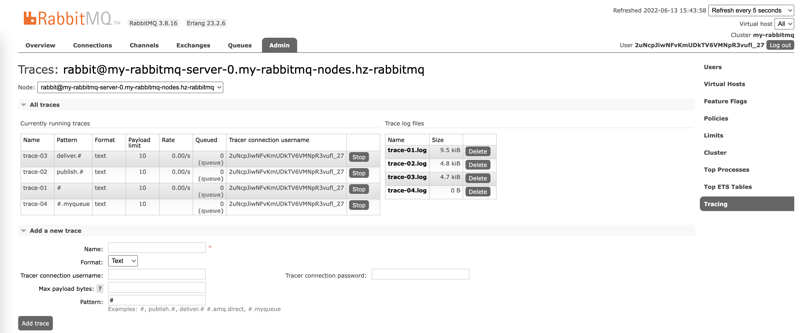

# RabbitMQ 消息追踪 rabbitmq_tracing

`rabbitmq_tracing` 插件相当于 `Firehose` 的 `GUI` 版本，它同样能跟踪 `RabbitMQ` 中消息的流入流出情况。rabbitmq_tracing 插件同样会对流入流出的消息做封装，然后将封装后的消息日志存入相应的 trace 文件之中。

可以使用 `rabbitmq-plugins enable rabbitmq_tracing` 命令来启动 rabbitmq_tracing 插件。



## 参数说明

1. Name
2. Format: [Text | JSON]
3. Tracer connection username
4. Tracer connection password
5. Max payload bytes
Maximum size of payload to log, in bytes. Payloads larger than this limit will be truncated. Leave blank to prevent truncation. Set to 0 to prevent logging of payload altogether.  要记录的有效负载的最大大小，以字节为单位。 大于此限制的有效负载将被截断。 留空以防止截断。 设置为 0 以完全防止记录有效负载。
6. Pattern
   * \#  匹配所有消息流入流出的情况，即当有客户端生产消息或者消费消息的时候，会把相应的消息日志都记录下来
   * publish.#  匹配所有消息流入的情况，也就是匹配发送至所有交换器的消息
   * deliver.#  匹配所有消息流出的情况，也就是匹配消费所有队列的消息
   * #.amq.direct
   * #.myqueue
   * publish.{exchangename}
   * deliver.{queuename}


```bash
$ kubectl -n hz-rabbitmq exec -ti my-rabbitmq-server-0 -- cat /var/tmp/rabbitmq-tracing/trace-01.log
Defaulted container "rabbitmq" out of: rabbitmq, setup-container (init)

================================================================================
2022-06-13 7:29:40:773: Message published

Node:         rabbit@my-rabbitmq-server-0.my-rabbitmq-nodes.hz-rabbitmq
Connection:   <rabbit@my-rabbitmq-server-0.my-rabbitmq-nodes.hz-rabbitmq.1655102041.5204.0>
Virtual host: /
User:         2uNcpJiwNFvKmUDkTV6VMNpR3vufl_27
Channel:      1
Exchange:     exchange1
Routing keys: [<<"key11">>]
Routed queues: [<<"queue1">>]
Properties:   [{<<"delivery_mode">>,signedint,2},{<<"headers">>,table,[]}]
Payload:
hello11

================================================================================
2022-06-13 7:29:48:530: Message published

Node:         rabbit@my-rabbitmq-server-0.my-rabbitmq-nodes.hz-rabbitmq
Connection:   <rabbit@my-rabbitmq-server-0.my-rabbitmq-nodes.hz-rabbitmq.1655102041.5230.0>
Virtual host: /
User:         2uNcpJiwNFvKmUDkTV6VMNpR3vufl_27
Channel:      1
Exchange:     exchange1
Routing keys: [<<"key12">>]
Routed queues: [<<"queue2">>]
Properties:   [{<<"delivery_mode">>,signedint,2},{<<"headers">>,table,[]}]
Payload:
hello12

================================================================================
2022-06-13 7:29:54:779: Message published

Node:         rabbit@my-rabbitmq-server-0.my-rabbitmq-nodes.hz-rabbitmq
Connection:   <rabbit@my-rabbitmq-server-0.my-rabbitmq-nodes.hz-rabbitmq.1655102041.5256.0>
Virtual host: /
User:         2uNcpJiwNFvKmUDkTV6VMNpR3vufl_27
Channel:      1
Exchange:     exchange1
Routing keys: [<<"key13">>]
Routed queues: [<<"queue3">>]
Properties:   [{<<"delivery_mode">>,signedint,2},{<<"headers">>,table,[]}]
Payload:
hello13

================================================================================
2022-06-13 7:30:08:526: Message published

Node:         rabbit@my-rabbitmq-server-0.my-rabbitmq-nodes.hz-rabbitmq
Connection:   <rabbit@my-rabbitmq-server-0.my-rabbitmq-nodes.hz-rabbitmq.1655102041.5300.0>
Virtual host: /
User:         2uNcpJiwNFvKmUDkTV6VMNpR3vufl_27
Channel:      1
Exchange:     exchange2
Routing keys: [<<"key21">>]
Routed queues: [<<"queue1">>]
Properties:   [{<<"delivery_mode">>,signedint,2},{<<"headers">>,table,[]}]
Payload:
hello21

================================================================================
2022-06-13 7:30:16:885: Message published

Node:         rabbit@my-rabbitmq-server-0.my-rabbitmq-nodes.hz-rabbitmq
Connection:   <rabbit@my-rabbitmq-server-0.my-rabbitmq-nodes.hz-rabbitmq.1655102041.5341.0>
Virtual host: /
User:         2uNcpJiwNFvKmUDkTV6VMNpR3vufl_27
Channel:      1
Exchange:     exchange2
Routing keys: [<<"key22">>]
Routed queues: [<<"queue2">>]
Properties:   [{<<"delivery_mode">>,signedint,2},{<<"headers">>,table,[]}]
Payload:
hello22

================================================================================
2022-06-13 7:30:23:116: Message published

Node:         rabbit@my-rabbitmq-server-0.my-rabbitmq-nodes.hz-rabbitmq
Connection:   <rabbit@my-rabbitmq-server-0.my-rabbitmq-nodes.hz-rabbitmq.1655102041.5367.0>
Virtual host: /
User:         2uNcpJiwNFvKmUDkTV6VMNpR3vufl_27
Channel:      1
Exchange:     exchange2
Routing keys: [<<"key23">>]
Routed queues: [<<"queue3">>]
Properties:   [{<<"delivery_mode">>,signedint,2},{<<"headers">>,table,[]}]
Payload:
hello23

================================================================================
2022-06-13 7:30:43:858: Message published

Node:         rabbit@my-rabbitmq-server-0.my-rabbitmq-nodes.hz-rabbitmq
Connection:   <rabbit@my-rabbitmq-server-0.my-rabbitmq-nodes.hz-rabbitmq.1655102041.5414.0>
Virtual host: /
User:         2uNcpJiwNFvKmUDkTV6VMNpR3vufl_27
Channel:      1
Exchange:     exchange3
Routing keys: [<<"key31">>]
Routed queues: [<<"queue1">>]
Properties:   [{<<"delivery_mode">>,signedint,2},{<<"headers">>,table,[]}]
Payload:
hello31

================================================================================
2022-06-13 7:30:50:130: Message published

Node:         rabbit@my-rabbitmq-server-0.my-rabbitmq-nodes.hz-rabbitmq
Connection:   <rabbit@my-rabbitmq-server-0.my-rabbitmq-nodes.hz-rabbitmq.1655102041.5439.0>
Virtual host: /
User:         2uNcpJiwNFvKmUDkTV6VMNpR3vufl_27
Channel:      1
Exchange:     exchange3
Routing keys: [<<"key32">>]
Routed queues: [<<"queue2">>]
Properties:   [{<<"delivery_mode">>,signedint,2},{<<"headers">>,table,[]}]
Payload:
hello32

================================================================================
2022-06-13 7:30:56:495: Message published

Node:         rabbit@my-rabbitmq-server-0.my-rabbitmq-nodes.hz-rabbitmq
Connection:   <rabbit@my-rabbitmq-server-0.my-rabbitmq-nodes.hz-rabbitmq.1655102041.5473.0>
Virtual host: /
User:         2uNcpJiwNFvKmUDkTV6VMNpR3vufl_27
Channel:      1
Exchange:     exchange3
Routing keys: [<<"key33">>]
Routed queues: [<<"queue3">>]
Properties:   [{<<"delivery_mode">>,signedint,2},{<<"headers">>,table,[]}]
Payload:
hello33

================================================================================
2022-06-13 7:31:29:378: Message received

Node:         rabbit@my-rabbitmq-server-0.my-rabbitmq-nodes.hz-rabbitmq
Connection:   <rabbit@my-rabbitmq-server-0.my-rabbitmq-nodes.hz-rabbitmq.1655102041.5545.0>
Virtual host: /
User:         2uNcpJiwNFvKmUDkTV6VMNpR3vufl_27
Channel:      1
Exchange:     exchange1
Routing keys: [<<"key11">>]
Queue:        queue1
Properties:   [{<<"delivery_mode">>,signedint,2},{<<"headers">>,table,[]}]
Payload:
hello11

================================================================================
2022-06-13 7:31:29:379: Message received

Node:         rabbit@my-rabbitmq-server-0.my-rabbitmq-nodes.hz-rabbitmq
Connection:   <rabbit@my-rabbitmq-server-0.my-rabbitmq-nodes.hz-rabbitmq.1655102041.5545.0>
Virtual host: /
User:         2uNcpJiwNFvKmUDkTV6VMNpR3vufl_27
Channel:      1
Exchange:     exchange2
Routing keys: [<<"key21">>]
Queue:        queue1
Properties:   [{<<"delivery_mode">>,signedint,2},{<<"headers">>,table,[]}]
Payload:
hello21

================================================================================
2022-06-13 7:31:29:381: Message received

Node:         rabbit@my-rabbitmq-server-0.my-rabbitmq-nodes.hz-rabbitmq
Connection:   <rabbit@my-rabbitmq-server-0.my-rabbitmq-nodes.hz-rabbitmq.1655102041.5545.0>
Virtual host: /
User:         2uNcpJiwNFvKmUDkTV6VMNpR3vufl_27
Channel:      1
Exchange:     exchange3
Routing keys: [<<"key31">>]
Queue:        queue1
Properties:   [{<<"delivery_mode">>,signedint,2},{<<"headers">>,table,[]}]
Payload:
hello31

================================================================================
2022-06-13 7:31:40:987: Message received

Node:         rabbit@my-rabbitmq-server-0.my-rabbitmq-nodes.hz-rabbitmq
Connection:   <rabbit@my-rabbitmq-server-0.my-rabbitmq-nodes.hz-rabbitmq.1655102041.5585.0>
Virtual host: /
User:         2uNcpJiwNFvKmUDkTV6VMNpR3vufl_27
Channel:      1
Exchange:     exchange1
Routing keys: [<<"key12">>]
Queue:        queue2
Properties:   [{<<"delivery_mode">>,signedint,2},{<<"headers">>,table,[]}]
Payload:
hello12

================================================================================
2022-06-13 7:31:40:988: Message received

Node:         rabbit@my-rabbitmq-server-0.my-rabbitmq-nodes.hz-rabbitmq
Connection:   <rabbit@my-rabbitmq-server-0.my-rabbitmq-nodes.hz-rabbitmq.1655102041.5585.0>
Virtual host: /
User:         2uNcpJiwNFvKmUDkTV6VMNpR3vufl_27
Channel:      1
Exchange:     exchange2
Routing keys: [<<"key22">>]
Queue:        queue2
Properties:   [{<<"delivery_mode">>,signedint,2},{<<"headers">>,table,[]}]
Payload:
hello22

================================================================================
2022-06-13 7:31:40:990: Message received

Node:         rabbit@my-rabbitmq-server-0.my-rabbitmq-nodes.hz-rabbitmq
Connection:   <rabbit@my-rabbitmq-server-0.my-rabbitmq-nodes.hz-rabbitmq.1655102041.5585.0>
Virtual host: /
User:         2uNcpJiwNFvKmUDkTV6VMNpR3vufl_27
Channel:      1
Exchange:     exchange3
Routing keys: [<<"key32">>]
Queue:        queue2
Properties:   [{<<"delivery_mode">>,signedint,2},{<<"headers">>,table,[]}]
Payload:
hello32

================================================================================
2022-06-13 7:31:58:164: Message received

Node:         rabbit@my-rabbitmq-server-0.my-rabbitmq-nodes.hz-rabbitmq
Connection:   <rabbit@my-rabbitmq-server-0.my-rabbitmq-nodes.hz-rabbitmq.1655102041.5631.0>
Virtual host: /
User:         2uNcpJiwNFvKmUDkTV6VMNpR3vufl_27
Channel:      1
Exchange:     exchange1
Routing keys: [<<"key13">>]
Queue:        queue3
Properties:   [{<<"delivery_mode">>,signedint,2},{<<"headers">>,table,[]}]
Payload:
hello13

================================================================================
2022-06-13 7:31:58:165: Message received

Node:         rabbit@my-rabbitmq-server-0.my-rabbitmq-nodes.hz-rabbitmq
Connection:   <rabbit@my-rabbitmq-server-0.my-rabbitmq-nodes.hz-rabbitmq.1655102041.5631.0>
Virtual host: /
User:         2uNcpJiwNFvKmUDkTV6VMNpR3vufl_27
Channel:      1
Exchange:     exchange2
Routing keys: [<<"key23">>]
Queue:        queue3
Properties:   [{<<"delivery_mode">>,signedint,2},{<<"headers">>,table,[]}]
Payload:
hello23

================================================================================
2022-06-13 7:31:58:165: Message received

Node:         rabbit@my-rabbitmq-server-0.my-rabbitmq-nodes.hz-rabbitmq
Connection:   <rabbit@my-rabbitmq-server-0.my-rabbitmq-nodes.hz-rabbitmq.1655102041.5631.0>
Virtual host: /
User:         2uNcpJiwNFvKmUDkTV6VMNpR3vufl_27
Channel:      1
Exchange:     exchange3
Routing keys: [<<"key33">>]
Queue:        queue3
Properties:   [{<<"delivery_mode">>,signedint,2},{<<"headers">>,table,[]}]
Payload:
hello33
[root@x86-master ~]#


```


```yaml
kind: RabbitmqCluster
apiVersion: rabbitmq.com/v1beta1
metadata:
  name: my-rabbitmq
  namespace: hz-rabbitmq
spec:
  affinity:
    podAntiAffinity:
      requiredDuringSchedulingIgnoredDuringExecution:
        - labelSelector:
            matchLabels:
              app.kubernetes.io/name: my-rabbitmq
          topologyKey: kubernetes.io/hostname
  image: rabbitmq:3.8.16-management
  override:
    statefulSet:
      spec:
        template:
          spec:
            containers:
              - name: rabbitmq
                readinessProbe:
                  failureThreshold: 6
                  initialDelaySeconds: 20
                  periodSeconds: 20
                  successThreshold: 2
                  timeoutSeconds: 10
  persistence:
    storage: 3Gi
    storageClassName: sc-topolvm
  rabbitmq:
    additionalConfig: |-
      num_acceptors.tcp = 10
      handshake_timeout = 10000
      vm_memory_high_watermark.relative = 0.4
      vm_memory_calculation_strategy = allocated
      vm_memory_high_watermark_paging_ratio = 0.5
      disk_free_limit.absolute = 50MB
      log.console = true
      log.console.level = debug
      log.connection.level = debug
      log.channel.level = debug
      log.queue.level = debug
      log.mirroring.level = debug
      log.federation.level = debug
      log.upgrade.level = debug
      log.default.level = debug
      channel_max = 2047
      max_message_size = 134217728
      heartbeat = 60
      default_vhost = /
      collect_statistics = none
      collect_statistics_interval = 5000
      delegate_count = 16
      cluster_keepalive_interval = 10000
      queue_index_embed_msgs_below = 4096
      mnesia_table_loading_retry_timeout = 30000
      mnesia_table_loading_retry_limit = 10
      mirroring_sync_batch_size = 4096
    additionalPlugins:
      - rabbitmq_top
      - rabbitmq_shovel
      - rabbitmq_tracing
    # advancedConfig: |
    #   [
    #       {rabbitmq_tracing, [
    #           {username, "tracing_admin"},
    #           {password, "tracing_password"}
    #       ]}
    #   ].
  replicas: 3
  resources:
    limits:
      cpu: '1'
      memory: 2Gi
    requests:
      cpu: '1'
      memory: 2Gi
  service:
    type: NodePort
  terminationGracePeriodSeconds: 604800
  tls: {}

```


