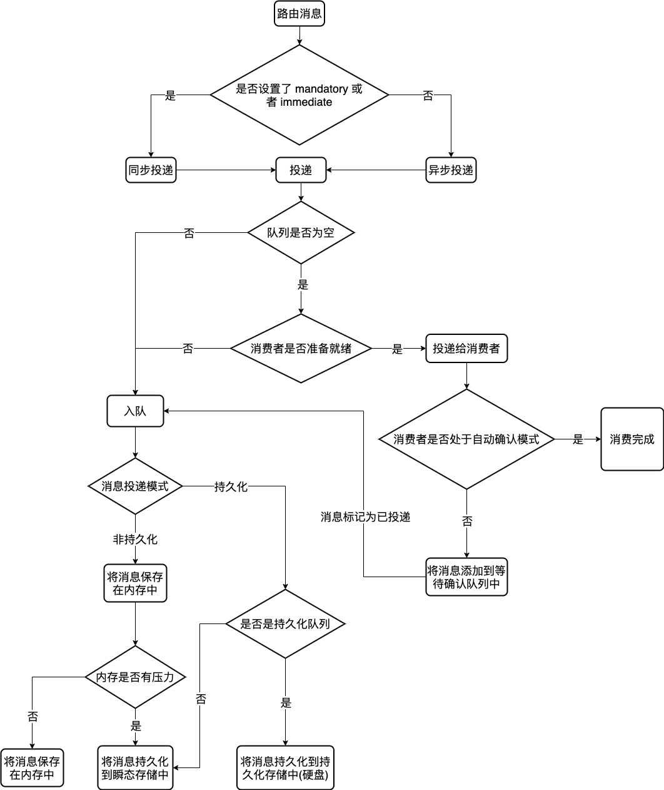

# Persistence Configuration

https://www.rabbitmq.com/persistence-conf.html

## Overview

The RabbitMQ persistence layer is intended to provide reasonably good throughput in the majority of situations without configuration. However, some configuration is sometimes useful. This guide covers a few configurable values that affect throughput, latency and I/O characteristics of a node. Consider reading the entire guide and get accustomed to [benchmarking with PerfTest](https://rabbitmq.github.io/rabbitmq-perf-test/stable/htmlsingle/) before drawing any conclusions.  RabbitMQ 持久层旨在在大多数情况下提供相当好的吞吐量而无需配置。 但是，某些配置有时很有用。 本指南涵盖了一些影响节点吞吐量、延迟和 I/O 特性的可配置值。 在得出任何结论之前，请考虑阅读整个指南并习惯使用 PerfTest 进行基准测试。

Some related guides include:  一些相关指南包括：

- [Main configuration guide](https://www.rabbitmq.com/configure.html)  主要配置指南

- [File and Directory Locations](https://www.rabbitmq.com/relocate.html)  文件和目录位置

- [Runtime Tuning](https://www.rabbitmq.com/runtime.html)  运行时调优

- [Queues](https://www.rabbitmq.com/queues.html#runtime-characteristics) and their runtime characteristics  队列及其运行时特性

## How Persistence Works

First, some background: both persistent and transient messages can be written to disk. Persistent messages will be written to disk as soon as they reach the queue, while transient messages will be written to disk only so that they can be evicted from memory while under memory pressure. Persistent messages are also kept in memory when possible and only evicted from memory under memory pressure. The "persistence layer" refers to the mechanism used to store messages of both types to disk.  首先，一些背景知识：持久消息和瞬态消息都可以写入磁盘。持久消息一到达队列就会被写入磁盘，而瞬态消息只会被写入磁盘，以便在内存压力下可以将它们从内存中逐出。持久消息也尽可能保存在内存中，并且仅在内存压力下从内存中逐出。 “持久层”是指用于将两种类型的消息存储到磁盘的机制。

On this page we say "queue" to refer to an unmirrored queue or a queue leader or a queue mirror. Queue mirroring is a "layer above" persistence.  在此页面上，我们说“队列”是指未镜像的队列或队列领导者或队列镜像。队列镜像是“层上”的持久性。

The persistence layer has two components: the **queue index** and the **message store**. The queue index is responsible for maintaining knowledge about where a given message is in a queue, along with whether it has been delivered and acknowledged. There is therefore one queue index per queue.  持久层有两个组件：队列索引和消息存储。队列索引负责维护有关给定消息在队列中的位置以及它是否已被传递和确认的信息。因此每个队列有一个队列索引。

The message store is a key-value store for messages, shared among all queues in the server. Messages (the body, and any metadata fields: properties and/or headers) can either be stored directly in the queue index, or written to the message store. There are technically two message stores (one for transient and one for persistent messages) but they are usually considered together as "the message store".  消息存储是消息的键值存储，在服务器中的所有队列之间共享。消息（正文和任何元数据字段：属性和/或标头）可以直接存储在队列索引中，也可以写入消息存储。从技术上讲，有两种消息存储（一种用于临时消息，另一种用于持久消息），但它们通常一起被视为“消息存储”。

### Memory Costs  内存成本

Under memory pressure, the persistence layer tries to write as much out to disk as possible, and remove as much as possible from memory. There are some things however which must remain in memory:  在内存压力下，持久层尝试尽可能多地写入磁盘，并尽可能多地从内存中删除。 然而，有些事情必须留在记忆中：

- Each queue maintains some metadata for each *unacknowledged* message. The message itself can be removed from memory if its destination is the message store.  每个队列为每个未确认的消息维护一些元数据。 如果消息的目的地是消息存储，则消息本身可以从内存中删除。

- The message store needs an index. The default message store index uses a small amount of memory for every message in the store.  消息存储需要一个索引。 默认消息存储索引为存储中的每条消息使用少量内存。

### Message Embedding in Queue Indices  队列索引中的消息嵌入

There are advantages and disadvantages to writing messages to the queue index.  将消息写入队列索引有利有弊。

This feature has advantages and disadvantages. Main advantages are:  此功能有优点也有缺点。主要优点是：

- Messages can be written to disk in one operation rather than two; for tiny messages this can be a substantial gain.  消息可以通过一次操作而不是两次写入磁盘；对于微小的消息，这可能是一个巨大的收获。

- Messages that are written to the queue index do not require an entry in the message store index and thus do not have a memory cost when paged out.  写入队列索引的消息不需要消息存储索引中的条目，因此在分页时没有内存成本。

Disadvantages are:  缺点是：

- The queue index keeps blocks of a fixed number of records in memory; if non-tiny messages are written to the queue index then memory use can be substantial.  队列索引在内存中保存固定数量的记录块；如果将非微小消息写入队列索引，则内存使用量可能很大。

- If a message is routed to multiple queues by an exchange, the message will need to be written to multiple queue indices. If such a message is written to the message store, only one copy needs to be written.  如果消息通过交换路由到多个队列，则需要将消息写入多个队列索引。如果将这样的消息写入消息存储，则只需要写入一个副本。

- Unacknowledged messages whose destination is the queue index are always kept in memory.  目的地是队列索引的未确认消息始终保存在内存中。

The intent is for very small messages to be stored in the queue index as an optimisation, and for all other messages to be written to the message store. This is controlled by the configuration item **queue_index_embed_msgs_below**. By default, messages with a serialised size of less than 4096 bytes (including properties and headers) are stored in the queue index.  目的是将非常小的消息存储在队列索引中作为优化，并将所有其他消息写入消息存储。这由配置项 queue_index_embed_msgs_below 控制。默认情况下，序列化大小小于 4096 字节的消息（包括属性和标头）存储在队列索引中。

Each queue index needs to keep at least one segment file in memory when reading messages from disk. The segment file contains records for 16,384 messages. Therefore be cautious if increasing queue_index_embed_msgs_below; a small increase can lead to a large amount of memory used.  从磁盘读取消息时，每个队列索引需要在内存中至少保留一个段文件。段文件包含 16,384 条消息的记录。因此增加 queue_index_embed_msgs_below 时要小心；小幅增加会导致使用大量内存。

## OS and Runtime Limits Affecting  影响操作系统和运行时限制

It is possible for persistence to underperform because the persister is limited in the **number of file handles** or **async threads** it has to work with. In both cases this can happen when you have a large number of queues which need to access the disk simultaneously.  持久性可能会表现不佳，因为持久性在文件句柄或它必须使用的异步线程的数量方面受到限制。在这两种情况下，当您有大量需要同时访问磁盘的队列时，都会发生这种情况。

### Too Few File Handles  文件句柄太少

The RabbitMQ server is limited in the [number of file handles](https://www.rabbitmq.com/networking.html#open-file-handle-limit) it can open. Every running network connection requires one file handle, and the rest are available for queues to use. If there are more disk-accessing queues than file handles after network connections have been taken into account, then the disk-accessing queues will share the file handles among themselves; each gets to use a file handle for a while before it is taken back and given to another queue.  RabbitMQ 服务器可以打开的文件句柄数量是有限的。每个正在运行的网络连接都需要一个文件句柄，其余的可供队列使用。如果考虑到网络连接后磁盘访问队列多于文件句柄，则磁盘访问队列将在它们之间共享文件句柄；每个人都可以使用文件句柄一段时间，然后再将其收回并交给另一个队列。

This prevents the server from crashing due to there being too many disk-accessing queues, but it can become expensive. The management plugin can show I/O statistics for each node in the cluster; as well as showing **rates of reads, writes, seeks** and so on it will also show a **rate of file handle churn** — the rate at which file handles are recycled in this way. A busy server with too few file handles might be doing hundreds of reopens per second - in which case its performance is likely to increase notably if given more file handles.  这可以防止服务器由于磁盘访问队列过多而崩溃，但它可能会变得昂贵。管理插件可以显示集群中每个节点的 I/O 统计信息；除了显示读取、写入、查找等的速率外，它还将显示文件句柄流失率——文件句柄以这种方式被回收的速率。文件句柄太少的繁忙服务器每秒可能会重新打开数百次 - 在这种情况下，如果提供更多文件句柄，它的性能可能会显着提高。

### I/O Thread Pool Size

[The runtime](https://www.rabbitmq.com/runtime.html) uses a pool threads to handle long-running file I/O operations. These are shared among all virtual hosts and queues. Every active file I/O operation uses one async thread while it is occurring. Having too few async threads can therefore hurt performance.  运行时使用池线程来处理长时间运行的文件 I/O 操作。这些在所有虚拟主机和队列之间共享。每个活动的文件 I/O 操作在发生时都使用一个异步线程。因此，异步线程太少会损害性能。

Note that the situation with async threads is not exactly analogous to the situation with file handles. If a queue executes a number of I/O operations in sequence it will perform best if it holds onto a file handle for all the operations; otherwise we may flush and seek too much and use additional CPU orchestrating it. However, queues do not benefit from holding an async thread across a sequence of operations (in fact they cannot do so).  请注意，异步线程的情况与文件句柄的情况并不完全相似。如果一个队列按顺序执行多个 I/O 操作，如果它为所有操作保留一个文件句柄，它将执行得最好；否则我们可能会刷新和寻找太多，并使用额外的 CPU 来编排它。但是，队列不会从在一系列操作中保持异步线程中受益（实际上它们不能这样做）。

Therefore there should ideally be enough file handles for all the queues that are executing streams of I/O operations, and enough async threads for the number of simultaneous I/O operations your storage layer can plausibly execute.  因此，理想情况下，应该为所有正在执行 I/O 操作流的队列提供足够的文件句柄，并为存储层可以合理执行的同时 I/O 操作数量提供足够的异步线程。

It's less obvious when a lack of async threads is causing performance problems. (It's also less likely in general; check for other things first!) Typical symptoms of too few async threads include the **number of I/O operations per second** dropping to zero (as reported by the management plugin) for brief periods when the server should be busy with persistence, while the reported **time per I/O operation** increases.  当缺少异步线程导致性能问题时，它就不那么明显了。 （一般情况下也不太可能；首先检查其他事情！）异步线程太少的典型症状包括每秒 I/O 操作的数量下降到零（由管理插件报告）服务器应该在短时间内忙于持久性，而每个 I/O 操作报告的时间增加。

The number of async threads is configured by the +A [runtime flag](https://www.rabbitmq.com/runtime.html). It is likely to be a good idea to experiment with several different values before changing this.  异步线程的数量由 +A 运行时标志配置。在更改之前尝试几个不同的值可能是一个好主意。

## Alternate Message Store Index Implementations  备用消息存储索引实现

As mentioned above, each message which is written to the message store uses a small amount of memory for its index entry. The message store index is pluggable in RabbitMQ, and other implementations are available as plugins which can remove this limitation.  如上所述，写入消息存储的每条消息都为其索引条目使用少量内存。 消息存储索引在 RabbitMQ 中是可插入的，并且可以作为插件使用其他实现来消除此限制。

The reason they are not shipped with the RabbitMQ distribution is that they all use native code. Note that such plugins typically make the message store run more slowly.  它们没有随 RabbitMQ 发行版一起提供的原因是它们都使用本机代码。 请注意，此类插件通常会使消息存储运行得更慢。

## Getting Help and Providing Feedback

If you have questions about the contents of this guide or any other topic related to RabbitMQ, don't hesitate to ask them on the [RabbitMQ mailing list](https://groups.google.com/forum/#!forum/rabbitmq-users).

## Help Us Improve the Docs <3

If you'd like to contribute an improvement to the site, its source is [available on GitHub](https://github.com/rabbitmq/rabbitmq-website). Simply fork the repository and submit a pull request. Thank you!

