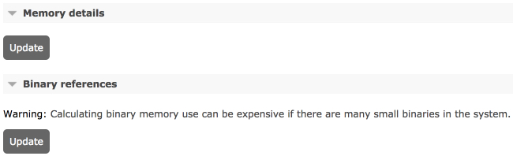
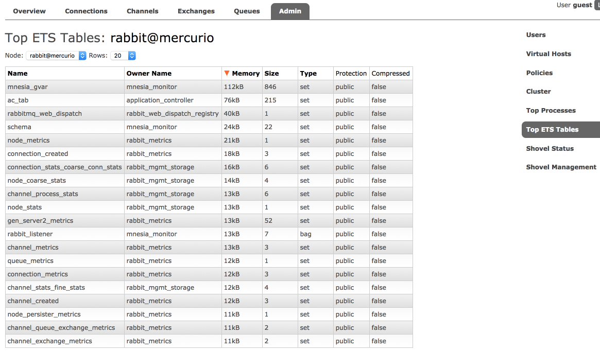
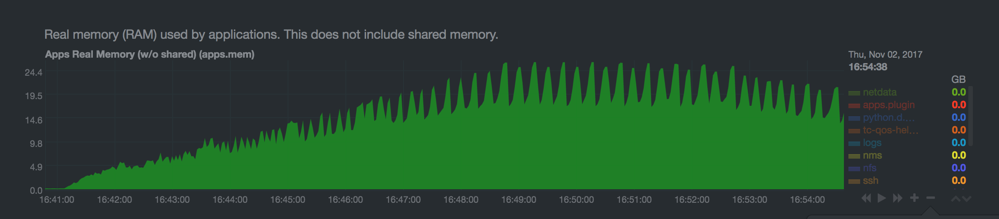

# Reasoning About Memory Use

https://www.rabbitmq.com/memory-use.html

## Overview

Operators need to be able to reason about node's memory use, both absolute and relative ("what uses most memory"). This is an important aspect of [system monitoring](https://www.rabbitmq.com/monitoring.html).  操作员需要能够推理节点的内存使用情况，包括绝对和相对（“什么使用最多的内存”）。 这是系统监控的一个重要方面。

RabbitMQ provides tools that report and help analyse node memory use:  RabbitMQ 提供了报告和帮助分析节点内存使用的工具：

- [rabbitmq-diagnostics memory_breakdown](https://www.rabbitmq.com/cli.html)  内存分解

- [rabbitmq-diagnostics status](https://www.rabbitmq.com/cli.html) includes the above breakdown as a section

- [Prometheus and Grafana](https://www.rabbitmq.com/prometheus.html)-based monitoring makes it possible to observe memory breakdown over time

- [Management UI](https://www.rabbitmq.com/management.html) provides the same breakdown on the node page as rabbitmq-diagnostics status

- [HTTP API](https://www.rabbitmq.com/management.html#http-api) provides the same information as the management UI, useful [for monitoring](https://www.rabbitmq.com/monitoring.html)

- [rabbitmq-top](https://github.com/rabbitmq/rabbitmq-top) and rabbitmq-diagnostics observer provide a more fine-grained [top](https://en.wikipedia.org/wiki/Top_(software))-like per Erlang process view

Obtaining a node memory breakdown should be the first step when reasoning about node memory use.  在推理节点内存使用情况时，获取节点内存故障应该是第一步。

Note that all measurements are somewhat approximate, based on values returned by the underlying runtime or the kernel at a specific point in time, usually within a 5 seconds time window.  请注意，所有测量值都有些近似，基于底层运行时或内核在特定时间点（通常在 5 秒时间窗口内）返回的值。

## Total Memory Use Calculation Strategies

RabbitMQ can use different strategies to compute how much memory a node uses. Historically, nodes obtained this information from the runtime, reporting how much memory is used (not just allocated). This strategy, known as legacy (alias for erlang) tends to underreport and is not recommended.  RabbitMQ 可以使用不同的策略来计算一个节点使用了多少内存。从历史上看，节点从运行时获取此信息，报告使用了多少内存（不仅仅是分配的）。这种被称为 legacy（erlang 的别名）的策略往往会漏报，因此不推荐使用。

Effective strategy is configured using the **vm_memory_calculation_strategy** key. There are two primary options:  使用 vm_memory_calculation_strategy 键配置有效策略。有两个主要选项：

- rss uses OS-specific means of querying the kernel to find RSS (Resident Set Size) value of the node OS process. This strategy is most precise and used by default on Linux, MacOS, BSD and Solaris systems. When this strategy is used, RabbitMQ runs short lived subprocesses once a second.  rss 使用特定于操作系统的方法来查询内核以查找节点操作系统进程的 RSS（驻留集大小）值。此策略是最精确的，默认情况下在 Linux、MacOS、BSD 和 Solaris 系统上使用。使用此策略时，RabbitMQ 每秒运行一次短暂的子进程。

- allocated is a strategy that queries runtime memory allocator information. It is usually quite close to the values reported by the rss strategy. This strategy is used by default on Windows.  已分配是一种查询运行时内存分配器信息的策略。它通常非常接近 rss 策略报告的值。默认情况下，此策略在 Windows 上使用。

The vm_memory_calculation_strategy setting also impacts memory breakdown reporting. If set to legacy (erlang) or allocated, some memory breakdown fields will not be reported. This is covered in more detail further in this guide.  vm_memory_calculation_strategy 设置也会影响内存故障报告。如果设置为 legacy (erlang) 或已分配，则不会报告某些内存细分字段。本指南中对此进行了更详细的介绍。

The following configuration example uses the rss strategy:  以下配置示例使用 rss 策略：

```
vm_memory_calculation_strategy = rss
```

Similarly, for the allocated strategy, use:

```
vm_memory_calculation_strategy = allocated
```

To find out what strategy a node uses, see its [effective configuration](https://www.rabbitmq.com/configure.html).  要了解节点使用的策略，请查看其有效配置。

## Memory Use Breakdown  内存使用明细

A RabbitMQ node can report its memory usage breakdown. The breakdown is provided as a list of categories (shown below) and the memory footprint of that category.  RabbitMQ 节点可以报告其内存使用情况。 细分以类别列表（如下所示）和该类别的内存占用量的形式提供。

Each category is a sum of runtime-reported memory footprint of every process or table of that kind. This means that the connections category is the sum of memory used by all connection processes, the channels category is the sum of memory used by all channel processes, ETS tables is the sum of memory used of all in-memory tables on the node, and so on.  每个类别都是该类型的每个进程或表的运行时报告的内存占用量的总和。 这意味着连接类别是所有连接进程使用的内存总和，通道类别是所有通道进程使用的内存总和，ETS表是节点上所有内存表使用的内存总和，以及很快。

### How Memory Breakdown Works

Memory use breakdown reports allocated memory distribution on the target node, by category:  内存使用细分报告目标节点上分配的内存分布，按类别：

- [Connections](https://www.rabbitmq.com/memory-use.html#breakdown-connections) (further split into four categories: readers, writers, channels, other)  连接（进一步分为四类：读者、作者、渠道、其他）

- [Quorum queue](https://www.rabbitmq.com/quorum-queues.html) replicas  仲裁队列副本

- Classic mirrored queue [leader replicas](https://www.rabbitmq.com/ha.html)  经典镜像队列领导副本

- Classic mirrored queue mirror (follower) replicas  经典镜像队列镜像（跟随者）副本

- Message Store and Indices  消息存储和索引

- [Binary heap references](https://www.rabbitmq.com/memory-use.html#breakdown-binaries)  二进制堆引用

- Node-local metrics (stats database)  节点本地指标（统计数据库）

- Internal database tables  内部数据库表

- Plugins  插件

- Memory allocated but not yet used  已分配但尚未使用的内存

- Code (bytecode, module metadata)  代码（字节码、模块元数据）

- ETS (in memory key/value store) tables  ETS（内存键/值存储）表

- Atom tables  原子表

- Other

Generally there is no overlap between the categories (no double accounting for the same memory). Plugins and runtime versions may affect this.  通常类别之间没有重叠（没有重复计算相同的内存）。 插件和运行时版本可能会影响这一点。

### Producing Memory Use Breakdown Using CLI Tools

A common way of producing memory breakdown is via **rabbitmq-diagnostics memory_breakdown**.  产生内存故障的一种常见方法是通过 rabbitmq-diagnostics memory_breakdown。

```bash
total
connection_readers: 0.0222 gb (1.53%)
connection_writers: 0.007 gb (0.48%)
connection_channels: 0.017 gb (1.17%)
connection_other: 0.1894 gb (13.05%)
quorum_queue_procs: 0.4181 gb (28.8%)
queue_procs: 0.0002 gb (0.01%)
queue_slave_procs: 0.0 gb (0.0%)
metrics: 0.0109 gb (0.75%)
stats_db
binary: 0.4129 gb (28.44%)
plugins: 0.0373 gb (2.57%)
allocated_unused: 0.1959 gb (13.49%)
reserved_unallocated: 0.0 gb (0.0%)
mnesia: 0.0006 gb (0.04%)
quorum_ets: 0.0303 gb (2.09%)
other_ets: 0.0073 gb (0.5%)
code: 0.0305 gb (2.1%)

other_proc: 0.0325 gb (2.24%)
other_system: 0.0209 gb (1.44%)
mgmt_db: 0.017 gb (1.17%)
atom: 0.0015 gb (0.11%)
msg_index: 0.0002 gb (0.01%)
```

| Report Field | Category | Details |
| ------------ | -------- | ------- |
| total || Total amount as reported by the effective memory calculation strategy (see above)  有效内存计算策略报告的总量（见上文） |
| connection_readers | Connections | Processes responsible for connection parser and most of connection state. Most of their memory attributes to TCP buffers. The more client connections a node has, the more memory will be used by this category. See [Networking guide](https://www.rabbitmq.com/networking.html) for more information.  负责连接解析器和大部分连接状态的进程。 它们的大部分内存属性都属于 TCP 缓冲区。 一个节点的客户端连接越多，这个类别使用的内存就越多。 有关详细信息，请参阅网络指南。 |
| connection_writers | Connections | Processes responsible for serialisation of outgoing protocol frames and writing to client connection sockets. The more client connections a node has, the more memory will be used by this category. See [Networking guide](https://www.rabbitmq.com/networking.html) for more information.  负责将传出协议帧序列化并写入客户端连接套接字的进程。 一个节点的客户端连接越多，这个类别使用的内存就越多。 有关详细信息，请参阅网络指南。 |
| connection_channels | Channels | The more channels client connections use, the more memory will be used by this category.  客户端连接使用的通道越多，该类别使用的内存就越多。 |
| connection_other | Connections | Other memory related to client connections |
| quorum_queue_procs | Queues | [Quorum queue](https://quorum-queues.html/) processes, both currently elected leaders and followers. Memory footprint can be capped on a per-queue basis. See the [Quorum Queues](https://www.rabbitmq.com/quorum-queues.html) guide for more information.  内存占用可以按队列设置上限。 有关详细信息，请参阅仲裁队列指南。 |
| queue_procs | Queues | Classic queue leaders, indices and messages kept in memory. The greater the number of messages enqueued, the more memory will generally be attributed to this section. However, this greatly depends on queue properties and whether messages were published as transient. See [Memory](https://www.rabbitmq.com/memory.html), [Queues](https://www.rabbitmq.com/queues.html), and [Lazy Queues](https://www.rabbitmq.com/lazy-queues.html) guides for more information.  保存在内存中的经典队列领导、索引和消息。 入队的消息数量越多，通常分配给该部分的内存就越多。 但是，这在很大程度上取决于队列属性以及消息是否作为瞬态发布。 有关详细信息，请参阅内存、队列和惰性队列指南。 |
| queue_slave_procs | Queues | Classic queue mirrors, indices and messages kept in memory. Reducing the number of mirrors (replicas) or not mirroring queues with inherently transient data can reduce the amount of RAM used by mirrors. The greater the number of messages enqueued, the more memory will generally be attributed to this section. However, this greatly depends on queue properties and whether messages were published as transient. See [Memory](https://www.rabbitmq.com/memory.html), [Queues](https://www.rabbitmq.com/queues.html), [Mirroring](https://www.rabbitmq.com/ha.html), and [Lazy Queues](https://www.rabbitmq.com/lazy-queues.html) guides for more information.  保存在内存中的经典队列镜像、索引和消息。 减少镜像（副本）的数量或不镜像具有固有瞬态数据的队列可以减少镜像使用的 RAM 量。 入队的消息数量越多，通常分配给该部分的内存就越多。 但是，这在很大程度上取决于队列属性以及消息是否作为瞬态发布。 有关详细信息，请参阅内存、队列、镜像和延迟队列指南。 |
| metrics | [Stats DB](https://www.rabbitmq.com/management.html) | Node-local metrics. The more connections, channels, queues are node hosts, the more stats there are to collect and keep. See [management plugin guide](https://www.rabbitmq.com/management.html) for more information.  节点本地指标。 节点主机的连接、通道、队列越多，需要收集和保存的统计信息就越多。 有关更多信息，请参阅管理插件指南。 |
| stats_db | Stats DB | Aggregated and pre-computed metrics, inter-node HTTP API request cache and everything else related to the stats DB. See [management plugin guide](https://www.rabbitmq.com/management.html) for more information.  聚合和预先计算的指标、节点间 HTTP API 请求缓存以及与统计数据库相关的所有其他内容。 有关更多信息，请参阅管理插件指南。 |
| binaries | Binaries | Runtime binary heap. Most of this section is usually message bodies and properties (metadata).  运行时二进制堆。 这部分的大部分内容通常是消息体和属性（元数据）。 |
| plugins | Plugins | Plugins such as [Shovel](https://www.rabbitmq.com/shovel.html), [Federation](https://www.rabbitmq.com/federation.html), or protocol implementations such as [STOMP](https://www.rabbitmq.com/memory-use.html) can accumulate messages in memory.  Shovel、Federation 等插件或 STOMP 等协议实现可以在内存中累积消息。 |
| allocated_unused | Preallocated Memory | Allocated by the runtime but not yet used.  由运行时分配但尚未使用。 |
| reserved_unallocated | Preallocated Memory | Allocated/reserved by the kernel but not the runtime  由内核分配/保留，但不是运行时 |
| mnesia | Internal Database | Virtual hosts, users, permissions, queue metadata and state, exchanges, bindings, runtime parameters and so on. |
| quorum_ets | Internal Database | Raft implementation's WAL and other memory tables. Most of these are periodically moved to disk.  Raft 实现的 WAL 和其他内存表。 其中大部分定期移动到磁盘。 |
| other_ets | Internal Database | Some plugins can use ETS tables to store their state |
| code | Code | Bytecode and module metadata. This should only consume double digit % of memory on blank/empty nodes. |
| other | Other | All other processes that RabbitMQ cannot categorise |

## Producing Memory Use Breakdown Using Management UI

Management UI can be used to produce a memory breakdown chart. This information is available on the node metrics page that can be accessed from Overview:  管理 UI 可用于生成内存分解图。 此信息可在可从概览访问的节点指标页面上找到：


On the node metrics page, scroll down to the memory breakdown buttons:  在节点指标页面上，向下滚动到内存细分按钮：



Memory and binary heap breakdowns can be expensive to calculate and are produced on demand when the Update button is pressed:  内存和二进制堆故障的计算成本可能很高，并且是在按下更新按钮时按需生成的：


It is also possible to display a breakdown of binary heap use by various things in the system (e.g. connections, queues):  还可以显示系统中各种事物（例如连接、队列）使用二进制堆的细分：


## Producing Memory Use Breakdown Using HTTP API and curl

It is possible to produce memory use breakdown over [HTTP API](https://www.rabbitmq.com/management.html) by issuing a GET request to the /api/nodes/{node}/memory endpoint.  通过向 /api/nodes/{node}/memory 端点发出 GET 请求，可以通过 HTTP API 生成内存使用细分。

```bash
curl -s -u guest:guest http://127.0.0.1:15672/api/nodes/rabbit@mercurio/memory | python -m json.tool

{
    "memory": {
        "atom": 1041593,
        "binary": 5133776,
        "code": 25299059,
        "connection_channels": 1823320,
        "connection_other": 150168,
        "connection_readers": 83760,
        "connection_writers": 113112,
        "metrics": 217816,
        "mgmt_db": 266560,
        "mnesia": 93344,
        "msg_index": 48880,
        "other_ets": 2294184,
        "other_proc": 27131728,
        "other_system": 21496756,
        "plugins": 3103424,
        "queue_procs": 2957624,
        "queue_slave_procs": 0,
        "total": 89870336
    }
}
```

It is also possible to retrieve a relative breakdown using the GET request to the /api/nodes/{node}/memory endpoint. Note that reported relative values are rounded to integers. This endpoint is intended to be used for relative comparison (identifying top contributing categories), not precise calculations.  也可以使用对 /api/nodes/{node}/memory 端点的 GET 请求检索相对故障。 请注意，报告的相对值四舍五入为整数。 此端点旨在用于相对比较（确定贡献最大的类别），而不是精确计算。

```bash
curl -s -u guest:guest http://127.0.0.1:15672/api/nodes/rabbit@mercurio/memory/relative | python -m json.tool

{
    "memory": {
        "allocated_unused": 32,
        "atom": 1,
        "binary": 5,
        "code": 22,
        "connection_channels": 2,
        "connection_other": 1,
        "connection_readers": 1,
        "connection_writers": 1,
        "metrics": 1,
        "mgmt_db": 1,
        "mnesia": 1,
        "msg_index": 1,
        "other_ets": 2,
        "other_proc": 21,
        "other_system": 19,
        "plugins": 3,
        "queue_procs": 4,
        "queue_slave_procs": 0,
        "reserved_unallocated": 0,
        "total": 100
    }
}
```

## Memory Breakdown Categories

### Connections

This includes memory used by client connections (including [Shovels](https://www.rabbitmq.com/shovel.html) and [Federation links](https://www.rabbitmq.com/federation.html)) and channels, and outgoing ones (Shovels and Federation upstream links). Most of the memory is usually used by TCP buffers, which on Linux autotune to about 100 kB in size by default. TCP buffer size can be reduced at the cost of a proportional decrease in connection throughput. See the [Networking guide](https://www.rabbitmq.com/networking.html) for details.  这包括客户端连接（包括铲子和联邦链接）和通道以及传出的（铲子和联邦上游链接）使用的内存。 大多数内存通常由 TCP 缓冲区使用，在 Linux 上默认自动调整到大约 100 kB 的大小。 TCP 缓冲区大小可以以连接吞吐量成比例减少为代价来减少。 有关详细信息，请参阅网络指南。

Channels also consume RAM. By optimising how many channels applications use, that amount can be decreased. It is possible to cap the max number of channels on a connection using the channel_max configuration setting:  通道也消耗 RAM。 通过优化应用程序使用的通道数量，可以减少该数量。 可以使用 channel_max 配置设置来限制连接上的最大通道数：

```bash
channel_max = 16
```

Note that some libraries and tools that build on top of RabbitMQ clients may implicitly require a certain number of channels. Finding an optimal value is usually a matter of trial and error.  请注意，一些构建在 RabbitMQ 客户端之上的库和工具可能隐含地需要一定数量的通道。 找到一个最佳值通常是一个反复试验的问题。

### Queues and Messages

Memory used by queues, queue indices, queue state. Messages enqueued will in part contribute to this category.  队列、队列索引、队列状态使用的内存。 排队的消息将部分贡献于此类别。

Queues will [swap their contents out to disc when under memory pressure](https://www.rabbitmq.com/memory.html). The exact behavior of this depends on [queue properties](https://www.rabbitmq.com/queues.html), whether clients publish messages as persistent or transient, and [persistence configuration](https://www.rabbitmq.com/persistence-conf.html) of the node.  队列在内存压力下会将其内容交换到磁盘。 其确切行为取决于队列属性、客户端是否将消息发布为持久性或瞬态，以及节点的持久性配置。

Message bodies do not show up here but in Binaries.  消息正文不显示在此处，而是显示在二进制文件中。

### Message Store Indexes

By default message store uses an in-memory index of all messages, including those paged out to disc. Plugins allow for replacing it with disk-based implementations.  默认情况下，消息存储使用所有消息的内存索引，包括那些调出到磁盘的消息。 插件允许用基于磁盘的实现来替换它。

### Plugins

Memory used by plugins (apart from the Erlang client which is counted under Connections, and the management database which is counted separately). This category will include some per-connection memory here for protocol plugins such as STOMP and MQTT as well as messages enqueued by plugins such as Shovel and Federation.  插件使用的内存（除了在 Connections 下计算的 Erlang 客户端和单独计算的管理数据库）。 此类别将包括一些每个连接的内存，用于 STOMP 和 MQTT 等协议插件以及由 Shovel 和 Federation 等插件排队的消息。

### Preallocated Memory

Memory preallocated by the runtime (VM allocators) but not yet used. This is covered in more detail below.  由运行时（VM 分配器）预分配但尚未使用的内存。 这将在下面更详细地介绍。

### Internal Database

Internal database (Mnesia) tables keep an in-memory copy of all its data (even on disc nodes). Typically this will only be large when there are a large number of queues, exchanges, bindings, users or virtual hosts. Plugins can store data in the same database as well.  内部数据库 (Mnesia) 表保留其所有数据的内存副本（甚至在磁盘节点上）。 通常，只有在有大量队列、交换、绑定、用户或虚拟主机时，这才会很大。 插件也可以将数据存储在同一个数据库中。

### Management (Stats) Database

The stats database (if the management plugin is enabled). In a cluster, most stats are stored locally on the node. Cross-node requests needed to aggregate stats in a cluster can be cached. The cached data will be reported in this category.  统计数据库（如果启用了管理插件）。 在集群中，大多数统计信息都存储在本地节点上。 可以缓存在集群中聚合统计信息所需的跨节点请求。 缓存的数据将在此类别中报告。

### Binaries

Memory used by shared binary data in the runtime. Most of this memory is message bodies and metadata.  运行时共享二进制数据使用的内存。 大部分内存是消息体和元数据。

With some workloads binary data heap can be garbage collected infrequently. rabbitmqctl force_gc can be used force collection. The following couple of commands forces collection and reports top processes that released most binary heap references:  对于某些工作负载，二进制数据堆可能很少被垃圾收集。 rabbitmqctl force_gc 可以用来强制收集。 以下几个命令强制收集并报告释放大多数二进制堆引用的顶级进程：

```bash
rabbitmqctl eval 'recon:bin_leak(10).'

rabbitmqctl force_gc
```

With RabbitMQ versions that do not provide rabbitmqctl force_gc, use  对于不提供 rabbitmqctl force_gc 的 RabbitMQ 版本，请使用

```bash
rabbitmqctl eval 'recon:bin_leak(10).'

rabbitmqctl eval '[garbage_collect(P) || P <- processes()].'
```

### Other ETS tables

Other in-memory tables besides those belonging to the stats database and internal database tables.  除了属于 stats 数据库和内部数据库表的内存表之外的其他内存表。

### Code

Memory used by code (bytecode, module metadata). This section is usually fairly constant and relatively small (unless the node is entirely blank and stores no data).  代码使用的内存（字节码、模块元数据）。 这部分通常相当恒定且相对较小（除非节点完全空白并且不存储数据）。

### Atoms

Memory used by atoms. Should be fairly constant.  原子使用的内存。 应该是相当恒定的。

### Per-process Analysis with rabbitmq-top

[rabbitmq-top](https://github.com/rabbitmq/rabbitmq-top) is a plugin that helps identify runtime processes ("lightweight threads") that consume most memory or scheduler (CPU) time.  rabbitmq-top 是一个插件，可帮助识别消耗最多内存或调度程序 (CPU) 时间的运行时进程（“轻量级线程”）。

The plugin ships with RabbitMQ. Enable it with  该插件随 RabbitMQ 一起提供。 启用它

```bash
[sudo] rabbitmq-plugins enable rabbitmq_top
```

The plugin adds new administrative tabs to the [management UI](https://www.rabbitmq.com/management.html). One tab displays top processes by one of the metrics:  该插件将新的管理选项卡添加到管理 UI。 一个选项卡按以下指标之一显示顶级进程：

- Memory used  使用的内存

- Reductions (unit of scheduler/CPU consumption)  减少（调度程序/CPU 消耗的单位）

- Erlang mailbox length  Erlang邮箱长度

- For gen_server2 processes, internal operation buffer length  对于 gen_server2 进程，内部操作缓冲区长度


Second tab displays ETS (internal key/value store) tables. The tables can be sorted by the amount of memory used or number of rows:  第二个选项卡显示 ETS（内部键/值存储）表。 可以按使用的内存量或行数对表进行排序：



## Preallocated Memory  预分配内存

Erlang memory breakdown reports only memory is currently being used, and not the memory that has been allocated for later use or reserved by the operating system. OS tools like ps can report more memory used than the runtime.  Erlang 内存故障报告仅报告当前正在使用的内存，而不是已分配供以后使用或由操作系统保留的内存。像 ps 这样的操作系统工具可以报告比运行时更多的内存使用情况。

This memory consists of allocated but not used, as well as unallocated but reserved by the OS. Both values depend on the OS and Erlang VM allocator settings and can fluctuate significantly.  该内存包括已分配但未使用的内存，以及未分配但由操作系统保留的内存。这两个值都取决于 OS 和 Erlang VM 分配器设置，并且可能会大幅波动。

How the value in both sections is computed depend on the vm_memory_calculation_strategy setting. If the strategy is set to erlang, unused memory will not be reported. If memory calculation strategy is set to allocated, memory reserved by OS will not be reported. Therefore rss is the strategy that provides most information from both the kernel and the runtime.  如何计算这两个部分的值取决于 vm_memory_calculation_strategy 设置。如果策略设置为erlang，则不会报告未使用的内存。如果内存计算策略设置为已分配，则不会上报操作系统预留的内存。因此 rss 是提供来自内核和运行时的大部分信息的策略。

When a node reports a large amount of allocated but unused memory on a long running node, it may be an indicator of runtime memory fragmentation. A different set of allocator settings can reduce fragmentation and increase the percentage of efficiently used memory. The right set of settings depends on the workload and message payload size distribution.  当一个节点在长时间运行的节点上报告有大量已分配但未使用的内存时，它可能是运行时内存碎片的一个指标。一组不同的分配器设置可以减少碎片并增加有效使用内存的百分比。正确的设置集取决于工作负载和消息负载大小分布。

Runtime's memory allocator behavior can be tuned, please refer to [erl](http://erlang.org/doc/man/erl.html) and [erts_alloc](http://erlang.org/doc/man/erts_alloc.html) documentation.  可以调整运行时的内存分配器行为，请参阅 erl 和 erts_alloc 文档。

## Memory Use Monitoring  内存使用监控

It is recommended that production systems monitor memory usage of all cluster nodes, ideally with a breakdown, together with [infrastructure-level metrics](https://www.rabbitmq.com/monitoring.html). By correlating breakdown categories with other metrics, e.g. the number of concurrent connections or enqueued messages, it becomes possible to detect problems that stem from an application-specific behavior (e.g. connection leaks or ever growing queues without consumers).  建议生产系统监控所有集群节点的内存使用情况，最好有故障，以及基础设施级别的指标。通过将细分类别与其他指标相关联，例如并发连接或排队消息的数量，就可以检测出源于应用程序特定行为的问题（例如连接泄漏或没有消费者的不断增长的队列）。

## Queue Memory  队列内存

### How much memory does a message use?  一条消息使用多少内存？

A message has multiple parts that use up memory:  一条消息有多个部分会占用内存：

- Payload: >= 1 byte, variable size, typically few hundred bytes to a few hundred kilobytes  有效负载：>= 1 字节，可变大小，通常为几百字节到几百千字节

- Protocol attributes: >= 0 bytes, variable size, contains headers, priority, timestamp, reply to, etc.  协议属性：>= 0 字节，可变大小，包含标头、优先级、时间戳、回复等。

- RabbitMQ metadata: >= 720 bytes, variable size, contains exchange, routing keys, message properties, persistence, redelivery status, etc.  RabbitMQ 元数据：>= 720 字节，可变大小，包含交换、路由密钥、消息属性、持久性、重新传递状态等。

- RabbitMQ message ordering structure: 16 bytes  RabbitMQ 消息排序结构：16 字节

Messages with a 1KB payload will use up 2KB of memory once attributes and metadata is factored in.  一旦将属性和元数据考虑在内，具有 1KB 有效负载的消息将占用 2KB 的内存。

Some messages can be stored on disk, but still have their metadata kept in memory.  有些消息可以存储在磁盘上，但仍将其元数据保存在内存中。

### How much memory does a queue use?  队列使用多少内存？

A message has multiple parts that use up memory. Every queue is backed by an Erlang process. If a queue is mirrored, each mirror is a separate Erlang process.  一条消息有多个部分会耗尽内存。每个队列都由一个 Erlang 进程支持。如果一个队列被镜像，每个镜像都是一个单独的 Erlang 进程。

Since every replica of a queue, whether leader or follower, is a single Erlang process, message ordering can be guaranteed. Multiple queues means multiple Erlang processes which get an even amount of CPU time. This ensures that no queue can block other queues.  由于队列的每个副本，无论是领导者还是跟随者，都是一个 Erlang 进程，因此可以保证消息的顺序。多个队列意味着多个 Erlang 进程获得均匀的 CPU 时间。这确保没有队列可以阻塞其他队列。

The memory use of a single queue can be obtained via the HTTP API:  单个队列的内存使用可以通过 HTTP API 获取：

```bash
curl -s -u guest:guest http://127.0.0.1:15672/api/queues/%2f/queue-name |
  python -m json.tool

{
    ..
    "memory": 97921904,
    ...
    "message_bytes_ram": 2153429941,
    ...
}
```

- memory: memory used by the queue process, accounts for message metadata (at least 720 bytes per message), does not account for message payloads over 64 bytes  队列进程使用的内存，考虑消息元数据（每条消息至少 720 字节），不考虑超过 64 字节的消息有效负载

- message_bytes_ram: memory used by the message payloads, regardless of the size  消息有效负载使用的内存，与大小无关

If messages are small, message metadata can use more memory than the message payload. 10,000 messages with 1 byte of payload will use 10KB of message_bytes_ram (payload) & 7MB of memory (metadata).  如果消息很小，则消息元数据可以使用比消息有效负载更多的内存。 10,000 条带有 1 字节有效负载的消息将使用 10KB 的 message_bytes_ram（有效负载）和 7MB 的内存（元数据）。

If message payloads are large, they will not be reflected in the queue process memory. 10,000 messages with 100 KB of payload will use 976MB of message_bytes_ram (payload) & 7MB of memory (metadata).  如果消息有效负载很大，它们将不会反映在队列进程内存中。 具有 100 KB 有效负载的 10,000 条消息将使用 976MB 的 message_bytes_ram（有效负载）和 7MB 的内存（元数据）。

### Why does the queue memory grow and shrink when publishing/consuming?  为什么发布/消费时队列内存会增长和缩小？

Erlang uses [generational garbage collection](https://www.erlang-solutions.com/blog/erlang-19-0-garbage-collector.html) for each Erlang process. Garbage collection is done per queue, independently of all other Erlang processes.  Erlang 对每个 Erlang 进程使用分代垃圾回收。 垃圾收集是按队列完成的，独立于所有其他 Erlang 进程。

When garbage collection runs, it will copy used process memory before deallocating unused memory. This can lead to the queue process using up to twice as much memory during garbage collection, as shown here (queue contains a lot of messages):  当垃圾收集运行时，它将在释放未使用的内存之前复制已使用的进程内存。 这可能导致队列进程在垃圾收集期间使用多达两倍的内存，如下所示（队列包含大量消息）：



### Is queue memory growth during garbage collection a concern?  垃圾收集期间的队列内存增长是否值得关注？

If Erlang VM tries to allocate more memory than is available, the VM itself will either crash or be killed by the OOM killer. When the Erlang VM crashes, RabbitMQ will lose all non-persistent data.  如果 Erlang VM 试图分配比可用内存更多的内存，则 VM 本身将崩溃或被 OOM 杀手杀死。 当 Erlang VM 崩溃时，RabbitMQ 将丢失所有非持久性数据。

High memory watermark blocks publishers and prevents new messages from being enqueued. Since garbage collection can double the memory used by a queue, it is unsafe to set the high memory watermark above 0.5. The default high memory watermark is set to 0.4 since this is safer as not all memory is used by queues. This is entirely workload specific, which differs across RabbitMQ deployments.  高内存水印阻止发布者并防止新消息入队。 由于垃圾回收可以使队列使用的内存翻倍，因此将高内存水印设置在 0.5 以上是不安全的。 默认的高内存水印设置为 0.4，因为这更安全，因为并非所有内存都被队列使用。 这完全是特定于工作负载的，在 RabbitMQ 部署中有所不同。

We recommend many queues so that memory allocation / garbage collection is spread across many Erlang processes.  我们建议使用多个队列，以便内存分配/垃圾收集分布在多个 Erlang 进程中。

If the messages in a queue take up a lot of memory, we recommend lazy queues so that they are stored on disk as soon as possible and not kept in memory longer than is necessary.  如果队列中的消息占用大量内存，我们建议使用惰性队列，以便它们尽快存储在磁盘上，并且不会在内存中保留超过必要的时间。

## Getting Help and Providing Feedback

If you have questions about the contents of this guide or any other topic related to RabbitMQ, don't hesitate to ask them on the [RabbitMQ mailing list](https://groups.google.com/forum/#!forum/rabbitmq-users).

## Help Us Improve the Docs <3

If you'd like to contribute an improvement to the site, its source is [available on GitHub](https://github.com/rabbitmq/rabbitmq-website). Simply fork the repository and submit a pull request. Thank you!