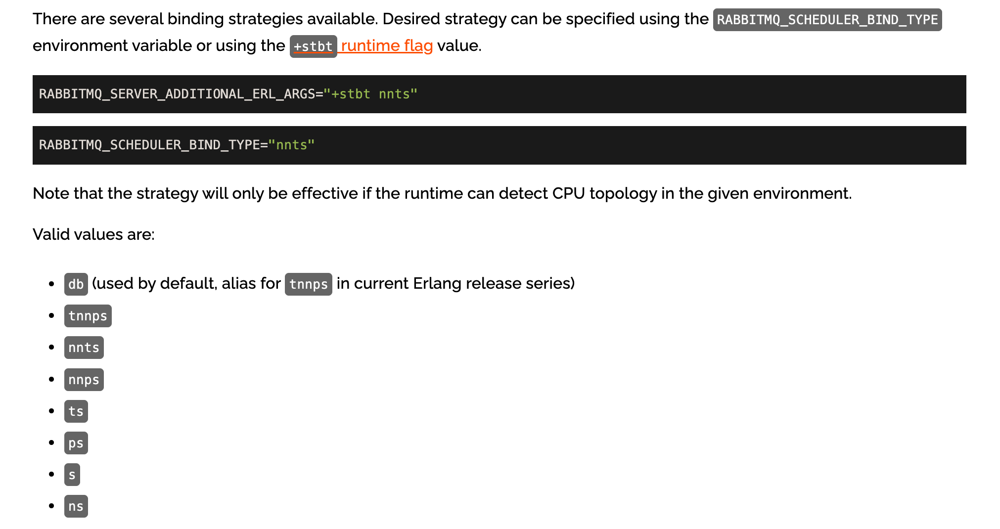

# 问题概述

在性能测试中，创建了多个大规格 RabbiMQ 实例。查看 cpu、内存都不是瓶颈的情况下，同一节点上的 RabbitMQ 互相影响，也没有达到网络或存储的瓶颈。

## 仲裁队列性能数据

| 单节点 RabbitMQ 数量 | 性能 |
| --------------- | --------- |
| 1               | 2.5-3万条/s |
| 9               | 11.9万条/s  |
| 11              | 12.2万条/s  |

监控物理机的网卡吞吐，峰值仅为 1.25GB/s，并未达到网卡的上限瓶颈（该环境上限为 3GB/s）


## 问题原因

容器化 RabbitMQ 在多核 cpu 的情况下，会根据 resource 中限制的 cpu 数指定 scheduler 数量，并且 cpu 绑定策略为 db。（注意：erlang 默认为 u，rabbitmq 社区配置默认为 db。在普通环境，scheduler 数量与 cpu 核数保持一致。而容器化环境，scheduler 数量默认与 limit 保持一致，所以才会出现 cpu 使用不均匀的现象。）

这可能导致多核环境中只有前几个 CPU 被充分利用，而其他核心处于空闲状态。当同时运行多个 RabbitMQ 实例时，可能会出现 CPU 竞争，从而导致性能下降。




## erlang 中绑定类型解释

参考：https://www.erlang.org/doc/man/erl.html

| 缩写 | 类型 | 含义 |
| ---- | ---- | ---- |
| u | unbound | 调度器未绑定到逻辑处理器，即操作系统决定调度器线程在何处执行以及何时迁移。这是默认设置。|
| ns | no_spread | 紧密的调度器标识绑定在尽可能接近的硬件上。 |
| ts | thread_spread | 线程指的是硬件线程（如英特尔的超线程）。具有较低调度器标识的调度器绑定到每个核心的第一个硬件线程，然后具有较高调度器标识的调度器绑定到每个核心的第二个硬件线程，依此类推。 |
| ps | processor_spread | 调度器像 thread_spread 一样扩散，但也跨物理处理器芯片扩散。 |
| s | spread | 调度器尽可能扩散。 |
| nnts | no_node_thread_spread | 类似于 thread_spread，但如果存在多个非一致性内存访问（NUMA）节点，则调度器逐个在一个 NUMA 节点上扩散，即一个 NUMA 节点的所有逻辑处理器按顺序绑定到调度器。 |
| nnps | no_node_processor_spread | 类似于 processor_spread，但如果存在多个 NUMA 节点，则调度器逐个在一个 NUMA 节点上扩散，即一个 NUMA 节点的所有逻辑处理器按顺序绑定到调度器。 |
| tnnps | thread_no_node_processor_spread | thread_spread 和 no_node_processor_spread 的组合。调度器跨 NUMA 节点扩散到硬件线程，但调度器只在一个 NUMA 节点内部跨处理器扩散。 |
| db | default_bind | 以默认方式绑定调度器。默认为 thread_no_node_processor_spread（可能会在将来更改）。 |

## 名词解释

| 名称 | 含义|
| ---- | -- |
| NUMA(Non Uniform Memory Access) | 即非一致内存访问架构。NUMA 具有多个节点(Node)，每个节点可以拥有多个 CPU (每个 CPU 可以具有多个核或线程)，节点内使用共有的内存控制器，因此节点的所有内存对于本节点的所有 CPU 都是等同的，而对于其它节点中的所有 CPU 都是不同的。 |

# 解决方案

对该参数进行优化修改为 u，表示 unbound。参考 https://www.rabbitmq.com/runtime.html#scheduling

## 修改方法

更新 RabbitmqCluster 的yaml，增加环境变量，指定绑定方式。

```yaml

envConfig: |
    RABBITMQ_SCHEDULER_BIND_TYPE="u"
```


修改后再进行压测，可以观察到cpu分配均匀，并且可以达到网卡上限。


