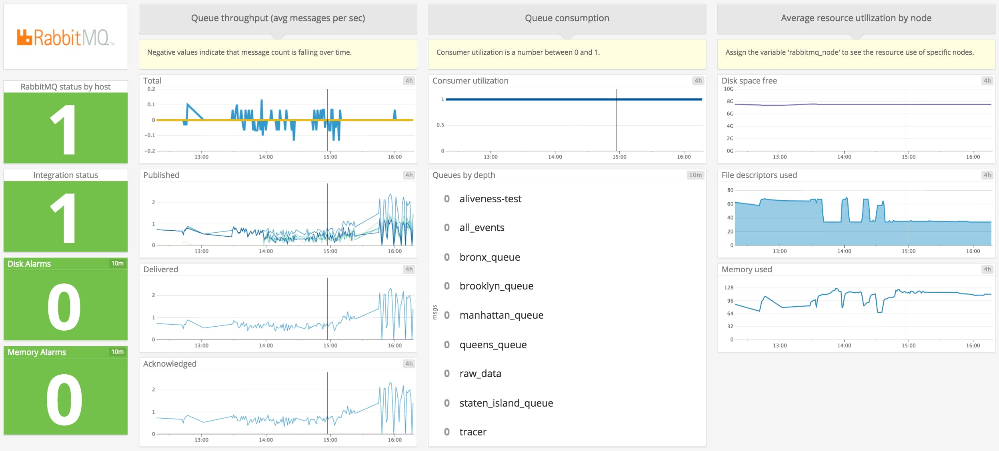
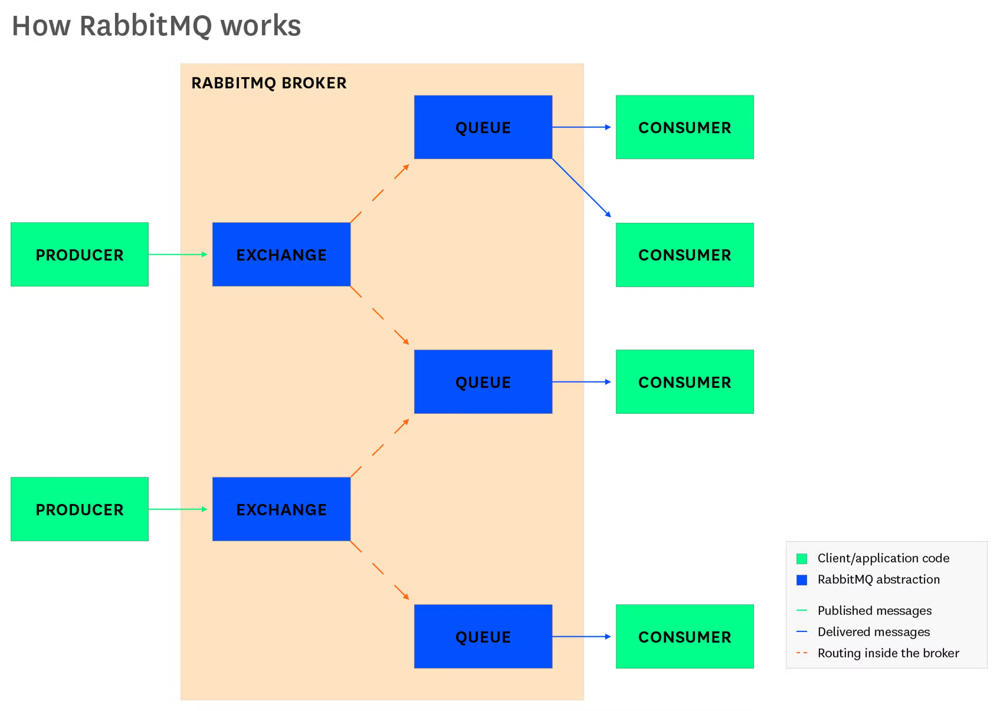
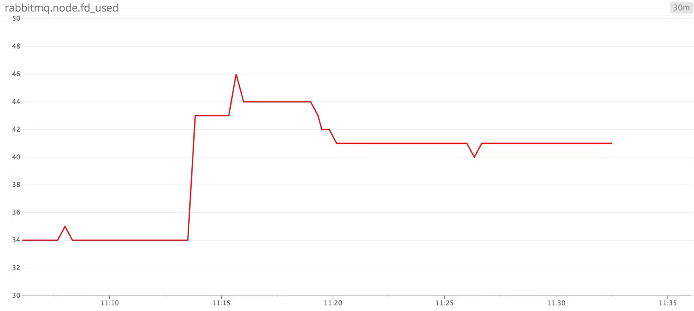
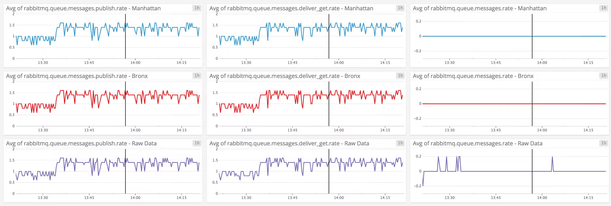

# Key metrics for RabbitMQ monitoring

https://www.datadoghq.com/blog/rabbitmq-monitoring/

## What is RabbitMQ?

RabbitMQ is a message broker, a tool for implementing a messaging architecture. Some parts of your application publish messages, others consume them, and RabbitMQ routes them between producers and consumers. The broker is well suited for loosely coupled microservices. If no service or part of the application can handle a given message, RabbitMQ keeps the message in a queue until it can be delivered. RabbitMQ leaves it to your application to define the details of routing and queuing, which depend on the relationships of objects in the broker: exchanges, queues, and bindings.  RabbitMQ 是一个消息代理，一个实现消息传递架构的工具。 应用程序的某些部分发布消息，其他部分使用它们，并且 RabbitMQ 在生产者和消费者之间路由它们。 代理非常适合松散耦合的微服务。 如果没有服务或应用程序的一部分可以处理给定的消息，RabbitMQ 会将消息保留在队列中，直到它可以被传递。 RabbitMQ 将它留给您的应用程序来定义路由和队列的细节，这取决于代理中对象的关系：交换、队列和绑定。

If your application is built around RabbitMQ messaging, then comprehensive monitoring requires gaining visibility into the broker itself. RabbitMQ exposes metrics for all of its main components, giving you insight into your message traffic and how it affects the rest of your system.  如果您的应用程序是围绕 RabbitMQ 消息传递构建的，那么全面监控需要获得对代理本身的可见性。 RabbitMQ 公开其所有主要组件的指标，让您深入了解您的消息流量以及它如何影响系统的其余部分。

## How RabbitMQ works

RabbitMQ runs as an [Erlang runtime](http://erlang.org/doc/reference_manual/distributed.html), called a **node**. A RabbitMQ server can include [one or more](https://www.rabbitmq.com/clustering.html) nodes, and a cluster of nodes can operate across one machine or several. Connections to RabbitMQ take place through TCP, making RabbitMQ suitable for a [distributed setup](https://www.rabbitmq.com/distributed.html). While RabbitMQ supports a number of protocols, it [implements AMQP](https://www.rabbitmq.com/tutorials/amqp-concepts.html) (Advanced Message Queuing Protocol) and [extends](https://www.rabbitmq.com/extensions.html) some of its concepts.  RabbitMQ 作为 Erlang 运行时运行，称为节点。 RabbitMQ 服务器可以包含一个或多个节点，并且节点集群可以跨一台或多台机器运行。通过 TCP 连接到 RabbitMQ，使 RabbitMQ 适合分布式设置。虽然 RabbitMQ 支持许多协议，但它实现了 AMQP（高级消息队列协议）并扩展了它的一些概念。

At the heart of RabbitMQ is the **message**. Messages feature a set of headers and a binary payload. Any sort of data can make up a message. It is up to your application to parse the headers and use this information to interpret the payload.  RabbitMQ 的核心是消息。消息具有一组标头和二进制有效负载。任何类型的数据都可以构成一条消息。由您的应用程序来解析标头并使用此信息来解释有效负载。

The parts of your application that join up with the RabbitMQ server are called producers and consumers. A **producer** is anything that publishes a message, which RabbitMQ then routes to another part of your application: the **consumer**. RabbitMQ clients are available in a [range of languages](http://www.rabbitmq.com/getstarted.html), letting you implement messaging in most applications.  与 RabbitMQ 服务器连接的应用程序部分称为生产者和消费者。生产者是发布消息的任何东西，然后 RabbitMQ 将其路由到应用程序的另一部分：消费者。 RabbitMQ 客户端支持多种语言，让您可以在大多数应用程序中实现消息传递。

RabbitMQ passes messages through abstractions within the server called exchanges and queues. When your application publishes a message, it publishes to an **exchange**. An exchange routes a message to a **queue**. Queues wait for a consumer to be available, then deliver the message.  RabbitMQ 通过称为交换和队列的服务器中的抽象传递消息。当您的应用程序发布消息时，它会发布到交换器。交换器将消息路由到队列。队列等待消费者可用，然后传递消息。

You’ll notice that a message going from a producer to a consumer moves through two intermediary points, an exchange and a queue. This separation lets you specify the logic of routing messages. There can be multiple exchanges per queue, multiple queues per exchange, or a one-to-one mapping of queues and exchanges. Which queue an exchange delivers to depends on [the type of the exchange](https://www.rabbitmq.com/tutorials/amqp-concepts.html#exchanges). While RabbitMQ defines the basic behaviors of topics and exchanges, how they relate is up to the needs of your application.  您会注意到从生产者到消费者的消息会通过两个中间点，一个交换和一个队列。这种分离使您可以指定路由消息的逻辑。每个队列可以有多个交换，每个交换可以有多个队列，或者队列和交换的一对一映射。交换交付到哪个队列取决于交换的类型。虽然 RabbitMQ 定义了主题和交换的基本行为，但它们之间的关系取决于您的应用程序的需求。

There are many possible design patterns. You might use [work queues](https://www.rabbitmq.com/tutorials/tutorial-two-python.html), a [publish/subscribe](https://www.rabbitmq.com/tutorials/tutorial-three-python.html) pattern, or a [Remote Procedure Call](https://www.rabbitmq.com/tutorials/tutorial-six-python.html) (as seen in [OpenStack Nova](https://www.datadoghq.com/blog/openstack-monitoring-nova/)), just to name examples from the official tutorial. The design of your RabbitMQ setup depends on how you configure its application objects (nodes, queues, exchanges…). RabbitMQ exposes metrics for each of these, letting you measure message traffic, resource use, and more.  有许多可能的设计模式。您可能会使用工作队列、发布/订阅模式或远程过程调用（如在 OpenStack Nova 中看到的），仅举官方教程中的示例。您的 RabbitMQ 设置的设计取决于您如何配置其应用程序对象（节点、队列、交换......）。 RabbitMQ 公开了每个指标的指标，让您可以衡量消息流量、资源使用等。

## Key RabbitMQ metrics

With so many moving parts within the RabbitMQ server, and so much room for configuration, you’ll want to make sure your messaging setup is working as efficiently as possible. As we’ve seen, RabbitMQ has a whole cast of abstractions, and each has its own metrics. These include:  RabbitMQ 服务器中有如此多的移动部件，以及如此多的配置空间，您需要确保您的消息传递设置尽可能高效地工作。正如我们所见，RabbitMQ 有一整套抽象，每个都有自己的指标。这些包括：

- Exchange metrics

- Node metrics

- Connection metrics

- Queue metrics

This post, the first in the series, is a tour through these metrics. In some cases, the metrics have to do with RabbitMQ-specific abstractions, such as queues and exchanges. Other components of a RabbitMQ application demand attention to the same metrics that you’d monitor in the rest of your infrastructure, such as storage and memory resources.  这篇文章是该系列的第一篇文章，是对这些指标的介绍。在某些情况下，指标与特定于 RabbitMQ 的抽象有关，例如队列和交换。 RabbitMQ 应用程序的其他组件需要关注您在其他基础设施中监控的相同指标，例如存储和内存资源。

You can gather RabbitMQ metrics through a set of plugins and built-in tools. One is `rabbitmqctl`, a RabbitMQ command line interface that lists queues, exchanges, and so on, along with various metrics. Another is a management plugin that reports metrics from a local web server. Several tools report events. We’ll tell you how to use these tools in [Part 2](https://www.datadoghq.com/blog/rabbitmq-monitoring-tools).  您可以通过一组插件和内置工具收集 RabbitMQ 指标。一个是 rabbitmqctl，一个 RabbitMQ 命令行界面，列出了队列、交换等，以及各种指标。另一个是管理插件，它报告来自本地 Web 服务器的指标。几个工具报告事件。我们将在第 2 部分中告诉您如何使用这些工具。

### Exchange performance

Exchanges tell your messages where to go. Monitoring exchanges lets you see whether messages are being routed as expected.  交流会告诉您的消息去向。 监控交换可让您查看消息是否按预期路由。

| Name | Description | Metric type | Availability |
| ---- | ----------- | ----------- | ------------ |
| Messages published in | Messages published to an exchange (as a count and a rate per second) | Work: Throughput | management plugin |
| Messages published out | Messages that have left an exchange (as a count and a rate per second) | Work: Throughput | management plugin |
| Messages unroutable | Count of messages not routed to a queue | Work: Errors | management plugin |

#### Metrics to watch: Messages published in, Messages published out

When RabbitMQ performs work, it performs work with messages: routing, queuing, and delivering them. Counts and rates of deliveries are available as metrics, including the number of messages that have entered the exchange and the number of messages that have left. Both metrics are available as rates (see the discussion of the management plugin in [Part 2](https://www.datadoghq.com/blog/rabbitmq-monitoring-tools)). These are key indicators of throughput.  当 RabbitMQ 执行工作时，它会处理消息：路由、排队和传递它们。 交付的计数和速率可用作指标，包括已进入交换的消息数量和离开的消息数量。 这两个指标都可以作为费率使用（请参阅第 2 部分中对管理插件的讨论）。 这些是吞吐量的关键指标。

#### Metric to alert on: Messages unroutable

In RabbitMQ, you specify how a message will move from an exchange to a queue by defining [bindings](https://www.rabbitmq.com/tutorials/tutorial-four-python.html). If a message falls outside the rules of your bindings, it is considered unroutable. In some cases, such as a [Publish/Subscribe](https://www.rabbitmq.com/tutorials/tutorial-three-python.html) pattern, it may not be important for consumers to receive every message. In others, you may want to keep missed messages to a minimum. RabbitMQ’s [implementation](http://www.rabbitmq.com/amqp-0-9-1-quickref.html) of AMQP includes a way to detect unroutable messages, sending them to a dedicated ([‘Alternative’](http://www.rabbitmq.com/amqp-0-9-1-quickref.html#exchange.declare)) exchange. In the management plugin (see [Part 2](https://www.datadoghq.com/blog/rabbitmq-monitoring-tools)), use the **return_unroutable** metric, constraining the count to a given time interval. If some messages have not been routed properly, the rate of publications into an exchange will also exceed the rate of publications out of the exchange, suggesting that some messages have been lost.  在 RabbitMQ 中，您可以通过定义绑定来指定消息如何从交换移动到队列。 如果一条消息超出了您的绑定规则，则它被认为是不可路由的。 在某些情况下，例如发布/订阅模式，消费者接收每条消息可能并不重要。 在其他情况下，您可能希望将错过的消息保持在最低限度。 RabbitMQ 的 AMQP 实现包括一种检测不可路由消息的方法，将它们发送到专用（“替代”）交换。 在管理插件（参见第 2 部分）中，使用 return_unrouteable 指标，将计数限制在给定的时间间隔内。 如果某些消息没有正确路由，则进入交换的发布速率也将超过发布交换的速率，这表明某些消息已经丢失。

### Nodes

RabbitMQ runs inside an Erlang runtime system called a [node](http://erlang.org/doc/reference_manual/distributed.html). For this reason the node is the primary reference point for observing the resource use of your RabbitMQ setup.  RabbitMQ 在称为节点的 Erlang 运行时系统中运行。 因此，节点是观察 RabbitMQ 设置的资源使用情况的主要参考点。

When use of certain resources reaches a threshold, RabbitMQ [triggers an alarm](https://www.rabbitmq.com/alarms.html) and blocks connections. These connections [appear](https://www.rabbitmq.com/alarms.html) as `blocking` in built-in monitoring tools, but it is left to the user to set up notifications (see [Part 2](https://www.datadoghq.com/blog/rabbitmq-monitoring-tools)). For this reason, monitoring resource use across your RabbitMQ system is necessary for ensuring availability.  当某些资源的使用达到阈值时，RabbitMQ 会触发警报并阻止连接。 这些连接在内置监控工具中显示为阻塞，但留给用户设置通知（参见第 2 部分）。 出于这个原因，监控整个 RabbitMQ 系统的资源使用对于确保可用性是必要的。

| Name | Description | Metric type | Availability |
| ---- | ----------- | ----------- | ------------ |
| File descriptors used | Count of file descriptors used by RabbitMQ processes | Resource: Utilization | management plugin, `rabbitmqctl` |
| File descriptors used as sockets | Count of file descriptors used as network sockets by RabbitMQ processes | Resource: Utilization | management plugin, `rabbitmqctl` |
| Disk space used | Bytes of disk used by a RabbitMQ node | Resource: Utilization | management plugin, `rabbitmqctl` |
| Memory used | Bytes in RAM used by a RabbitMQ node (categorized by use) | Resource: Utilization | management plugin, `rabbitmqctl` |

#### Metrics to alert on: File descriptors used, file descriptors used as sockets

As you increase the number of connections to your RabbitMQ server, RabbitMQ uses a greater number of file descriptors and network sockets. Since RabbitMQ will [block new connections](https://www.rabbitmq.com/alarms.html) for nodes that have reached their file descriptor limit, monitoring the available number of file descriptors helps you keep your system running (configuring the file descriptor limit depends on your system, as seen in the context of Linux [here](https://www.rabbitmq.com/install-debian.html#kernel-resource-limits)). On the front page of the management plugin UI, you’ll see a count of your file descriptors for each node. You can fetch this information through the HTTP API (see [Part 2](https://www.datadoghq.com/blog/rabbitmq-monitoring-tools)). This timeseries graph shows what happens to the count of file descriptors used when we add, then remove, connections to the RabbitMQ server.  随着与 RabbitMQ 服务器的连接数量的增加，RabbitMQ 会使用更多的文件描述符和网络套接字。 由于 RabbitMQ 将阻止已达到其文件描述符限制的节点的新连接，因此监视可用的文件描述符数量有助于您保持系统运行（配置文件描述符限制取决于您的系统，如这里的 Linux 上下文所示）。 在管理插件 UI 的首页上，您将看到每个节点的文件描述符计数。 您可以通过 HTTP API 获取此信息（请参阅第 2 部分）。 此时间序列图显示了当我们添加、然后删除与 RabbitMQ 服务器的连接时使用的文件描述符计数发生了什么变化。

#### Metrics to alert on: Disk space used

RabbitMQ goes into a state of alarm when the available disk space of a given node [drops below a threshold](https://www.rabbitmq.com/disk-alarms.html). Alarms [notify your application](https://www.rabbitmq.com/connection-blocked.html) by passing an AMQP [method](https://www.rabbitmq.com/tutorials/amqp-concepts.html#amqp-methods), `connection.blocked`, which RabbitMQ clients handle differently (e.g. [Ruby](http://reference.rubybunny.info/Bunny/Session.html#blocked%3F-instance_method), [Python](http://pika.readthedocs.io/en/0.10.0/modules/adapters/blocking.html#pika.adapters.blocking_connection.BlockingConnection.add_on_connection_blocked_callback)). The default threshold is 50MB, and the number is configurable. RabbitMQ checks the storage of a given drive or partition every 10 seconds, and checks more frequently closer to the threshold. Disk alarms impact your whole cluster: once one node hits its threshold, the rest will stop accepting messages. By monitoring storage at the level of the node, you can make sure your RabbitMQ cluster remains available. If storage becomes an issue, you can check [queue-level metrics](https://www.datadoghq.com/blog/rabbitmq-monitoring/#queue-performance) and see which parts of your RabbitMQ setup demand the most disk space.  当给定节点的可用磁盘空间低于阈值时，RabbitMQ 进入警报状态。 警报通过传递 AMQP 方法 connection.blocked 来通知您的应用程序，RabbitMQ 客户端以不同方式处理该方法（例如 Ruby、Python）。 默认阈值为 50MB，数量可配置。 RabbitMQ 每 10 秒检查一次给定驱动器或分区的存储，并在接近阈值时更频繁地检查。 磁盘警报会影响您的整个集群：一旦一个节点达到其阈值，其余节点将停止接受消息。 通过在节点级别监控存储，您可以确保您的 RabbitMQ 集群保持可用。 如果存储成为问题，您可以检查队列级别的指标并查看 RabbitMQ 设置的哪些部分需要最多的磁盘空间。

#### Metrics to alert on: Memory used

As with storage, RabbitMQ [alerts on memory](https://www.rabbitmq.com/memory.html). Once a node’s RAM utilization exceeds a threshold, RabbitMQ blocks all connections that are publishing messages. If your application requires a different threshold than the default of 40 percent, you can set the `vm_memory_high_watermark` in your RabbitMQ configuration file. Monitoring the memory your nodes consume can help you avoid surprise memory alarms and throttled connections.  与存储一样，RabbitMQ 会在内存上发出警报。 一旦节点的 RAM 利用率超过阈值，RabbitMQ 就会阻止所有正在发布消息的连接。 如果您的应用程序需要与默认值 40% 不同的阈值，您可以在 RabbitMQ 配置文件中设置 vm_memory_high_watermark。 监控节点消耗的内存可以帮助您避免意外的内存警报和限制连接。

The challenge for monitoring memory in RabbitMQ is that it’s used [across your setup](https://www.rabbitmq.com/memory-use.html), at different scales and different points within your architecture, for application-level abstractions such as queues as well as for dependencies like [Mnesia](http://erlang.org/doc/man/mnesia.html), Erlang’s internal database management system. A crucial step in monitoring memory is to break it down by use. In [Part 2](https://www.datadoghq.com/blog/rabbitmq-monitoring-tools), we’ll cover tools that let you list application objects by memory and visualize that data in a graph.  在 RabbitMQ 中监控内存的挑战在于，它在您的架构中以不同的规模和不同的点用于应用程序级别的抽象，例如队列以及诸如 Erlang 的内部数据库管理系统 Mnesia 之类的依赖项。 监控内存的一个关键步骤是通过使用来分解它。 在第 2 部分中，我们将介绍一些工具，这些工具可让您按内存列出应用程序对象并在图表中可视化该数据。

### Connection performance

Any traffic in RabbitMQ flows through a TCP connection. Messages in RabbitMQ [implement](https://www.rabbitmq.com/tutorials/amqp-concepts.html) the structure of the AMQP frame: a set of headers for attributes like content type and routing key, as well as a binary payload that contains the content of the message. RabbitMQ is well suited for a [distributed network](https://www.rabbitmq.com/distributed.html), and even single-machine setups work through local TCP connections. Like monitoring exchanges, monitoring your connections helps you understand your application’s messaging traffic. While exchange-level metrics are observable in terms of RabbitMQ-specific abstractions such as message rates, connection-level metrics are reported in terms of computational resources.  RabbitMQ 中的任何流量都流经 TCP 连接。 RabbitMQ 中的消息实现了 AMQP 帧的结构：一组用于内容类型和路由键等属性的标头，以及包含消息内容的二进制有效负载。 RabbitMQ 非常适合分布式网络，甚至单机设置也可以通过本地 TCP 连接工作。 与监控交换一样，监控连接可帮助您了解应用程序的消息传递流量。 虽然交换级别的指标可以根据 RabbitMQ 特定的抽象（例如消息速率）来观察，但连接级别的指标是根据计算资源报告的。

| Name | Description | Metric type | Availability |
| ---- | ----------- | ----------- | ------------ |
| Data rates | Number of octets sent/received within a TCP connection per second | Resource: Utilization | management plugin |

#### Metrics to watch: Data rates

The logic of publishing, routing, queuing and subscribing is independent of a message’s size. RabbitMQ messages are always [first-in, first-out](https://www.rabbitmq.com/queues.html), and require a consumer to parse their content. From the perspective of a queue, all messages are equal.  发布、路由、排队和订阅的逻辑与消息的大小无关。 RabbitMQ 消息始终是先进先出的，并且需要消费者解析其内容。 从队列的角度来看，所有消息都是平等的。

One way to get insight into the payloads of your messages, then, is by monitoring the data that travels through a connection. If you’re seeing a rise in memory or storage in your [nodes](https://www.datadoghq.com/blog/rabbitmq-monitoring/#nodes), the messages moving to consumers through a connection may be holding a greater payload. Whether the messages use memory or storage depends on your [persistence](https://www.rabbitmq.com/persistence-conf.html) settings, which you can monitor along with your [queues](https://www.datadoghq.com/blog/rabbitmq-monitoring/#queue-performance). A rise in the rate of sent octets may explain spikes in storage and memory use downstream.  因此，深入了解消息有效负载的一种方法是监视通过连接传输的数据。 如果您看到节点中的内存或存储有所增加，则通过连接传递给消费者的消息可能会持有更大的有效负载。 消息是使用内存还是存储取决于您的持久性设置，您可以与队列一起监控这些设置。 发送八位字节速率的上升可能解释了下游存储和内存使用的峰值。

### Queue performance

Queues receive, push, and store messages. After the exchange, the queue is a message’s final stop within the RabbitMQ server before it reaches your application. In addition to [observing your exchanges](https://www.datadoghq.com/blog/rabbitmq-monitoring/#exchange-performance), then, you will want to monitor your [queues](https://www.rabbitmq.com/queues.html). Since the message is the top-level unit of work in RabbitMQ, monitoring queue traffic is one way of measuring your application’s throughput and performance.  队列接收、推送和存储消息。 交换之后，队列是消息到达应用程序之前在 RabbitMQ 服务器中的最后一站。 除了观察你的交换之外，你还需要监控你的队列。 由于消息是 RabbitMQ 中的顶级工作单元，因此监控队列流量是衡量应用程序吞吐量和性能的一种方法。

| Name | Description | Metric type | Availability |
| ---- | ----------- | ----------- | ------------ |
| Queue depth | Count of all messages in the queue | Resource: Saturation  | `rabbitmqctl` |
| Messages unacknowledged | Count of messages a queue has delivered without receiving acknowledgment from a consumer | Resource: Error | `rabbitmqctl` |
| Messages ready | Count of messages available to consumer | Other | `rabbitmqctl` |
| Message rates | Messages that move in or out of a queue per second, whether unacknowledged, delivered, acknowledged, or redelivered | Work: Throughput | management plugin |
| Messages persistent | Count of messages written to disk | Other | `rabbitmqctl` |
| Message bytes persistent | Sum in bytes of messages written to disk | Resource: Utilization | `rabbitmqctl` |
| Message bytes RAM | Sum in bytes of messages stored in memory | Resource: Utilization | `rabbitmqctl` |
| Number of consumers | Count of consumers for a given queue | Other | `rabbitmqctl` |
| Consumer utilization | Proportion of time that the queue can deliver messages to consumers | Resource: Availability | management plugin |

#### Metrics to watch: Queue depth, messages unacknowledged, and messages ready

Queue depth, or the count of messages currently in the queue, tells you a lot and very little: a queue depth of zero can indicate that your consumers are behaving efficiently or that a producer has thrown an error. The usefulness of queue depth depends on your application’s expected performance, which you can compare against queue depths for messages in specific states.  队列深度，或当前队列中的消息数，能告诉你很多，也很少：队列深度为零可以表明你的消费者行为有效，或者生产者抛出了一个错误。 队列深度的有用性取决于应用程序的预期性能，您可以将其与特定状态下消息的队列深度进行比较。

For instance, `messages_ready` indicates the number of messages that your queues have exposed to subscribing consumers. Meanwhile, `messages_unacknowledged` tracks messages that have been delivered but remain in a queue pending explicit [acknowledgment](https://www.rabbitmq.com/confirms.html) (an `ack`) by a consumer. By comparing the values of `messages`, `messages_ready` and `messages_unacknowledged`, you can understand the extent to which queue depth is due to success or failure elsewhere.  例如，messages_ready 表示您的队列向订阅消费者公开的消息数量。 同时，messages_unacknowledged 跟踪已传递但仍留在队列中等待消费者显式确认（确认）的消息。 通过比较消息messages_ready 和messages_unacknowledged 的值，您可以了解队列深度在多大程度上是由于其他地方的成功或失败。

#### Metrics to watch: Message rates

You can also retrieve rates for messages in different states of delivery. If your `messages_unacknowledged` rate is higher than usual, for example, there may be errors or performance issues downstream. If your deliveries per second are lower than usual, there may be issues with a producer, or your routing logic may have changed.  您还可以检索处于不同传递状态的邮件的费率。 例如，如果您的 messages_unacknowledged 率高于平时，则下游可能存在错误或性能问题。 如果您的每秒交付量低于平时，则生产者可能存在问题，或者您的路由逻辑可能已更改。

This dashboard shows message rates for three queues, all part of a test application that collects data about New York City.  此仪表板显示三个队列的消息率，所有队列都是收集有关纽约市数据的测试应用程序的一部分。

#### Metric to watch: Messages persistent, message bytes persistent, and message bytes RAM

A queue may [persist messages](https://www.rabbitmq.com/persistence-conf.html) in memory or on disk, preserving them as pairs of keys and values in a message store. The way RabbitMQ stores messages depends on whether your queues and messages are [configured](https://www.rabbitmq.com/tutorials/tutorial-two-python.html) to be, respectively, [durable and persistent](https://www.rabbitmq.com/tutorials/amqp-concepts.html). Transient messages are written to disk in conditions of memory pressure. Since a queue consumes both storage and memory, and does so dynamically, it’s important to keep track of your queues' resource metrics. For instance you can compare two metrics, `message_bytes_persistent` and `message_bytes_ram`, to understand how your queue is allocating messages between resources.  队列可以将消息保存在内存或磁盘中，将它们作为键和值对保存在消息存储中。 RabbitMQ 存储消息的方式取决于您的队列和消息是否分别配置为持久性和持久性。 在内存压力的情况下，瞬态消息被写入磁盘。 由于队列同时消耗存储和内存，并且是动态的，因此跟踪队列的资源指标非常重要。 例如，您可以比较两个指标 message_bytes_persistent 和 message_bytes_ram，以了解您的队列如何在资源之间分配消息。

#### Metric to alert on: Number of consumers

Since you configure consumers manually, an application running as expected should have a stable consumer count. A lower-than-expected count of consumers can indicate failures or errors in your application.  由于您手动配置消费者，因此按预期运行的应用程序应该具有稳定的消费者数量。 低于预期的消费者数量可能表明您的应用程序出现故障或错误。

#### Metric to alert on: Consumer utilization

A queue’s consumers are not always able to receive messages. If you have configured a consumer to acknowledge messages manually, you can stop your queues from releasing more than a certain number at a time before they are consumed. This is your channel’s [prefetch setting](https://www.rabbitmq.com/confirms.html). If a consumer encounters an error and terminates, the proportion of time in which it can receive messages will shrink. By measuring [consumer utilization](https://www.rabbitmq.com/blog/2014/04/14/finding-bottlenecks-with-rabbitmq-3-3/), which the management plugin (see [Part 2](https://www.datadoghq.com/blog/rabbitmq-monitoring-tools)) reports as a percentage and as a decimal between 0 and 1, you can determine the availability of your consumers.  队列的消费者并不总是能够接收消息。 如果您已将消费者配置为手动确认消息，则可以阻止队列在消费前一次释放超过一定数量的消息。 这是您频道的预取设置。 如果消费者遇到错误并终止，它可以接收消息的时间比例会缩小。 通过测量消费者利用率，管理插件（参见第 2 部分）以百分比和 0 到 1 之间的小数形式报告，您可以确定消费者的可用性。

## Get inside your messaging stack  进入您的消息堆栈

Much of the work that takes place in your RabbitMQ setup is only observable in terms of abstractions within the server, such as exchanges and queues. RabbitMQ reports metrics on these abstractions in their own terms, for instance counting the messages that move through them. Abstractions you can monitor, and the metrics RabbitMQ reports for them, include:  RabbitMQ 设置中发生的大部分工作只能在服务器内的抽象方面观察到，例如交换和队列。 RabbitMQ 以它们自己的术语报告这些抽象的指标，例如计算通过它们的消息。您可以监控的抽象以及 RabbitMQ 为它们报告的指标包括：

- [Exchanges](https://www.datadoghq.com/blog/rabbitmq-monitoring/#exchange-performance): Messages published in, messages published out, messages unroutable  已发布的消息、已发布的消息、无法路由的消息

- [Queues](https://www.datadoghq.com/blog/rabbitmq-monitoring/#queue-performance): Queue depth, messages unacknowledged, messages ready, messages persistent, message bytes persistent, message bytes RAM, number of consumers, consumer utilization  队列深度、未确认消息、消息就绪、消息持久、消息字节持久、消息字节 RAM、消费者数量、消费者利用率

Monitoring your message traffic, you can make sure that the loosely coupled services within your application are communicating as intended.  监控您的消息流量，您可以确保应用程序中松散耦合的服务按预期进行通信。

You will also want to track the resources that your RabbitMQ setup consumes. Here you’ll monitor:  您还需要跟踪 RabbitMQ 设置消耗的资源。在这里，您将监控：

- [Nodes](https://www.datadoghq.com/blog/rabbitmq-monitoring/#nodes): File descriptors used, file descriptors used as sockets, disk space used, memory used  使用的文件描述符、用作套接字的文件描述符、使用的磁盘空间、使用的内存

- [Connections](https://www.datadoghq.com/blog/rabbitmq-monitoring/#connection-performance): Octets sent and received  发送和接收的八位字节

In [Part 2](https://www.datadoghq.com/blog/rabbitmq-monitoring-tools) of this series, we’ll show you how to use a number of RabbitMQ monitoring tools. In [Part 3](https://www.datadoghq.com/blog/monitoring-rabbitmq-performance-with-datadog/), we’ll introduce you to comprehensive RabbitMQ monitoring with Datadog, including the [RabbitMQ integration](https://docs.datadoghq.com/integrations/rabbitmq/).  在本系列的第 2 部分中，我们将向您展示如何使用许多 RabbitMQ 监控工具。在第 3 部分中，我们将向您介绍使用 Datadog 进行全面的 RabbitMQ 监控，包括 RabbitMQ 集成。

## Acknowledgments

We wish to thank our friends at [Pivotal](https://pivotal.io/) for their technical review of this series.  我们要感谢 Pivotal 的朋友对本系列的技术审查。

*Source Markdown for this post is available [on GitHub](https://github.com/DataDog/the-monitor/blob/master/rabbitmq/rabbitmq-monitoring.md). Questions, corrections, additions, etc.? Please [let us know](https://github.com/DataDog/the-monitor/issues).*  这篇文章的源 Markdown 可以在 GitHub 上找到。 问题、更正、补充等？ 请告诉我们。

