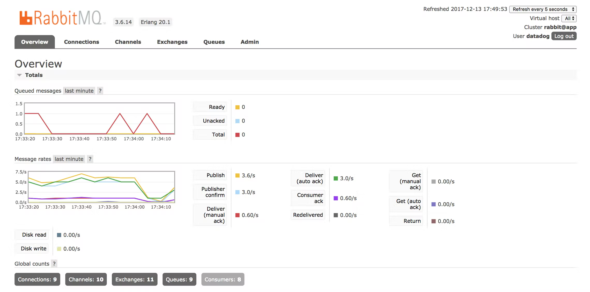
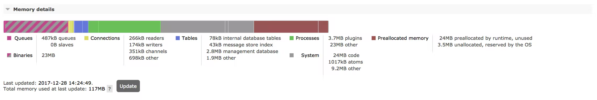
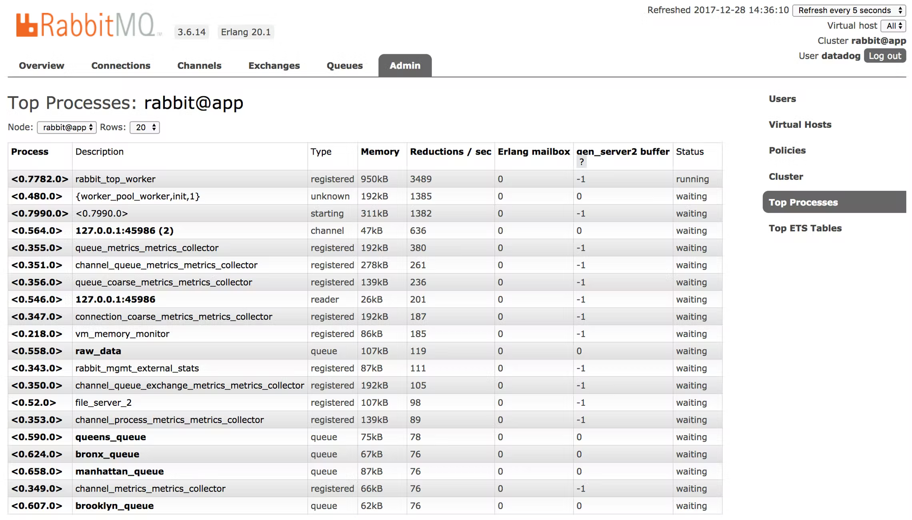
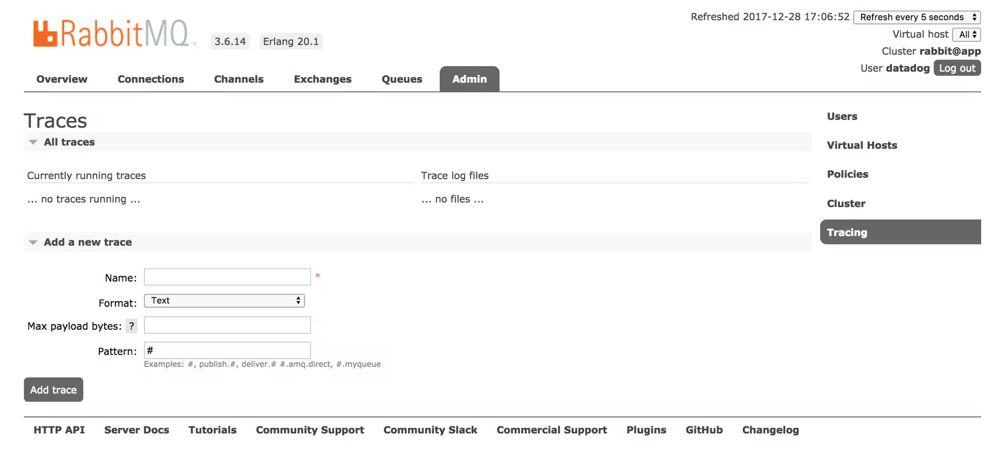
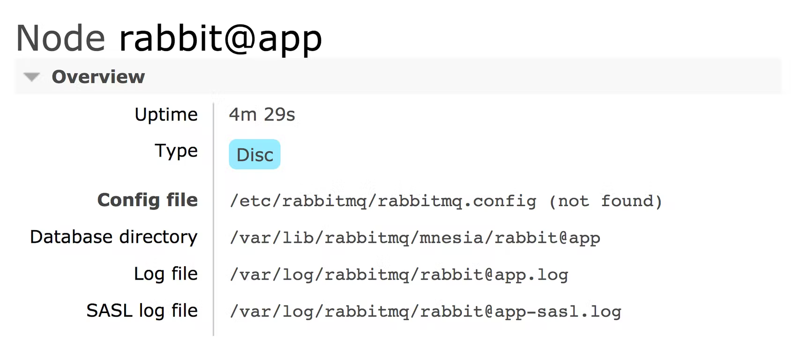
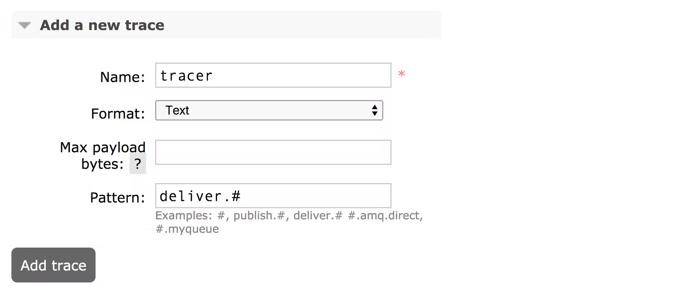

# Collecting metrics with RabbitMQ monitoring tools

https://www.datadoghq.com/blog/rabbitmq-monitoring-tools/

*While the output of certain RabbitMQ CLI commands uses the term “slave” to refer to mirrored queues, RabbitMQ has [disavowed](https://www.rabbitmq.com/ha.html#what-is-mirroring) this term, as has Datadog.*  虽然某些 RabbitMQ CLI 命令的输出使用术语“slave”来指代镜像队列，但 RabbitMQ 和 Datadog 都否认了这个术语。

When collecting [RabbitMQ metrics](https://www.datadoghq.com/blog/rabbitmq-monitoring), you can take advantage of RabbitMQ’s built-in monitoring tools and ecosystem of plugins. In this post, we’ll introduce these RabbitMQ monitoring tools and show you how you can use them in your own messaging setup.  在收集 RabbitMQ 指标时，您可以利用 RabbitMQ 的内置监控工具和插件生态系统。 在这篇文章中，我们将介绍这些 RabbitMQ 监控工具，并向您展示如何在您自己的消息传递设置中使用它们。

| Tool              | What you get                                                       | Metrics it collects                                                            |
| ----------------- | ------------------------------------------------------------------ | ------------------------------------------------------------------------------ |
| Built-in CLI      | Status snapshots of RabbitMQ’s core application objects            | Node resource use, Queue performance                                           |
| Management plugin | A built-in web server that reports metrics via UI and API          | Exchange metrics, Node resource use, Connection performance, Queue performance |
| Tracing tools     | Exchanges that report events from messages and application objects | Events                                                                         |

## The built-in CLI

For a quick scan of your application’s vital signs, you can turn to [RabbitMQ’s CLI](https://www.rabbitmq.com/rabbitmqctl.8.html): `rabbitmqctl`. This tool, which comes installed with RabbitMQ, lets you perform management tasks (check server status, add nodes to a cluster, etc.) and exposes metrics about RabbitMQ objects such as queues, exchanges, and nodes. Values of RabbitMQ metrics are snapshots from the moment you run the command. Since the only configuration `rabbitmqctl` requires is a set of command line options, the tool is a quick way to get a high-level view into key metrics.  要快速扫描应用程序的生命体征，您可以使用 RabbitMQ 的 CLI：rabbitmqctl。 该工具随 RabbitMQ 一起安装，可让您执行管理任务（检查服务器状态、将节点添加到集群等）并公开有关 RabbitMQ 对象（如队列、交换和节点）的指标。 RabbitMQ 指标的值是您运行命令时的快照。 由于 rabbitmqctl 唯一需要的配置是一组命令行选项，因此该工具是一种快速了解关键指标的高级方法。

`rabbitmqctl` lets you access many of the metrics we cover in [Part 1](https://www.datadoghq.com/blog/rabbitmq-monitoring), including node-level resource metrics, connection performance metrics, and detailed breakdowns of message counts within queues. A full list of `rabbitmqctl` metrics is [here](https://www.rabbitmq.com/man/rabbitmqctl.1.man.html).  rabbitmqctl 允许您访问我们在第 1 部分中介绍的许多指标，包括节点级资源指标、连接性能指标以及队列中消息计数的详细细分。 rabbitmqctl 指标的完整列表在这里。

You can collect most metrics from the CLI by running  您可以通过运行从 CLI 收集大多数指标

```bash
rabbitmqctl list_<item>
```

The `<item>` might be a kind of application object, such as `queues` or `exchanges`, or other sources of data like `users` or `permissions`. You can specify which RabbitMQ metrics to collect, and `rabbitmqctl` returns them as a series of columns.  <item> 可能是一种应用程序对象，例如队列或交换，或其他数据源，例如用户或权限。 您可以指定要收集哪些 RabbitMQ 指标，rabbitmqctl 将它们作为一系列列返回。

For instance, we might use `rabbitmqctl` to check for bottlenecks in an application that queries an API for data about New York City. The application retrieves raw data from the API and passes it to a queue. The queue’s consumer processes the data, aggregates it by borough, and sends it to another queue. To query RabbitMQ for queue names, total messages, messages ready for consumption, state (running, idle…), and consumer utilization, we can run:  例如，我们可以使用 rabbitmqctl 来检查应用程序中的瓶颈，该应用程序查询 API 以获取有关纽约市的数据。 应用程序从 API 检索原始数据并将其传递给队列。 队列的消费者处理数据，按自治市镇聚合数据，然后将其发送到另一个队列。 要查询 RabbitMQ 的队列名称、消息总数、可供消费的消息、状态（正在运行、空闲……）和消费者利用率，我们可以运行：

```bash
sudo rabbitmqctl list_queues name messages messages_ready state consumer_utilisation
```

A full list of columns for queues is [here](https://www.rabbitmq.com/rabbitmqctl.8.html#list_queues). “Utilisation” uses the British spelling. The resulting data looks like this:  队列的完整列列表在这里。 “Utilisation”使用英式拼写。 结果数据如下所示：

```bash
Listing queues
staten_island_queue     426     426     running
bronx_queue             0       0       running       1.0
brooklyn_queue          0       0       running       1.0
queens_queue            0       0       running       1.0
manhattan_queue         0       0       running       1.0
raw_data                1       0       running       1.0
all_events              0       0       running       1.0
tracer                  0       0       running       1.0
```

Though each queue is running, `staten_island_queue` has two metrics with especially high values: `messages_ready` and `messages`. Messages are entering the queue and not leaving. As it turns out, `staten_island_queue` has no `consumer_utilisation`. While the other queues report the maximum value of 1.0, this one shows a blank. The queue’s consumers are not available to receive messages. One next step could be to investigate our consumers for exceptions.  尽管每个队列都在运行，但 staten_island_queue 有两个指标值特别高：messages_ready 和 messages。 消息正在进入队列而不是离开。 事实证明，staten_island_queue 没有 consumer_utilisation。 当其他队列报告最大值 1.0 时，这个队列显示为空白。 队列的消费者无法接收消息。 下一步可能是调查我们的消费者是否存在异常。

Another use of `rabbitmqctl` is to get a quick set of metrics about your RabbitMQ environment. The command `rabbitmqctl status` lists statistics about the runtime of your RabbitMQ server. Here you’ll find a number of node-level resource metrics, including usage for file descriptors, sockets, and disk space. You’ll also find, as shown here, a breakdown of memory usage in bytes:  rabbitmqctl 的另一个用途是获取有关 RabbitMQ 环境的一组快速指标。 命令 rabbitmqctl status 列出了有关 RabbitMQ 服务器运行时的统计信息。 在这里，您将找到许多节点级别的资源指标，包括文件描述符、套接字和磁盘空间的使用情况。 如此处所示，您还可以找到以字节为单位的内存使用明细：

```bash
{memory,
     [{connection_readers,255008},
      {connection_writers,81400},
      {connection_channels,189272},
      {connection_other,694920},
      {queue_procs,382048},
      {queue_slave_procs,0},
      {plugins,3236488},
      {other_proc,19575592},
      {metrics,260224},
      {mgmt_db,2080600},
      {mnesia,79832},
      {other_ets,1970600},
      {binary,29566616},
      {msg_index,44360},
      {code,24918337},
      {atom,1041593},
      {other_system,9716726},
      {allocated_unused,24424144},
      {reserved_unallocated,1347584},
      {total,119865344}]}
```

## The management plugin

The RabbitMQ [management plugin](http://www.rabbitmq.com/management.html) extends its host node with a web server, which reports metrics from the host node and any nodes in its cluster. It comes with an HTTP API, an interactive web UI, and an extended set of command line tools. The API and web interface report the same metrics as `rabbitmqctl`, and add [statistics of their own](https://raw.githack.com/rabbitmq/rabbitmq-management/master/priv/www/doc/stats.html).  RabbitMQ 管理插件使用 Web 服务器扩展其主机节点，该服务器报告来自主机节点及其集群中任何节点的指标。 它带有一个 HTTP API、一个交互式 Web UI 和一组扩展的命令行工具。 API 和 Web 界面报告与 rabbitmqctl 相同的指标，并添加自己的统计信息。

For example, the RabbitMQ management plugin exposes the `message_stats` object, which gives you counts and rates of traffic through your messaging setup. This is where you’ll find the metrics related to exchanges and message rates in [Part 1](https://www.datadoghq.com/blog/rabbitmq-monitoring). Do note that the management plugin only stores up to [one day](http://www.rabbitmq.com/monitoring.html) of metrics. Depending on your needs, you may opt to query the API and store the return values yourself.  例如，RabbitMQ 管理插件公开了 message_stats 对象，它通过消息设置为您提供流量的计数和速率。 您可以在此处找到第 1 部分中与交换和消息率相关的指标。请注意，管理插件最多只能存储一天的指标。 根据您的需要，您可以选择自己查询 API 并存储返回值。

Like `rabbitmqctl`, the management plugin ships with an installation of RabbitMQ. To set it up, run the following command:  与 rabbitmqctl 一样，管理插件附带了 RabbitMQ 的安装。 要进行设置，请运行以下命令：

```bash
rabbitmq-plugins enable rabbitmq_management
```

### HTTP API

The RabbitMQ management plugin reports metrics from a web server. One way to gather the metrics is through an API. The API is useful for three reasons. First, it returns JSON, letting you work with RabbitMQ metrics in your own scripts. Second, it provides data as rates, complementing the snapshots you get in `rabbitmqctl`. Third, it gives you detailed information about the components of your application (see a list of stats [here](https://raw.githack.com/rabbitmq/rabbitmq-management/master/priv/www/doc/stats.html)).  RabbitMQ 管理插件报告来自 Web 服务器的指标。收集指标的一种方法是通过 API。 API 之所以有用，有三个原因。首先，它返回 JSON，让您可以在自己的脚本中使用 RabbitMQ 指标。其次，它以速率提供数据，补充您在 rabbitmqctl 中获得的快照。第三，它为您提供有关应用程序组件的详细信息（请参阅此处的统计信息列表）。

To access the API, direct an HTTP GET request to `localhost:15672/api/<endpoint>` (or 55672 for versions before 3.0). API endpoints are organized around RabbitMQ abstractions: nodes, connections, channels, consumers, exchanges, queues, [and so on](https://raw.githack.com/rabbitmq/rabbitmq-management/master/priv/www/api/index.html). You can narrow your query to a specific virtual host or component of your application. To choose the default virtual host, `/`, you need to include the encoding `%2F` in the API endpoint.  要访问 API，请将 HTTP GET 请求定向到 localhost:15672/api/<endpoint>（或 3.0 之前的版本为 55672）。 API 端点是围绕 RabbitMQ 抽象组织的：节点、连接、通道、消费者、交换、队列等。您可以将查询范围缩小到特定的虚拟主机或应用程序的组件。要选择默认虚拟主机 /，您需要在 API 端点中包含编码 %2F。

Message rates are useful if you want to know how smoothly traffic moves through a given part of your system. For example, you can see whether messages leave a queue as quickly as they arrive. In our demo application, we’ll compare rates for messages with two statuses: those published into an exchange and routed to the `raw_data` queue, and those delivered to consumers. To start, this query returns information about the queue `raw_data`:  如果您想知道流量通过系统给定部分的顺畅程度，消息速率很有用。例如，您可以查看消息是否与到达队列一样快。在我们的演示应用程序中，我们将比较具有两种状态的消息的速率：发布到交换并路由到 raw_data 队列的消息，以及传递给消费者的消息。首先，此查询返回有关队列 raw_data 的信息：

```bash
http://localhost:15672/api/queues/%2F/raw_data?msg_rates_age=300&msg_rates_incr=100
```

We’ve set `msg_rates_age=300` to constrain our data to the last five minutes, and `msg_rates_incr=100` to check our queue for samples every 100 seconds. Both query parameters are necessary for obtaining averages, which the web server calculates from the samples. You’ll find averages, samples, and rates in `publish_details`.  我们设置了 msg_rates_age=300 以将我们的数据限制在最后五分钟，并设置 msg_rates_incr=100 以每 100 秒检查一次队列中的样本。 这两个查询参数都是获得平均值所必需的，Web 服务器从样本中计算得出平均值。 您可以在 publish_details 中找到平均值、样本和比率。

```bash
"publish_details":{
    "avg":2730.5,
    "avg_rate":1.3833333333333333,
    "samples":[
        {"timestamp":1513276900000,"sample":2939},
        {"timestamp":1513276800000,"sample":2795},
        {"timestamp":1513276700000,"sample":2664},
        {"timestamp":1513276600000,"sample":2524}],
    "rate":1.44}
```

In this object, `avg` is the average count of messages across the samples. Since message counts are cumulative, the average includes all messages of this type over the lifetime of the queue. `samples` are collected at the interval we specify, yielding an `avg_rate`. `rate` is per second, showing the change since the last sample.  在此对象中，avg 是样本中消息的平均计数。 由于消息计数是累积的，因此平均值包括队列生命周期内此类型的所有消息。 以我们指定的间隔收集样本，产生一个 avg_rate。 rate 是每秒，显示自上次采样以来的变化。

There’s a similar set of statistics in `deliver_get_details`, again taking samples every 100 seconds across our five-minute interval.  在 Deliver_get_details 中有一组类似的统计数据，在我们的五分钟间隔内每 100 秒再次采样一次。

```bash
"deliver_get_details":{
    "avg":2731.0,
    "avg_rate":1.3866666666666667,
    "samples":[
        {"timestamp":1513276900000,"sample":2940},
        {"timestamp":1513276800000,"sample":2796},
        {"timestamp":1513276700000,"sample":2664},
        {"timestamp":1513276600000,"sample":2524}],
    "rate":1.44}
```

In the last five minutes, published messages have roughly kept pace with deliveries. Messages are moving through the queue with no bottlenecks.  在过去的五分钟内，发布的消息大致与交付保持同步。 消息在没有瓶颈的情况下通过队列。

If you plan to query the API from within your application, you’ll need to make sure that you’ve [configured](http://www.rabbitmq.com/management.html) the RabbitMQ management plugin. You’ll want to adjust the `cors_allow_origins` setting to permit requests from your application’s domain. And if your application uses HTTPS, you’ll want to make sure that the API does so too (by default it does not).  如果您打算从应用程序中查询 API，则需要确保已配置 RabbitMQ 管理插件。 您需要调整 cors_allow_origins 设置以允许来自应用程序域的请求。 如果您的应用程序使用 HTTPS，您需要确保 API 也这样做（默认情况下不这样做）。

### The web UI

Once you’ve started the broker and installed the RabbitMQ management plugin, you’ll have access to a built-in metrics UI. Point a browser to the root of the web server, e.g., `localhost:15672`, to see a number of dashboards. These correspond roughly to the endpoints of the HTTP API. There’s an overview page as well as links to pages for connections, channels, exchanges, and queues.  启动代理并安装 RabbitMQ 管理插件后，您将可以访问内置的指标 UI。 将浏览器指向 Web 服务器的根目录，例如 localhost:15672，以查看许多仪表板。 这些大致对应于 HTTP API 的端点。 有一个概述页面以及连接、通道、交换和队列页面的链接。



The UI updates in real time and displays data from several sources at once. The overview tab includes timeseries graphs of queue depths and message rates. Pages for individual connections, channels, exchanges and queues include their own timeseries graphs. You can check the web interface and know at a glance whether any part of your RabbitMQ application has become unavailable. And by clicking a tab for connections, channels, exchanges, and queues, you can compare key work metrics for message and data traffic throughout your application.  UI 实时更新并同时显示来自多个来源的数据。 概览选项卡包括队列深度和消息速率的时间序列图。 各个连接、通道、交换和队列的页面包括它们自己的时间序列图。 您可以检查 Web 界面，一眼就知道您的 RabbitMQ 应用程序的任何部分是否不可用。 通过单击连接、通道、交换和队列的选项卡，您可以比较整个应用程序中消息和数据流量的关键工作指标。

The RabbitMQ management UI can also graph your memory usage. You’ll find this graph under the “Memory details” section of the page for a given node. Explanations for categories within the graph are [here](https://www.rabbitmq.com/memory-use.html).  RabbitMQ 管理 UI 还可以绘制内存使用情况。 您将在给定节点页面的“内存详细信息”部分下找到此图。 图表中的类别说明在这里。



While less customizable than `rabbitmqctl` or the HTTP API, the web UI gives you quick visibility into the health of your RabbitMQ setup.  虽然不如 rabbitmqctl 或 HTTP API 可定制，但 Web UI 让您可以快速了解 RabbitMQ 设置的健康状况。

### `rabbitmq_top`

For monitoring the memory use of your RabbitMQ application, `rabbitmqctl` and the management plugin give you a breakdown by application component: `connection_readers`, `queue_procs`, `binary`, and so on. For a breakdown by RabbitMQ process, you can use [another plugin](https://github.com/rabbitmq/rabbitmq-top), `rabbitmq_top`, which extends the management web server with a `top`-like list. As with the management plugin, it’s built into RabbitMQ (as of version 3.6.3 and later). Since `rabbitmq_top` is resource intensive, Pivotal advises that you run it only when needed.  为了监控 RabbitMQ 应用程序的内存使用情况，rabbitmqctl 和管理插件按应用程序组件为您提供细分：connection_readers、queue_procs、二进制文件等。 对于 RabbitMQ 进程的细分，您可以使用另一个插件 rabbitmq_top，它使用类似顶部的列表扩展了管理 Web 服务器。 与管理插件一样，它内置在 RabbitMQ 中（从 3.6.3 及更高版本开始）。 由于 rabbitmq_top 是资源密集型的，Pivotal 建议您仅在需要时运行它。

To enable `rabbitmq_top`, run this command:

```bash
rabbitmq-plugins enable rabbitmq_top
```

After you enable the management plugin and `rabbitmq_top`, you’ll find another tab in the management UI and another endpoint in the API. Both report memory consumption by process. In the “Admin” tab of the management UI, find the sidebar on the right and click “Top Processes.”  启用管理插件和 rabbitmq_top 后，您将在管理 UI 中找到另一个选项卡，在 API 中找到另一个端点。 两者都按进程报告内存消耗。 在管理 UI 的“Admin”选项卡中，找到右侧的侧边栏，然后单击“Top Processes”。



To access a similar breakdown through the API, send a `GET` request to `/api/top/<node-name>`, such as `http://localhost:15672/api/top/rabbit@app`.  要通过 API 访问类似的细分，请向 /api/top/<node-name> 发送 GET 请求，例如 http://localhost:15672/api/top/rabbit@app。

If a process looks interesting, you can find out more within a dedicated web page. Either click the PID in the “Top Processes” page or access the API endpoint `/api/process/<pid>`. `<pid>` includes leading and trailing zeroes as well as angle brackets, as in `<0.513.0>`. Whether you use the UI or API, `rabbitmq_top` reports the same metrics, letting you choose the format that fits your needs.  如果某个过程看起来很有趣，您可以在专门的网页中找到更多信息。 单击“Top Processes”页面中的 PID 或访问 API 端点 /api/process/<pid>。 <pid> 包括前导零和尾随零以及尖括号，如 <0.513.0>。 无论您使用 UI 还是 API，rabbitmq_top 都会报告相同的指标，让您选择适合您需求的格式。

Unlike other parts of the RabbitMQ management UI, the “Top Processes” page does not include a timeseries graph, but reports a static count of memory consumption with each refresh.  与 RabbitMQ 管理 UI 的其他部分不同，“Top Processes”页面不包含时间序列图，但会报告每次刷新时内存消耗的静态计数。

### `rabbitmqadmin`

The RabbitMQ management plugin also ships with `rabbitmqadmin`, a [CLI](http://www.rabbitmq.com/management-cli.html) that combines the visual simplicity of a UI with the ability to enter commands in a terminal. To download it, enable the management plugin and visit `http://localhost:15672/cli/` (adjust the host protocol, domain, and port based on your configuration settings). While `rabbitmqadmin` does make data available on the command line, the RabbitMQ documentation [advises](http://www.rabbitmq.com/management-cli.html) using the more fully featured HTTP API if you’d like to automate your monitoring.  RabbitMQ 管理插件还附带 rabbitmqadmin，一个 CLI，它结合了 UI 的视觉简单性和在终端中输入命令的能力。 要下载它，请启用管理插件并访问 http://localhost:15672/cli/（根据您的配置设置调整主机协议、域和端口）。 虽然 rabbitmqadmin 确实在命令行上提供了数据，但如果您想自动化监控，RabbitMQ 文档建议使用功能更全面的 HTTP API。

## Events and Tracing  事件和追踪

To connect the swings of your performance metrics with events in the life of the message broker, RabbitMQ offers two plugins and one built-in tool.  为了将性能指标的波动与消息代理生命周期中的事件联系起来，RabbitMQ 提供了两个插件和一个内置工具。

- The event exchange ([more info](https://www.datadoghq.com/blog/rabbitmq-monitoring-tools/#event-exchange)): Receives messages when application objects are created and destroyed, policies are set, and user configurations are changed.  在创建和销毁应用程序对象、设置策略和更改用户配置时接收消息。

- The firehose ([more info](https://www.datadoghq.com/blog/rabbitmq-monitoring-tools/#the-firehose)): Re-publishes every message in your RabbitMQ setup to a single exchange for fine-grained debugging of your messaging activity.  将 RabbitMQ 设置中的每条消息重新发布到单个交换器，以便对消息传递活动进行细粒度调试。

- `rabbitmq_tracing` ([more info](https://www.datadoghq.com/blog/rabbitmq-monitoring-tools/#rabbitmq-tracing)): Lets you decouple tracing from your application code by controlling the firehose through the management UI.  让您通过管理 UI 控制 firehose 将跟踪与应用程序代码分离。

### Event exchange

When the RabbitMQ server undergoes changes, these are silent by default. Exchanges are created. Permissions are granted. Consumers go offline. To observe these events, you can use a plugin. The event exchange [ships with](https://github.com/rabbitmq/rabbitmq-event-exchange) RabbitMQ version 3.6.0 and later. To enable it, run the following command:  当 RabbitMQ 服务器发生更改时，这些默认情况下是静默的。 交易所被创建。 已授予权限。 消费者下线。 要观察这些事件，您可以使用插件。 事件交换随 RabbitMQ 版本 3.6.0 及更高版本一起提供。 要启用它，请运行以下命令：

```bash
rabbitmq-plugins enable rabbitmq_event_exchange
```

With the event exchange, events are published as messages, with the bodies empty and the routing keys conveying data: `queue.deleted`, `consumer.created`, `user.authentication.success`, [and so on](https://github.com/rabbitmq/rabbitmq-event-exchange). Events are routed to a single exchange,`amq.rabbitmq.event`, leaving your application to pass them into queues.  通过事件交换，事件作为消息发布，主体为空，路由键传送数据：queue.deleted、consumer.created、user.authentication.success 等等。 事件被路由到单个交换，amq.rabbitmq.event，让您的应用程序将它们传递到队列中。

Because events are broadcast as messages, working with events is a matter of handling the exchange as you would any other. This example uses Ruby’s AMQP client, [bunny](https://github.com/ruby-amqp/bunny), to declare the event exchange and its queues, bindings and consumers.  因为事件是作为消息广播的，所以处理事件就是像处理其他任何事情一样处理交换的问题。 此示例使用 Ruby 的 AMQP 客户端 bunny 来声明事件交换及其队列、绑定和消费者。

```bash
require 'bunny'

conn = Bunny.new
conn.start
ch = conn.create_channel

q = ch.queue('all_events')

x = ch.topic( 
    'amq.rabbitmq.event', 
    :durable => true,
    :internal => true
)

q.bind(x, :routing_key => "#")

q.subscribe do |delivery_info, properties, body|
    # Process the messages (not shown)
end
```

The routing keys in the event exchange include two or three words. You can route all events to a single queue with the routing key `#` (as above). You can also declare separate queues for events that belong to different kinds of objects, for instance `queue.#` or `alarm.#`. When declaring the exchange inside your application, you’ll need to make sure that the options `durable` and `internal` are set to `true`, matching the plugin’s built-in configuration.  事件交换中的路由键包括两个或三个单词。您可以使用路由键 # （如上）将所有事件路由到单个队列。您还可以为属于不同类型对象的事件声明单独的队列，例如 queue.# 或 alarm.#。在应用程序中声明交换时，您需要确保将持久性和内部选项设置为 true，以匹配插件的内置配置。

### The firehose

While the event exchange follows changes in your messaging setup, you’ll need another tool for events related to messages themselves. This is the [firehose](https://www.rabbitmq.com/firehose.html), which routes a copy of every message published in RabbitMQ into a single exchange. The tool is built into the RabbitMQ server, and does not require any RabbitMQ plugins. The firehose is one way of debugging your messaging setup by achieving visibility at a fine grain. It’s important to note that since the firehose publishes additional messages to a new exchange, the bump in activity will impact performance.  虽然事件交换会随着消息设置的变化而变化，但您需要另一个工具来处理与消息本身相关的事件。这是 firehose，它将 RabbitMQ 中发布的每条消息的副本路由到单个交换中。该工具内置在 RabbitMQ 服务器中，不需要任何 RabbitMQ 插件。 firehose 是一种通过实现细粒度可见性来调试消息传递设置的方法。需要注意的是，由于 firehose 会向新的 Exchange 发布额外的消息，因此活动的增加会影响性能。

To enable the firehose, run this command:  要启用 firehose，请运行以下命令：

```bash
sudo rabbitmqctl trace_on
```

You will need to run this command every time you start the RabbitMQ server.  每次启动 RabbitMQ 服务器时都需要运行此命令。

One advantage of the firehose is the ability to log messages without touching your application code. Rather than instrument each producer to publish to an exchange for logging, you can simply handle messages from the firehose, which are re-published to that exchange automatically. Just declare the exchange `amq.rabbitmq.trace`, along with its queues, bindings, and consumers, and set the exchange’s `durable` and `internal` properties to true.  firehose 的一个优点是能够在不接触应用程序代码的情况下记录消息。 您可以简单地处理来自 firehose 的消息，这些消息会自动重新发布到该交易所，而不是让每个生产者都发布到交换器以进行日志记录。 只需声明交易所 amq.rabbitmq.trace 及其队列、绑定和消费者，并将交易所的持久性和内部属性设置为 true。

You can identify the position of a message inside your application by its routing key within the firehose: `publish.<exchange name>` when it enters the broker, `deliver.<queue name>` when it leaves. Messages in the firehose have the same bodies as their counterparts elsewhere.  您可以通过消息在 firehose 中的路由键识别消息在应用程序中的位置：publish.<exchange name> 进入代理时，deliver.<queue name> 离开时。 消防软管中的消息与其他地方的消息具有相同的主体。

### `rabbitmq_tracing`

RabbitMQ makes it possible to log your messages at an even greater remove from your application code than the standard firehose. Rather than handling messages from the firehose by declaring exchanges, queues, and consumers within your code, you instead use the management UI to route the firehose into a log file. The tool for this is a plugin, `rabbitmq_tracing`, which extends the RabbitMQ management plugin’s web server. `rabbitmq_tracing` is especially useful for obtaining traces quickly, avoiding the need to instrument any application code at all.  RabbitMQ 使得从应用程序代码中删除比标准 firehose 更多的消息成为可能。 不是通过在代码中声明交换、队列和使用者来处理来自 firehose 的消息，而是使用管理 UI 将 firehose 路由到日志文件中。 这个工具是一个插件，rabbitmq_tracing，它扩展了 RabbitMQ 管理插件的 web 服务器。 rabbitmq_tracing 对于快速获取跟踪特别有用，根本不需要检测任何应用程序代码。

You can enable the `rabbitmq_tracing` plugin with this command:  您可以使用以下命令启用 rabbitmq_tracing 插件：

```bash
rabbitmq-plugins enable rabbitmq_tracing
```

Then, when you start the RabbitMQ server, run

```bash
sudo rabbitmqctl trace_on
```

In the management UI, click the “Admin” link on the top menu, then click “Tracing” on the right to view your data.



Making a log file available to the firehose may take some extra configuration. Within the “Overview” page, click the name of a node. In the page that follows, look for the location of the RabbitMQ configuration file, `rabbitmq.config`.  使日志文件可用于 firehose 可能需要一些额外的配置。 在“概述”页面中，单击节点的名称。 在随后的页面中，查找 RabbitMQ 配置文件 rabbitmq.config 的位置。



If the configuration file does not exist, create it at this location. Once you’ve done this, you can configure the tracer, setting the `directory`, `username` and `password` properties of the `rabbitmq_tracing` section. The file uses Erlang’s [configuration syntax](http://erlang.org/doc/man/config.html).  如果配置文件不存在，请在此位置创建它。 完成此操作后，您可以配置跟踪器，设置 rabbitmq_tracing 部分的目录、用户名和密码属性。 该文件使用 Erlang 的配置语法。

```bash
[
    {rabbitmq_tracing, [
      {directory, "/shared/src/log"},
      {username, "username"},
      {password, "password"}
    ]}
].
```

You will need to create the files in which RabbitMQ outputs the firehose. In `rabbitmq.config`, you will have assigned a folder location to the `directory` property. Place files with the `.log` extension here, and make sure that RabbitMQ has permission to read them. In the Tracing page within the management UI, you can now point the firehose to one of your log files. Set the “Name” of the trace to one of your files *without the extension* `.log`. The server will add the extension.  您将需要创建 RabbitMQ 输出 firehose 的文件。 在 rabbitmq.config 中，您将为目录属性分配一个文件夹位置。 将带有 .log 扩展名的文件放在这里，并确保 RabbitMQ 有权读取它们。 在管理 UI 的 Tracing 页面中，您现在可以将 firehose 指向您的日志文件之一。 将跟踪的“名称”设置为不带扩展名 .log 的文件之一。 服务器将添加扩展。



When setting the `pattern` for your log, you can name a routing key using the [same syntax](https://www.rabbitmq.com/tutorials/tutorial-five-python.html) you use to bind queues and exchanges. An example log might look like this:  为日志设置模式时，您可以使用与绑定队列和交换相同的语法命名路由键。 示例日志可能如下所示：

```bash
2017-12-14 19:36:20:162: Message received

Node:         rabbit@app
Connection:   127.0.0.1:55088 -> 127.0.0.1:5672
Virtual host: /
User:         guest
Channel:      1
Exchange:     borough
Routing keys: [<<"manhattan">>]
Queue:        manhattan_queue
Properties:   [{<<"priority">>,signedint,0},
               {<<"delivery_mode">>,signedint,2},
               {<<"content_type">>,longstr,<<"application/octet-stream">>}]
Payload: 
<message data would be here>
```

You can also format the log file as JSON. In the “Add a new trace” form, set the value of the “Format” dropdown. The fields displayed will remain the same.  您还可以将日志文件格式化为 JSON。 在“添加新跟踪”表单中，设置“格式”下拉菜单的值。 显示的字段将保持不变。

The name of your log file becomes an endpoint for the management API. In our example, this would be `http://localhost:15672/api/trace-files/tracer.log`.  您的日志文件的名称将成为管理 API 的端点。 在我们的示例中，这将是 http://localhost:15672/api/trace-files/tracer.log。

It’s important to know that `rabbitmq_tracing` has a [performance cost](https://github.com/rabbitmq/rabbitmq-tracing), using both memory and CPU, and isn’t recommended for systems that log more than 2,000 messages per second. Like the firehose, `rabbitmq_tracing` is a debugging tool to run only when needed.  重要的是要知道 rabbitmq_tracing 有性能成本，同时使用内存和 CPU，并且不建议用于每秒记录超过 2,000 条消息的系统。 与 firehose 一样，rabbitmq_tracing 是一个仅在需要时运行的调试工具。

## RabbitMQ monitoring tools: Beyond one-at-a-time  RabbitMQ 监控工具：超越一次一次

In this post, we’ve covered a number of RabbitMQ monitoring tools. Each measures its own slice of performance. `rabbitmqctl` gives you metrics as at-the-moment counts. The management plugin goes one step further, adding rates. With the event exchange and firehose, you get logs, both for messages and events.  在这篇文章中，我们介绍了许多 RabbitMQ 监控工具。每个都衡量自己的表现。 rabbitmqctl 为您提供即时计数的指标。管理插件更进一步，增加了费率。通过事件交换和 firehose，您可以获得消息和事件的日志。

You can go tool by tool, monitoring each level on its own. The process is a manual one, requiring deliberate commands and API calls. And there is no built-in, automatic method for comparing data between tools. As your messaging infrastructure scales, you’ll want a monitoring solution that does more work for you.  您可以逐个工具，单独监控每个级别。该过程是手动过程，需要经过深思熟虑的命令和 API 调用。并且没有内置的自动方法来比较工具之间的数据。随着您的消息传递基础架构的扩展，您将需要一个可以为您完成更多工作的监控解决方案。

With Datadog’s RabbitMQ integration, you can get a unified view of data that, with your suite of RabbitMQ monitoring tools, you would need to piece together on your own. You can receive alerts, traces, and logs in a single place. We’ll show you how this works in [Part 3](https://www.datadoghq.com/blog/monitoring-rabbitmq-performance-with-datadog). If you’d like to jump straight into Datadog, get started right away with a [free trial](https://www.datadoghq.com/blog/rabbitmq-monitoring-tools/#).  通过 Datadog 的 RabbitMQ 集成，您可以获得统一的数据视图，使用您的 RabbitMQ 监控工具套件，您需要自己拼凑。您可以在一个地方接收警报、跟踪和日志。我们将在第 3 部分中向您展示其工作原理。如果您想直接使用 Datadog，请立即开始免费试用。

*Source Markdown for this post is available [on GitHub](https://github.com/DataDog/the-monitor/blob/master/rabbitmq/rabbitmq-monitoring-tools.md). Questions, corrections, additions, etc.? Please [let us know](https://github.com/DataDog/the-monitor/issues).*  这篇文章的源 Markdown 可以在 GitHub 上找到。问题、更正、补充等？请告诉我们。
