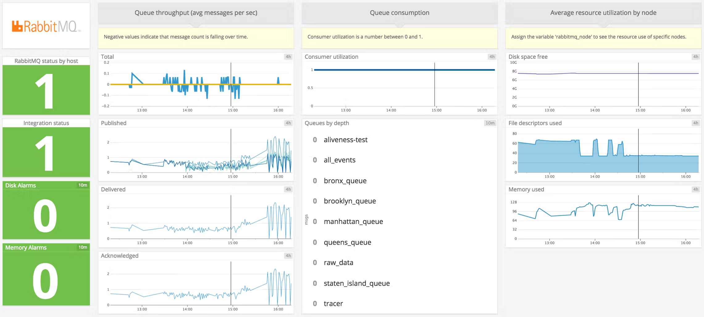
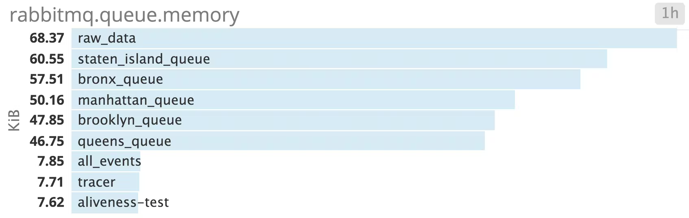
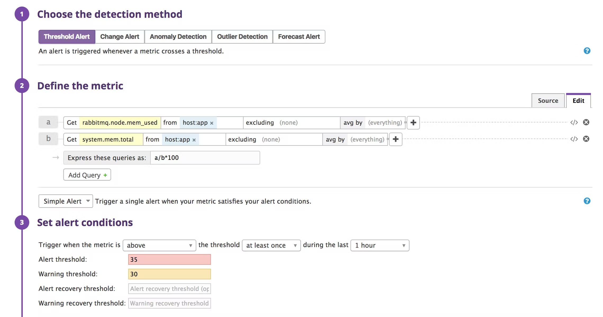
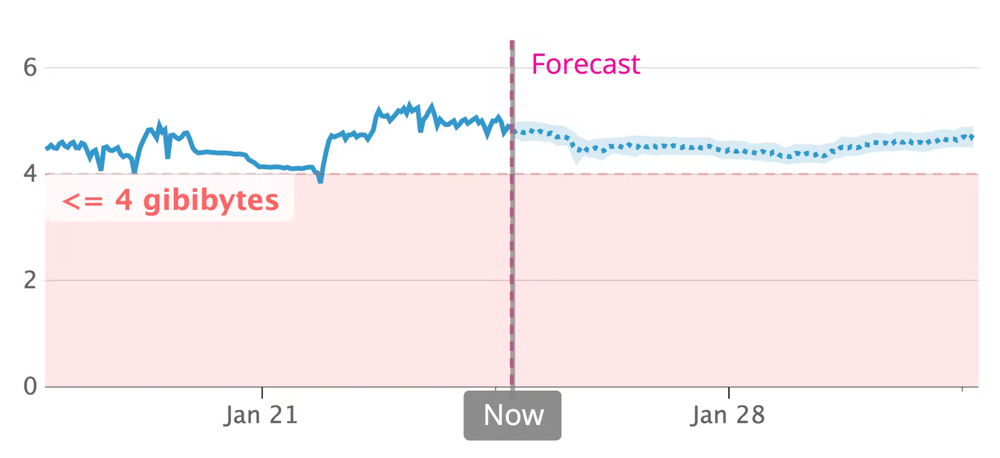
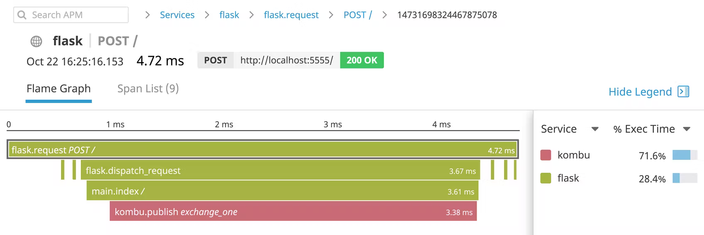

# Monitoring RabbitMQ performance with Datadog

https://www.datadoghq.com/blog/monitoring-rabbitmq-performance-with-datadog/

In Part 2 of this series, we’ve seen how RabbitMQ [ships with tools](https://www.datadoghq.com/blog/rabbitmq-monitoring-tools/) for monitoring different aspects of your application: how your queues handle message traffic, how your nodes consume memory, whether your consumers are operational, and so on. While RabbitMQ plugins and built-in tools give you a view of your messaging setup in isolation, RabbitMQ weaves through the very design of your applications. To better understand your applications, you need to see how RabbitMQ performance relates to the rest of your stack.  在本系列的第 2 部分中，我们看到了 RabbitMQ 如何提供用于监控应用程序不同方面的工具：队列如何处理消息流量、节点如何消耗内存、消费者是否可操作等等。 虽然 RabbitMQ 插件和内置工具可以让您单独查看消息传递设置，但 RabbitMQ 贯穿您的应用程序的设计。 为了更好地理解您的应用程序，您需要了解 RabbitMQ 性能与堆栈其余部分的关系。

Datadog gives you an all-at-once view of key RabbitMQ metrics, out of the box, with our RabbitMQ dashboard. You can also set alerts to notify you when the availability of your messaging setup is at stake. In this post we’ll show you how to set up comprehensive monitoring using Datadog’s RabbitMQ integration.  Datadog 通过我们的 RabbitMQ 仪表板为您提供开箱即用的关键 RabbitMQ 指标的全部视图。 您还可以设置警报以在消息设置的可用性受到威胁时通知您。 在这篇文章中，我们将向您展示如何使用 Datadog 的 RabbitMQ 集成设置全面监控。



## Installing the Agent

The Datadog Agent checks your host for RabbitMQ performance metrics and sends them to Datadog. The Agent can also capture metrics and trace requests from the rest of the systems running on your hosts. Instructions for installing the Agent are [here](https://app.datadoghq.com/account/settings#agent/overview). For some systems this only takes a single command. Check our [documentation](https://docs.datadoghq.com/agent/) for more details on the Agent.  Datadog 代理检查您的主机的 RabbitMQ 性能指标并将它们发送到 Datadog。 代理还可以从您的主机上运行的其他系统捕获指标和跟踪请求。 安装代理的说明在这里。 对于某些系统，这只需要一个命令。 查看我们的文档以获取有关代理的更多详细信息。

## Integrating Datadog with RabbitMQ

The RabbitMQ integration is based on the [management plugin](http://www.rabbitmq.com/management.html) (see [Part 2](https://www.datadoghq.com/blog/rabbitmq-monitoring-tools/)), which creates a [web server](https://www.rabbitmq.com/management.html#http-api) that reports metrics from its host node and any nodes clustered with it. To configure the integration, first [enable](https://www.datadoghq.com/blog/rabbitmq-monitoring-tools/#the-management-plugin) the RabbitMQ management plugin. Then follow the integration’s [instructions](https://docs.datadoghq.com/integrations/rabbitmq/#connect-the-agent) for adding a configuration file.  RabbitMQ 集成基于管理插件（请参阅第 2 部分），该插件创建一个 Web 服务器，该服务器报告来自其主机节点和与其集群的任何节点的指标。 要配置集成，首先启用 RabbitMQ 管理插件。 然后按照集成的说明添加配置文件。

You’ll want to edit the configuration file to reflect the setup of your hosts. A basic config looks like this:  您需要编辑配置文件以反映主机的设置。 基本配置如下所示：

```bash
init_config:

instances:
    -  rabbitmq_api_url: http://localhost:15672/api/
       rabbitmq_user: datadog
       rabbitmq_pass: some_password
```

The configuration file gives the Agent access to the management API. Within the `instances` section, change `rabbitmq_api_url` to match the address of the management web server, which should have permission to accept requests from the Agent’s domain (see [Part 2](https://www.datadoghq.com/blog/rabbitmq-monitoring-tools/#http-api)). Monitoring a cluster of RabbitMQ nodes requires that only one node exposes metrics to the Agent. The node will aggregate data from its peers in the cluster. For RabbitMQ versions 3.0 and later, port 15672 is the default.  配置文件使代理可以访问管理 API。在实例部分中，更改 rabbitmq_api_url 以匹配管理 Web 服务器的地址，该服务器应该有权接受来自代理域的请求（参见第 2 部分）。监控 RabbitMQ 节点集群要求只有一个节点向代理公开指标。该节点将从集群中的对等节点聚合数据。对于 RabbitMQ 3.0 及更高版本，端口 15672 是默认值。

While an API URL is required, a user is optional. If you provide one, make sure you’ve declared it within the server. Follow [this](https://www.rabbitmq.com/rabbitmqctl.8.html#User_Management) documentation to create users and assign privileges. If your system has more than 100 nodes or 200 queues, you’ll want to specify the nodes and queues the Agent will check. See our [template](https://github.com/DataDog/integrations-core/blob/master/rabbitmq/datadog_checks/rabbitmq/data/conf.yaml.example) for examples of how to do this, along with other configuration options.  虽然 API URL 是必需的，但用户是可选的。如果您提供一个，请确保您已在服务器中声明它。按照此文档创建用户并分配权限。如果您的系统有超过 100 个节点或 200 个队列，您需要指定代理将检查的节点和队列。有关如何执行此操作的示例以及其他配置选项，请参阅我们的模板。

Once you’ve [restarted the Agent](https://docs.datadoghq.com/agent/guide/agent-commands/), RabbitMQ should be reporting metrics, events, and service checks to Datadog. Verify this by running the [info command](https://docs.datadoghq.com/agent/guide/agent-commands/#agent-information) and making sure the “Checks” section has an entry for “rabbitmq”.  重新启动代理后，RabbitMQ 应该向 Datadog 报告指标、事件和服务检查。通过运行 info 命令并确保“检查”部分具有“rabbitmq”条目来验证这一点。


```bash
    rabbitmq (5.21.0)
    -----------------
      - instance #0 [OK]
      - Collected 33 metrics, 0 events & 2 service checks
```

Since the integration is based on the RabbitMQ management plugin, it gathers most of the same metrics. See [Part 1](https://www.datadoghq.com/blog/rabbitmq-monitoring/) for what this entails, and our [documentation](https://docs.datadoghq.com/integrations/rabbitmq/) for a full list of metrics.  由于集成基于 RabbitMQ 管理插件，因此它收集了大部分相同的指标。 请参阅第 1 部分了解这意味着什么，以及我们的文档以获取完整的指标列表。

The integration tags node-level metrics with the name of a node and queue-level metrics with the name of a queue. You can graph metrics by node or queue to help you diagnose RabbitMQ performance issues and compare metrics across your application.  集成使用节点名称标记节点级指标，使用队列名称标记队列级指标。 您可以按节点或队列绘制指标，以帮助您诊断 RabbitMQ 性能问题并比较整个应用程序的指标。

## The RabbitMQ dashboard

Because the RabbitMQ integration gathers metrics from the management plugin, it can take data that the plugin reports as static values and plot it over time.  因为 RabbitMQ 集成从管理插件收集指标，所以它可以将插件报告为静态值的数据并随时间绘制。

For instance, the integration can use Datadog’s built-in tags to visualize the memory consumption of either one or all of your queues. This example uses the demo application from [Part 2](https://www.datadoghq.com/blog/rabbitmq-monitoring-tools/), which handles data related to different boroughs in New York City. Our application queries an API, publishes the resulting JSON to a queue, consumes from the queue to aggregate the data by borough, then publishes to a final queue, where the data waits for a database to store it.  例如，集成可以使用 Datadog 的内置标签来可视化一个或所有队列的内存消耗。 此示例使用第 2 部分中的演示应用程序，该应用程序处理与纽约市不同行政区相关的数据。 我们的应用程序查询 API，将生成的 JSON 发布到队列，从队列中消费以按区聚合数据，然后发布到最终队列，数据等待数据库存储。



Graphing memory consumption is especially useful because of the way RabbitMQ handles the sizes of messages (see [Part 1](https://www.datadoghq.com/blog/rabbitmq-monitoring/#connection-performance)). You can see whether your messages take up more memory as they’re processed, even as queue depths remain constant.  由于 RabbitMQ 处理消息大小的方式（参见第 1 部分），绘制内存消耗特别有用。 您可以查看您的消息在处理时是否占用更多内存，即使队列深度保持不变。

You can also use the RabbitMQ integration to correlate metrics for your queues with system-level metrics outside the scope of the RabbitMQ management plugin. The integration’s [out-of-the-box timeboard](https://app.datadoghq.com/dash/integration/37/rabbitmq---metrics) makes it easy to compare your network traffic, system load, system memory, and CPU usage with the state of your queues over time.  您还可以使用 RabbitMQ 集成将队列的指标与 RabbitMQ 管理插件范围之外的系统级指标相关联。 集成的开箱即用时间板使您可以轻松地将您的网络流量、系统负载、系统内存和 CPU 使用率与您的队列状态进行比较。

## Alerts

Once you are collecting and visualizing RabbitMQ metrics, you can set alerts in Datadog to notify your team of performance issues.  收集和可视化 RabbitMQ 指标后，您可以在 Datadog 中设置警报以通知您的团队性能问题。

As we’ve discussed in [Part 1](https://www.datadoghq.com/blog/rabbitmq-monitoring/), RabbitMQ will [block connections](https://www.rabbitmq.com/alarms.html) when its nodes use too many resources. With Datadog, you can identify resource shortages and use alerts to give your team time to respond.  正如我们在第 1 部分中所讨论的，当 RabbitMQ 的节点使用太多资源时，它会阻塞连接。使用 Datadog，您可以识别资源短缺并使用警报让您的团队有时间做出响应。

To do this, determine the level of memory or disk use at which RabbitMQ will start blocking connections. You may want to check your [configuration file](https://www.rabbitmq.com/configure.html) for the value of `vm_memory_high_watermark` or `disk_free_limit`. Then set an alert to trigger when that threshold is approaching. In the screenshot below, we’ve set an alert threshold for memory use at 35 percent, a bit less than the 40-percent threshold at which RabbitMQ triggers an internal alarm.  为此，请确定 RabbitMQ 将开始阻塞连接的内存或磁盘使用级别。您可能需要检查配置文件中 vm_memory_high_watermark 或 disk_free_limit 的值。然后设置警报以在接近该阈值时触发。在下面的屏幕截图中，我们将内存使用的警报阈值设置为 35%，略低于 RabbitMQ 触发内部警报的 40% 阈值。

In the example below, our Datadog alert is set to trigger on a *percentage* of available memory, which is the unit that RabbitMQ uses for its own internal [memory alarms](https://www.rabbitmq.com/memory.html). RabbitMQ’s [disk alarm](https://www.rabbitmq.com/disk-alarms.html) is different, based on the absolute number of bytes available, so you would use a single metric, `rabbitmq.node.disk_free`, to set a Datadog alert for disk usage.  在下面的示例中，我们的 Datadog 警报设置为触发可用内存的百分比，这是 RabbitMQ 用于其自己的内部内存警报的单位。 RabbitMQ 的磁盘警报是不同的，基于可用字节的绝对数量，因此您将使用单个指标 rabbitmq.node.disk_free 来为磁盘使用设置 Datadog 警报。



Datadog will notify your team using the channel of your choice (Slack, PagerDuty, OpsGenie, etc.) when RabbitMQ approaches its disk or memory limit.  当 RabbitMQ 接近其磁盘或内存限制时，Datadog 将使用您选择的通道（Slack、PagerDuty、OpsGenie 等）通知您的团队。

With Datadog [forecasts](https://www.datadoghq.com/blog/forecasts-datadog/), you can predict when RabbitMQ will reach a resource threshold and set alerts for a certain time in advance. For example, you can fire off a notification two weeks before RabbitMQ is likely to set a disk alarm, giving your team enough time to take action.  使用 Datadog 预测，您可以预测 RabbitMQ 何时会达到资源阈值并提前设置警报。 例如，您可以在 RabbitMQ 可能设置磁盘警报前两周发出通知，让您的团队有足够的时间采取行动。



## Application performance monitoring

Datadog can also help you understand the role RabbitMQ plays within your applications—how often RabbitMQ handles traffic from your HTTP servers, for example, and when RabbitMQ presents a bottleneck. [Distributed tracing and APM](https://docs.datadoghq.com/tracing/) visualizes the latency of RabbitMQ operations in the context of all the services that handle a request, so you can know when to tune RabbitMQ for a smoother user experience.  Datadog 还可以帮助您了解 RabbitMQ 在您的应用程序中所扮演的角色——例如，RabbitMQ 处理来自您的 HTTP 服务器的流量的频率，以及 RabbitMQ 何时出现瓶颈。 分布式跟踪和 APM 在处理请求的所有服务的上下文中可视化 RabbitMQ 操作的延迟，因此您可以知道何时调整 RabbitMQ 以获得更流畅的用户体验。



The flame graph above is from a Flask application that uses the [Kombu AMQP client](https://github.com/celery/kombu) to publish user request data to the RabbitMQ exchange called `exchange_one`. We can see that our application takes longer to publish messages to `exchange_one` than to perform any other task.  上面的火焰图来自一个 Flask 应用程序，该应用程序使用 Kombu AMQP 客户端将用户请求数据发布到名为 exchange_one 的 RabbitMQ 交换器。 我们可以看到，与执行任何其他任务相比，我们的应用程序将消息发布到 exchange_one 所需的时间更长。

Datadog can generate traces from RabbitMQ client libraries automatically. The Flask application above includes the following code, which configures the Datadog Agent to auto-instrument the [Kombu client](http://pypi.datadoghq.com/trace/docs/other_integrations.html#kombu) and [Flask web framework](http://pypi.datadoghq.com/trace/docs/web_integrations.html#flask):  Datadog 可以自动从 RabbitMQ 客户端库生成跟踪。 上面的 Flask 应用程序包含以下代码，它将 Datadog 代理配置为自动检测 Kombu 客户端和 Flask Web 框架：

```python
from ddtrace import patch

patch(kombu=True)
patch(flask=True)
```

Datadog supports auto-instrumentation for RabbitMQ clients in several languages, including [Node.js](https://docs.datadoghq.com/tracing/setup/nodejs/#worker-compatibility) and [Java](https://docs.datadoghq.com/tracing/setup/java/#networking-framework-compatibility). If there’s not yet support for your own RabbitMQ client, you can instrument your code with Datadog’s [tracing libraries](https://docs.datadoghq.com/tracing/setup/).  Datadog 支持多种语言的 RabbitMQ 客户端自动检测，包括 Node.js 和 Java。如果您自己的 RabbitMQ 客户端还不支持，您可以使用 Datadog 的跟踪库检测您的代码。

## Distributed messaging, unified monitoring  分布式消息传递，统一监控

In this post, we’ve shown how to install the Datadog Agent and the RabbitMQ integration. We’ve learned how to view RabbitMQ metrics in the context of your infrastructure, and how to alert your team of approaching resource issues.  在这篇文章中，我们展示了如何安装 Datadog 代理和 RabbitMQ 集成。我们已经学习了如何在您的基础设施上下文中查看 RabbitMQ 指标，以及如何提醒您的团队正在处理资源问题。

Using Datadog, you can observe all aspects of your RabbitMQ setup, all in one place. And with more than 500 supported integrations for out-of-the-box monitoring, it’s possible to see your RabbitMQ performance metrics alongside those of related systems like [OpenStack](https://www.datadoghq.com/blog/openstack-monitoring-datadog/). If you don’t yet have a Datadog account, you can sign up for a [free trial](https://www.datadoghq.com/blog/monitoring-rabbitmq-performance-with-datadog/#) and start monitoring your applications and infrastructure today.  使用 Datadog，您可以在一个地方观察 RabbitMQ 设置的所有方面。借助 500 多种支持的开箱即用监控集成，您可以将您的 RabbitMQ 性能指标与 OpenStack 等相关系统的指标一起查看。如果您还没有 Datadog 帐户，您可以注册免费试用并立即开始监控您的应用程序和基础设施。

*Source Markdown for this post is available [on GitHub](https://github.com/DataDog/the-monitor/blob/master/rabbitmq/monitoring-rabbitmq-performance-with-datadog.md). Questions, corrections, additions, etc.? Please [let us know](https://github.com/DataDog/the-monitor/issues).*  这篇文章的源 Markdown 可以在 GitHub 上找到。问题、更正、补充等？请告诉我们。

