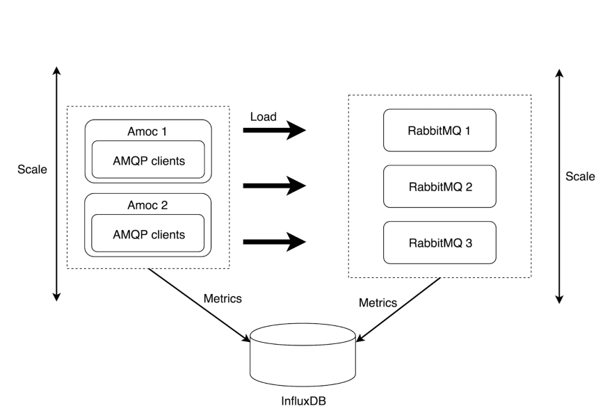
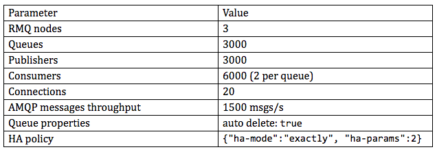
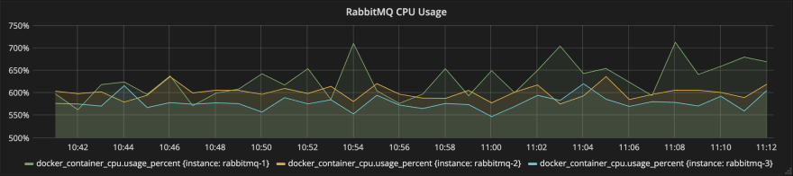
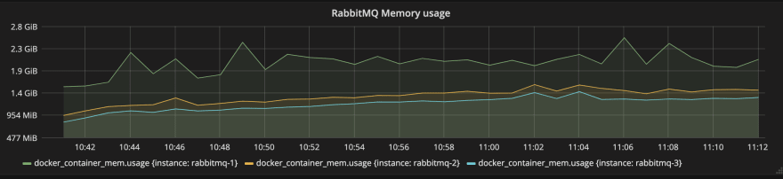
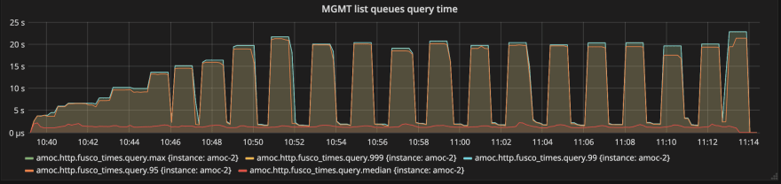
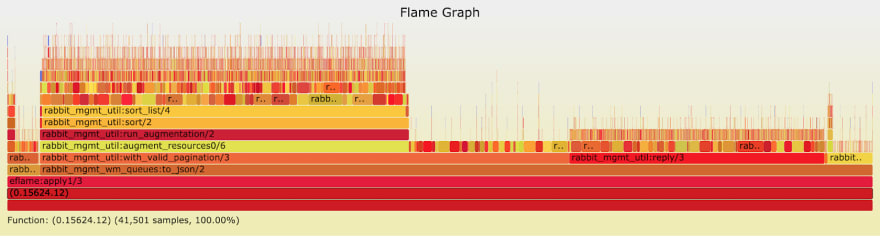
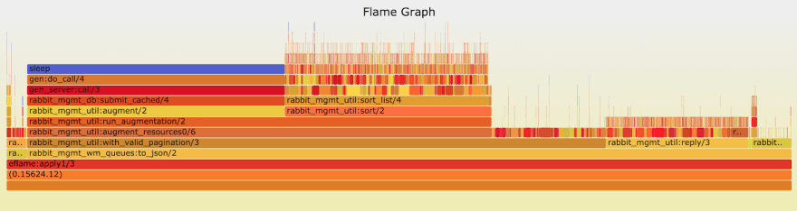
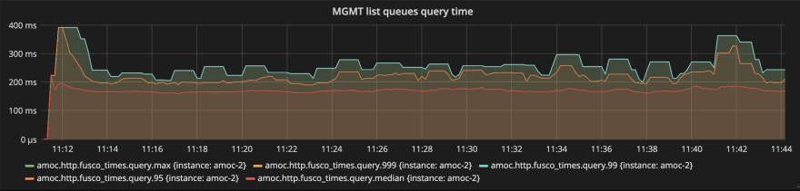

# How to debug your RabbitMQ

https://dev.to/erlang_solutions/how-to-debug-your-rabbitmq-2e04

### What you will learn in this blog.  您将在此博客中学到什么。

Our RabbitMQ consultancy customers come from a wide range of industries. As a result, we have seen almost all of the unexpected behaviours that it can throw at you. RabbitMQ is a complex piece of software that employs concurrency and distributed computing (via Erlang), so debugging it is not always straightforward. To get to the root cause of an unexpected (and unwanted) behaviour, you need the right tools and the right methodology. In this article, we will demonstrate both to help you learn the craft of debugging in RabbitMQ.  我们的 RabbitMQ 咨询客户来自各行各业。 结果，我们几乎看到了它可能给您带来的所有意外行为。 RabbitMQ 是一个复杂的软件，它采用并发和分布式计算（通过 Erlang），因此调试它并不总是那么简单。 要找到意外（和不需要的）行为的根本原因，您需要正确的工具和正确的方法。 在本文中，我们将演示两者，以帮助您了解在 RabbitMQ 中进行调试的技巧。

### The problem of debugging RabbitMQ  调试RabbitMQ的问题

The inspiration for this blog comes from a real-life example. One of our customers had the [RabbitMQ Management HTTP API](https://cdn.rawgit.com/rabbitmq/rabbitmq-management/v3.7.9/priv/www/api/index.html) serving crucial information to their system. The system relied on the API heavily, specifically on `/api/queues` endpoint because the system needed to know the number of messages ready in each queue in a RabbitMQ cluster. The problem was that sometimes a HTTP request to the endpoint lasted up to tens of seconds (in the worst case they weren't even able to get a response from the API).  这个博客的灵感来自一个真实的例子。 我们的一位客户使用 RabbitMQ 管理 HTTP API 为他们的系统提供关键信息。 系统严重依赖 API，特别是 /api/queues 端点，因为系统需要知道 RabbitMQ 集群中每个队列中准备好的消息数量。 问题是有时对端点的 HTTP 请求持续长达数十秒（在最坏的情况下，他们甚至无法从 API 获得响应）。

So what caused some requests to take so much time? To answer that question, we tried to reproduce the issue through load testing.  那么是什么导致一些请求花费了这么多时间呢？ 为了回答这个问题，我们尝试通过负载测试重现该问题。

### Running load tests

We use a platform that we created for [MongooseIM](https://www.erlang-solutions.com/products/mongooseim.html) to run our [Continuous Load Testing](https://tide.erlang-solutions.com/). Here are some of the most important aspects of the platform:  我们使用为 MongooseIM 创建的平台来运行我们的持续负载测试。 以下是该平台的一些最重要的方面：

1. all the services that are involved in a load test run inside docker containers  负载测试中涉及的所有服务都在 docker 容器中运行

2. the load is generated by [Amoc](https://github.com/esl/amoc); it's an open source tool written in Erlang for generating massively parallel loads of any kind (AMQP in our case)  负载由 Amoc 产生； 它是一个用 Erlang 编写的开源工具，用于生成任何类型的大规模并行负载（在我们的例子中是 AMQP）

3. metrics from the system under test and Amoc site are collected for further analysis.  收集来自被测系统和 Amoc 站点的指标以供进一步分析。

The diagram below depicts a logical architecture of an example load test with RabbitMQ:  下图描述了使用 RabbitMQ 的示例负载测试的逻辑架构：



In the diagram, the left-hand side, shows a cluster of Amoc nodes that emulate AMQP clients which, in turn, generate the load against RabbitMQ. On the other side, we can see a RabbitMQ cluster that serves the AMQP clients. All the metrics from both the Amoc and RabbitMQ services are collected and stored in an InfluxDB database.  在图中，左侧显示了一个模拟 AMQP 客户端的 Amoc 节点集群，这些客户端反过来生成针对 RabbitMQ 的负载。 另一方面，我们可以看到为 AMQP 客户端提供服务的 RabbitMQ 集群。 来自 Amoc 和 RabbitMQ 服务的所有指标都被收集并存储在 InfluxDB 数据库中。

### Slow Management HTTP API queries  缓慢的管理 HTTP API 查询

We tried to reproduce the slow queries to Management HTTP API in our load tests. The test scenario was fairly simple. A bunch of publishers were publishing messages to default exchange. Messages from each publisher were routed to a dedicated queue (each publisher had a dedicated queue). There were also consumers attached to each queue. Queue mirroring was enabled.  我们尝试在负载测试中重现对管理 HTTP API 的慢查询。 测试场景相当简单。 一堆发布者正在将消息发布到默认交换。 来自每个发布者的消息被路由到一个专用队列（每个发布者都有一个专用队列）。 每个队列还附加了消费者。 队列镜像已启用。

For concrete values, check the table below:  具体数值见下表：



That setup stressed the Rabbit servers on our infrastructure. As seen in the graphs below:  该设置强调了我们基础架构上的 Rabbit 服务器。 如下图所示：





Every RabbitMQ node consumed about 6 (out of 7) CPU cores and roughly 1.4GB of RAM except for `rabbitmq-1` which consumed significantly more than the others. That was likely because it had to serve more of the Management HTTP API requests than the other two nodes.  每个 RabbitMQ 节点消耗大约 6 个（共 7 个）CPU 内核和大约 1.4GB 的 RAM，但 rabbitmq-1 的消耗量明显高于其他节点。 这可能是因为它必须处理比其他两个节点更多的管理 HTTP API 请求。

During the load test `/api/queues` endpoint was queried **every two seconds** for the list of all queues together with corresponding `messages_ready` values. A query looked like this:  在负载测试期间，每两秒查询一次 /api/queues 端点，以获取所有队列的列表以及相应的 messages_ready 值。 查询如下所示：

```
http://rabbitmq-1:15672/api/queues?columns=name,messages_ready
```

Here are the results from the test:  以下是测试结果：



The figure above shows the query time during a load test. It's clear that things are very slow. The median equals **1.5s** while the `95, 99, 999` percentiles and max reach **20s**.  上图显示了负载测试期间的查询时间。 很明显，事情进展得很慢。 中位数等于 1.5 秒，而 95、99、999 百分位数和最大值达到 20 秒。

### Debugging

Once the issue is confirmed and can be reproduced, we are ready to start debugging. The first idea was to find the Erlang function that is called when a request to the RabbitMQ Management HTTP API comes in and determine where that function spends its execution time. If we were able to do this it would allow us to localise the most time expensive code behind the API.  一旦问题得到确认并且可以重现，我们就可以开始调试了。 第一个想法是找到当对 RabbitMQ 管理 HTTP API 的请求进入时调用的 Erlang 函数，并确定该函数将其执行时间花在哪里。 如果我们能够做到这一点，它将允许我们本地化 API 背后最耗时的代码。

### Finding the entrypoint function  寻找入口函数

To find the function we were looking for we took the following steps:  为了找到我们正在寻找的功能，我们采取了以下步骤：

1. looked through the [RabbitMQ Management Plugin](https://github.com/rabbitmq/rabbitmq-management/tree/v3.7.9) to find the appropriate "HTTP path to function" mapping,  查看 RabbitMQ 管理插件以找到适当的“HTTP 函数路径”映射，

2. used the Erlang tracing feature to verify if a found function is really called when a request comes in.  使用 Erlang 跟踪功能来验证当请求进来时是否真的调用了找到的函数。

The management plugin uses [cowboy](https://github.com/ninenines/cowboy) (an Erlang HTTP server) underneath to serve the API requests. Each HTTP endpoint requires a cowboy callback module, so we easily found the [`rabbit_mgmt_wm_queues:to_json/2`](https://github.com/rabbitmq/rabbitmq-management/blob/v3.7.9/src/rabbit_mgmt_wm_queues.erl#L49) function which seemed to handle requests coming to the `/api/queues`. We confirmed that with tracing (using a [recon](http://ferd.github.io/recon/recon.html) library that is shipped with RabbitMQ by default).  管理插件使用下面的牛仔（Erlang HTTP 服务器）来服务 API 请求。 每个 HTTP 端点都需要一个牛仔回调模块，因此我们很容易找到 rabbit_mgmt_wm_queues:to_json/2 函数，该函数似乎处理来自 /api/queues 的请求。 我们通过跟踪确认了这一点（使用默认情况下随 RabbitMQ 提供的侦察库）。

```bash
root@rmq-test-rabbitmq-1:/rabbitmq_server-v3.7.9# erl -remsh rabbit@rmq-test-rabbitmq-1 -sname test2 -setcookie rabbit  

Erlang/OTP 21 [erts-10.1] [source] [64-bit] [smp:22:7] [ds:22:7:10] [async-threads:1]  

Eshell V10.1  (abort with ^G)  
(rabbit@rmq-test-rabbitmq-1)1> recon_trace:calls({rabbit_mgmt_wm_queues, to_json, 2}, 1).  
1  

11:0:48.464423 <0.1294.15> rabbit_mgmt_wm_queues:to_json(#{bindings => #{},body_length => 0,cert => undefined,charset => undefined,  
  has_body => false,  
  headers =>  
      #{<<"accept">> => <<"*/*">>,  
        <<"authorization">> => <<"Basic Z3Vlc3Q6Z3Vlc3Q=">>,  
        <<"host">> => <<"10.100.10.140:53553">>,  
        <<"user-agent">> => <<"curl/7.54.0">>},  
  host => <<"10.100.10.140">>,host_info => undefined,  
  media_type => {<<"application">>,<<"json">>,[]},  
  method => <<"GET">>,path => <<"/api/queues">>,path_info => undefined,  
  peer => {{10,100,10,4},54136},  
  pid => <0.1293.15>,port => 53553,qs => <<"columns=name,messages_ready">>,  
  ref => rabbit_web_dispatch_sup_15672,  
  resp_headers =>  
      #{<<"content-security-policy">> => <<"default-src 'self'">>,  
        <<"content-type">> => [<<"application">>,<<"/">>,<<"json">>,<<>>],  
        <<"vary">> =>  
            [<<"accept">>,  
             [<<", ">>,<<"accept-encoding">>],  
             [<<", ">>,<<"origin">>]]},  
  scheme => <<"http">>,  
  sock => {{172,17,0,4},15672},  
  streamid => 1,version => 'HTTP/1.1'}, {context,{user,<<"guest">>,  
               [administrator],  
               [{rabbit_auth_backend_internal,none}]},  
         <<"guest">>,undefined})  
Recon tracer rate limit tripped.  
```


The snippet above shows that we enabled tracing for`rabbit_mgmt_wm_queues:to_json/2` first, then we manually sent a request to the Management API (using curl; not visible on the snippet) and which generated the trace event. That's how we found our entrypoint for further analysis.  上面的代码片段显示我们首先启用了对rabbit_mgmt_wm_queues:to_json/2 的跟踪，然后我们手动向管理API 发送了一个请求（使用curl；在代码片段中不可见）并生成了跟踪事件。 这就是我们找到进一步分析的入口点的方式。

### Using flame graphs

Having found a function that serves the requests, we can now check how that function spends its execution time. The ideal technique to do this is [Flame Graphs](http://www.brendangregg.com/flamegraphs.html). One of its [definitions](http://www.brendangregg.com/flamegraphs.html) states:  找到服务请求的函数后，我们现在可以检查该函数如何花费其执行时间。 理想的技术是火焰图。 它的定义之一是：

*Flame graphs are a visualisation of profiled software, allowing the most frequent code-paths to be identified quickly and accurately.*  火焰图是分析软件的可视化，允许快速准确地识别最常见的代码路径。

In our case, we could use flame graphs to visualise the stack trace of the function or, in other words, which functions are called inside a traced function, and how much time it takes (relatively to the traced function's execution time) for these functions to execute. This visualisation helps to identify suspicious functions in the code quickly.  在我们的例子中，我们可以使用火焰图来可视化函数的堆栈跟踪，或者换句话说，在跟踪函数中调用了哪些函数，以及这些函数需要多少时间（相对于跟踪函数的执行时间） 执行。 这种可视化有助于快速识别代码中的可疑函数。

For Erlang, there is a library called [eflame](https://github.com/proger/eflame) that has tools for both: gathering traces from the Erlang system and building a flame graph from the data. But how do we inject that library into Rabbit for our load test?  对于 Erlang，有一个名为 eflame 的库，它具有两种工具：从 Erlang 系统收集跟踪信息并从数据中构建火焰图。 但是我们如何将该库注入到 Rabbit 中进行负载测试呢？

### Building a custom RabbitMQ docker image

As we mentioned previously, all the services in our load testing platform run inside docker containers. Hence, we had to build a custom `RabbitMQ docker` image with the eflame library included in the server code. We created a [rabbitmq-docker repository](https://github.com/esl/rabbitmq-docker) that makes it easy to build a docker image with modified RabbitMQ source code.  正如我们之前提到的，我们负载测试平台中的所有服务都运行在 docker 容器中。 因此，我们必须使用包含在服务器代码中的 eflame 库构建自定义 RabbitMQ docker 映像。 我们创建了一个 rabbitmq-docker 存储库，可以轻松地使用修改后的 RabbitMQ 源代码构建 docker 映像。

### Profiling with eflame

Once we had a modified RabbitMQ docker image with eflame included, we could run another load test (specifications were the same as the previous test) and start the actual profiling. These were the results:  一旦我们修改了包含 eflame 的 RabbitMQ docker 镜像，我们就可以运行另一个负载测试（规格与之前的测试相同）并开始实际的分析。 结果如下：





We ran a number of measurements and had two types of result as presented above. The main difference between these graphs is in `rabbit_mgmt_util:run_run_augmentation/2` function. What does that difference mean?  我们进行了多次测量，并得到了上述两种类型的结果。这些图之间的主要区别在于 rabbit_mgmt_util:run_run_augmentation/2 函数。这个区别是什么意思？

From the results of the previous load tests and manual code analysis, we know that there are slow and fast queries. The slow requests can take up to twenty seconds while the fast ones only take a few. It confirms the query time chart above with: 50 percentile about 1.5s but 95 (and higher percentiles) equaling up to 20s. Moreover, we manually measured execution time of both cases using [timer:tc/3](http://erlang.org/doc/man/timer.html#tc-3) and the results were consistent.  从前面的负载测试和人工代码分析的结果，我们知道有慢查询和快查询之分。慢速请求最多可能需要 20 秒，而快速请求只需要几秒钟。它确认了上面的查询时间图表：50 个百分位大约 1.5 秒，但 95 个（和更高的百分位）等于 20 秒。此外，我们使用 timer:tc/3 手动测量了这两种情况的执行时间，结果是一致的。

This happens because there is a [cache](https://github.com/rabbitmq/rabbitmq-management/blob/v3.7.9/src/rabbit_mgmt_db_cache.erl) in the Management plugin. When the cache is valid, the requests are served much faster as the data has already been collected, but when it's invalid, all the necessary information needs to be gathered.  发生这种情况是因为管理插件中有缓存。当缓存有效时，请求的服务速度会更快，因为数据已经被收集，但是当它无效时，需要收集所有必要的信息。

Despite the fact that the graphs have the same length in the picture, they represent different execution times (fast vs slow). Hence it's hard to guess which graph shows which query without actually taking a measurement. The first graph shows a fast query while the second shows a slow one. In the slow query graph `rabbit_mgmt_util:augment/2 -> rabbit_mgmt_db:submit_cached/4 -> gen_server:call/3 -> …` the stack takes so much time because the cache is invalid and fresh data needs to be collected. So what happens when data is collected?  尽管图中的图表长度相同，但它们代表不同的执行时间（快与慢）。因此，如果不进行实际测量，很难猜测哪个图表显示了哪个查询。第一张图显示了快速查询，而第二张图显示了慢速查询。在慢查询图中 rabbit_mgmt_util:augment/2 -> rabbit_mgmt_db:submit_cached/4 -> gen_server:call/3 -> ... 堆栈需要很长时间，因为缓存无效并且需要收集新数据。那么在收集数据时会发生什么？

### Profiling with fprof

You might ask "why don't we see the data collection function(s) in the flame graphs?" This happens because the cache is implemented as another Erlang process and the data collection happens inside the cache [process](https://github.com/rabbitmq/rabbitmq-management/blob/v3.7.9/src/rabbit_mgmt_db_cache.erl#L101-L119). There is a `gen_server:call/3` function visible in the graphs that makes a call to the cache process and waits for a response. Depending on the cache state (valid or invalid) a response can come back quickly or slowly.  您可能会问“为什么我们看不到火焰图中的数据收集功能？” 发生这种情况是因为缓存是作为另一个 Erlang 进程实现的，并且数据收集发生在缓存进程内部。 图中可见一个 gen_server:call/3 函数，它调用缓存进程并等待响应。 根据缓存状态（有效或无效），响应可以快速或缓慢地返回。

Collecting data is implemented in [`rabbit_mgmt_db:list_queue_stats/3`](https://github.com/rabbitmq/rabbitmq-management/blob/v3.7.9/src/rabbit_mgmt_db.erl#L357-L368) function which is invoked from the cache process. Naturally, we should profile that function. We tried eflame and after **several dozens of minutes** this is the result we got:  收集数据是在从缓存进程调用的 rabbit_mgmt_db:list_queue_stats/3 函数中实现的。 自然，我们应该分析该功能。 我们尝试了 eflame，几十分钟后，我们得到了这样的结果：

```
eheap_alloc: Cannot allocate 42116020480 bytes of memory (of type "old_heap").
```

The Erlang heap memory allocator tried to allocate **42GB** of memory (in fact, the space was needed for [garbage collector](https://www.erlang-solutions.com/blog/erlang-19-0-garbage-collector.html) to operate) and crashed the server. As eflame takes advantage of Erlang Tracing to generate flame graphs it was, most probably, simply overloaded with a number of trace events generated by the traced function. That's where [fprof](http://erlang.org/doc/man/fprof.html) comes into play.  Erlang 堆内存分配器试图分配 42GB 的内存（实际上是垃圾收集器运行所需的空间）并导致服务器崩溃。 由于 eflame 利用 Erlang Tracing 来生成火焰图，它很可能只是简单地被跟踪函数生成的许多跟踪事件重载。 这就是 fprof 发挥作用的地方。

According to the official Erlang documentation fprof is:  根据官方 Erlang 文档 fprof 是：

*a Time Profiling Tool using trace to file for minimal runtime performance impact.*  一个时间分析工具，使用跟踪到文件以最小化运行时性能影响。

That’s very true. The tool dealt with collecting data function smoothly, however it took several minutes to produce the result. The output was quite big so there are only crucial lines listed below:  这是非常真实的。 该工具处理收集数据功能顺利，但需要几分钟才能产生结果。 输出非常大，所以只有下面列出的关键行：

```
(rabbit@rmq-test-rabbitmq-1)96> fprof:apply(rabbit_mgmt_db, list_queue_stats, [RA, B, 5000]).  
...
(rabbit@rmq-test-rabbitmq-1)97> fprof:profile().  
...
(rabbit@rmq-test-rabbitmq-1)98> fprof:analyse().  
...
%                                       CNT        ACC       OWN  
{[{{rabbit_mgmt_db,'-list_queue_stats/3-lc$^1/1-1-',4}, 803,391175.593,  105.666}],  
 { {rabbit_mgmt_db,queue_stats,3},              803,391175.593,  105.666},     %  
 [{{rabbit_mgmt_db,format_range,4},            3212,390985.427,   76.758},  
  {{rabbit_mgmt_db,pick_range,2},              3212,   58.047,   34.206},  
  {{erlang,'++',2},                            2407,   19.445,   19.445},  
  {{rabbit_mgmt_db,message_stats,1},            803,    7.040,    7.040}]}.  
```

The output consists of many of these entries. The function marked with the % character is the one that the current entry concerns. The functions below are the ones that were called from the marked function. The third column (`ACC`) shows the total execution time of the marked function (the functions own execution time and callees) in milliseconds. For example, in the above entry the total execution time of the`rabbit_mgmt_db:pick_range/2` function equals 58,047ms. For a detailed explanation of the fprof output check the [official fprof documentation](http://erlang.org/doc/man/fprof.html#analysis-format).  输出包含许多这样的条目。标有 % 字符的函数是当前条目所关注的函数。下面的函数是从标记函数调用的函数。第三列（ACC）显示了标记函数的总执行时间（函数自己的执行时间和被调用者），以毫秒为单位。例如，在上述条目中，rabbit_mgmt_db:pick_range/2 函数的总执行时间等于 58,047 毫秒。有关 fprof 输出的详细说明，请查看官方 fprof 文档。

The entry above is the top level entry concerning `rabbit_mgmt_db:queue_stats/3` which was called from the traced function. That function spent most of its execution time in `rabbit_mgmt_db:format_range/4` function. We can go to an entry concerning that function and check where it spent its execution time accordingly. This way, we can go through the output and find potential causes of the Management API slowness issue.  上面的条目是关于从跟踪函数调用的 rabbit_mgmt_db:queue_stats/3 的顶级条目。该函数的大部分执行时间都在 rabbit_mgmt_db:format_range/4 函数中。我们可以转到有关该函数的条目，并相应地检查它在哪里花费了执行时间。这样，我们可以检查输出并找到管理 API 缓慢问题的潜在原因。

Reading through the fprof output in a top-down fashion we ended up with this entry:  以自上而下的方式阅读 fprof 输出，我们最终得到以下条目：

```
{[{{exometer_slide,'-sum/5-anonymous-6-',7},   3713,364774.737,  206.874}],
 { {exometer_slide,to_normalized_list,6},      3713,364774.737,  206.874},     %
 [{{exometer_slide,create_normalized_lookup,4},3713,213922.287,   64.599}, %% SUSPICIOUS
  {{exometer_slide,'-to_normalized_list/6-lists^foldl/2-4-',3},3713,145165.626,   51.991}, %% SUSPICIOUS
  {{exometer_slide,to_list_from,3},            3713, 4518.772,  201.682},
  {{lists,seq,3},                              3713,  837.788,   35.720},
  {{erlang,'++',2},                            3712,   70.038,   70.038},
  {{exometer_slide,'-sum/5-anonymous-5-',1},   3713,   51.971,   25.739},
  {garbage_collect,                               1,    1.269,    1.269},
  {suspend,                                       2,    0.151,    0.000}]}.  
```

The entry concerns `exometer_slide:to_normalized_list/6` function which in turn called two “suspicious” functions from the same module. Going deeper we found this:  该条目涉及 exometer_slide:to_normalized_list/6 函数，该函数又从同一模块调用两个“可疑”函数。 深入研究我们发现了这一点：

```
    {[{{exometer_slide,'-create_normalized_lookup/4-anonymous-2-',5},347962,196916.209,35453.182},
  {{exometer_slide,'-sum/5-anonymous-4-',2},   356109,16625.240, 4471.993},
  {{orddict,update,4},                         20268881,    0.000,172352.980}],
 { {orddict,update,4},                         20972952,213541.449,212278.155},     %
 [{suspend,                                    9301,  682.033,    0.000},
  {{exometer_slide,'-sum/5-anonymous-3-',2},   31204,  420.574,  227.727},
  {garbage_collect,                              99,  160.687,  160.687},
  {{orddict,update,4},                         20268881,    0.000,172352.980}]}.  
```

and:

```
{[{{exometer_slide,'-to_normalized_list/6-anonymous-5-',3},456669,133229.862, 3043.145},{{orddict,find,2}, 19369215, 0.000,129761.708}],{ {orddict,find,2}, 19825884,133229.862,132804.853}, %[{suspend, 4754, 392.064, 0.000},{garbage_collect, 22, 33.195, 33.195},{{orddict,find,2}, 19369215, 0.000,129761.708}]}.
```

A lot of the execution time was consumed by `orddict:update/4` and `orddict:find/2` functions. These two combined accounted for **86%** of the total execution time.  orddict:update/4 和 orddict:find/2 函数消耗了大量的执行时间。 这两个加起来占总执行时间的 86%。

This led us to the [`exometer_slide`](https://github.com/rabbitmq/rabbitmq-management-agent/blob/v3.7.9/src/exometer_slide.erl) module from the [RabbitMQ Management Agent Plugin](https://github.com/rabbitmq/rabbitmq-management-agent/tree/v3.7.9). If you look into the module, you'll find all the functions above and the connections between them.  这将我们引向 RabbitMQ 管理代理插件中的 exometer_slide 模块。 如果您查看该模块，您会发现上面的所有功能以及它们之间的联系。

We decided to close the investigation at this stage because this was clearly the issue. Now, that we've shared our thoughts on the issue with the community in this blog, who knows, maybe we'll come up with a new solution together.  我们决定在这个阶段结束调查，因为这显然是问题所在。 现在，我们已经在这个博客中与社区分享了我们对这个问题的想法，谁知道呢，也许我们会一起想出一个新的解决方案。

### The observer effect  观察者效应

There is one last thing that is essential to consider when it comes to debugging/observing systems - [the observer effect](https://en.wikipedia.org/wiki/Observer_effect_(physics)). The observer effect is a theory that claims if we are monitoring some kind of phenomena the observation process changes that phenomena.  在调试/观察系统时，还有最后一件事是必须考虑的——观察者效应。 观察者效应是一种理论，它声称如果我们正在监测某种现象，观察过程会改变这种现象。

In our example, we used tools that take advantage of tracing. Tracing has an impact on a system as it generates, sends and processes a lot of events.  在我们的示例中，我们使用了利用跟踪的工具。 跟踪会在系统生成、发送和处理大量事件时对其产生影响。

Execution times of the aforementioned functions increased substantially when they were called with profiling enabled. Pure calls took several seconds while calls with profiling enabled several minutes. However, the difference between the slow and fast queries seemed to remain unchanged.  在启用分析时调用上述函数时，它们的执行时间会大大增加。 纯调用需要几秒钟，而启用分析的调用需要几分钟。 但是，慢查询和快查询之间的差异似乎保持不变。

The observer effect was not evaluated in the scope of the experiment described in this blog post.  观察者效应未在本博文中描述的实验范围内进行评估。

### A workaround solution  变通解决方案

The issue can be solved in a slightly different manner. Let's think for a while if there is another way of obtaining queues names corresponding to the amount of messages in them?
There is the [`rabbit_amqqueue:emit_info_all/5`](https://github.com/rabbitmq/rabbitmq-server/blob/v3.7.9/src/rabbit_amqqueue.erl#L758) function that allows us to retrieve the exact information we are interested in - directly from a queue process. We could use that API from a custom RabbitMQ plugin and expose a HTTP endpoint to send that data when queried.  这个问题可以用稍微不同的方式解决。 让我们想一想，是否有另一种方法可以获取与其中的消息量相对应的队列名称？
rabbit_amqqueue:emit_info_all/5 函数允许我们直接从队列进程中检索我们感兴趣的确切信息。 我们可以使用来自自定义 RabbitMQ 插件的 API，并公开一个 HTTP 端点以在查询时发送该数据。

We turned that idea into reality and built a proof of concept plugin called [`rabbitmq-queue-info`](https://github.com/esl/rabbitmq-queue-info) that does exactly what's described above.
The plugin was even load tested (test specification was exactly the same as it was with the management plugin; from earlier in the blog). The results are below and they speak for themselves:  我们将这个想法变成了现实，并构建了一个名为 rabbitmq-queue-info 的概念证明插件，它完全按照上面的描述进行了操作。
该插件甚至经过了负载测试（测试规范与管理插件完全相同；来自博客的前面部分）。 结果如下，它们不言自明：



### Want more  想要更多

Want to know more about tracing in RabbitMQ, Erlang & Elixir? Check out WombatOAM, an intuitive system that makes monitoring and maintenance of your systems easy. [Get your free 45 day trial of WombatOAM now](https://www.erlang-solutions.com/products/wombatoam.html).  想了解更多关于 RabbitMQ、Erlang 和 Elixir 中的跟踪？ 查看 WombatOAM，这是一个直观的系统，可以轻松监控和维护您的系统。 立即获取 WombatOAM 的 45 天免费试用版。

### Apendix  附录

Version 3.7.9 of RabbitMQ was used in all the load tests mentioned in this blog post. Special thanks go to Szymon Mentel and Andrzej Teleżyński for all the help with that publication.  这篇博文中提到的所有负载测试都使用了 RabbitMQ 3.7.9 版本。特别感谢 Szymon Mentel 和 Andrzej Teleżyński 为本出版物提供的所有帮助。


```
5> eflame2:help().

    Usage: 1st phase: Generate a binary trace

        eflame2:write_trace(Mode, BinaryFile, PidSpec, SleepMSecs)
        eflame2:write_trace(Mode, BinaryFile, PidSpec, M, F, A)
        %% The following forms used with experimental VM only!
        eflame2:write_trace_exp(Mode, BinaryFile, PidSpec, SleepMSecs)
        eflame2:write_trace_exp(Mode, BinaryFile, PidSpec, M, F, A)

    Mode = 'global_calls' | 'global_calls_plus_new_procs' |
           'global_and_local_calls' | 'global_and_local_calls_plus_new_procs' |
           erlang_trace_flags()
    erlang_trace_flags() = See OTP docs for erlang:trace() BIF

    PidSpec = 'all' | 'existing' | 'new' | pid() | [pid()]

    To trace current pid and execution of {M,F,A} only, we suggest:
        eflame2:write_trace(Mode, BinaryFile, self(), M, F, A)

    To trace all pids and gather traces on all pids for some time, we suggest:
        eflame2:write_trace(Mode, BinaryFile, PidSpec, SleepMSecs)

    Usage: 2nd phase: Convert a binary trace to an ASCII trace

        eflame2:format_trace(BinaryFile).  % output = input ++ ".out"
      or else
        eflame2:format_trace(BinaryFile, OutputFile).

        Remember to wait for 'finished!' message!
ok
6>

```

